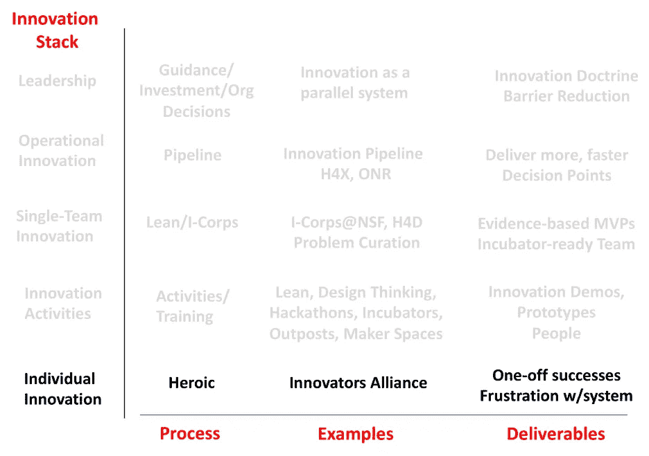
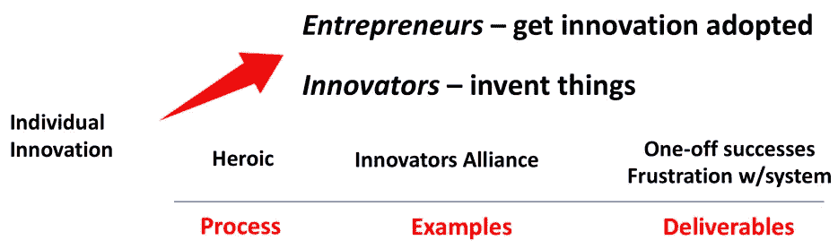
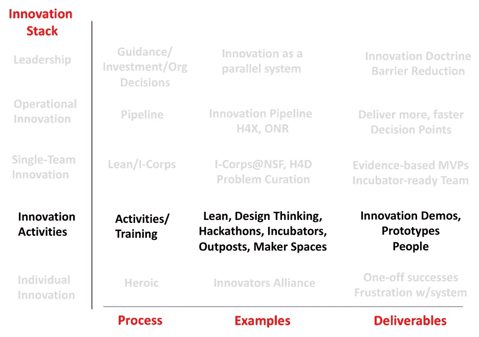
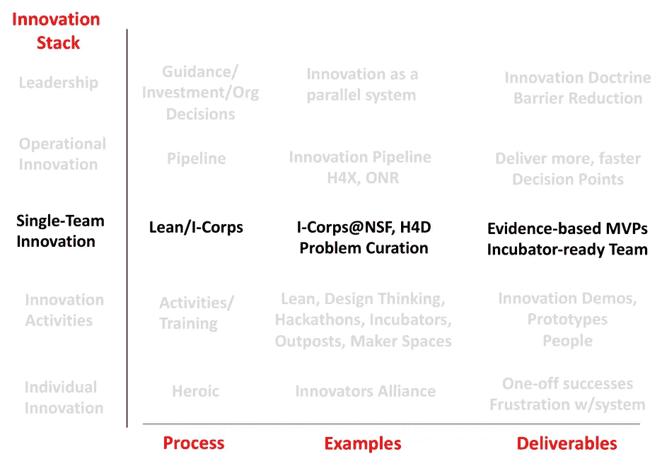
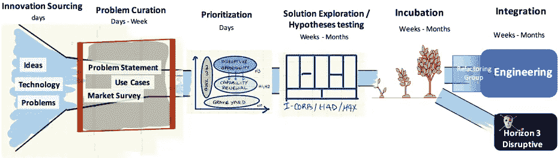
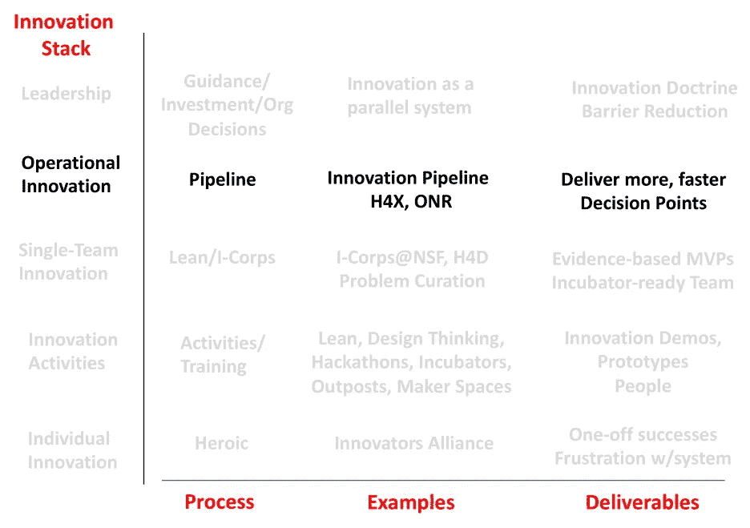

# 创新栈:如何让创新项目不仅仅是咖啡杯

> 原文：<https://medium.com/swlh/the-innovation-stack-how-to-make-innovation-programs-deliver-more-than-coffee-cups-7879c162b46d>

你的组织是否充满了黑客马拉松、鲨鱼池、孵化器和其他创新项目，但没有一个改变了你的公司/机构的轨迹？

在过去的几年里，皮特·纽维尔和我帮助大公司、美国联邦科学机构、国防部和情报部门建立了创新项目。但是直到最近，我们才意识到为什么有些项目成功了，而有些项目却失败了。

在深入研究了多个组织之后，我们现在明白了为什么个体创新者会感到沮丧，以及为什么企业家的成功需要英雄主义。我们还可以解释为什么创新活动产生了创新剧场，但交付成果却很少。我们可以解释为什么大型组织中的创新看起来一点也不像初创公司。最重要的是，我们现在对如何构建创新项目有了更好的想法，这些项目将交付产品和服务，而不仅仅是演示。

它从理解“创新栈”开始——在大型组织中出现的创新努力的层次结构。这个堆栈包括:个人创新、创新工具和活动、团队创新和运营创新。

**个人创新** 在大公司/机构内部追求创新并不是 21 世纪的发明。自从公司存在以来，就有充满激情的人看到新的、未计划的和未安排的事情是可能的。针对现有流程、程序和计划的现状，他们着手构建一个演示/原型，并通过英勇的努力成功地实现了一项新创新——通过交付/部署一项新创新。

我们将他们的努力描述为“英勇的”,因为在一个大公司中，所有已建立的程序和流程主要是为了执行和支持当前的业务模式。从管理工程、制造或运营组织的人的角度来看，新的、未计划的和未安排的创新是对现有资源的干扰和拖累。(我听过的最好的描述是，“不受约束的创新是对核心能力的拒绝服务攻击。”)这是因为到目前为止，我们还没有对创新者提出任何要求、严格要求或证据，以了解集成、扩展和部署产品/服务需要什么。

最后，大多数公司/机构创新流程将“创新”分成“[演示日](https://www.ycombinator.com/demoday/faq/)或“[鲨鱼池](https://en.wikipedia.org/wiki/Shark_Tank)”，在那里他们面对一个审批/资助委员会，该委员会决定哪些创新想法值得追求。然而，没有任何可测量的里程碑来显示团队对问题的有效性、客户需求、支点等所了解的进展的证据。，最佳演示者和最炫的演示通常会胜出。

在一些公司和政府机构中，创新者甚至有非正式团体，即创新者联盟，他们可以在那里交流系统的最佳做法和变通办法。(把这个想象成创新者支持小组。)但这些创新活动是临时性的，创新者缺乏权威、资源和正式流程来使创新计划成为其部门或机构的一个组成部分。

*创新者 vs 企业家* 从事大公司/机构创新的人有两种:*创新者*——发明新技术、产品、服务或流程的人；以及*企业家*——那些已经想出如何通过现有的公司/机构程序和流程来采纳和交付创新的人。尽管有些人既是创新者又是企业家，但任何成功的创新项目都需要一个至少具备这两种技能的个人或团队。(更多细节可在[这里](https://steveblank.com/2018/04/03/the-difference-between-innovators-and-entrepreneurs/)找到。)

**创新工具和活动** 在过去的十年中，创新者已经意识到他们需要不同于用于现有产品/客户新版本的传统项目管理工具的工具和活动。他们热情地拥抱创新工具和活动，这些工具和活动第一次帮助个体创新者弄清楚要制造什么，为谁制造，以及如何创建有效的原型和演示。

创新*工具*的一些例子是客户开发、设计思维、以用户为中心的设计、商业模型画布、讲故事等。公司/机构也选择了为初创公司开发的创新*活动*，如[黑客马拉松](https://en.wikipedia.org/wiki/Hackathon)，孵化器，内部 Kickstarters，以及[开放式创新](https://sloanreview.mit.edu/article/the-era-of-open-innovation/)计划和[创客空间](https://www.makerspaces.com/what-is-a-makerspace/)，为个体创新者提供物理空间和专用时间来构建原型和演示。此外，公司和机构已经建立了[创新前哨](https://steveblank.com/category/innovation-outposts/)(通常位于硅谷)，以便更接近相关技术，然后进行投资、合作或收购。

这些活动在创业生态系统中是有意义的(公司 100%专注于创新)，然而它们在公司/机构内部产生了令人失望的结果(当组织的 98%专注于执行现有的业务/任务模型时)。)虽然这些工具和*活动*培养了创新者并生成了演示和原型，但它们缺乏专注于交付/部署的端到端*流程*。因此，很少有人对公司的最高或最低收入(或一个机构的使命)做出贡献，这也就不足为奇了。

具有讽刺意味的是，工具/活动小组并没有谈论使用工具的*结果*——即快速交付想要和需要的新产品/服务的能力——他们的热情让他们宣扬工具和活动的*特性*。这意味着高层领导已经将这些团体归类为公司培训部门的延伸，怀疑论者认为这是“最新的时尚”

基于团队的创新
我们认识到，不仅仅是教创新者如何使用新工具或让他们制作演示，我们还需要一个过程来教授业务/使命模型的所有组成部分(谁是客户，什么产品/服务能解决他们的问题，我们如何向他们提供产品/服务，提供支持等等)。)创业教育的下一步是教*团队*如何收集证据的正式创新流程，让他们测试自己的想法是否可行、可取和可行。基于团队的创新项目的例子有[国家科学基金会创新团队](https://www.nsf.gov/news/special_reports/i-corps/) (I-Corps @ NSF)，情报社区 I-Corps @ NSA，以及国防部的[国防黑客](https://www.h4di.org/) (H4D)。

与孵化器、黑客马拉松、Kickstarters 等单一目的的活动相反。，这些课程教授如何通过使用假设检验和室外实验的科学方法将想法转化为可交付的产品/服务。该流程强调快速学习周期，包括速度、紧迫性、接受失败为学习以及创新指标。

团队与 100 多个受益者和利益相关者交谈，同时构建最小的可行产品，以最大化学习和发现。他们带着对交付/部署产品所需的所有障碍和资源的深刻理解离开项目。

好消息是，I-Corps、国防黑客和其他专注于训练单个团队的创新项目提高了创新门槛。这些项目已经教会了数千个由联邦政府资助的科学家团队以及企业、国防部和情报界的创新者。然而，随着时间的推移，我们已经看到完成这些计划的团队遇到了扩展挑战。即使有很好的基于证据的最小可行产品(原型)，团队也很难将这些创新大规模部署到现场。或者，一个实现了产品市场适应性的团队构建了一个非标准的体系结构，却找不到在父组织中大规模维护它的方法。

经过思考，我们发现了两个根本原因。第一个是创新团队和他们的上级组织之间缺乏 *联系*。因为创新与其他活动脱节，所以团队是在母公司之外组建和接受教育的。这意味着当团队回到他们自己的组织时，他们发现执行现有的优先级是优先的。他们回来说一门外语(什么是支点？最小可行什么？)给他们的同事和老板，他们根据基于执行的指标获得奖励。此外，由于预算是提前几年计划好的，他们的组织对“好主意”没有懈怠因此，没有办法完成和部署创新者开发的任何创新原型，即使是已经过验证的原型。

第二个根本原因出现了，因为创新团队和他们的组织都没有授权、预算或人员来建立一个端到端的*创新管道* *流程，一个从创新开始的*采购漏斗，一直到将他们的原型整合到主流工程生产中。(见下文和 HBR 关于创新管道的文章。)

**运营创新** 随着组织从个体创新者单独工作，到采用创新工具和活动，再到教授团队基于证据的创新，我们最重要的认识是:拥有技能/工具和活动是关键的组成部分，但它们本身不足以建立一个项目，交付对领导层至关重要的结果。*只有当高层领导看到创新过程如何快速交付重要的东西时，他们才会采取行动改变碍事的流程和程序。*

我们认为，下一个重大步骤是让团队和领导者从头到尾思考创新过程——也就是说，可视化一个想法如何产生以及从哪里产生(来源)到部署(如何到达用户手中)的整个流程。因此，我们绘制了一个规范的*创新管道*。(HBR 的文章[这里](https://hbr.org/2017/09/what-your-innovation-process-should-look-like)详细描述了它。)在下图中，前面描述的 I-Corps 计划是标有“解决方案探索/假设测试”的方框我们已经用所有必要的部分包围了这个过程，以快速和大规模地*构建和交付*产品和服务。

第二，我们已经意识到，虽然个人计划赢得了“奖项”，孵化器和黑客马拉松获得了咖啡杯和海报，但当*运营团队改变了他们在关键产品或任务服务中的工作方式时，高层领导会注意到这一点。*当运营团队中的团队采用创新管道时，它对快速交付产品/服务产生了直接影响。

运营组可以是公司损益中心，也可以是影响收入、利润、用户、市场份额等的任何事物。在政府机构中，它可以是允许一个团队更有效地或以一种新的破坏性方式执行任务的东西。运营团队具有可见性、可信度，最重要的是与使命直接相关。

这些群体在哪里？在每个大公司或机构中，都有解决运营问题的团队，他们意识到“他们不能再这样下去了”和/或“我们需要做更多的事情”和/或“事情发生了变化，我们需要迅速找到新的方法来开展业务。”这些团体准备尝试新的东西。最重要的是，我们了解到“新东西”绝对不是更多的工具或活动(设计思维、以用户为中心的设计、讲故事、黑客马拉松、孵化器等等)。)因为这些团体想要一个端到端的解决方案，创新管道与领导这些团体的“实干家”产生了共鸣。

然而，如果没有高层领导实际交付创新的授权，在整个公司/机构中扩大创新意味着一次找到一个群体——直到你达到认可的临界点。这时领导层开始关注。我们迄今为止的经验是，由有预算和权力解决关键问题的内部企业家管理的 25 至 150 人的团队是开始实施这一计划的合适地点。在大公司/机构中找到这些人是一个可重复的过程。在你的公司/机构内部，需要耐心和持续的客户发现，以找到这些群体，并深刻理解他们的痛苦/收获和要做的工作。

**吸取的教训**

—公司/机构已经适应并采用了创业创新*工具*

*   精益、设计思维、以用户为中心的设计、商业模式画布等。

—以及启动*活动*和*团队创新*

*   黑客马拉松、孵化器、Kickstarters、I-Corps、FastWorks 等。

—因为它们与主流业务/任务模型脱节，很少有人能够超越演示/原型

—使用创新堆栈，开始直接与运营团队合作

*   找到那些意识到“他们不能再这样下去了”和/或“我们需要做更多的事情”和/或“事情发生了变化，我们需要迅速找到新的方法来做生意”的人

—你会送一些重要的东西，而不是咖啡杯

*史蒂夫·布兰克写到* [*颠覆性创新*](https://steveblank.com/2018/06/05/whats-next-for-getting-stuff-done-in-large-organizations-the-innovation-stack/)*at*[*www.steveblank.com*](http://www.steveblank.com)

## 这篇文章发表在 [The Startup](https://medium.com/swlh) 上，这是 Medium 最大的创业刊物，有+369，832 人关注。

## 在此订阅接收[我们的头条新闻](http://growthsupply.com/the-startup-newsletter/)。

