# 月球基地阿尔法的室内设计

> 原文：<https://medium.com/swlh/the-interior-design-of-moonbase-alpha-9c0d96119be9>

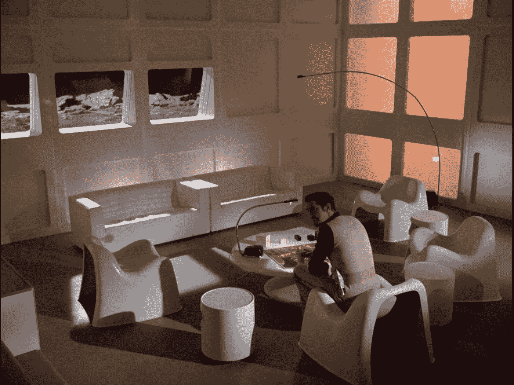

Image from [catacombs.space1999.ne](http://Foto da catacombs.space1999.net)t

## 空间:1999 年的电视节目是一个永久性的展示 60 年代和 70 年代的设计和创意的橱窗——意大利的和非意大利的。

月球基地阿尔法状态报告。离开地球轨道 2610 天后

在指挥官柯尼希的脑海中，计算机冰冷的声音仍然回响着:“数据不足，需要人类决定”。又一次，轮到他了。指挥官坐在他的办公桌前，脸上带着紧张和疲惫。出埃及行动。这是最好的选择吗？永远抛弃阿尔法，搬到一个充满陷阱但也充满机遇的星球？

就在这时，伯格曼教授走进了指挥官的办公室。他坐在小扶手椅上，把一杯热咖啡放在桌子上，放在图表和老鹰队进行的测量之间。双方对视了一会儿，但都保持沉默。

与此同时，医疗中心的拉塞尔博士正忙着给艾伦和桑德拉注射药物，他们刚从起飞坡道上的“雄鹰 4 号”坠机事故中返回。他看着他们躺在躺椅上，被昏暗的灯光照亮。他注意到桑德拉在呻吟。站起来，他放下衣架，但不在乎。

[**空间:1999 年**](https://en.wikipedia.org/wiki/Space:_1999) 是我最喜欢的电视剧。它一直留在我的心里，在我的记忆里，在我的梦里。“人文主义”科幻小说，“T8”索拉里斯“T9”或“T10”2001:太空漫游”风格，被丰富的特效今天仍然有效。阿尔法人迷失在迷幻而不可理解的宇宙中，他们穿着象牙色的制服，非常优雅，只有左袖有一丝颜色。月球基地阿尔法的房间似乎是未来主义的，优雅的，蜿蜒的，基本的家具和设计对象的集合…一瞬间…这真的是一个设计集合！

据我所知，这是第一次也是唯一一次，科幻系列中的场景充满了由著名设计师设计的装饰元素。他们中的许多人来自意大利学派，该学派在 60 年代和 70 年代以其创造力和工业化的设计方法入侵了世界。甚至制造公司也主要是意大利人，实验实验室使用创新的材料和形状。

我想举几个例子，图片和信息取自网站[Catacombs.net](http://catacombs.space1999.net/main/cguide/umfurnish.html)，电视节目的圣经，由**马丁·威利**精心编辑、管理和守护。

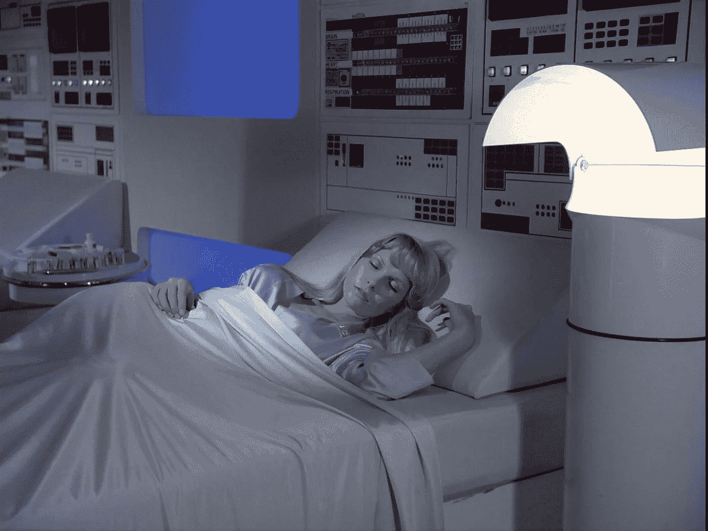

*皮莱奥落地灯*(上图)是由[盖·奥兰蒂](https://en.wikipedia.org/wiki/Gae_Aulenti)为阿特米德设计的。它是 Moonbase Alpha 的标志性亮点之一，还有由鲁道夫·博内托设计、古兹尼生产的“ *Sorella* ”台灯(下图)。

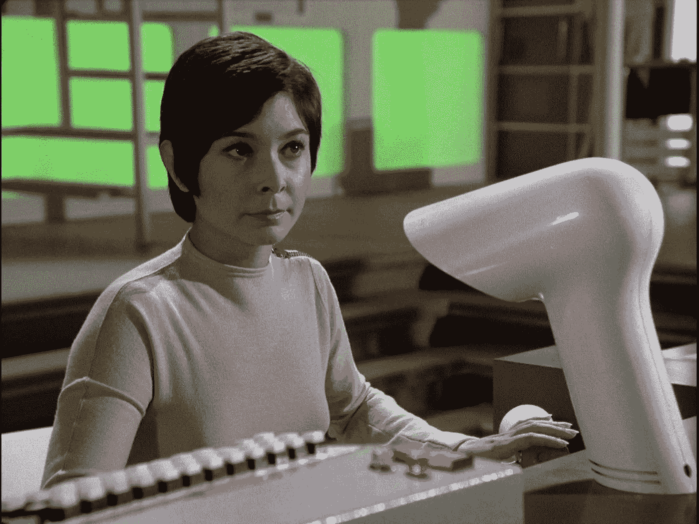

在下图中，全神贯注的伯格曼教授([巴瑞·摩司](https://en.wikipedia.org/wiki/Barry_Morse))坐在由[塞尔吉奥·马扎](https://www.artemide.com/company/designers/31929/sergio-mazza) (1968，阿尔特米德)设计的“ [*托加*](http://catacombs.space1999.net/main/cguide/furn/umfgaudi.html#toga) ”扶手椅上，旁边是由【16】 *卢乔拉* “法比奥·伦齐设计的灯”(1971，伊古齐尼)和 [*梅扎特塞拉*](http://catacombs.space1999.net/main/cguide/furn/umftable.html) 设计的桌子

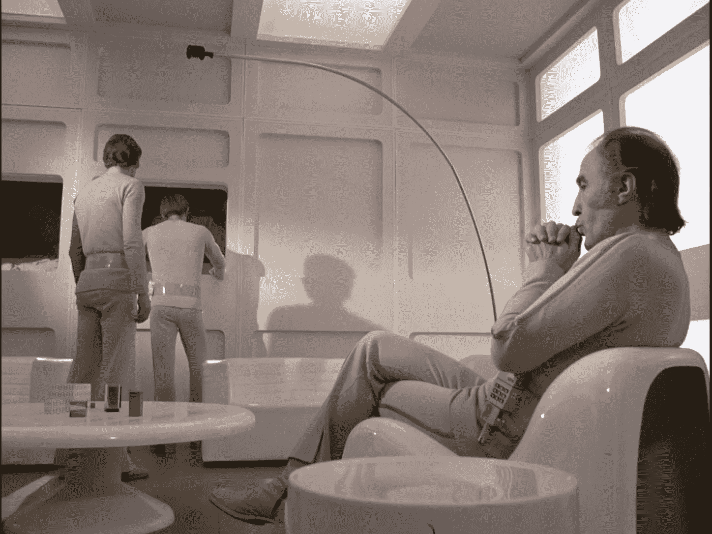

其他几个马杰斯莱蒂的作品也被使用过。也因为名字不可能错过著名的椅子“*”(1971，Artemide)，可见这里连同书桌“*”的作者是[阿尔韦托·罗塞利](https://it.wikipedia.org/wiki/Alberto_Rosselli_%28architetto%29) (1969，萨波里蒂)。**

**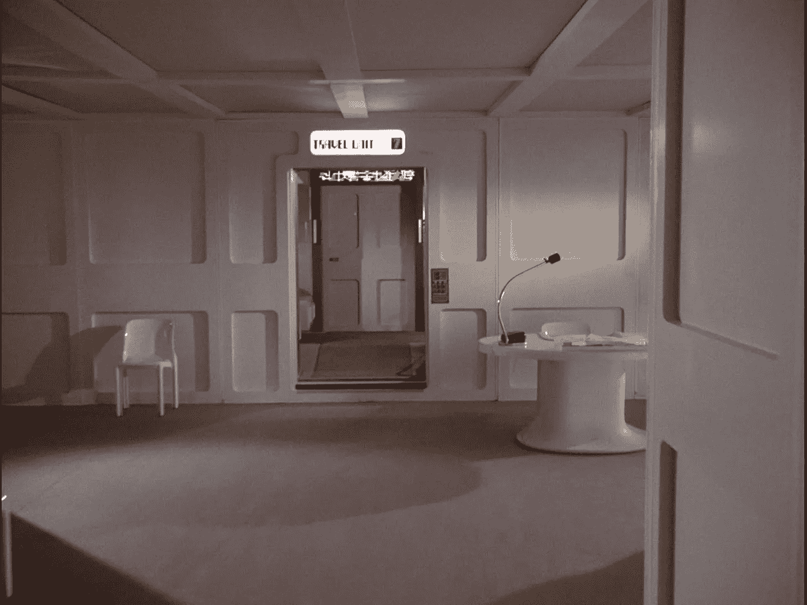**

**无处不在的桌子“[*Stadio*”](http://catacombs.space1999.net/main/cguide/furn/umftable.html#stadio)(1966，Artemide)也是由 Magistretti。**

**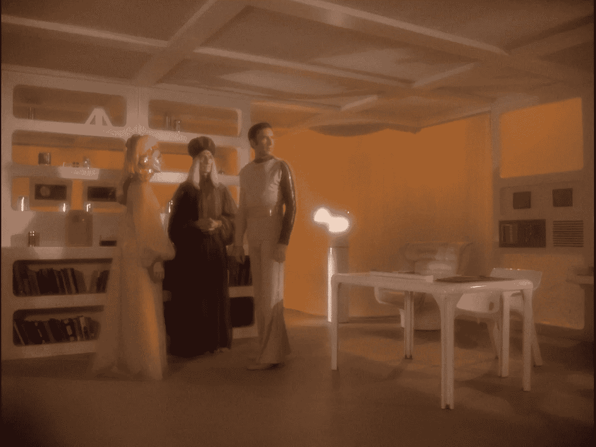**

**柯尼希指挥官([马丁·兰杜](https://en.wikipedia.org/wiki/Martin_Landau))的书桌容器是皮欧·曼祖的作品(1969，卡泰尔)。他是雕塑家贾科莫的儿子，也是[菲亚特 127](https://en.wikipedia.org/wiki/Fiat_127) 的设计师。这把椅子是德国的(1972 年，奥多·克洛斯)。**

**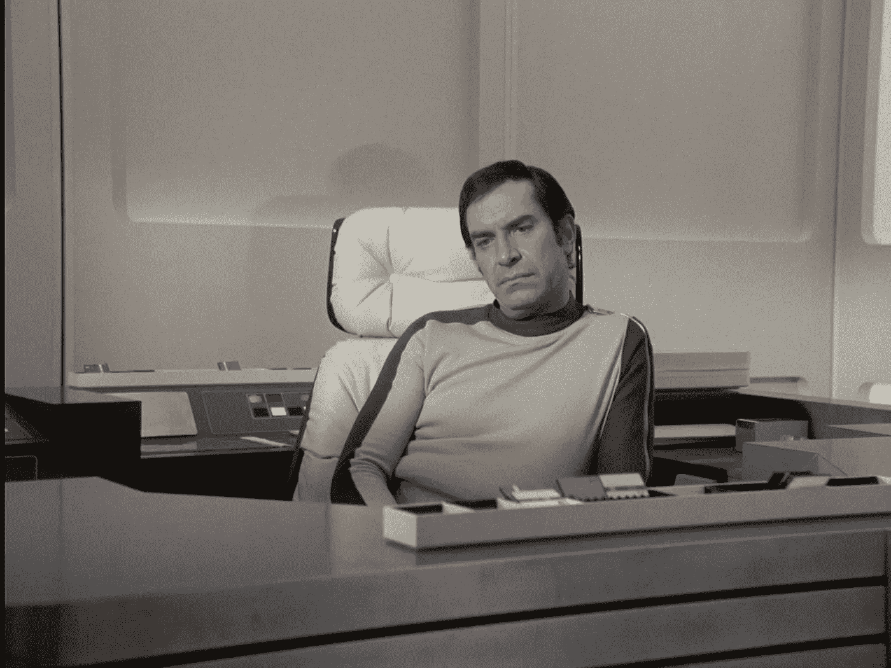**

**妖媚的拉塞尔博士([芭芭拉·贝恩](https://en.wikipedia.org/wiki/Barbara_Bain))房间里的那顶帽子是 [*梅尔波美妮*](http://catacombs.space1999.net/main/cguide/furn/umfmelpomene.html) ”由[洛多维科·巴比亚诺·迪·贝尔乔索](https://it.wikipedia.org/wiki/Lodovico_Barbiano_di_Belgiojoso)、[恩里科·佩雷苏蒂](https://it.wikipedia.org/wiki/Enrico_Peressutti)和[埃内斯托·内森·罗杰斯](https://en.wikipedia.org/wiki/Ernesto_Nathan_Rogers)制作，由阿尔特米德实现。**

**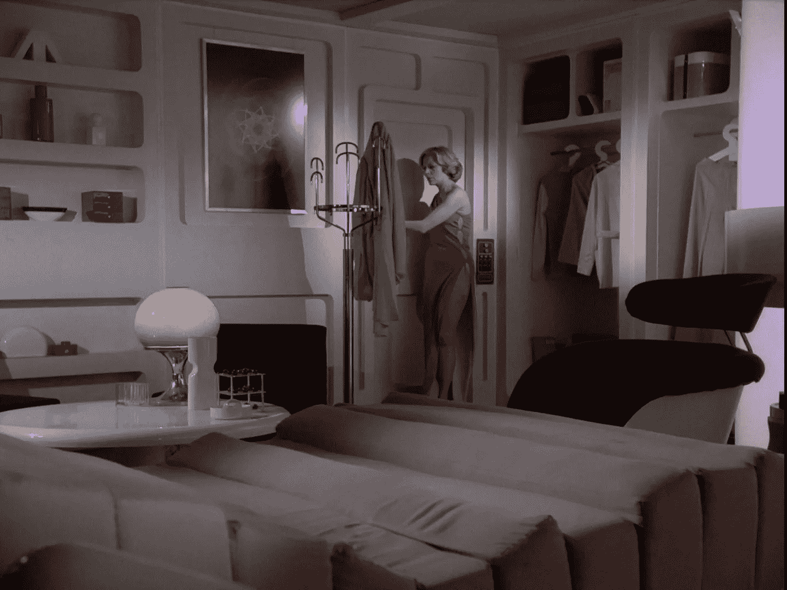**

**它不会错过 [Olivetti](https://en.wikipedia.org/wiki/Olivetti#Computers) 所追求的失落的意大利电子和计算机科学之路的一个片段:由 [Mario Bellini](https://en.wikipedia.org/wiki/Mario_Bellini) 设计的计算器“ [*Divisumma 18*](http://catacombs.space1999.net/main/cguide/furn/umfdivisumma.html) ”，在一集里被用作谷歌翻译的不太可能的前身。**

**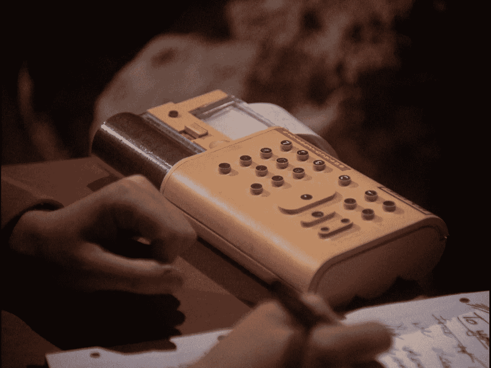**

**即使是由格里和西尔维亚·安德森创作的系列中的外星人，也有着非凡的审美趣味。例如，在一艘宇宙飞船上我们发现一把由设计师[乔·科伦坡](https://en.wikipedia.org/wiki/Joe_Cesare_Colombo)、*E*[*LDA*](http://catacombs.space1999.net/main/cguide/furn/umfelda.html)(1965，Comfort)设计的扶手椅。**

**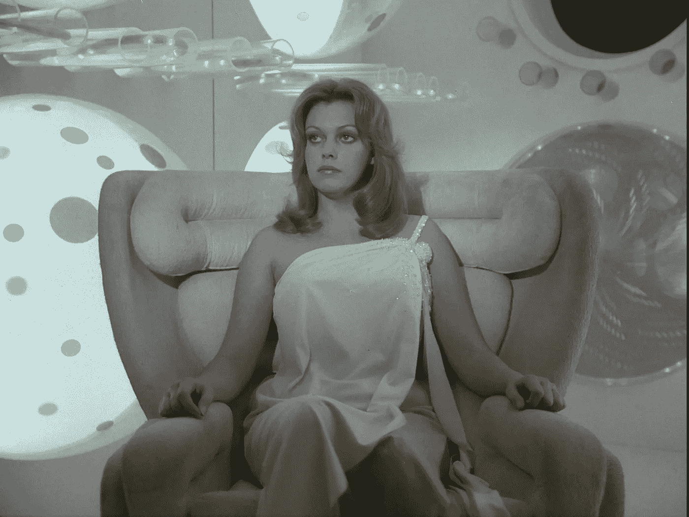**

**科伦坡的另一个作品，储物推车“ [*Boby*](http://catacombs.space1999.net/main/cguide/furn/umfboby.html) ”。**

**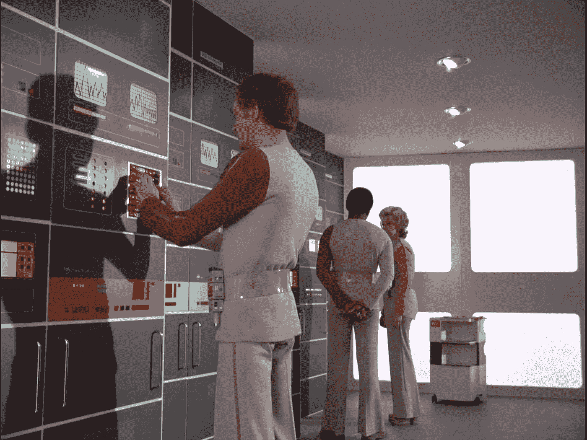**

**最后，在这个简短的回顾中，我们不能不提到芭芭拉·贝恩的朋友、奥地利裔美国时装设计师兼同性恋活动家鲁迪·格瑞奇(Rudi Gernreich)设计的男女通用制服(“束腰外衣”)。**

**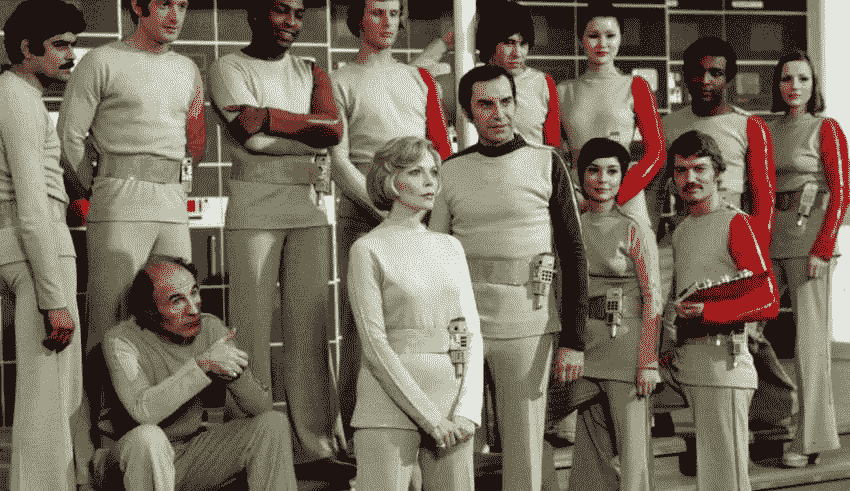**

**Source: [gerryanderson.co.uk](http://gerryanderson.co.uk)**

***** *意大利设计的一个有趣故事，可以通过* [*新美乐股份公司·斯科佩利蒂*](http://dspace.unive.it/bitstream/handle/10579/1711/825991-126302.pdf?sequence=2) *(意大利文)的毕业论文追溯。***

****

## **这篇文章发表在《创业公司》杂志上，这是 Medium 最大的创业刊物，有 314，551 人关注。**

## **订阅接收[我们的头条新闻](http://growthsupply.com/the-startup-newsletter/)。**

****