# 国际创业指南:迪拜

> 原文：<https://medium.com/swlh/the-international-startup-guide-dubai-c11171058d9a>

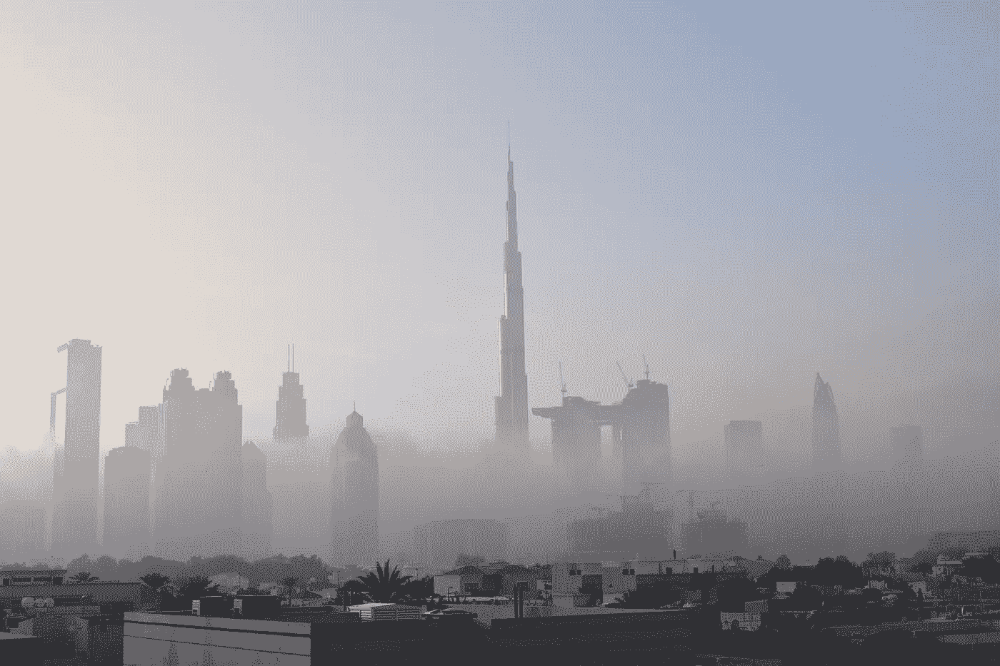

Dubai (Sunrise), United Arab Emirates

“创业不插电”博客系列的一部分:博客 3

从“不插电创业”世界巡演反思迪拜的创业生态系统。

那些在 Medium 或我的任何社交媒体渠道(如 [Twitter](https://twitter.com/MarcelMuenster?ref_src=twsrc%5Egoogle%7Ctwcamp%5Eserp%7Ctwgr%5Eauthor) 或 [LinkedIn](https://www.linkedin.com/in/marcelmuenster/) )上关注我的人，你们会知道我今年开始了一个新项目:一场“不插电创业”世界巡演。如果你还没有机会读到我的旅行，那么请随意在这里赶上。

几天前，我刚刚完成了旅程的第一站，在此期间，我在迪拜度过了两周。在那段时间里，我能够了解到他们独特的创业生态系统。在实地工作并与如此多的企业家会面后，我获得了大量关于在中东“创业”的知识。

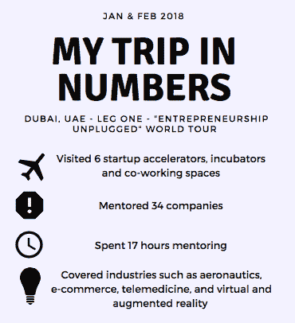

对于迪拜 300 多万外籍人士中的许多人来说，这座城市是通往更美好、更安全、更繁荣生活的大门。虽然有很多方法可以利用迪拜的资源来实现你的任何梦想，但创业是我最了解的，因此我将在这里讲述我的经历。在博客的第一部分，我将通过提供如何找到合适的创业资源和成本估算的指南来关注在迪拜创业。第二部分将向您展示以迪拜为中心的 MENA(中东和北非)创业活动的“30，000 英尺视角”。在追求任何形式的创业梦想之前，这是需要知道的两件关键事情。

**在迪拜创业:成本分析💰**

在迪拜创业，无论你是决定与当地合作伙伴合作还是在自由区创业，都不便宜。所以，在开始之前，你首先需要决定走哪条路，并权衡相对成本。当然，下面的费用只是一个近似值，但确实提供了一个在迪拜做企业家的财务负担的概念。这些成本会根据公司的实际规模和类型、位置以及其他业务需求而有所不同。

1)有限责任公司

有限责任公司可以由最少 2 人最多 50 人组成，他们的责任限于他们在公司资本中的股份。有限责任公司在当地贸易中提供灵活性，这意味着你不会像在自由贸易区那样受限于贸易区的边界。公司外资股权不能超过 49%；因此，当地合伙人是必要的，他们必须持有公司的多数股份。一般最低资本为 30 万迪拉姆。

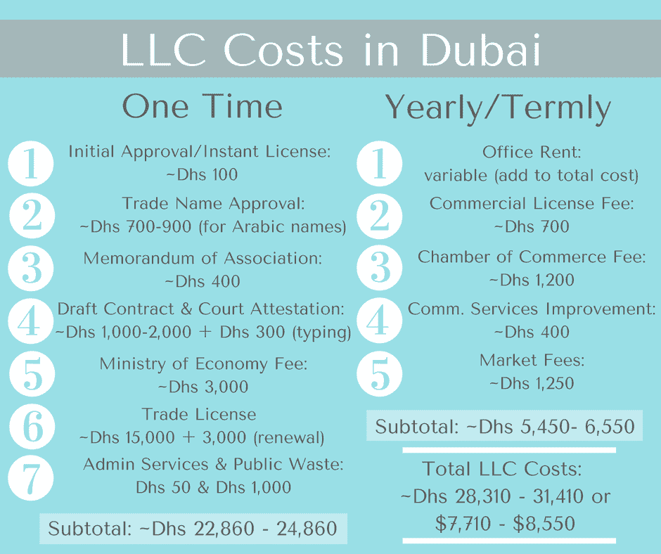

2)自由区

在自由贸易区成立公司有很多好处，包括拥有 100%的所有权和免除所有进口关税。成本和收益因地点和企业类型而异。阿联酋有 45 个自由区，可供选择的选项很多；仅迪拜就有 20 个(见[海湾新闻的“阿联酋的 45 个自由区:为你的新业务找到合适的自由区”](http://gulfnews.com/guides/life/community/45-free-zones-in-the-uae-find-the-right-one-for-your-new-business-1.1716197)查看详细分类)。

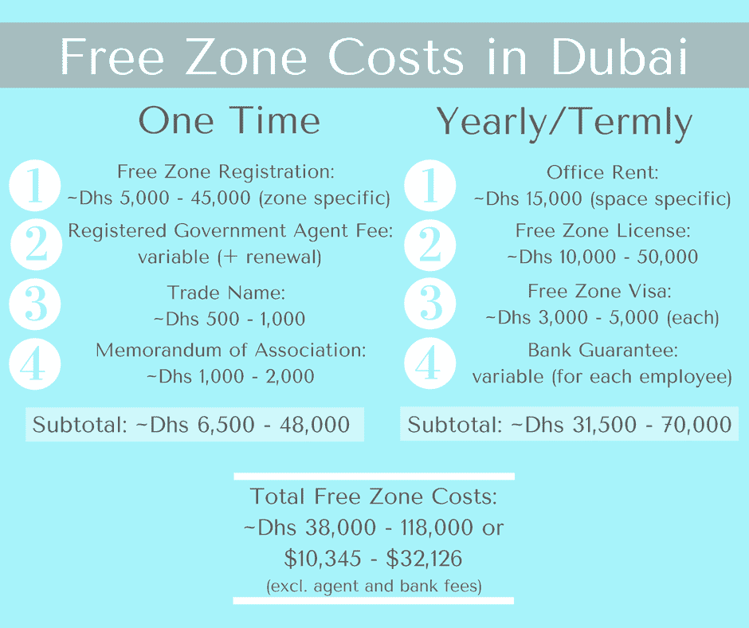

欲了解更多关于有限责任公司和免税区成本的详细信息，请点击[此处](https://docs.google.com/spreadsheets/d/1lcaUICRBNO1Fl4Q0EDY0nKu1q4GAQEZ3FAEgpquNI7o/edit?usp=sharing)。

**中东创业生态系统的“30，000 英尺视角”🌍**

据 [Investopedia](https://www.investopedia.com/terms/m/middle-east-and-north-africa-mena.asp) 称，MENA(中东和北非地区)包括大约 22 个国家(详情见[此处](https://en.wikipedia.org/wiki/MENA))。由于该地区没有标准化的定义，不同的组织将该地区定义为由不同的领土组成。该地区拥有 3 . 81 亿人口，约占世界人口的 6%，是全球经济稳定的重要来源(全球 60%的石油储量和 45%的天然气储量都在该地区)。

《国家日报》的达尼亚·萨阿迪报道说，未来五年，中东北非的财富预计每年增长 8.8%。此外，中东和北非地区的总财富在 2000 年至 2017 年年中之间增长了 156%，增速高于同期 140%的全球平均水平。

底线是，世界的这一部分是有钱可花的，这一点不会让人感到意外。特别是对于初创公司来说，这提供了一个通过提供创新和独特的服务或产品来寻找投资者和客户的机会。

*中东北非的温床🔥*

在接受 Techstars 采访“500 Startups MENA Fund”董事总经理哈桑·海德尔(Hasan Haider)的采访时，海德尔指出，开罗(埃及)、利雅得(沙特阿拉伯)、迪拜(阿联酋)和多哈(卡塔尔)等城市是商业活动的温床。下图给出了基于地理位置的创业地点细分。阿联酋，尤其是迪拜，是该地区排名第一的地方，其次是埃及、土耳其和科威特。

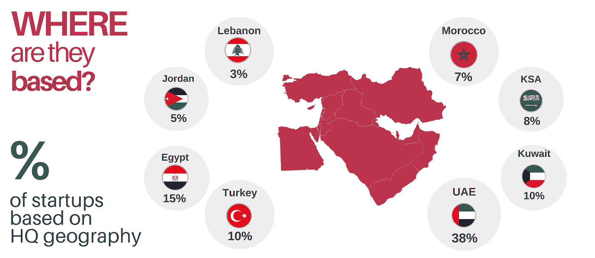

Picture Source: [https://www.magnitt.com/sites/default/files/files/MAGNiTT_MENA_EXITS_INFOGRAPHIC(1).pdf](http://Picture Source: https://www.magnitt.com/sites/default/files/files/MAGNiTT_MENA_EXITS_INFOGRAPHIC(1).pdf)

*投资和筹资生态系统*🏆

根据 [MAGNiTT 的#MENAFounders 报告](https://www.entrepreneur.com/article/292312)，阿联酋拥有该地区 50%的顶级融资创业公司。此外，[menabytes.com](https://www.menabytes.com/2017-venture-report/)发布了一份“中东和北非地区年度风险报告”,展示了在中东和北非地区取得的成功。通过跟踪 123 家创业公司的 134 笔交易，他们发现，仅 2017 年一年，该地区就有价值约 4.75 亿美元的投资。更重要的是，其中 84%,约 4 亿美元，直接流向了阿联酋。很明显，正如他们所说，“2017 年对于中东和北非的创业公司来说是伟大的一年”，为未来几年的进一步成功提供了希望。

*最热门行业*🔑

下图根据创业公司退出的百分比，显示了哪些行业最热门。最热门的行业——电子商务——中最突出的例子是亚马逊对 Souq 的收购和 Emaar Malls 对 Namshi 的收购。

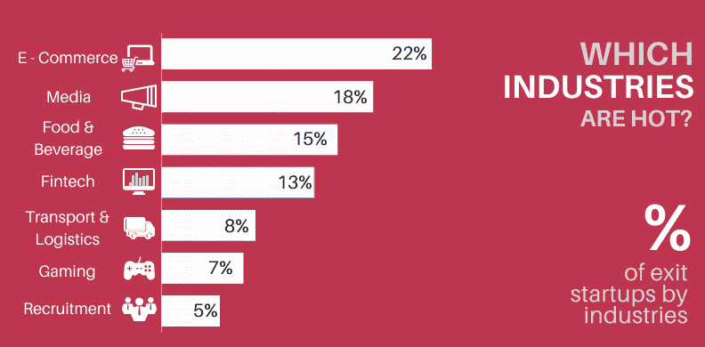

Picture Source: [https://www.magnitt.com/sites/default/files/files/MAGNiTT_MENA_EXITS_INFOGRAPHIC(1).pdf](https://www.magnitt.com/sites/default/files/files/MAGNiTT_MENA_EXITS_INFOGRAPHIC(1).pdf)

*投资明细*💸

就投资阶段而言，在下文详述的总共 117 笔交易中，只有 12 笔(不到 11%)属于种子期前类别。仅阿联酋就有不到 8.8%的种子期前交易，这表明该地区投资超过 10 万美元的可能性很高。

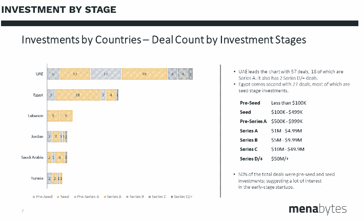

Picture Source: [https://www.menabytes.com/2017-venture-report/](https://www.menabytes.com/2017-venture-report/)

我在迪拜时发现的一件有趣的事情是，尽管显然有钱可花，但阿联酋人仍然非常厌恶风险，商业交易主要依赖于信任。

因此，问题变成了:不是本地人的创始人如何弥合“朋友和家人之间的鸿沟？”由于外籍企业家和投资者之间的不熟悉(以及当地投资者对信任的承诺)，对一些人来说，在迪拜筹集资金存在重大障碍。目前的问题是找到一种方法，让外籍人士克服这一障碍，这样他们也可以利用迪拜蓬勃发展的创业生态系统。

*创始人是谁？*💡

根据 [MAGNiTT 的#MENAFounders 报告](https://www.entrepreneur.com/article/292312)，中东和北非地区 100 家初创公司的人口统计数据如下:

**国籍**

*   68%的创始人来自中东和北非地区。最多的创始人来自黎巴嫩(20%)，约旦紧随其后，占 18%。创始人数量排名前 8 位的其他国家包括埃及、土耳其、巴勒斯坦、KSA、叙利亚和阿联酋。

**创始人数量**

*   79%的中东和北非 100 强创业公司都有一个或两个创始人。

**性**

*   12%的中东和北非创始人是女性。

**体验**

*   中东和北非地区的创始人在创办自己的创业公司之前，平均有 9 年的专业经验。
*   35%的 MENA 创始人曾在[麦肯锡&公司](https://www.mckinsey.com/)、[战略&、T13](https://www.strategyand.pwc.com/)[德勤](https://www2.deloitte.com/us/en.html)等公司从事咨询或财务工作。
*   35%的 MENA 创始人之前在创业公司工作，即 [Bayt](https://www.bayt.com) 、 [Yahoo](https://www.yahoo.com/) ！、[扎维亚](https://www.zawya.com/mena/en/)和[杜比兹勒](https://www.dubizzle.com)。

**教育**

*   中东北非地区 41%的创始人毕业于 MBA 学位:排名前五的学校是哈佛大学、欧洲工商管理学院、伦敦商学院、麻省理工学院和斯坦福大学。
*   48%的 MENA 创始人拥有工程学位。

*数字上的成功*🔝

MAGNiTT 的#MENAFounders 报告提供了更多关于 MENA 创业生态系统的精彩细节:

**退出**

*   过去 5 年，中东和北非地区的初创企业已经退出了 60 次。只有 38%的交易被披露，估值超过 30 亿美元。报告中的下图很好地展示了 2012 年至 2017 年的情况:

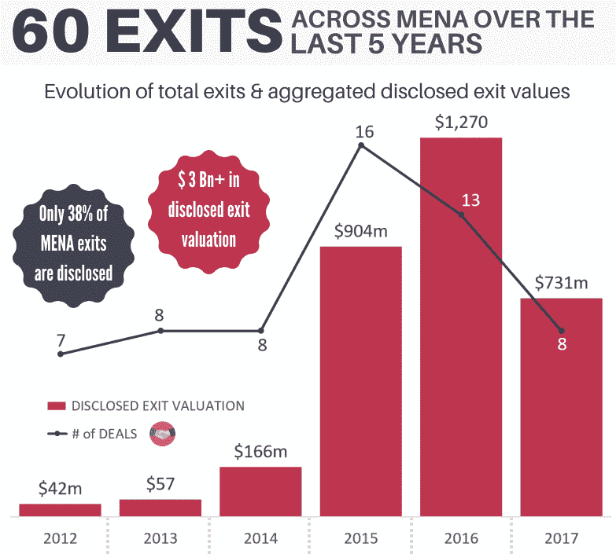

Picture Source: [https://www.magnitt.com/sites/default/files/files/MAGNiTT_MENA_EXITS_INFOGRAPHIC(1).pdf](https://www.magnitt.com/sites/default/files/files/MAGNiTT_MENA_EXITS_INFOGRAPHIC(1).pdf)

*   平均而言，退出需要 7 年时间。
*   按照披露的收购情况，中东和北非地区 10 大退出公司如下所述。迄今为止，中东和北非地区最大的退出者是被 Miteno 以 9 亿美元收购的 media.net。

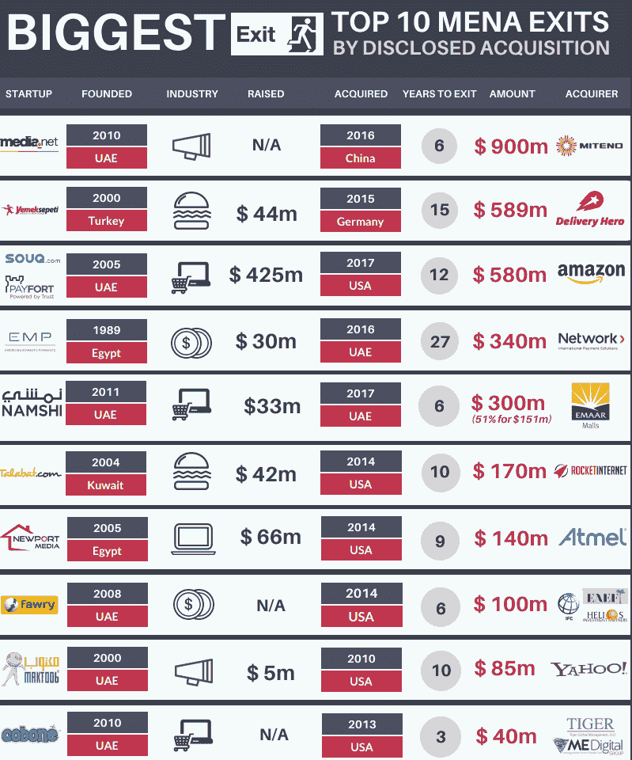

Picture Source: [https://www.magnitt.com/sites/default/files/files/MAGNiTT_MENA_EXITS_INFOGRAPHIC(1).pdf](https://www.magnitt.com/sites/default/files/files/MAGNiTT_MENA_EXITS_INFOGRAPHIC(1).pdf)

**收购方的来源**

*   47%的收购者来自中东和北非地区，其次是欧洲(30%)和美国(12%)。

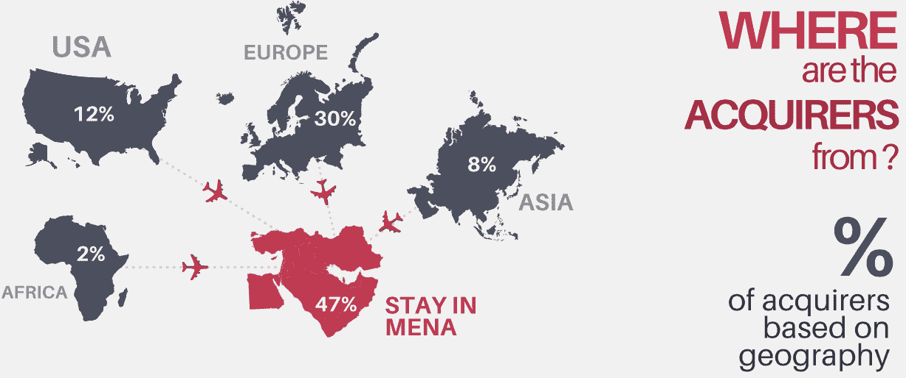

Picture Source: [https://www.magnitt.com/sites/default/files/files/MAGNiTT_MENA_EXITS_INFOGRAPHIC(1).pdf](https://www.magnitt.com/sites/default/files/files/MAGNiTT_MENA_EXITS_INFOGRAPHIC(1).pdf)

**成功的风投**

*   值得注意的中东和北非风险投资的退出包括。每个成功的创业生态系统都需要最终再投资的出口。

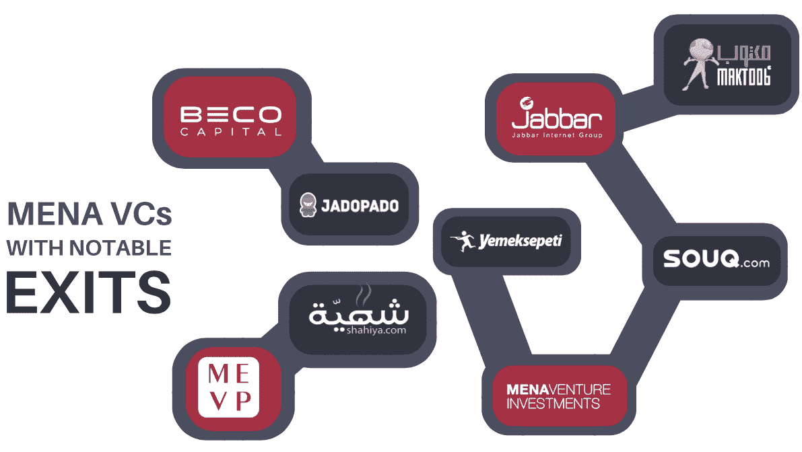

Picture Source: [https://www.magnitt.com/sites/default/files/files/MAGNiTT_MENA_EXITS_INFOGRAPHIC(1).pdf](https://www.magnitt.com/sites/default/files/files/MAGNiTT_MENA_EXITS_INFOGRAPHIC(1).pdf)

在我返回波士顿的 14 个小时的飞机上，我无法停止思考我短暂但非常紧张的创业之旅。写完这篇博客后，我很兴奋地看到，我对迪拜(和中东北非地区)创业生态系统实力的许多假设变成了事实；他们作为真正的强国正在崛起和繁荣。

简而言之，该地区拥有大量购买力强劲的客户，强大的创业生态系统，以及越来越多的成功退出。这绝对是一个考虑开始创业之旅的好地方。然而，我要说的是，不管人们议论纷纷，任何认真考虑在迪拜(或该地区其他地方)创业的创始人都应该敏锐地意识到文化差异和语言障碍。

总的来说，迪拜是一次真正奇妙的经历。就我个人而言，我带着一个我已经开始着手的想法离开了；市场上的一个缺口，我很乐意看到它被修复。

你呢？你打算解决什么问题？

波浪形卷发

➡️每周从你的收件箱里收到一篇值得一读的文章。[在这里报名](https://goo.gl/forms/p6gnR2OTUiZc47in2)。🙏

PS:大家可以拍手跟我来，这样会有更多的人在 Medium 上看到这篇文章(见下面的视频)。👏 👍

**你可以通过**联系到我

**推特:** @marcelmuenster

**个人网站:**[about.me/marcelmuenster](http://about.me/marcelmuenster)(了解更多关于我的信息并安排通话)

**LinkedIn:** 给我发一封[电子邮件](https://www.linkedin.com/in/marcelmuenster/)或一条[直接信息](https://www.linkedin.com/in/marcelmuenster/)

## 这个故事发表在 [The Startup](https://medium.com/swlh) 上，这是 Medium 最大的创业刊物，拥有 307，871+人关注。

## 在这里订阅接收[我们的头条新闻](http://growthsupply.com/the-startup-newsletter/)。

