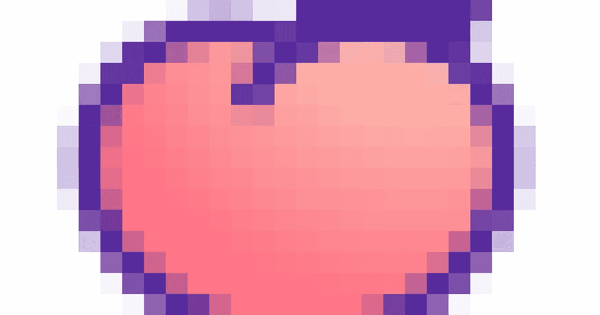
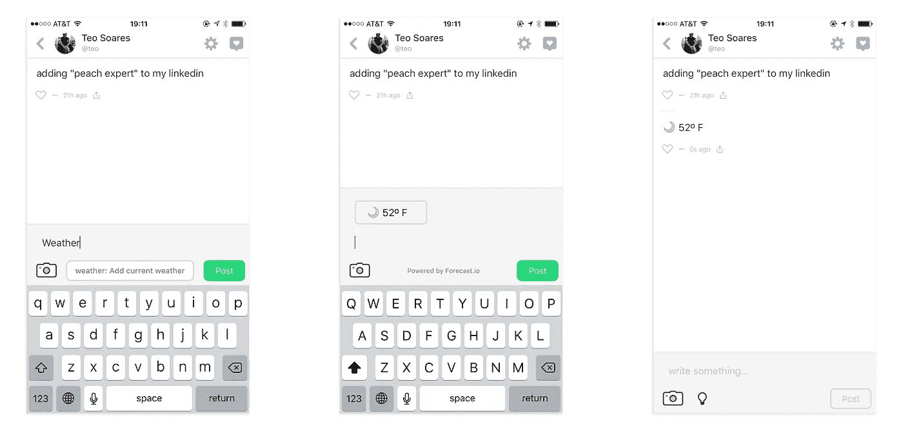

# 互联网和巨型桃子应用

> 原文：<https://medium.com/swlh/the-internet-and-the-giant-peach-app-bd7340892dc6>

## 关于桃子上市的 3 点想法

如果你是互联网上的某类人——一个技术型、媒体型、表情型的人——你可能听说过 [Peach](http://peach.cool) 。

这是一个 Twitter-meet-Slack-meet-your-iPhone 社交网络，由 Vine 的联合创始人发起，上周五大张旗鼓地推出。还有表情符号。

如果你是互联网上的另一种人——从事发展数字产品业务的那种人——你也应该注意一下 Peach 的推出。

原因如下。

## 他们称他们的应用程序为“桃子”，让发现见鬼去吧

SEO-wise，桃子可以找到一个更好的名字。桃子是一种水果。它是一种颜色。这是“全国桃子月”存在的理由，每年八月，“桃子”在谷歌搜索中会出现[高峰。Peach(这个应用程序)甚至没有改变这个词——比如说，Peech——以使自己更容易被发现。](https://www.google.com/trends/explore#q=peach)

网址也是如此， [peach.cool](http://peach.cool) ，它歪曲了传统的. com 或. co。当然，peach.cool 被采用了，但还有其他选择。你可以花 2.99 美元拥有[peachapp.co。](https://www.godaddy.com/domains/searchresults.aspx?checkAvail=1&domainToCheck=peachapp.co)

但是，从这个词的传统意义上来说——从这个词的 SEO 意义上来说——可发现性并不是 Peach 的重点。在发布初期，这款应用吸引了一群非常特殊的观众。这种类型的观众会发现点酷网址，嗯，酷。这就是前面提到的技术、媒体和表情符号受众，他们都生活在一个平台上:Twitter。

所以把 Peach 的发布看作是为 Twitter 优化的。从这个角度来看，“桃子”是一个奇妙的名字。是表情符号！是一个委婉代表其他东西的表情符号！是推特上通常很少见的表情符号！换句话说:尽管对于搜索引擎优化来说，Peach 是一个糟糕的名字，但是对于 Twitter 优化来说，它却是一个非常棒的名字。

上周五，当 peach 推出时，Peach 表情符号的使用量[达到峰值](https://twitter.com/ProductHunt/status/685631066737000448)。通过获得有影响力的媒体类型的立足点，Peach 最终提高了其搜索引擎优化。

## 他们隐藏了他们的黑仔特征

桃子的杀手锏——区别于脸书、推特等的唯一特征。——是“神奇单词”的概念键入“draw”，Peach 会弹出一个绘图画布。“天气”将为天气服务。“评价”让你对任何事物进行五星评分。诸如此类。

事情是这样的:就杀手级功能而言，当这款应用首次推出时，咒语是相当隐蔽的。Peach 没有将他们包括在入职培训中。它没有提供鼓励用户打字的覆盖层。找到一个神奇的单词列表需要它自己的神奇单词:“帮助。”

这是不寻常的，但它的工作。人们很好奇。他们会花时间在一个产品上，只是为了看看他们能找到什么。称之为寻宝游戏效应:隐藏应用程序的核心功能，通过鼓励用户寻找它来推动参与度。

更有甚者，发现了一个神奇单词的用户感到自豪。他们想分享他们的发现。他们发现“骰子”掷出了一对骰子，他们想与朋友分享这一点。参与度也因此提高。

当然，媒体对此深信不疑。咒语是最好的新闻素材。来自 [Mashable](http://mashable.com/2016/01/08/peach-magic-words/#ZuKoD8umigq3) :“这是你可以用桃子的‘魔咒’做的所有很酷的事情。”"

## 他们搞砸了，但没关系

周五的某个时候，桃子倒下了。互联网被打乱了。如果你曾经推出过任何东西，你可能会有这样的噩梦——今天是发布日，你的产品已经像病毒一样传播，媒体喜欢它，但你不能转化用户，因为，嗯，有东西坏了。

在这一点上，诱惑是忽视批评。埋头苦干，直到问题解决。这是可以理解的，但这不是桃子做的。他们承认，在品牌上，用表情符号。

用户喜欢它。

这并不是说在发布日破坏你的应用是一个好主意。但是每次遇到用户都是建立你品牌的机会，即使用户在抱怨。

每次发射都不一样。对桃子起作用的东西对其他产品不起作用。这不是重点。

这一点是这样的:SEO 驱动的决策和直接入职流程的标准应用工具包不是应用发布策略的全部。

有时候，你可以用表情符号来命名你的应用。