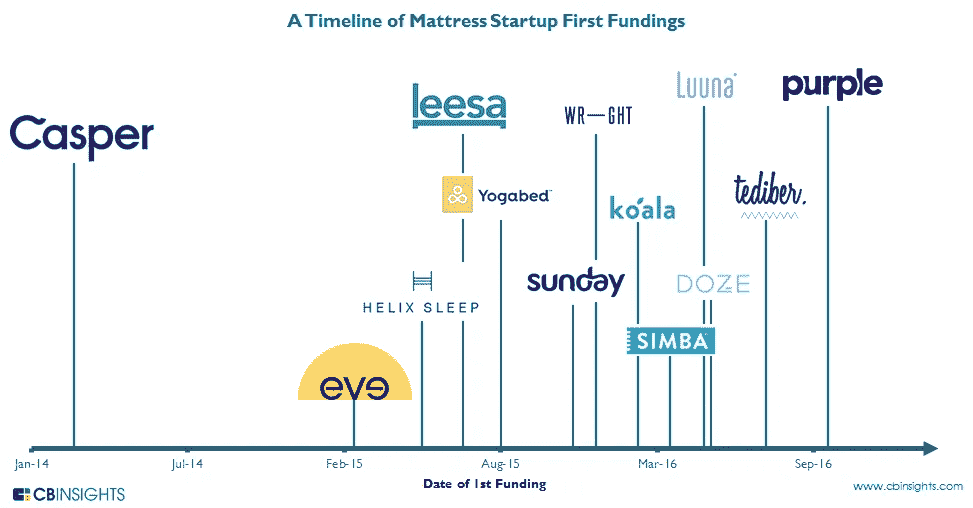

# 行动中的内部企业家:t 恤和床垫大战

> 原文：<https://medium.com/swlh/the-intrapreneur-in-action-t-shirts-mattress-cf51f41c3d09>

The Mattress Wars are real

你可能已经注意到越来越多的公司提供创新和业务转型服务。他们中的一些人深入参与了这些新兴的学科，另一些人则在现有的咨询服务中加入了这些产品，还有一些人疯狂地放弃了零散的商业模式。

毫无疑问需要存在。过去的大部分巨型企业都没有为未来做好准备，随着传统实践的强化和大范围的转向，他们自然需要帮助来为明天做好准备。

作为创新或转型计划的一部分，经常出现的一个概念是“内部企业家”。就像企业家一样，他们寻求解决问题、承担风险、激发主动性、释放价值并(最终)带来收入。唯一的区别是，他们是在公司内部这样做的，而不是靠同事的咖啡机为公司服务。

我已经培训了一些人，他们要么希望激励一批新的创业者，要么希望自己成为一名创业者，但我从未在野外见过这样的人。

直到上周末。

# 床垫大战

搬到纽约后，床垫成了我们新公寓购物清单上的第一项。经过一番考虑(尽管相对于成本来说可能还不够——我花了更多时间来决定午餐吃什么)，我从 *Leesa* 订购了一份，这是一家旨在吸引像我一样居住在城市的千禧一代的勇敢的创业公司。(我拒绝了*卡斯珀*，因为我喜欢支持失败者——当你的足球队是水晶宫时，这种事情就会发生)。

Leesa 在第一个月做得很好，然后到了圣诞节，它似乎有一种床垫僵直；清晨背痛成了家常便饭。由于我妻子工作繁忙，良好的睡眠尤为重要——是时候向莉沙挥手告别，迎来一位新的竞争者了。床垫大战是真实的——睡眠是一个竞争激烈的行业(见本文顶部的图片)

# 输入滴滴

新的竞争者最终成了老的现任者——在一个温和的周六下午，我们去了离我们住处几个街区的当地*床垫公司*。它离家很近，有自己的产品，还有一个有点令人困惑的橱窗展示。但是嘿。

我很自豪自己没有像一个吃了太多糖的 6 岁小孩一样把 6 英尺 6 英寸的身体摊开在商店的第一张床上(一周前我在一家设计师手提袋店的圆形沙发上这样做了，并因此受到了惩罚)，之后，一位名叫迪迪的相当迷人的海地女士向我们走来。

我不会告诉你我们床垫决策矩阵的更多细节，但一个小时后，我们已经准备好支付 dosh，并收到我们的新床垫和枕头(也是第二天送达)。在我们等待付款的过程中，我提到了她非常迷人的公司 t 恤。我喜欢它，但它看起来有点过时。

迪迪回应说，她自己设计并支付了费用，因为她认为这是一个让商店更令人难忘的好方法，并建立了更广泛的品牌知名度，也是一个提高她的设计和营销技能的机会。她甚至用这个标签建立了新的 Twitter 和 Instagram 账户。

直到床垫公司最近收购这家公司之前，这家商店一直是 Sleepy 's 的分公司。他们在去年 2 月开始更名，12 个月过去了，它看起来仍然像是一项正在进行的工作——在我旁边，一个令人困倦的名字在一些床垫公司品牌的床腿下害羞地探出头来，商店本身看起来有点昏昏欲睡。

迪迪认为更名并不十分成功，因此她决定亲自动手。她用自己的想法游说了几位高管，但没有得到任何回应。

我喜欢她的热情和激情——她对商店里的产品非常了解，显然喜欢帮助顾客，举止优雅，富有幽默感。她甚至自己掏钱定制了工作服！谁不想让她成为他们团队的一员呢？

滴滴是内部企业家的化身。我对公司高管没有认可她的倡议感到失望，所以我告诉她我会给他们写信，发表一篇关于我们在商店的经历的文章，并附上一张照片。她笑了。我猜她认为我就是那个彬彬有礼、有点古怪的英国人。

但我不是在开玩笑。这就是——迪迪和我们的新床垫和枕头。

祈祷我会收到床垫公司的西西里·迪肯森和 CMO 的回复，也许我们会看到“*有睡眠*？”不久的将来，在联合广场的广告牌上…

*原载于 2018 年 1 月 22 日*[*howardgray.net*](https://howardgray.net/2018/01/22/the-intrapreneur-in-action/)*。*

## 这个故事发表在 [The Startup](https://medium.com/swlh) 上，这是 Medium 最大的企业家出版物，拥有 288，884+人。

## 在此订阅接收[我们的头条新闻](http://growthsupply.com/the-startup-newsletter/)。

