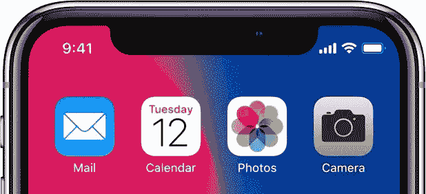

# iPhone X Notch 完全是关于品牌的

> 原文：<https://medium.com/swlh/the-iphone-x-notch-is-all-about-branding-aef4f34c365b>

在 iPhone X 发布会之后，有很多关于其屏幕顶部独特“凹口”的讨论，该凹口容纳了支持 Face ID 的摄像头和传感器。许多人，尤其是设计师，都表达了他们的观点，认为它很丑，不符合苹果的设计标准。塞满角落的图标和时间显示看起来很糟糕。

