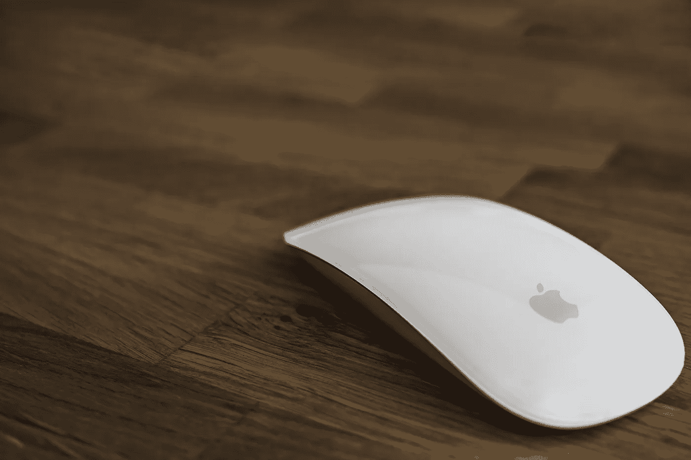

# 点击诱饵的讽刺

> 原文：<https://medium.com/swlh/the-irony-of-clickbait-b094f20886cb>

我想说，这个标题其实*并不是* clickbait。我在这里要谈的是为什么 clickbait 会兴起，为什么我们会如此负面地看待它，为什么它不完全是浪费时间。

我们都知道 clickbait 的兴起。我们可能是它的一两次受害者。

一些我们认为是点击诱饵的标题是误导性的，因为它们表述了以下内容之一:

*   那些让我们*个人*想点击的(迎合你)
*   那些让*任何人*都想点击它的东西(迎合所有人)
*   还有那些不会告诉你它是关于什么的(含糊地不迎合任何人)

现在比以往任何时候都更容易自愿放弃我们的时间，去做一些从一开始就不会给我们带来任何真正价值的事情。无论如何，我们要冒险一试。

因此，让我们看看 clickbait 如何永远不会胜过真实内容，clickbait 如何接管了我们的许多媒体，以及它是否应该被实践或被轻视。

# 内容永远是王道

每个人都知道并相信内容*是*，*永远是*的王。这永远是真的。

这并不是因为我们*希望*对于我们这些真正努力工作的人来说这是真的，不想屈服于像 clickbait 这样的策略来帮助我们。

然而，内容永远是王道，因为即使 clickbait 成功了，无论点击的是什么，都可能感觉是空的。一部有前途的电影，会觉得空洞。一个 Youtube 视频会觉得很空洞。

一个故事或一个想法是吸引人们并保持他们注意力的东西，而标题并不总是需要被贴上内容本身的标签。

如果某个东西被制作出来，而 clickbait 被用作一种策略，而它却有一个薄弱的故事，或者没有真正的问题被提出或回答，那么它就是空的，你和我都会看到这一点。

我们可能不会马上知道它，这是我们自愿花时间去看看它是否包含我们还没有得到的好内容。

这是一个“我想知道接下来这些角色会发生什么”的问题，但缺乏有趣的角色让我们不在乎。我们认为我们可能会感兴趣，所以我们试了一下，但我们并不真正关心。

我们寻找内容，有时会被我们不喜欢或感到空虚的内容所吸引。出于对转变的好奇，我们会听，所以这是我们的选择，与我们被吸引的事物保持合拍。

那么，这是否意味着，如果有前景的内容支持吸引注意力的方法，那么 clickbait 就是合理的？

在我看来，不一定。这就验证了它为什么有效。我们可能都不喜欢 clickbait，但我们可能会不顾一切地点击一些东西，因为我们花时间来看看它是否值得不会总是困扰我们。

# Clickbait 如何接管

Clickbait 已经接管，因为如果一切都是 clickbait，你必须搜索你想要的。

有了互联网的新功能和它的准确性，我们可以马上找到我们想要的东西。但这也带来了其他人，他们可能一直在寻找其他东西，跌跌撞撞地来到错误的页面，但选择留下来。

我们遇到的一切都在试图引起我们的注意。无论是我们在寻找的东西还是与之密切相关的东西，都给了我们另一个想得到答案的问题。

Clickbait 很常见，因为我们是否屈服对制作 clickbait 的人来说比对我们更重要。

我们可以抽出几分钟来决定某样东西是否值得我们花费时间，但那时我们已经给了他们想要的东西。咔嚓一声。

现在，如果内容或娱乐不存在，大多数情况下 clickbait 被命名为 clickbait。这是一个诱饵，因为它是空的，而且承诺的比实际的多。

一些通常可能被忽略的好东西将不得不使用 clickbait 作为一种策略，但是如果它值得我们花费时间并且我们喜欢它，我们不一定会认为它是 clickbait，因为它有一个标题背后的支持。

# 不应该练习点击诱饵吗

不幸的是，Clickbait 是必要的，因为虽然一切都是在线的，一切都是竞争性的，但导致具有真正内容的 clickbait 只是利用一种策略来吸引你的注意力。

让我们恼火的是没有任何价值的诱饵。

今天总会有点击诱饵，所以这是关于我们的决定，抓住机会，检查是否有符合我们想要的东西。

Clickbait 不是*对你撒谎*，它只是过度夸张的营销，以吸引你和尽可能多的人。有些人会喜欢，有些人不会，但大众使它成为必要。

虽然说起来很奇怪，但 clickbait 是一种可以学习的技能。

我自己不会使用太多的点击诱饵，也不会说我要在标题中谈论的内容，因为我没有练习过如何构思一个能吸引更多观众的标题。

然而，即使作为一项技能，如果它关注的远不止内容本身，而作品的焦点不在那里，那么 clickbait 也不是一件好事情。

我们不出售我们不确定的产品，我们的策略是在人们注意到它是一个失败的产品之前尽可能快地出售它。

但是在媒体的情况下，一个失败的产品只是一个消费者不满意他们没有付钱的娱乐。

这可能是一个令人讨厌的策略，我们已经变得麻木了。如果我们理解了*为什么* clickbait 是一个东西，我们可能会更愿意冒险去尝试一些东西，或者我们可能会把它视为对真实内容的更大威胁。

不管怎样，我想说的是点击诱饵并不总是坏的。应该被鄙视的是用在不良或缺乏内容上的点击诱饵。

## 这篇文章发表在 [The Startup](https://medium.com/swlh) 上，这是 Medium 最大的创业刊物，有 326，962+人关注。

## 在这里订阅接收[我们的头条新闻](http://growthsupply.com/the-startup-newsletter/)。

