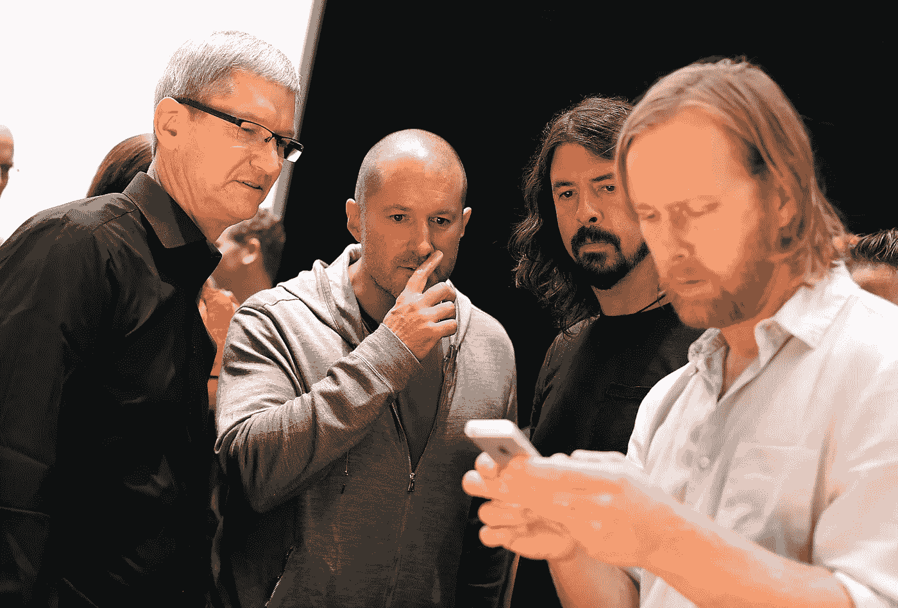
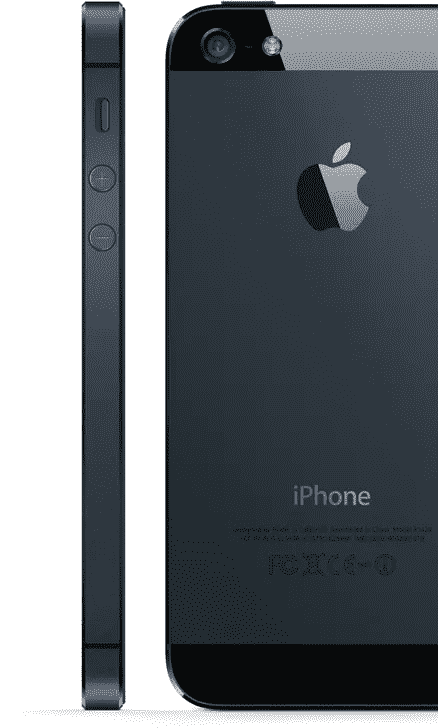

# 乔尼·伊夫原则

> 原文：<https://medium.com/swlh/the-jony-ive-principle-4e50641d41be>

The look of someone who gives a shit.

> “我认为我们大部分制造环境的特点是粗心……我们真诚地试图制造不符合这些价值观的产品，它们证明了我们拼命努力制造最好的产品，因为我们知道像 J.J .这样的人会坐下来盯着屏幕。他会感觉到…他无法清晰地表达出来，但我们希望他会感觉到其中的用心，我相信我们能够识别的远远超过我们能够表达的 …”
> 
> —乔尼·伊夫

上面这段话摘自今年《名利场》峰会上乔尼·艾夫和 J.J .艾布拉姆斯·布莱恩·格雷泽的一段对话。阅读它确实不能做到公正，所以当你看到它时，请确保查看本页底部的视频。

真正引起我共鸣的是这句台词:

> **我确实相信，我们辨别的能力远远超过我们表达的能力**

现在想一想 Jony 如此雄辩地暗示，当他设计每天接触数百万人的产品时，他并不认为我们将通过我们的理性思维大脑来体验它，而是我们将通过更深、更少表达的情感大脑来感受它。这个问题让你很难清楚地表达对以下问题的正确回答:

“你为什么爱那个人？”

或者

"你为什么辞去工作去一家工资较低的公司工作？"

这一点特别引起了我的共鸣，因为今天我们生活在一个“MVP”的第一世界，为了运输，或者为了尽快向我们的用户销售，或者为了满足价格点，或者达到时间表，或者击败我们的市场竞争对手，或者本月的其他指标，等等，我们不得不运输一些东西

我想我们可能丢了什么东西。

我认为我们失去了对产品的关心、思考和热爱。我认为我们应该做一些令人愉快和有趣的东西，只是因为它可能会让用户脸上露出笑容，而不是因为我们需要达到某种点击率。它的想法是，下次你想发布你的“狗的优步”应用程序时，你就坐在那里，在你敢写一行代码之前，他妈的研究出皮特保罗和牛头犬之间的区别。

这是不理智的。或者是？

可能没有数据支持它，但我确信它至少对我们使用的所有伟大产品负有部分责任。它甚至可能是我们都拼命寻找的“未知因素”。

也许是时候我们做 Jony 做的事情，专注于我们目前可能无法直接给出数字的事情，或者在用户测试中从推荐中辨别出来的事情？

也许我们应该花时间搞清楚什么对我们和使用我们产品的人真正重要，而不是把一堆飞镖扔在黑板上，看看有什么粘在一起？

也许我们所有的产品设计看起来都一样的原因是因为我们都试图快速发布一些东西，而不想花时间去真正深入挖掘我们想要解决的问题。所以我们遵循同样的设计模式，生产出同样没有灵魂的普通垃圾。

> “随便扔点自举上去！”

“We shot all this stuff,” Dye says, “the butterflies and the jellyfish and the flowers for the motion face, it’s all in-camera. And so the flowers were shot blooming over time. I think the longest one took us 285 hours, and over 24,000 shots.” — Wired ([http://www.wired.com/2015/04/apple-watch-design/](http://www.wired.com/2015/04/apple-watch-design/))

你 Apple Watch 上的那些水母、蝴蝶和花朵是用相机拍摄的真实的**真实的**水母、蝴蝶和花朵。它们不是某个团队在冲刺阶段为一个 8 分故事制作的动画设计。他们拍一朵花拍了 285 个小时，超过 24，000 个镜头，所以当你看着你的手腕时，你看到的第一件事会让你脸上露出笑容，照亮你大脑中你甚至不知道你有过的部分。

为什么？

因为他们在乎自己的手艺。

因为他们在乎你的经历。

你知道吗？

*这就是乔尼·伊夫原则。*

The whole thing is worth a watch. Really. But skip to 17:25 if you just want to see the relevant part.

我想分享一些真正引起我共鸣的产品，因为我认为它们投入了大量的工作、关怀、爱和思考。

1974 Porsche 911 Turbo.

Apple iPhone 5

Kanye West’s My Beautiful Dark Twisted Fantasy

你有些什么？在回复中分享一下吧！

## 我是谁？

我是一名具有工程意识的产品设计师，也是一名来自纽约市的具有设计意识的 iOS 工程师。我也碰巧想加入一个充满激情的团队，开发一些伟大的产品。

*如果你感兴趣，我们来聊聊:****danielrak@me.com****或*[***@ Daniel rakh***](http://twitter.com/danielrakh)

## 如果你喜欢这篇文章，你也会喜欢这些！

 [## Twitter 房间

### Twitter 的产品设计提案。

medium.com](/p/e6f34e843e9a)  [## 重新设计 Twitter 时刻

### 一项重新想象 Twitter 最新功能的概念设计研究。

medium.com](/p/f71658bbde68)  [## Tweetstorm 简介

### 将新兴的推文风格设计到 Twitter 中。

medium.com](/p/373bd7e5eb54) 

发表于*[**【SWLH】**](https://medium.com/swlh)**(***《创业》、《流浪癖》、《生活黑客》)**

******