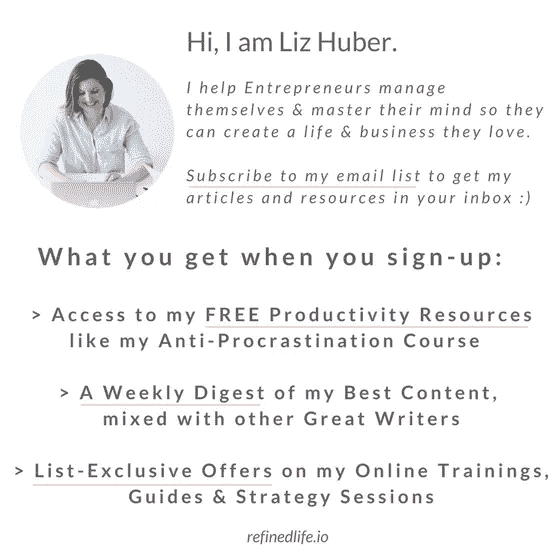

# 我用来赢得胜利的日志问题

> 原文：<https://medium.com/swlh/the-journaling-questions-i-use-to-win-the-day-db2663f4c0f3>

## 最大化项目日志的好处

我是日志的超级粉丝。事实上，这是我主要的正念活动——比起冥想，我更热衷于写日记。大概是因为我几乎能瞬间感受到结果。我坚信写日志是获得自我洞察力、从过去学习和重新编程大脑的最有力的工具之一。为了让你更好地了解写日记的程序是什么样子，以及在建立一个程序时应该考虑什么，我在这里与你分享我自己的个人程序。

# 我如何记录:

尽管任何形式的日志都是有帮助的，但我发现结构化的或有指导的日志在达到我的目标时是最有效的。这个想法是想出一套你每天都要回答的问题。当你刚开始写日记，写作对你来说并不容易时，这尤其有用。写出完整的句子并不重要——要点更好。选择问题时，考虑你的目标。你想对生活采取更积极的态度，变得更快乐吗？考虑在你的写作程序中融入一些感激或积极的问题！或者你正在朝着一个特定的目标努力，比如减肥或者自己创业？包括一个关于今天的成就和实现目标的行动的问题。我想你明白了。

重要的是建立一次你的日志结构，并试着在一段时间内坚持同样的问题。如果你每天都按照同样的顺序做，那就更好了！为什么？因为这样更容易回顾你写的东西，一个问题一个问题地分析，从中获得洞见。这些见解可以从发现哪些活动真正给你带来快乐，到发现生活中需要改进或改变的地方。

# 当我写日记时:

写日记可以极大地增加你早晨和/或晚上的日常生活。我个人尝试两个都做，但实际上我只是坚持晚上的那一个。哪里适合你的写作在很大程度上取决于你的喜好，以及你的目标。我发现早上写日记是进入正确心态迎接白天即将到来的挑战的好方法，而晚上写日记可以更好地用作反思练习以及支持良好的睡眠。此外，临时或紧急日志可以有效地将你从消极的思想漩涡中拯救出来，或者理清混乱的情绪。以下是我如何使用这些日志类型的更多信息:

# 我的早晨日记结构:

当我醒来感觉神清气爽、心情愉悦、注意力集中时，我通常会跳过早上的例行日志。但在那些我醒来感到沮丧、奇怪或不知所措的日子里，我会确保在工作前花一些额外的时间坐下来看我的日记。早上写日记是一个很好的工具，可以让你的头脑清醒，让自己再次关注重要的事情，甚至可以确定第二天你应该改变的事情(例如，取消不必要的会议或安排额外的自我护理会议或额外的一小时睡眠)。以下是我的早晨日记结构:

问 **问题 1:“我今天想实现的最重要的三件事是什么？”**

这个问题可以确保你的注意力集中在 3 上(而且只有 3！)一天中最重要的事情——在你开始之前。当你在最后一分钟醒来，匆忙去工作，甚至在你有机会思考今天的任务之前，你就会被电子邮件淹没，让别人支配你的一天，你会失去很多宝贵的时间。除了确保你处于游戏的顶端，并遵循你的优先事项而不是其他人的需求，这个问题还可以帮助你专注于真正重要的事情。你今天需要完成的一个项目是什么？你今天空闲时最重要的事情是什么？和家人一起吃饭？上健身课吗？

早上第一件事就是直接进入你的优先事项，忽略所有其他事情。这会让你更有效率，更快乐！

问 **问题 2:“我今天的目标是什么？”**

这个问题与第一个问题在一个稍微不同的层次上工作。与其关注成就或活动，不如关注你的心态，以及在这特定的一天你想如何思考和感受。但是和第一个问题一样，你也可以把它和你的目标联系起来。在日常生活中，你想改变你的思维和行为方式的是什么？要不要对自己好一点，让自己多放松一点？今天你想用健康的食物滋养你的身体吗？你打算更享受这一刻吗？以下是我最近的早间日志中的几个例子:

*   今天我会善待自己，即使我犯了错误。
*   今天我想专注于和男朋友一起吃饭的当下，而不是总想着接下来要做的事。
*   今天我想放松一下，因为我还没有从上周末生病中完全恢复过来。我会允许自己跳过锻炼，早点睡觉。

问题 3:“今天我为什么而兴奋？”

这是一个大的！为什么？因为如果你连续几天或几周都不回答这个问题，你迫切需要改变你的生活！要么你需要将更多你真正喜欢的活动融入到你的一天中(而不是总是对别人的计划说是，尽管你想做别的事情)，要么你需要改变你对你所做的事情的思考方式。

问 **问题 4:“我今天的肯定是什么？”**

早上写日记是一个很好的方法，通过把它们写在你的笔记本上(甚至可能是多次)来挤压你的肯定。试着在一段时间内坚持 1 或 2 个核心信念，以确保你的信念正确地根植于你的神经系统。当措辞肯定时，确保它们是现在时态，并且相当现实。以下是我最近早上的一些主张:

*   *我拥有自己创业所需的所有工具、技能和资源，并赚到足够的钱来养活自己。*
*   我吃得像我爱我自己一样，我动得像我爱我自己一样，我说话像我爱我自己一样。我爱我自己。

[http://bit.ly/signup-lizhuber](http://bit.ly/signup-lizhuber)

# 我的晚间日记结构:

睡觉前写日记已经成为我夜间生活不可或缺的一部分。它帮助我反思我的一天，把事情放在正确的位置，让任何困扰我的担忧或想法随风而去。以下是我目前在晚报上使用的问题:

问题 1:“我今天过得怎么样？”—打开日志

晚上，我会在笔记本上保留整整两页纸。在左边，我写一些公开的日志，记录当天我的想法。有时候是关于那天发生的事情或者我正在思考的问题的故事。有时候只是要点。有时它会变成图画或购物清单。我想对那页做什么就做什么！

问 **问题 2:“我今天实现了什么？”**

这个问题在两种情况下会有帮助:

1)你正在为非常具体的目标而努力。在这种情况下，记下你今天做的有助于实现这些目标的事情，例如“去上普拉提课”、“写博客”、“去约会”。

2)你感到沮丧是因为你在目标上没有进展，或者你对自己有负面的想法。在这种情况下，奖励自己的小成就。这可以让你正确看待“浪费的一天”。

问题 3:“今天有什么好消息？”或者:“今天我感激什么？”

这两个问题很像，但还是不太一样。我目前喜欢第一种，因为我试图适应一种更积极的心态。通过写下所有的事情(我是说所有的事情！)今天进行得很顺利(不提那些不顺利的)，我正在重新编程我的大脑，过滤积极的东西，享受小事情。以下是最近几周的一些好消息:

*   *发现了一位令人惊叹的新艺人——无法停止听她的歌*
*   *今天早上喝了鲜榨橙汁*
*   *提前下班去上瑜伽课*

如果你选择感恩这个问题，你会更多地关注生活中美好的事情，而不仅仅是这一天。例如:*我深深感激我的恋爱关系，我自己的公寓和我支付高级瑜伽课程的能力。选择对你更合适的问题。*

问 **问题 4:“什么让我烦恼？我担心什么？”**

这个问题有两个目标:
1)放下所有在你脑海中浮动的想法，这样你就可以有一个轻松的睡眠
2)马上或一夜之间想出解决方案(是的，这很有效！).我喜欢用头脑风暴的方式来解决我在日记中担心的问题。有时想出一个行动并决定第二天去做，有助于睡前放松。而且有时候，通过睡前在笔记本上写下问题，你的大脑会在你睡觉的时候想出解决办法。试试吧！

问题 5:“今天我还能做得更好吗？”

最好的自我反省！反思今天不顺利的情况，并想出下次做得更好的方法。通过积极思考你会有什么不同的做法，你更有可能在下次面临类似情况时采取不同的行动。

问题 6:“明天最重要的三件事是什么？”

如果你还没有在你的早间日志中提到这个问题，确保你在晚上也提到它。前一天晚上写下你第二天的重点的好处很简单:你的想法仍然是今天的问题，所以更容易确定第二天的下一步是什么。如果你在晚上对所有你需要做的事情感到不知所措，这也会有所帮助(有人有周日晚上忧郁吗？；)).

# 临时/紧急日志记录:

除了遵循结构化方法的日常日志之外，我经常将日志作为一种工具来摆脱消极的思想螺旋或理解我混乱的感觉。为了做到这一点，我通常只是坐下来，打开日志。像“我感觉如何？”或者“到底是怎么回事？”以及“为什么我会有这种感觉？”会非常有助于引发有见地的日志会话。通常情况下，我从紧急日志会议中清醒过来，头脑更加清醒。

# 最后的想法

如果你使用结构化的方法，通过回答针对你的目标的问题，写日记会是一个非常有效的自我洞察和大脑编程工具。此外，开放式日志可以帮助你理解自己的想法，并发现生活中当前问题的隐藏解决方案。

# 你准备好提升你的心态和生产力了吗？

注册到我的电子邮件列表，就可以获得我的免费资源和我的最佳内容的每周摘要，与其他伟大的作家混在一起。我希望你能加入我的部落！

**👉🏼** [**注册**](http://bit.ly/signup-lizhuber) **到我的邮箱列表**

[http://bit.ly/signup-lizhuber](http://bit.ly/signup-lizhuber)

**👉🏼** [**注册**](http://bit.ly/signup-lizhuber) **到我的邮箱列表**

## 这篇文章发表在 [The Startup](https://medium.com/swlh) 上，这是 Medium 最大的创业刊物，拥有 338，320 多名读者。

## 在这里订阅接收[我们的头条新闻](http://growthsupply.com/the-startup-newsletter/)。

