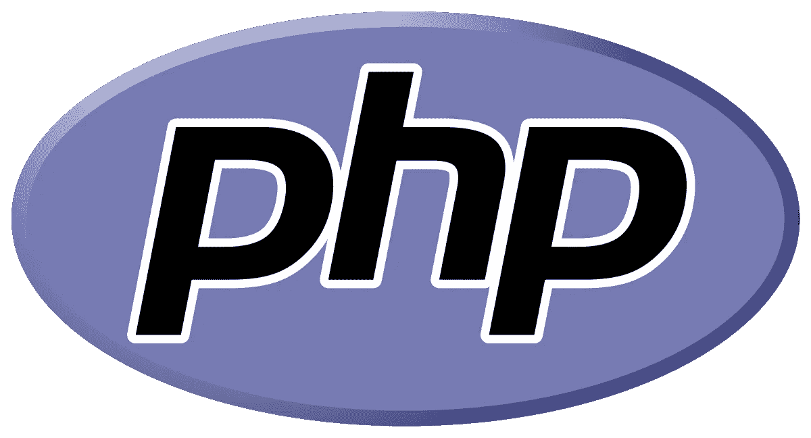

# 一个 17 岁开发者的旅程

> 原文：<https://medium.com/swlh/the-journey-of-a-17-year-old-developer-1d99d002f986>

*这是唯一一位成功的连续创业者和程序员*

[*米尔扎*](https://medium.com/u/9070fdf69b08?source=post_page-----1d99d002f986--------------------------------) *！！！*

今天，我的一个密友带领我进入了媒体、编码和创业领域。

Blankt 是一个展示你的才华和被发现的新平台。

2018 年平台上的发现是很难的。即使你持续发布内容，让人们看到你的视频也需要很长时间。布兰克特不再是了，试试吧。

布兰克特——发现当下。

所以，我想把他的文章放在下面:

> ~ 2018 年 2 月 7 日(布兰克特首席执行官)[米尔扎 M.S 拜格](https://medium.com/u/9070fdf69b08?source=post_page-----1d99d002f986--------------------------------)
> 
> **你有没有想建一个 APP 或者网站却没有信心或者技能去做的经历？**
> 
> **猜猜看？我就说说我是怎么在短短 3 年内学会 iOS，android，web 开发的。**
> 
> 让我先自我介绍一下，我是米尔扎·贝格——米尔扎比兹。我现在大四。我最喜欢的科目应该是数学，因为它是宇宙的语言，而且很实用。我喜欢下棋！
> 
> 我是怎么开始的？
> 
> /* * * * * * * Web 开发********/
> 
> **年龄:12-13 岁(8 年级)**
> 
> 这一切都开始于我 12 岁的时候，我除了看 youtube 视频没有别的事情可做，我偶然发现了这个广告，它是关于 HTML 或建立网站的。我懒得跳过它，所以我看了整个广告，我无法向你描述我脑子里在想什么；视频中的那个人在记事本上输入文本，然后他能在该死的网页上显示出来！就像魔法一样。我非常兴奋地看到我可以做到这一点，所以我点击了广告，并按照教程，并能够打印我的名字在网页上！[✅]

# 我学的第一门编程语言是什么？

有什么猜测吗？

> 没错！是 PHP 宝贝！我还是那么热爱这门语言。使用 php，我能够用 SQL 构建我的第一个登录页面。哦，天啊，我再一次被你编程的能力和你如何让电脑听你的话所震惊了！[✅]
> 
> 有趣的事实:脸书网站是用 PHP 开发的。脸书仍然使用 PHP，但它已经为它建立了一个编译器，所以它可以变成本地代码。
> 
> 我是怎么进入移动开发的？
> 
> //**** Android 开发******//
> 
> **年龄:14 岁(九年级)**

> web 开发后，我想创建移动应用程序。最棒的是我不知道创造一个有多难。

> 我对移动开发非常感兴趣，所以我开始研究，我偶然发现了一个网站，你可能听说过 teamtreehouse——我不是被赞助来这么说的——但我喜欢这个网站，因为它带我从 0 到 1。每天午餐时间，我都会去图书馆看很多视频，从“构建一个简单的 Android 应用程序”到“用 SQLite 存储 Android 数据”,我每天都会这么做！在家里，我真的会这样做。我在不到 2-3 个月的时间里完成了这条赛道，而且我已经是这方面的专家了
> 
> 你学习编程的唯一途径就是实际去做！

> 我想知道如何使用 Parse，移动后端作为服务平台，最初由提供商 Parse，Inc .开发。该公司于 2013 年被脸书收购，并于 2017 年 1 月关闭，以及其他先进的技术服务。幸运的是，我找到了一个名为“slidenerd”的 YT 频道我记得当我开始看他的视频时，他有 6 万订户，现在他有超过 14 万——他真的值得拥有。
> 
> 我整个夏天都在做一些小项目，包括语法分析、相机、位置和其他有趣的东西。[✅]
> 
> **到这个时候，我已经在编程上投入了数千个小时。所以要有耐心，好事需要时间！**
> 
> /* * * * * * * iOS 开发********/
> 
> 年龄:15 岁(10 年级)

[https://medium.com/swiftist/how-to-use-ios-11-beta-installed-device-with-xcode-8-c255b916aca5](/swiftist/how-to-use-ios-11-beta-installed-device-with-xcode-8-c255b916aca5)

> 在与 android studio 合作了一整个夏天后，我决定试用 Xcode，这是一个开发 iOS 或 macOS 应用程序的集成开发环境(IDE)；Xcode 比 Android Studio 好 1000 倍，因为模拟器的性能是 A+，故事板超级容易导航。顺便说一下，我正在谈论 2013-14 年的 Android Studio。现在，Android Studio 显然有所改进，它看起来像 Xcode 的界面。
> 
> 我是怎么学会 iOS 开发的？
> 
> 让我告诉你一些事情:一旦你学会了编程语言，它本质上是相同的概念，但语法是不同的。

> Java 到 Objective-C 的转换是一个困难的过程，因为 Objective-C 的语法非常怪异和复杂；括号太多了。看代码并不愉快。但我能够缓慢但稳定地适应它。

Lets build that app

> 非常感谢让我们构建那个应用程序，Jared Davison 和 YT 上更多的 iOS 开发频道，我能够非常快速地学习 swift 和 objective-c，并在几周内构建出令人敬畏的高级应用程序。

> 我强烈推荐使用他的 Firebase 构建一个实时聊天应用程序——由 Firebase，Inc .在 2011 年开发的移动和 web 应用程序开发平台，然后在 2014 年被 Google 收购。Parse 关闭后，我和许多开发人员一起迁移到 Firebase。[✅]
> 
> **我所学到的:激情>** **天赋**

# 我参与过什么大项目吗？

> 年龄:16 岁(大三)
> 
> **重新连接——连接创意人员！**

> 我是 Reconnect 的创始人之一。我们的计划是联系创意人员！

PC: Hustle guru!

> “如果我们可以建立一个系统，让你可以根据你想要启动的项目，与你所在地区的其他创意人员建立联系，那会怎么样？”
> 
> 为了 Reconncet，我开发了一个 iOS 应用，使用 Firebase 作为后端，CLLocation，Google Maps API，SDWebImageCache 来缓存图片。
> 
> 基本上没成。更多详情:[https://www.youtube.com/watch?v=PyRamsZLLTE&t = 469s](https://www.youtube.com/watch?v=PyRamsZLLTE&t=469s)。
> 
> 我从工作@ Reconnect 中学到了很多…

# BLANKT —即刻发现！

> **年龄:17 岁(现)**

> 布兰克特，展示你的才华和被发现的新平台。
> 
> 2018 年平台上的发现是很难的。即使你持续发布内容，让人们看到你的视频也需要很长时间。布兰克特不再是了，试试吧。
> 
> **我们正在为世界各地崭露头角的人才提供一个平台。我们本质上是年轻人才的早期视频孵化器。**
> 
> 该应用程序将专属于芝加哥的自动取款机。如果你住在芝加哥，请尝试一下！非常感谢您的反馈，请发送电子邮件至“blanktapp@gmail.com”
> 
> app store[https://itunes . apple . com/us/app/blanket-connect-in-the-moment/id 1291509972？mt=8](https://itunes.apple.com/us/app/blanket-connect-in-the-moment/id1291509972?mt=8)

> 想看看我开发的应用程序吗？
> 
> [https://itunes . apple . com/us/developer/Mirza-baig/id 1187756004？mt=8](https://itunes.apple.com/us/developer/mirza-baig/id1187756004?mt=8)

总结一下！去支持我的儿子米尔扎，不要忘了看看 ShareME，因为我目前正在做这个。

## 谢谢你看我的文章！欢迎在下面留下评论或了解更多关于我的信息！！

## 如果您错过了我的上一篇文章:

*   [16 岁企业家的生活](/swlh/life-as-a-16-year-old-entrepreneur-b783bc54be69)

## 关于作者的更多信息:

我 16 岁|程序员|出版公司首席执行官|内容营销人员

*   如果你有兴趣和我一起跟进，请查看我的网站:[https://jdombele.wixsite.com/jayson](https://jdombele.wixsite.com/jayson)
*   如果你对我的 ShareMe 创业感兴趣，请查看下面的链接:[www.jdombele.wixsite.com/shareme](http://www.jdombele.wixsite.com/shareme)
*   想要了解政治、商业、科技等方面的新闻吗？[https://documentedpress.wordpress.com/](https://documentedpress.wordpress.com/)

任何问题，业务查询或关注，请随时发送电子邮件给我@:jdapple4357@gmail.com

## 这个故事发表在 [The Startup](https://medium.com/swlh) 上，这是 Medium 最大的企业家出版物，拥有 294，522+人。

## 订阅接收[我们的头条](http://growthsupply.com/the-startup-newsletter/)。

