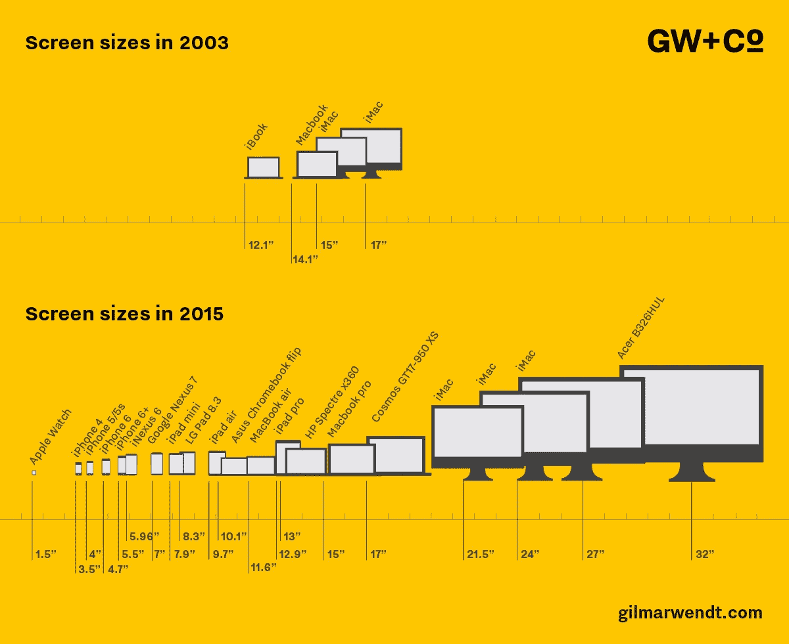
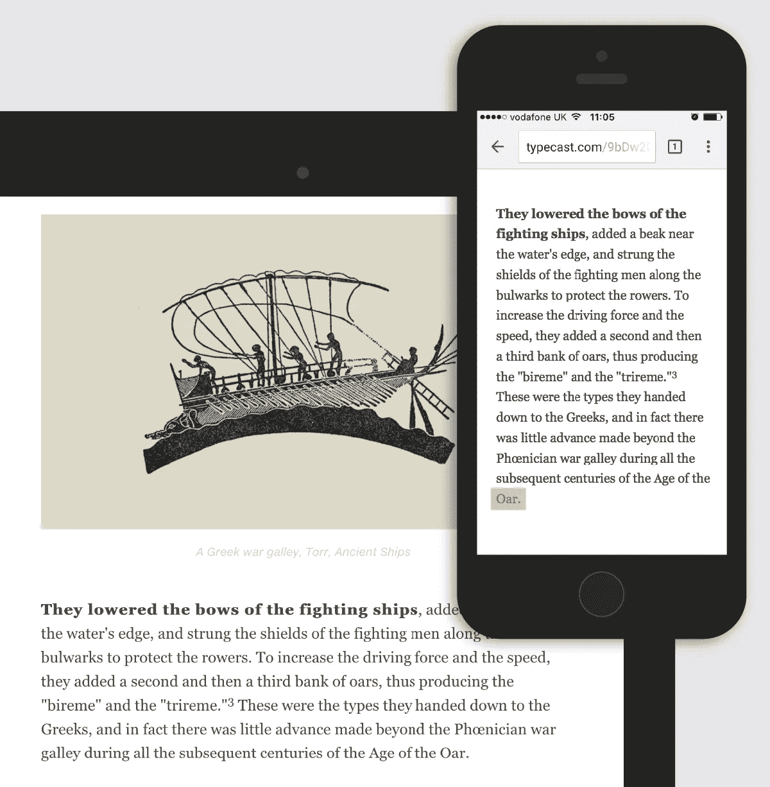
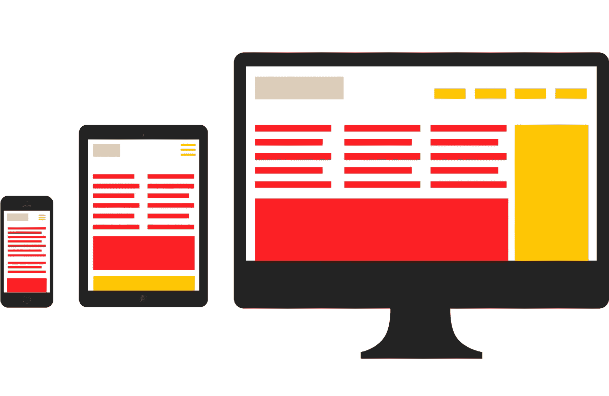
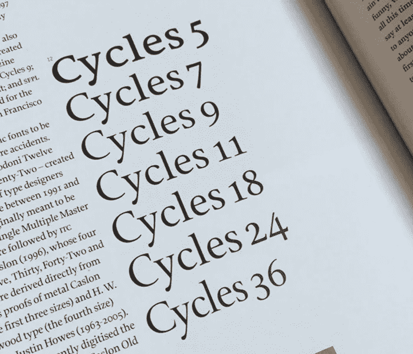

# 屏幕上打字的苦与乐

> 原文：<https://medium.com/swlh/the-joys-and-pains-of-type-on-screen-1dad8dd2eb09>

[gilmarwendt.com](http://www.gilmarwendt.com)

自从 1439 年约翰内斯·古腾堡发明印刷机以来，好的印刷技术在交流书面信息方面一直是必不可少的。从那时起，很多事情都过去了，现在使用的出版方法远远超出了纸张。数字印刷术已经取代了传统的金属和木材类型，我们理解和使用印刷术的方式也发生了变化。

技术正在以光速发展，尽管我们拥有各种优势、插件和资源，但我们在网上发现的印刷细节的质量与印刷书籍或杂志不在同一水平上。这让我想知道…我们如何在网上实现更好的排版？不同设备尺寸的爆炸式增长使得它变得更加困难…

今天，我们可以选择在街上或家里通过 27 英寸的屏幕浏览网站；在这两种情况下，我们都必须能够舒适地阅读显示在屏幕上的信息。

作为设计师，主要问题是我们无法知道每一位访客的设备类型、屏幕宽度和设置。此外，网页开发人员不一定有书籍设计师可能有的排版背景。来自印刷的最佳实践正在消失。

这里有两个例子，我敢肯定，这两个例子让不止一个印刷极客感到恼火——寡妇和光学尺寸。

首先，网上有很多寡妇。在印刷术中，寡妇是段落最后一行的一个单词。它们被认为是糟糕的字体，因为它们看起来不舒服。在印刷设计中，我们可以通过手动调整文本来避免它们。然而，在网页设计中，我们处理的是一个可变的页面——屏幕或浏览器窗口的大小——它可以像上面的图表一样变化。

对于每种屏幕比例，文本就像水一样，根据屏幕宽度进行调整，这让我们对它的显示方式充满了不确定性。这种灵活性使得很难应用传统的排版规则。页边距、行距和字体大小需要根据屏幕大小而变化，因此我们对页面布局的理解已经从静态网格转变为内容流动的灵活系统:

下面是第二个例子:为大标题设计的字体不能很好地用作正文。传统上，热金属型铸造厂创造光学调整字体，以帮助特定大小的可读性。其中一些正在被数字化。在下面的图片中，我们可以看到 [Cycles](https://www.myfonts.com/fonts/stone/cycles/) 字体是如何针对不同尺寸进行优化的:分隔小尺寸的字符，并在大尺寸上强调对比度。在一个快速显示内容是必须的响应性网络世界中，加载同一字体的七个版本可行吗？

但是不仅仅是各种各样的屏幕尺寸影响了字体，浏览器和操作系统的多样性也影响了字体的外观。它们中的每一种都呈现不同的字体，有时会使字符看起来模糊、臃肿或破损。今天有一些插件和 CSS 属性可以帮助改善这一点。此外，选择一个好的字体会有所帮助。优秀的字体设计师会花大量时间手动调整字体的字符，以便更好地在屏幕上呈现。这个过程叫做暗示。布鲁诺·马格在这个[视频](https://www.youtube.com/watch?v=BMr4aBdag3Q)中很好地解释了这一点。

虽然网页排版已经变得比以前更好，但我想质疑目前的做法，并探索将我们在印刷品中发现的排版质量带到屏幕上是否可能和可行。接下来会有更多的帖子更深入地探讨这个问题…

如果你不想错过他们，请订阅我们的[博客](http://gilmarwendt.com/blog)！

拉克尔·卡隆格是 [GW+Co](http://www.gilmarwendt.com) 的设计师

发表于*[**# SWLH**](https://medium.com/swlh)**(***创业、流浪、生活黑客)**

******