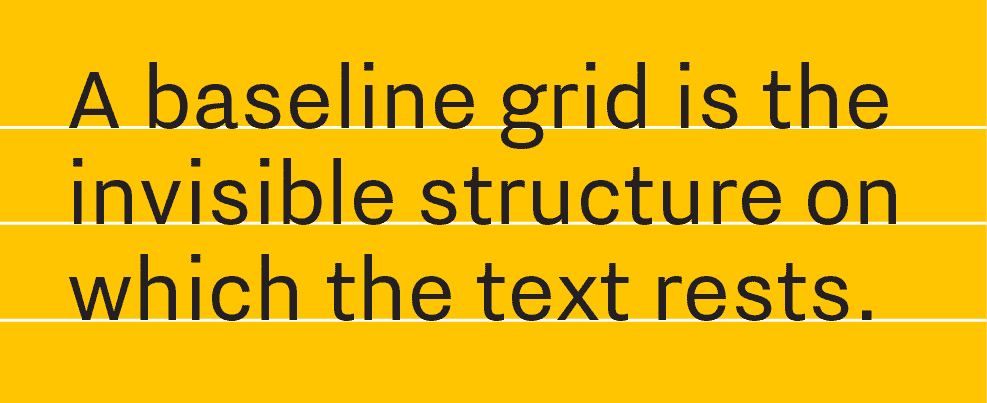
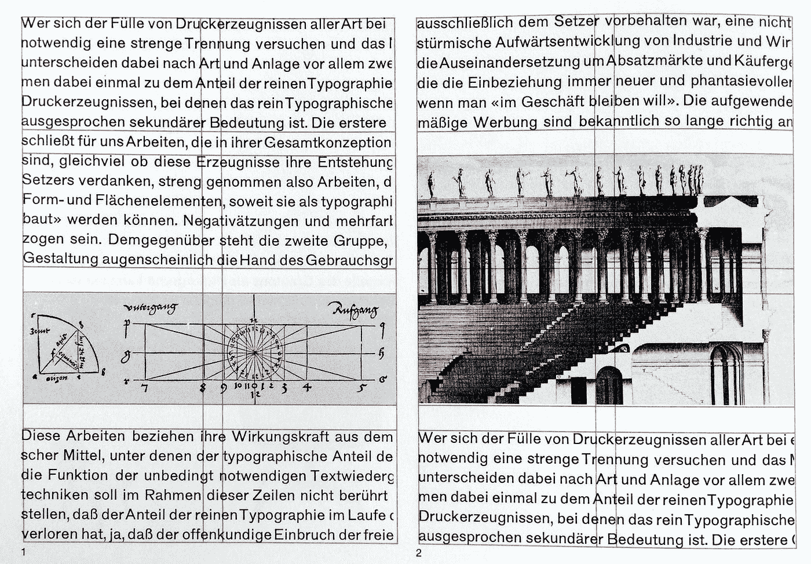
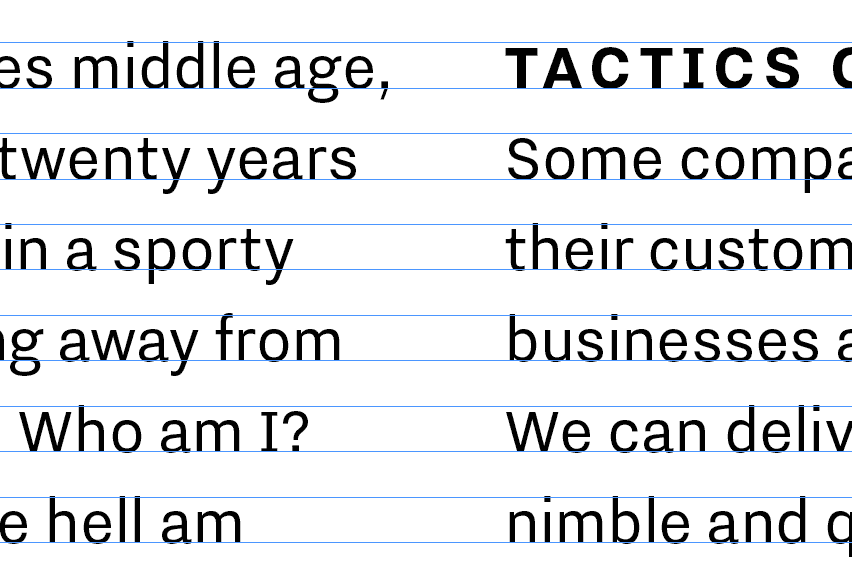
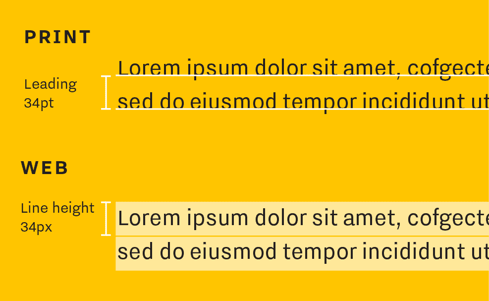
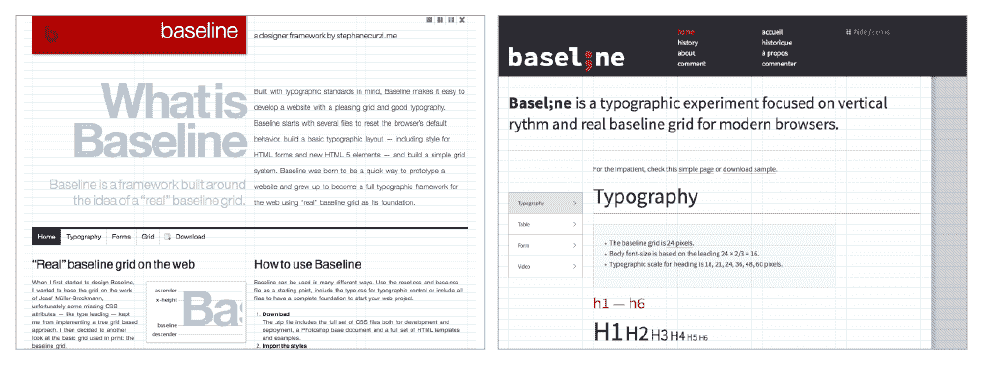
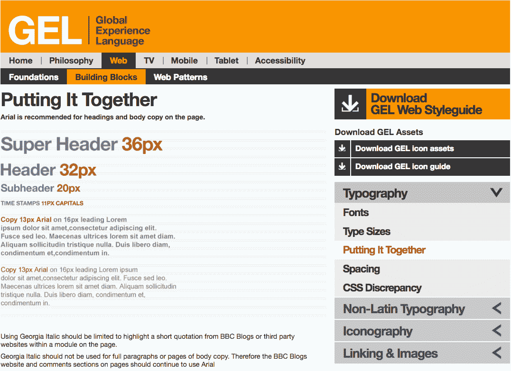
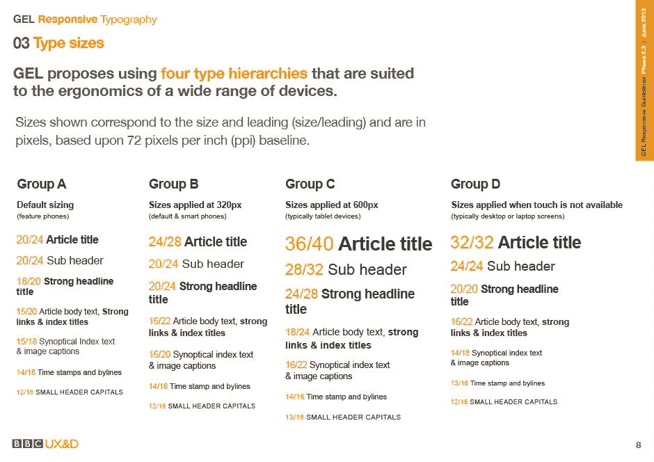

# 银幕上打字的苦与乐(二)

> 原文：<https://medium.com/swlh/the-joys-and-pains-of-type-on-screen-ii-9e9b29f2b713>

几个月前，在之前的这篇文章中，我开始探索我们是否可以将印刷设计的高排版标准带到屏幕上。如今，移动设备的繁荣改变了我们消费信息的方式——我们可以在家里喝着美酒，从平板电脑上阅读一些东西，也可以在地铁上被一群人推来推去时，从手机上阅读一些东西。

从事网页设计几年后，我看到了网页排版的许多发展，比如网页字体的使用，渲染插件等等。但是有一件事引起了我的注意，那就是我们并没有真正在网上用基线网格进行设计。

在印刷中，基线网格是文本行所在的不可见的行。它是由细心的印刷工计算出来的，考虑到了行距和字体大小。

我们可以使用基线网格来创建布局网格，帮助我们在页面上定位其他元素，如图像。这将产生一致和谐的页面。

有了基线网格，我们还可以排版更整洁的布局，确保文本行跨几列对齐。

虽然这看起来很怪，但我们相信，这种对印刷细节的关心和关注使日常文本变得特别。

但是在网页排版中，文本行的工作方式与印刷不同。在印刷中，行距是基线之间的距离，而在网页中，没有行距。取而代之的是一个叫做行高的 css 属性。它是这样工作的:

web 的工作方式要宽松得多，这使得精确控制文本位置变得更加困难。挑战是:我们能设计一个有基线网格的网站吗？

有些人已经在研究这个问题了，答案是肯定的——理论上是这样的。如果我们理解行高属性是如何工作的，我们可以通过调整段落的数字和边距来设置基线网格，并构建一个 css 样式表([参见本文](http://webdesign.tutsplus.com/articles/setting-web-type-to-a-baseline-grid--webdesign-3414))。此外，还有一些基线网格框架可以下载，例如[这里](http://stephanecurzi.me/baselinecss.2009/)和[这里](http://b4d455.fr/basel/)。

另一个例子是 BBC GEL(全球体验语言)——BBC 的设计框架，用于在屏幕平台上一致地应用形成品牌的所有元素。几年前，他们创造了一种巧妙的方法，将基线网格应用到网页设计中。为了克服印刷和网页排版之间的差异，他们计算了他们所谓的“css 偏移”来调整排版元素的位置，以便它们总是与 8px 的基线网格对齐。他们是这样解释的。

我认为这类系统的问题是它们只适用于一种屏幕尺寸，但其他尺寸呢？我们必须意识到网络不再是静态的画布。网站需要适应每种设备，我们无法控制用户现在浏览网页的所有屏幕尺寸。这意味着，我们可能会花很多时间为 24 英寸的显示器建立一个完美的基线网格，但在 iPad Mini 上完全没有用。更不用说会把事情搞砸的浏览器兼容性问题了。

此外，如今我们遵循移动优先的方法，因此所有内容经常需要显示在一列中，将文本列彼此对齐有意义吗？

但是这不应该阻止我们在网络上获得好的排版节奏。让我们来看看[新的，更新的 BBC 凝胶](http://www.bbc.co.uk/gel)。为了更新他们的方法以适应多设备时代，他们从一个僵化的网格转移到一个更灵活、反应更迅速的系统。他们仍然使用 8px 基线网格，但现在他们为每个屏幕尺寸提供了四种不同的样式表。

为了与 8px 基线网格对齐，每种样式的行距应能被 4 整除，但有些样式不遵守这一规则(例如 16/22)，因为我觉得这样看起来不合适，所以这些元素应该在下方留出足够的空间，以便将下一个元素与基线网格对齐。这一次他们没有提到他们以前的 css 偏移。

的确，在印刷中，基线网格是一种在页面上排列元素时可以节省我们大量时间的工具，它的正确使用可以确保所有页面的一致性，尤其是在杂志或长书中。此外，对于那些痴迷于排版的人来说，这样设计的页面的和谐是非常令人愉快的。

然而，我要说的是，基线网格是一种非常严格和坚固的结构，并不真正适合网络工作的流动性。这并不意味着我们不应该关心使网页和谐和考虑。将排版选择视为一个连贯的系统，将适用于不同的屏幕尺寸，并保持高标准。

如果你不想错过更多像这样的帖子，请订阅我们的[博客](http://www.gilmarwendt.com/blog)！

拉奎尔·卡隆格是 T2 GW+Co 的设计师