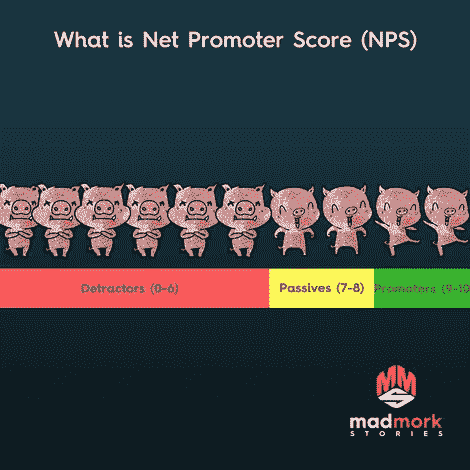

# 关键创始人指标:NPS 它是什么以及为什么您应该跟踪它

> 原文：<https://medium.com/swlh/the-key-founder-metric-nps-what-it-is-and-why-you-should-track-it-295d53119ad4>

如今，市场营销人员会跟踪很多指标。无论你是在一家初创公司还是大公司工作，我们从来没有这么多的指标来跟踪，这可以帮助我们真正了解我们的业务是在发展还是在衰退。但是，有没有一个度量标准能让所有其他的都相形见绌呢？

是的，有:净推广分数。

**支配它们的度量**

净推介值(NPS)是消费者向他们认识的人推荐你的产品的意愿。对于大多数企业，尤其是初创企业和小企业，以及大多数营销预算很少或非常有限的个体经营者来说，NPS 至关重要。为什么？因为口碑(WOM)是这些企业获得新客户的主要途径。口碑从根本上来说来自于人们愿意推荐你的企业(NPS)。口碑是我们大多数人拥有的最重要的营销渠道。事实上，在 2014 年由威瑞森和小企业趋势进行的研究中，超过 85%的接受调查的小企业将 WOM 作为客户发现其业务的方式。如果你的 NPS 低，你不会得到积极的 WOM。事实上，通常会发生相反的情况:“远离布鲁诺的御林军。你不会想知道我在最后一个热狗里发现了什么……”

**NPS 是如何计算的，什么被认为是好的？**

Net Promoter 是一个简单的单行问题，我们大多数人都在网上调查、弹出窗口或通过电子邮件被问到过。典型的问题是:“你愿意向朋友推荐我们的产品(服务)吗？”然后你用 0-10 分回答，10 分是最高分，0 分是…嗯…废话。这是它的基本外观:

分数的计算方法是从总推广者(你最直言不讳的拥护者)中减去所有的诋毁者(那些不喜欢或可能负面推荐你的产品的人)。出于 NPS 计算的目的，属于 7-8 类的消费者被视为“中性”。最初，这可能感觉有点违反直觉，但从心理学角度来看，如果你仔细想想，这完全有道理。你通常什么时候向朋友推荐某样东西？当你被产品的质量震惊了，它远远超出了你的预期。你什么时候抱怨？对许多人来说，他们会为可能让他们烦恼的小事而抱怨。人们更有可能抱怨一种产品，而不是称赞它。那只是人类的本性。(**推特这个)。一旦你从推销者中减去诋毁者，你通常会得到介于-100 到 100 之间的分数。那是最后的 NPS。**

就得分而言,“0”是中性的，但什么是好的得分呢？嗯，任何积极的都可以被认为是“好”，但通常任何高于 50+的都被认为是优秀的。例如，根据 Retently.com 的数据，苹果以 72 的 NPS 领先计算机行业，而在零售业，亚马逊以 69 领先，网飞以 68 的 NPS 领先行业平均水平。

**高 NPS 的好处**

拥有极高的 NPS 有很多好处。最重要的好处是，通常情况下，NPS 高的产品比竞争对手有更高的保留率。例如，网飞的用户比竞争对手的用户使用该服务的时间更长。苹果在 2017 年对 iPhone 的留存率高达 92%，而三星的 Galaxy 为 77%。保持现有客户是营销人员的首要任务，因为回头客不会受到通常的客户获取成本(CAC)的影响，因此对公司来说利润更高。

此外，高 NPS 也意味着公司获取新用户的营销成本更低，因为一定比例的用户也更有可能向朋友推荐该产品或服务。想想吧。你的朋友上一次询问关于电影、电视节目或餐馆的建议是什么时候？你给他们推荐了吗？如果你做了，你就是该产品或服务的推广者。这就是 NPS 在为您服务！

**一切都不完美**

有文章批评 NPS，有些人甚至说 NPS 已经死了。NPS 并不完美，也有它的弱点。首先，NPS 是一个随机抽样回答的问题。像任何调查一样，有一种固有的偏见，即调查可能由喜欢回答调查的人来回答(这可能是真的，也可能不是真的)。第二，问题总是在特定的时间点问。例如，Intuit 通常每季度问我一次对 Quickbooks 的看法。如果我今天过得很糟糕，或者碰巧在平台上遇到了问题，我可能会比平时更严厉地惩罚他们。关键是这是一个时间快照，所以数据是静态的。人们可以很容易地争辩说，在我们今天这个快速发展的世界中，某些产品，如软件，可以实时更新，NPS 数据在你得到它时可能已经不相关了。例如，手机游戏的更新周期比汽车快得多。然而，这并没有完全否定客户在那个时间点的体验。

另一个论点是，仅仅因为消费者推荐你的服务，并不意味着如果他们发现一个更好的交易，他们可能不会流失(离开)。我们生活在一个竞争异常激烈的市场中，产品和服务的改进速度比过去更快，消费者的信息更灵通，信息比以往任何时候都更加开放和可用。关键是，你必须每天都努力赢得顾客的信任。永不松懈。

**始终实践“安全”研究**

任何基于研究的事情都可能是棘手的，所以在做 NPS 研究或任何其他基于问题的研究时，都有最佳实践。

首先，确保你使用一个可靠的平台或研究供应商。外面有很多可以提供的服务，如 Qualtrics、Retentio。IO、Surveymonkey(你可以自己运行)或更复杂的研究机构，如 YouGov 或 Nielsen。

其次，确保你的用户群有足够大的代表性样本。如果您不确定，请询问您团队中的数据科学家或产品经理，以计算统计上有代表性的样本大小。当有疑问时:大小在研究中很重要，就像在生活的其他领域一样；)(**推文这个**)

第三，足够频繁地运行它来跟踪你对产品所做的改变，但不要太频繁以至于惹恼你的用户。最佳实践通常是每季度一次，尽管我见过游戏公司在频繁修改他们的移动应用程序时，也是每月一次。

第四，永远不要仅仅依靠 NPS 来评估你的业务和/或产品的健康状况。你还需要关注品牌认知度、知名度、购买意向、客户流失率/保留率以及营销漏斗的保留指标。NPS 是关键指标，但也必须放在其他指标的背景下考虑。当你进行研究以定期评估竞争对手的表现时，这也是最佳实践。不要只看你自己的指标，而是看你的竞争对手做得如何，并以他们为基准来衡量自己。

第五，我也强烈建议，如果你的产品允许的话，直接在你的产品中运行 NPS 问题，例如，如果你有一个软件服务。对于许多行业来说，这根本行不通，因为他们提供的是实物(比如汽车或床)，但你越接近用户实际使用产品的时间，效果越好。

最后，在如何衡量、构建问题以及何时开展调查方面保持一致。你改变的变量越多，就越难衡量，比较就越不可靠。

NPS 是一个至关重要的商业指标，从最小的创业公司到最大的财富 500 强公司，每个企业都应该跟踪。它易于管理、实施快速且经济高效。记住上面的规则，你应该没问题。请记住，永远不要孤立地使用它，团队中总要有人愿意挑战你的假设。诺基亚在某个时候有很好的 NPS，但当智能手机市场转向触摸屏和应用程序时，它完全错过了市场。剩下的就是历史了。

在商界，只有偏执狂才能生存。

马德默克

## 这个故事发表在 [The Startup](https://medium.com/swlh) 上，这是 Medium 最大的创业刊物，有 292，582+人关注。

## 订阅接收[我们的头条新闻](http://growthsupply.com/the-startup-newsletter/)。

