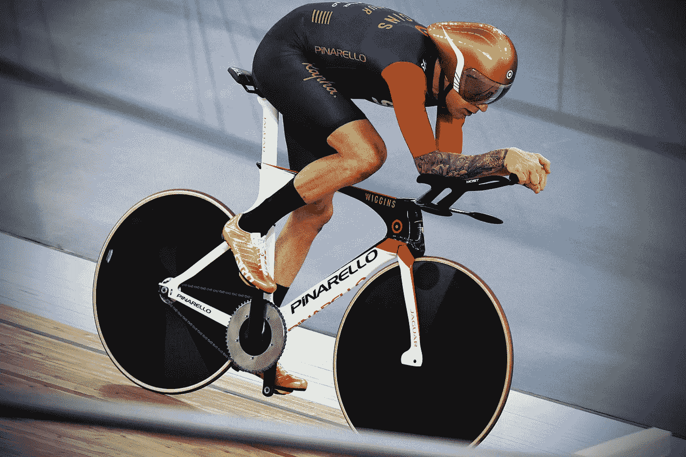
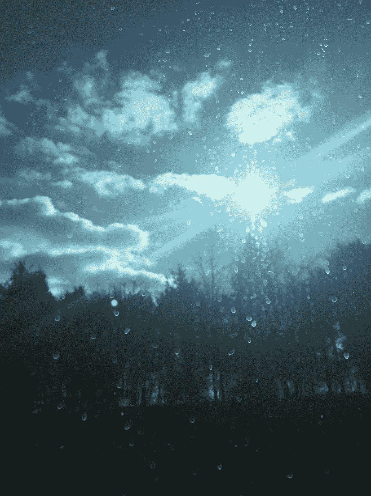

# 成为世界上最优秀的人的关键

> 原文：<https://medium.com/swlh/the-key-to-being-the-best-in-the-world-at-what-you-do-364c98d8b75a>

Photo by [Simon Connellan](https://unsplash.com/photos/BRHrxZFROzI?utm_source=unsplash&utm_medium=referral&utm_content=creditCopyText) on [Unsplash](https://unsplash.com/search/photos/athletics?utm_source=unsplash&utm_medium=referral&utm_content=creditCopyText)

一开始很难，但当你突破时会很有趣。

无论你做什么，一生致力于每天都以最佳状态表现是成为你所做的世界上最好的人的关键——结果将使你的人生旅程和每天的经历成为你可能获得的最引人入胜的经历。

在这篇文章中，我将向你展示每天达到巅峰状态所需的承诺。

作为一种日常习惯，进入巅峰状态对于尽可能做到最好至关重要，并有助于发挥你的巅峰潜力。

*更*更重要的是，**保持巅峰状态**对于成为你所在领域的佼佼者甚至更为关键——因为你一天中大约有 16 个小时是醒着的，而在你所在领域成为佼佼者的每一分钟都是一场赢得胜利的游戏。

*最重要的是*，**进入和退出活动，以及拥有保持最佳状态的技能**至关重要，因为我们在清醒时所做的一切就是将注意力从一件事转移到下一件事。

至少可以说，很难进入巅峰状态，更难在一天中保持这种状态，更难在一天的活动中保持这种状态。

这就是为什么它将世界上最好的人与世界上其他人区分开来，而胜利者是那些最能控制自己精神状态的人。

最优秀的人尽他们所能把自己带入尽可能高的状态，并尽他们所能保持在那里。其余的可能会做一个，开始时有时很强，许多人很可能根本不考虑他们的状态。

# 什么是巅峰状态，为什么它如此重要？

> 有趣的是，我们花了多少时间和金钱去追求提升我们意识的东西，却没有每天培养更高层次的意识来提升我们的生存状态，而后者是免费的。—我

巅峰状态是你的终极地带，在这里，你的思想、生理、身体和大脑都在运转。

你积极主动，知道自己在做什么和为什么。

你感觉很好，有目的有意图。

你的感官是警觉的，这导致对知识和你周围环境的敏感和智能吸收。

在高峰状态下阅读 30 分钟比在脸书内外 8 小时的网上冲浪更有效。

30 分钟的阅读有呼吸的空间，不受干扰，并且如此警觉，以至于你能够让这些知识成为你的一部分——在你成为你想成为的人的旅程中。实践你理想自我习惯的人。

虽然无意的、中断的和无目的的网上冲浪是反应性的，而且**也创造了你，但不一定是你想成为的人——而是这个世界正在分享的东西。**

> 想象一下，你正在成为人们在互联网上分享的东西——一个可怕的想法，不是吗？

巅峰状态的神经化学混合物创造了一种深度流动，并不断放电——电。这当然会让你整天都感受到快乐。

众所周知，当人们处于[心流状态时*感觉最快乐*。](https://www.ted.com/talks/mihaly_csikszentmihalyi_on_flow)

这种快乐会带来满足感，这是每个人都渴望拥有的。

我们都有过像这样如火如荼的日子。

这是作为我们的最高自我，根据我们的最高理想做出决定。

这是带我们去我们想去的地方的状态。

今天早上，我像平时一样，4:30 就醒了。

当我打字的时候，我正在从 DC 到纽约的巴士上。在我发表这篇文章后，今天下午我有两个辅导电话和外展目标。我从打出这篇文章开始，一直忙着计划接电话，因为我以进入巅峰状态开始了我的一天。我正以每小时 100 英里的速度行驶。我是办公室里那个让你讨厌的家伙，因为他荒谬的能量水平。

当我坐在公交车上时，我的感官感受到了这个美丽的画面。

我的巅峰状态比那辆巴士上的任何人都更欣赏并通过他的感官接受那个图像。我知道这一点，因为当我承担这一切时，我感到电流在我的大脑中流动。

如此警觉，如此敏感。

我感觉自己绝对处于最佳状态。

这就是我们需要在日常生活中发挥出我们的最佳水平，成为我们工作中的佼佼者，并达到我们最高水平的快乐和满足感。

**这是关于用习惯和惯例来制造它。**

我的日常习惯让我在早上 4:30 醒来——这让我的猴子思维平静下来，不会被催促着开始做事和开始新的一天。我从早上 5:00 开始打盹，无所事事。这种空间和选择性是至关重要的，因为它给了我空间和可变性——从而更多的自由。

苹果怎么样:我可能比一般人睡得更多，但是给自己空间去睡，结果大部分时间都没睡着。

然后，我煮了一杯咖啡，开始阅读我的核心书籍(大卫·霍金斯博士的《放手》和麦克斯韦·马尔茨博士的《心理控制论》)，这些书籍提升了我的状态，帮助我提升了最高自我——通过我提升的意识和知觉。我想成为什么样的人，以及我希望那个人如何行动。

在阅读和喝完咖啡的时候，我会有一个想法，开始反复思考是日记还是文章的想法，如果没有，我会进行 20-45 分钟的冥想。注意这里的可变性——有一个常规，但有很大的空间跟随你的直觉。

有时候，当我开始写文章或开始发送销售邮件时，我无法进行冥想，因为我受到了一个新推销的启发。

然后我计划好我的一天，决定我绝对需要完成的事情。我决定什么是重要的，并把我对负面后果的承诺发给我的室友。通常是类似于“如果我不给你看我完成这 4 件事的证据，我会给你 1000 美元”这样的话。

# 那么如何进入自己的巅峰状态呢？

独自一人开始一天的生活——这是最重要的部分。

如果你醒来时反应迟钝，不为自己占据不受干扰的空间，几乎不可能达到并保持在巅峰状态。结果的损失绝对是巨大的。这是赢与输、快乐与无聊、满足与匮乏的区别。

如果你每天早上不给自己留有空间，这并不是说你注定要做这些事情，但是如果你确实为你想成为的人和你想如何行动做好准备，你默认的习惯就会开始改变。如果你让自己兴奋起来(平静而有条不紊地),你会在一天中感觉良好，这为你一天中更好的默认习惯做好了准备。

[这一点我怎么强调都不为过](/swlh/the-surprising-secret-to-changing-the-world-dd4d2519f940)。

这个空间是给你做的事情，让你完全照亮。那是什么活动？它应该是让你进入深流的东西，让你鞭策自己的东西，让你对自己活着的原因感觉良好和有意义的东西。

可以是读书、冥想、祈祷、咖啡和新闻等等。**重要的不是你做了什么，而是背后的背景和意图**。这是一个深刻而有意义的“自我”时间，去成为你想成为的人。

你把这段时间留给了自己，让自己展现出最好的自己和最高的理想。这给了你勇气，让你从可能的最高处做出最好、最重要的决定——也给了你勇气和信念，让你变得勇敢无畏，同时感受到你绝对的最佳状态。

我总是一大早就想出我最大最好的想法，并且有勇气说出来，然后把这些想法推出去。

这就像人们嗑药后做了一些超出舒适区的事情，或者喝酒后陷入舒适区一样。这是你需要最大限度地发挥你的潜力和成为你最好的人的高度。

相信我，我曾经是一个永远不会出版的恐惧作家。我花了一年时间写了 30 篇文章，却没有发表。我不得不让我的教练为我出版。

现在我的巅峰状态，除非不舒服，否则感觉不好。直到我写了一些东西，突破了重写旧规则和创造新规则的界限，我才觉得出版是件好事。

这就是你如何知道自己是这个领域的**大师。当你打算每天重写一条旧规则时。我只能从我现在的巅峰状态中找到勇气去做这件事！**

# 从最难/最重要的事情开始安排你的一天

一旦你进入巅峰状态，是时候专注于保持状态并有效管理你的转变了。这可能从早上 6 点到 9 点的任何地方开始，取决于你的闹钟的起点。

对我来说，大约在早上 7 点左右，我处于巅峰状态(没有双关语)，开始做我最重要的工作，计划/优先安排我的一天。

今天，它创建了一个新的电子邮件模板，发布了这篇文章，打了 30 个销售电话，写了一些营销文案，并为 2:30 的提案讨论和辅导客户做了准备。对于所有这些事情，我需要处于巅峰状态，激情燃烧。

你有什么活动有关系吗？你的状态如何影响你处理这些活动的方式？我以每小时 100 英里的速度冲过我的车。这种经历一直很吸引人。因此，因为我的巅峰状态，我期待着把那些人赶出公园，而不仅仅是通过他们。我每天都在制造这个(尽我所能)，你必须这么做！

# 那么你已经进入了巅峰状态，如何保持呢

所以你在转动曲柄，着火了。感官是警觉的，感觉良好和有目的，并从你的最高自我采取行动。

*   决策是流动的，而不是强迫的。
*   反应是有反应的，而不是被动的。
*   你[拥有自己的框架](http://pitchanything.com/oren-talks-about-frame-control/),不会对别人的框架做出反应。

你在创造你想要的精神环境，而不是接受你的物质环境为你创造的精神环境。

如何保持下去？

我们一天中只有这么多能量，但是有一些方法可以让我们一整天都保持状态。这些可能很难做到，但是相信我，当它们成为习惯时，就会变得有趣和容易。

请记住，**我们只是按照我们能够容忍的最低标准行事，而不是按照我们努力达到的最高标准行事。**标准是相对的，今天移山所需要的东西明天就可以成为一种自然的日常习惯。

不要用分散注意力的休息或食物来转移或扰乱你的注意力或生理机能，这会让你的身体变慢。一直走，直到走不动为止。在工作日甚至是周末，按计划行事，继续前进。没有比早晨的势头更好的状态了。

这也是为什么我们说有些人“精瘦刻薄”。回到巅峰状态是很难的，牺牲一些食物或网络中断时间是值得的。

我经常在早上 7 点左右从这个地方开始我的一天，不吃东西一直到 1 点或 2 点。我要的只是一杯[防弹咖啡](https://blog.bulletproof.com/how-to-make-your-coffee-bulletproof-and-your-morning-too/)，它能满足饥饿感，抑制食欲，让我保持精力充沛而又轻盈。

对你来说，如果你晚一点开始，可能会花掉你一天的大部分时间。想象一下，如果你冲刺的话，在下午 2 点或 3 点前完成所有的工作(感觉棒极了！).

我向你保证，如果你在早上 5 点醒来，以一种最佳状态开始你的一天，你会在午餐时间完成你其他同事一整天都在做的事情。把它拿到银行去。

如果你真的这么做了，那是时候好好休息一下了。请注意，这里有一些细微差别，取决于工作和中断的数量，以及它们的类型和它们对你的影响，所以如果你不能遵循 t。

在巅峰状态下吸收和接受这些干扰与置身事外的区别是深远的！

如果你处于巅峰状态，你会做出反应而不是反应。你的心情会变得更好，你已经完成了很多事情，你甚至会期待分心的事情，比如“来吧！”。

你会把障碍翻转过来，而不是用压力或烦恼来应对。

然而有趣的是，一旦你掌握了窍门，你就会自然而然地消除干扰。早上你会关上门，戴上耳机，反复播放你最喜欢的歌曲。在你的墙上或门上挂上“请勿打扰”的标志。

人们会习惯的，知道除非绝对必要，否则不要打扰你。

# 管理过渡——保持最佳状态的关键

如果你处于巅峰状态，过渡会更容易进入和退出。当你需要从写重要的电子邮件(这在早上是一项容易的流动活动)转到与下属或上级开会，并长时间讨论一个项目或一个人，比如 45 分钟到 60 分钟，重要的是保持专注，不要分心，让环境或电子邮件接管你。

坚持时间表，完成项目。而且很容易兴奋到巅峰状态，但仍然被外界刺激所控制。事实上，这甚至可能更容易，因为你感觉很好，期待多巴胺的冲击甚至更有趣——但要保持专注！

我无法告诉你有多少次我会发表一篇文章，然后在网上冲浪，然后吃午饭，然后在一天的剩余时间里忘记它。很难回到你的巅峰状态，尤其是在一天的晚些时候。这通常是不可能的，除非你在家里或很晚的时候转移到下一个环境，而这正是许多创意者在早晨之外的偏好。

即使是你吃午饭或休息和恢复的状态(是的，你需要很多，只要学会如何去做)也需要积极主动和留心。

*   意识到你还活着。
*   注意你是知道的。
*   注意你在休息。

这是世界上最好的休息和恢复方式。

这就是为什么我建议不停地转动曲柄，不停顿地离开这个状态。这种禁食状态会让你坚持更久，让你在更长的时间里保持更敏锐。这就是为什么间歇禁食效果如此之好(真是太黑了！).

# 休息、恢复和回到巅峰状态的策略

现在可能早至上午 11 点，晚至下午 3 点或 4 点。你可能一整天都处于巅峰状态，也可能一整天都没有，但是你想重新回到巅峰状态，重新集中注意力，精力或者玩耍。您有几个选择:

休息和恢复，只要你需要。

关闭和恢复至关重要。事实上，以最佳状态表现所需的承诺要求你设计一种休息和恢复的生活，这样你就可以以所需的缓慢和专注开始你的一天，并转化为强度——这是最困难也是最重要的部分。

这就是为什么在一周中，我会在睡前留出足够的时间，让自己在 8:30 或 9 点左右准时入睡。我在 7 点或 7 点半左右开始放松。

关掉东西，喝茶，写作或冥想。这可能显得有些极端，但我的状态决定了我一整天的产出，在这一点上没有什么比这更重要的了——尤其是如果我的目标是世界上最好的。

是给你的吗？还有什么比这更重要呢？

是你！

今天是你的日子！

它让你的生活！

你如何存在，决定了你过的生活。我想在我所做的事情上成为世界上最好的。如果你做得一样好，我强烈推荐。

如果你想知道，我确实有社交和约会，我只是尽我所能计划我的日常事务，这很难，但你需要问问自己，尽你最大的努力对你来说意味着什么？

如果没有，那也没关系。一切都很有效率，你得到了你所付出的，所以呆到很晚，上帝保佑你，如果这是你想要的。

但是如果在我人生的这个阶段，做最好的自己就是我的一切，我会对那些“最好拥有”的次要事件说不，只去做那些“绝对是的”的事情。

# 重新设置到状态

如果你掉下马车，做一个适当的重置。想象又到了早晨，想象你的书或冥想或例行公事。抓住一首让你觉得与众不同的歌曲，反复播放。播放它，积极主动地进入你的状态。这将触发相同的操作。以下是恢复状态的其他方法:

1.锻炼身体，无论是俯卧撑、锻炼还是其他什么。

2.留出空间，在 30-60 分钟内屏蔽所有人和事。这在白天是艰难的，但我从不后悔为此腾出时间。

> 就像马丁·路德·金说的那样——“我有太多的事情要做，我不得不花 3 个小时祈祷才能做完”。

3.想想那些让你达到最高自我的事情。

4.深深地活在当下，并呆在那里。

5.试着听一些音乐，呼吸 30 次。这通常会奏效。

但是，这也很重要，虽然听起来我是在告诉你要整天像台机器一样，但我不是。事实上恰恰相反。巅峰状态吸收慢，行动慢。

你只会有强度——强度来自火箭起飞前缓慢的发射——你的焦点和状态是一样的。

你让它静置——发酵——积累，然后在一天中爆炸。

随着你一天的继续，不要试图费力度过，因为能量会自然减少。进入一种使用较少能量的宁静状态。减轻你的思想和对结果的期望。

放下紧张和恐惧，即使你有最后期限。

“一切都会过去的”

对自己说:“我知道我有工作要做。我可以用武力或心流来完成它。我选择轻松流。”

让今天剩下的时间就这样过去吧。给自己空间。这时候你会发现自己进入了一种不那么激烈的状态，这种状态可以产生你最好的作品。但是[与你的时刻](/the-mission/how-to-live-a-full-life-31e23203f265)保持一致，不要‘强迫’任何事情。

如果你一定要完成工作，那就腾出一块空间，重新开始你早上的例行工作，或者使用上一节中的一些精神/身体策略。

# 结论

你的精神状态决定了你的时间状态。

你的时间状态决定了你的行动状态。

你的行为状态决定了你的选择。

你做出的选择来自于那一刻的你。

成为你能成为的最好的人是由你的心态决定的。

最好的运动员知道这一点，最好的基金经理知道这一点，最好的艺术家、作家和扑克玩家也知道这一点。

是一种更高的境界，让你看到别人看不到的东西。是你的更高状态带来了那个只对不舒服感到舒服的人。

正是这种更高的状态最终让你击败竞争对手，成为你所在领域的大师。

更高的境界需要承诺和实践——纪律和韧性。

这需要牺牲和付出代价，但我不能建议付出足够的代价。

埃隆·马斯克知道。

马克·扎克伯格知道。

世界上最好的对冲基金经理就是这样做的。

他们领域里最好的作家都是这样。

我们这个时代的运动员就是这样做的，世界上最好的短跑运动员被告知只关注一件事:他们的巅峰状态。

你具备每天都做到最好的条件吗？它是自由的——它通向自由。

动手吧。

## [点击接收我承诺的每周一次的改变游戏规则(无广告)的文章，这是你在互联网上其他地方找不到的。你还会收到我的 36 条原则指南，指导你如何掌控他人，以你希望被对待的方式被对待——并在你所做的事情上成为世界上最好的。我保证你不会后悔的。](https://betreatedhowyouwanttobetreated.com/optin-main)

## 这个故事发表在 [The Startup](https://medium.com/swlh) 上，这是 Medium 最大的创业刊物，有 292，582+人关注。

## 订阅接收[我们的头条](http://growthsupply.com/the-startup-newsletter/)。

