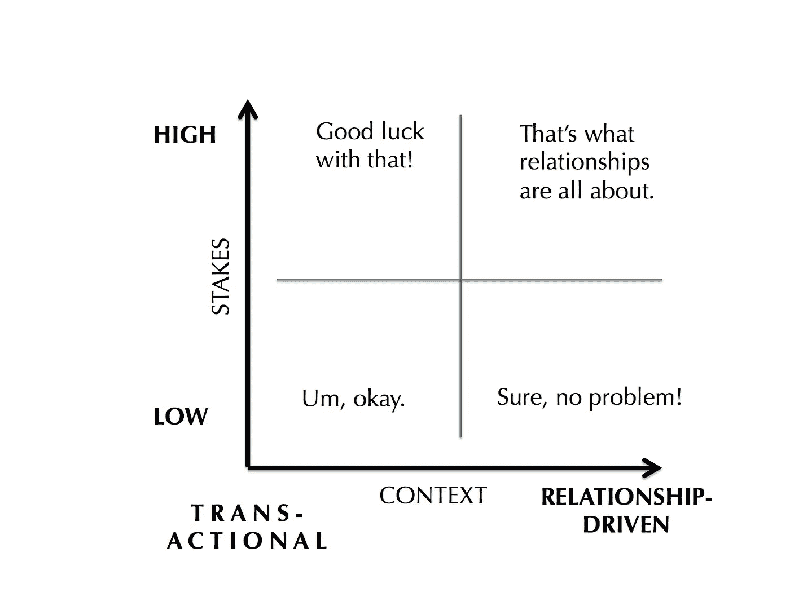

# 影响的关键:R 因素

> 原文：<https://medium.com/swlh/the-key-to-influence-the-r-factor-66c0562a773c>

*想锻炼更大的影响力？答案就藏在眼前。*

(Photo: *#WOCinTech Chat)*

三十出头的产品经理必须赢得工程、销售和设计部门同事的合作，才能按时将更新的产品推向市场，但她对这些部门的员工没有直接的权力。

一家大型儿童医院的肿瘤科护理主任需要她的 60 多名护士团队始终如一地采用各种协议，她对微观管理的风险非常敏感。

一名年轻的营销助理在工作第六个月时，经常在会议上发言，但他的好想法要么没有引起注意，要么被其他人采纳，然后邀功。

所有这些专业人士都面临着一个共同的挑战:*我怎样才能更有影响力？*

就本文的目的而言，假设运用影响力意味着在不诉诸胁迫或贿赂的情况下让他人朝着你的方向前进。[【1】](#_ftn1)用终止合同的威胁或者大激励的诱惑来改变一个人的行为是一回事。如果没有直接的权威、高级职称或良好的专业声誉，要做到这一点要困难得多。这是在没有权威的情况下施加影响的普遍挑战。

与其关注运用影响力的工具，不如从情境开始:你想影响谁，你想让他们做什么？这些问题可能看起来很简单，但它们对衡量你成功的可能性至关重要。理解这一点的最好方法之一是，当别人试图影响你时，考虑你自己的观点。

举一个低风险的例子。你在不同部门的一个不认识的同事正试图为一个有嘉宾发言的“午餐学习”研讨会招徕观众，他希望你能参加。他热情洋溢地描述了演讲者，并承诺这将是一次引人入胜的会议。这不需要你做太多——反正你是在午休，没有任何成本。所以你觉得这听起来无害。你的回答可能是“嗯，好吧。”如果有其他事情发生，你可能会改变计划，但是你同意了。他影响了你的行为。

现在想象一下，邀请你的人是你团队中的亲密同事。你们两个经常在工作之外进行社交活动。在这种情况下，决定是很容易的:一旦你检查了你的时间表，你就说这样的话，“当然，没问题，”或者“我很高兴来。听起来很好玩。”

第一个和你不认识的同事的案例是事务性的。他正在出售午餐时间演讲环节，你决定购买，因为价格合适。在第二种情况下，你根据关系回复你的亲密同事。有可能你会为了她去参加会议，即使演讲者听起来有点没用。

让我们提高赌注。想象一下，你的亲密同事希望你支持她的一项计划，该计划面临着组织内一些强大利益集团的强烈反对。冒险可能会有风险。但是你同意她这个案子的价值，你知道她指望你的支持。所以你签约了，因为这就是关系的全部。你相信在类似的情况下她也会为你做同样的事情。

现在考虑一下这个高风险的问题是否来自你不认识的同事。你对风险看得太清楚了，但你对这个人不够了解，无法衡量他执行自己推动的计划的能力。这个想法在理论上听起来不错，但有太多未解之谜。所以你礼貌地拒绝了，同时想，“祝你好运，把那块巨石滚上山。”

在高风险的情况下，这种关系非常重要。当职位权力或专业技能不能让一个人与众不同时，尤其如此。为什么会这样呢？

想想你自己与以交易方式接近你的人打交道的经历。在某些情况下，你可能并不介意，但在最糟糕的情况下，你可能会觉得自己被利用了，就像是别人游戏中的一枚棋子。

事务性的情况无法完全避免；他们是一个组织生活中给予和索取不可避免的一部分。有时，精明的个人会提前确认交易，这种信号有助于增加可信度，因为意图是毫无疑问的。但即使是最有魅力的个人也会在交易模式中遇到极限。

那么有什么实用的外卖呢？当你需要施加影响时，如果你能借助关系的力量，你成功的概率会大大增加。看看周围那些在没有正式或非正式权力的情况下成功影响他人的同事。这可能是他们的超能力。如果你想变得更有影响力，把你的时间投入到人们身上，不要有期望或不可告人的动机。没有太多的社会资本。

这个定义很好地改编自我以前的老板小约瑟夫·奈对软实力或吸引力的定义，他将其描述为不使用胁迫或贿赂就能获得你想要的结果。奈描述了国际关系中的权力运作。由于影响力往往比权力更间接的表现出来，我在这里把它定义为让别人朝着你的方向前进，而不是得到一个结果或结果。

## 这篇文章发表在[的《创业](https://medium.com/swlh)，这是 Medium 最大的创业刊物，拥有 277，050 多名读者。

## 订阅接收[我们的头条新闻](http://growthsupply.com/the-startup-newsletter/)。

