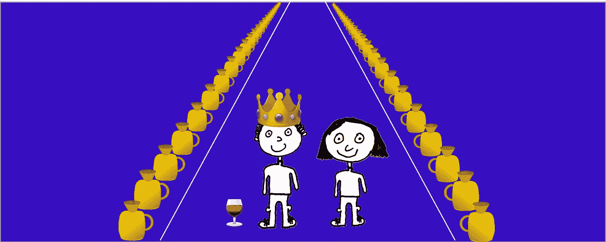

# 国王的难题:今天的问题如何成为明天的成功

> 原文：<https://medium.com/swlh/the-kings-conundrum-a-reminder-that-there-s-always-a-smarter-way-to-face-our-problems-f73479be5140>

The King’s conundrum

在工作和家庭中，我们都面临着进退两难的困境，而积极的解决方案似乎是不可能的。

无论我们从哪个角度看，似乎只有前进的道路会带来麻烦。

但也许不是…

下面的故事总是提醒我，无论它看起来多么糟糕，都可能有一条更好的前进道路，隐藏在显而易见的地方，如果你从各个不同的角度看待这个问题，它就会呈现出来。

*几年前，正是下面这个问题的解决方案激发了我对组合学的兴趣。组合学是数学的一个令人惊奇的分支，从不同的角度来看问题，通常可以得到简单而优雅的解决方案。*

# 国王的难题

许多年前，地球上最大的王国的国王为他的加冕典礼举行了一场盛大的宴会。他邀请了王国里所有最重要的人来和他一起庆祝。

但是在宴会开始前两个小时，灾难降临了！他的一个侍从从他站岗的酒窖跑向他。他在喊…

**太公:**“殿下，殿下，可怕的事情发生了！”

国王:“什么事，太公，发生了什么事？”

乡绅屏住呼吸，继续说道。

乡绅:“你邪恶的哥哥，先生，我刚刚抓到他在一大壶酒里下毒。”

**王:**“烦，听起来跟我哥做的那种气人的事一模一样。现在，告诉我乡绅，你看到哪个酒壶是有毒的吗？”

乡绅:“是的，殿下，但是你的哥哥看到了我，所以他开始在周围交换酒壶。我不知道哪一个被毒死了。”

国王是一个冷静而公正的人，他做出了这样的回答。

**王:**“别担心，太公。我们必须把所有的酒都扔掉，然后重新开始。告诉我，大厅里摆了多少个酒壶？”

乡绅:“陛下，1000 个酒壶，就这么多了！地窖里没有酒了。这是我们几十年来最大的一次聚会。”

**王:**“太公，这可不太好，我们的宴会不能没有酒，宴会必须进行下去。今晚我所有的敌人都在这里。他们会抓住我们最微小的弱点。”

国王沉思了一下，然后继续说道。

国王:“乡绅，你对毒药本身了解多少？”

乡绅:“我找到了装毒药的瓶子——你哥哥一定是跑的时候掉了——我很了解这种毒药，先生。一杯会立刻杀死饮用者，然而奇怪的是，满满一顶针只会让他们毛骨悚然。哦，还有最后一件事:饮酒后 20 分钟，症状才会出现。”

国王，在他所有的理性，收集他的想法，并重复了他如何看待他的仆人的情况。

# 概述

**王:**所以情况就是这样。离派对开始还有两个小时，1000 瓶酒，其中一瓶有毒，20 分钟后毒药才会生效，满满一杯会让人当场死亡，但满满一顶针只会让他们毛骨悚然。"

**乡绅:**“正是，先生。”

国王和他的侍从苦思冥想如何才能找出哪个酒壶被下毒了。他知道，如果他召集 1000 个仆人，他可以让他们都从一个酒壶里拿出满满一顶针来试一试，只要 20 分钟，他就能知道哪个仆人中毒了，因为相应的仆人的头发会竖起来。但是他没有 1000 个仆人。他能找出哪个污染的人少吗？

国王终于开口了。

**国王:**“乡绅，我们现在有多少仆人？”

**太公:**“最多三十，殿下。所有其他人都出去准备宴会厅。”

**王者:**“才 30！那么，乡绅，我没有主意了。如果没有酒，我面临叛乱。如果我端上酒，我今晚可能会杀了朋友和家人。你知道我们该如何解决这个问题吗？”

国王和乡绅静静地坐了一会儿，然后国王突然有了一个主意。

**国王:**“我知道了，让我给宫廷数学家打个电话，解释一下我们的困境，她可能会有答案！”

所以他召来了他的宫廷数学家塔菲。几分钟后她到了，他解释了整个情况。

塔菲:“先生，你有多少仆人可以支配？”

**王:**“顶多三十，塔菲。形势非常严峻。”

塔菲沉默了几分钟，想了想。最终，她开口了。

**塔菲:**“殿下，我有办法。我们可以在接下来的两个小时内确定这些酒壶中的哪一个装有毒药……只需要你的十个仆人。”

在这一点上，如果你想自己解决，停止阅读。

# 解决方案

**国王:**“塔菲，你是个天才！请解释我们怎么可能做这样的事！”

“好吧，先生，在接下来的一个小时里，你的十个仆人将不得不从许多酒壶中拿出满满一顶针来试一试，但是，只要只有一壶酒被下毒，他们最多只能拿出满满一顶针的毒酒。

国王:“继续，塔菲。”

Tafi: “对于每一个酒壶，我们可以创造不同的仆人组合来饮用，这样它就有了饮酒者的独特“签名”。这样，我们就能准确地确定哪个酒壶里有毒药。

“这是我们应该做的。我们要把这些酒壶排成一长串，从一个数到一千。然后我们将每个酒壶标上相应的二进制数。

“这是指你只用 0 和 1 来描述一个数字。在二进制中，一直到十的数字是 1、10、11、100、101、110、111、1000、1001、1010。

“而二进制的十二是 1100，九百九十九是 1111100111。

“现在请注意最后一个二进制数是如何有十位数的。事实上，我们可以用十位数来表示一千以内的所有数字，因为我们可以将两个数字写成 0000000010，将十二个数字写成 0000001100。

“现在我们给这十个数字中的每一个分配一个仆人，每个仆人必须做的是沿着酒壶的线，从他们的二进制数字为 1 的每一个酒壶中喝满满一顶针的水，并离开他们的数字为 0 的每一个酒壶。

“比如，对于第十二个酒壶，只有第七个和第八个仆人会喝。因为第九百九十九个只有第六和第七个仆人不会喝酒。

“这样，我们就能通过注意到哪个仆人的头发竖起来的组合来准确地确定哪个酒壶被下毒了！"

The tenth servant will drink from flagon 687 and 689 but not from 688, since the final digit is 1 then 0 then 1.

国王很惊讶，但他很快采取了行动。他立即让他的十个仆人开始工作。

他们花了一个半小时算出了所有的二进制数，并沿着整条线喝了相关的顶针满。

离晚宴开始还有十分钟，毒药开始生效了。国王和塔菲看着第四、第五和第八个仆人(醉得不可思议)的头发都竖起来了。它成功了！

The 4th, 5th and 8th servant tasted the poison

他们写下了这个显示的二进制数字:0001100100，然后他们把它转换回正常数字，这意味着第 356 个酒壶肯定被污染了。由于数学家 Tafi 的工作，他们把它从生产线上移走了，服务也按时完成了！

# 所以…

…认为自己别无选择的国王能够通过以不同的方式思考问题找到解决方案(通过 Tafi)。

我相信，在生活中，我们经常可以做同样的事情，也许不是用组合学，而是从不同的角度看待我们的问题和处境。

今天的困境可以成为明天的成功！

如果你喜欢这个博客，那么请看看我以前的博客 [*长寿和幸福的秘密藏在爱因斯坦的相对论*](/swlh/the-secret-to-a-longer-and-happier-life-is-hidden-in-einsteins-theory-of-relativity-85bc2e07ce48) *。*

*并请查看我公司*[*pil cro*](https://www.pilcro.com/?utm_source=medium&utm_medium=kingwine&utm_campaign=awareness)*关于 G-Suite 的智能品牌管理软件。*

## 这个故事发表在 [The Startup](https://medium.com/swlh) 上，这是 Medium 最大的创业刊物，有 293，189+人关注。

## 订阅接收[我们的头条](http://growthsupply.com/the-startup-newsletter/)。

