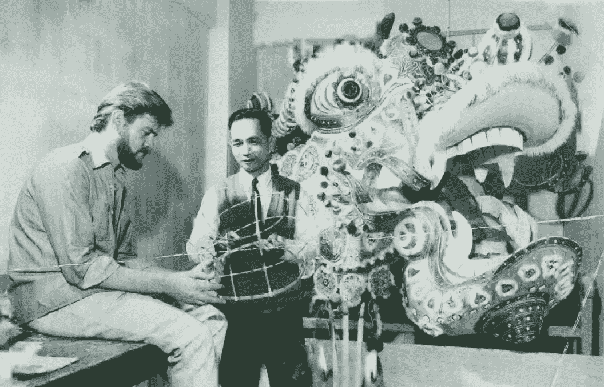

# 最后的龙制造者:一个中国移民的故事

> 原文：<https://medium.com/swlh/the-last-dragon-maker-a-chinese-immigrant-story-31166eca5524>

The ‘Melbourne Dai Loong’ is a symbol of Chinese pride and resilience

博物馆里静悄悄的，大厅里空无一人，除了一个漫不经心的年轻人和一个穿着过度的老年绅士，他们带着顽强的自豪感大步走过每个展览。一种令人不安的沉默气氛将这两个人联系在一起，他们似乎有着短暂的脆弱的同志情谊，但很快就因礼貌而变得岌岌可危。