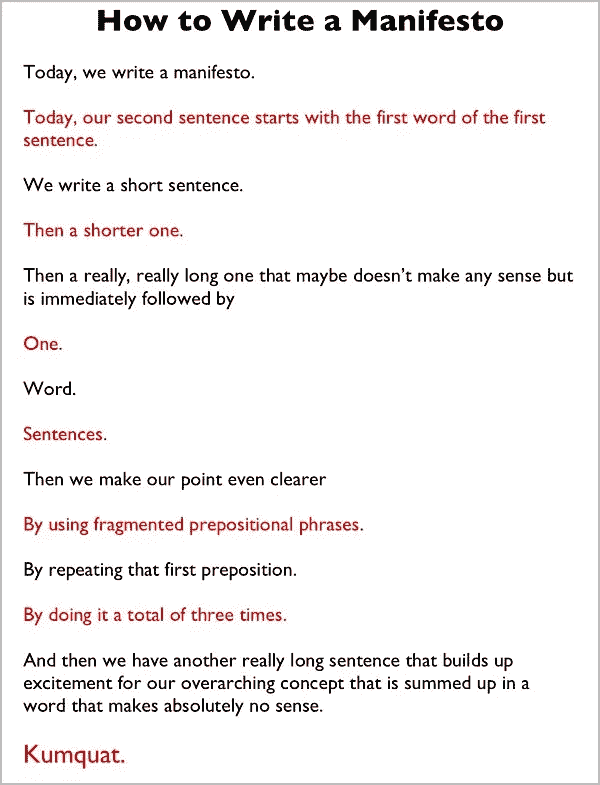

# 品牌的最后一句话(或者为什么委员会不创造品牌)

> 原文：<https://medium.com/swlh/the-last-word-in-branding-or-why-committees-don-t-create-brands-d4d9f53a1a5d>

*由* [**布瑞尔**](http://www.risingabovethenoise.com)

面对现实吧，委员会很烂。

但是我操之过急了。

> 最近，我从作家兼创意总监[金莫](http://www.fastcompany.com/person/kim-mok)的聪明头脑中偶然发现了这个最令人惊讶的**宣言**。
> 
> 书名叫做，“[如何写宣言](http://www.kimmok.com/#514799/THE-MANIFESTO-MANIFESTO)”，简直是天才之作。

为了让我们都在同一页上，这里是定义:

> **宣言** |ˌmanəˈfestō|名词(pl。政策和目标的公开声明，尤指。政党或候选人在选举前发出的传单。
> 起源中期 17 分。:来自意大利语，来自 manifestare，来自拉丁语，“公开”，来自 manifestus“明显”。

以下是金在她的网站上发表的颇有见地的作品:

因此，我决定根据金的杰出模式，写一篇关于…*品牌化的宣言。*

> *它完美地工作。唯一的问题是，我不知道最后一个词应该是什么。
> **这就是你进来的地方。***

*我邀请你参与下面的活动，这样我们就可以一起完成这个题为“为什么委员会不创造品牌”的宣言*

# ****为什么委员会不创造品牌****

> **今天，一个品牌将诞生。**
> 
> *今天，一个品牌将会超越那些被锁在没有窗户的房间里，喝着卢克热咖啡，吃着让人发胖的甜甜圈的委员会发起的快餐、快餐和香草运动。*
> 
> *灵感不会发生在锁着门、封闭思想的小房间里。*
> 
> *灵感是关于你的。还有我。*
> 
> *一个品牌可以激发灵感、补充能量和恢复活力——给以前只是梦想的事物注入新的能量。*
> 
> **品牌。**
> 
> **激情。**
> 
> **梦想。**
> 
> **品牌不会凭空出现……**
> 
> **脱离天气。**
> 
> **来自命运。**
> 
> *来自我们无法控制的事情。*
> 
> **品牌将理念、洞察力和美学凝聚成一股力量，能够改变公司的进程、改变忠诚的方向、凝聚人们的激情、重振梦想的活力。**
> 
> ****你来了:*** (最后一个字应该是什么？)*

****像这样？*** *我邀请你跟随我上* [***中***](/@davidbrier) *也跟随我的新媒体发布:* [***成功品牌+颠覆性策略***](https://medium.com/successful-brands-disruptive-strategies)*

**获得超过 320 个国家和国际设计和品牌认可和奖项，*[*David Brier*](http://whywebpr.com/davidbrier/index.php)*是一位获奖的品牌形象设计师，* [*作者*](http://www.risingabovethenoise.com/thebook/) *，以及品牌专家。他的* [*事务所的工作*](http://risingabovethenoise.com/) *赢得了同行和组织的赞赏，但更重要的是，帮助客户以新的和创新的方式启动他们的品牌，即使(尤其是)他们在以前的品牌改造中失败了。**

**既然你已经读到这里，你可以索取一本免费的* [*《幸运品牌》电子书*](http://risingabovethenoise.com/brand_leadership/) *。**

**

**这篇文章的前一个版本最初发表在 www.fastcompany.com***当我还是一个年轻的、不太灵活的作家的时候。***

****

***发表于* **创业、旅游癖和生活黑客****

************

**-**