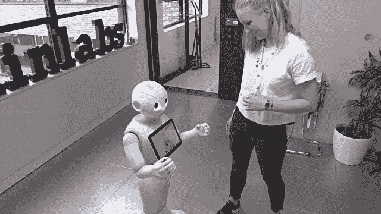
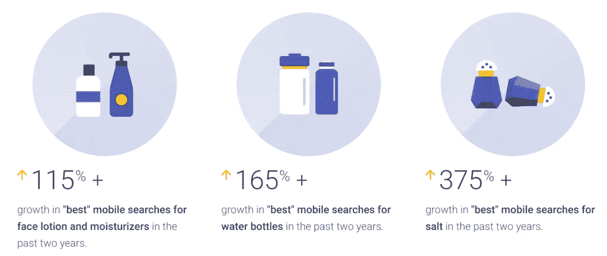
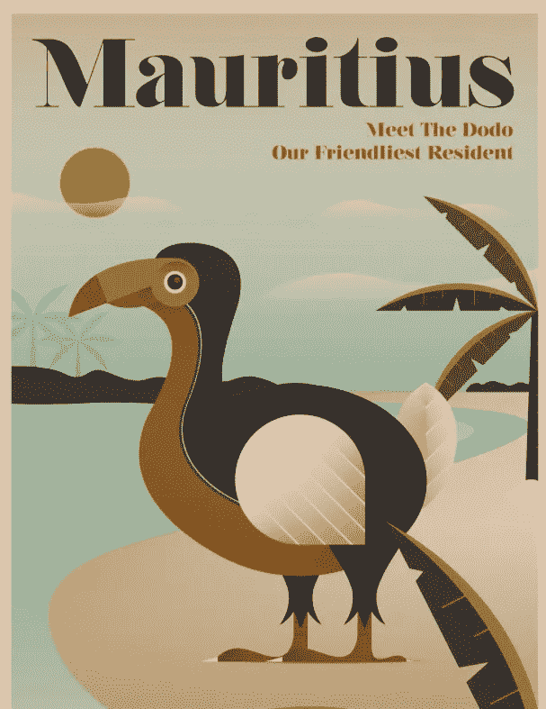
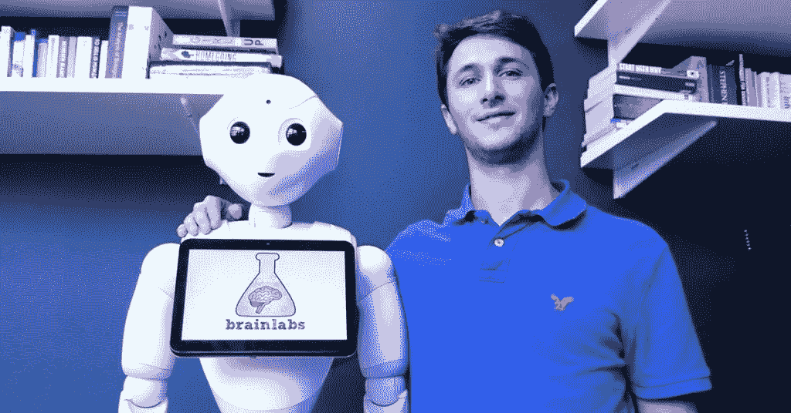

# 搜索的最新趋势:伦敦 Brainlabs 活动

> 原文：<https://medium.com/swlh/the-latest-trends-in-search-brainlabs-event-london-2ddea7f533d0>

## 2 月 22 日，领先的数字媒体机构 Brainlabs 在其伦敦总部举办了最新的一系列 PPC 实时聊天活动。

**来自谷歌、Verve Search，当然还有 Brainlabs 的演讲者，有很多话题需要考虑和消化。在这篇文章中，我们回顾了一个启发性事件的亮点。**

本期 PPC Chat Live 的主题是“搜索的现状”，重点是 2018 年及以后塑造行业的趋势。演讲者发表了各种各样的演讲，反映了该行业的起源，不仅仅是为了怀旧，也是为了照亮未来。

[Brainlabs](https://www.brainlabsdigital.com/) 已经作为一家创新的、数据驱动的搜索机构开辟了一个位置，这一基调贯穿了整个晚上，所有这一切都得到机器人接待员佩珀的干练协助。

尽管付费搜索占据了大部分播出时间，但仍有足够的空间来思考 SEO 的不断演变的角色，以及搜索的本质告诉我们关于现代消费者的什么。

# 数字助理:授权还是简单授权？

来自谷歌的 Peter Giles 以一个发人深省的关于新技术对人们寻找信息方式的影响的演讲拉开了晚会的序幕。

Peter 指出，支持语音的数字助理准确性的提高导致了消费者行为的一系列变化。其中一些可以被视为授权，而另一些可能只是为了满足我们与生俱来的懒惰和对无摩擦生活的渴望。

本次会议中有三个核心行为趋势:

# 1.好奇心增加

因为人们可以接触到前所未有的大量信息，他们更倾向于提问。当答案总是近在咫尺时，这是一种可以理解的发展。

在过去的两年里，谷歌看到了一些有趣的趋势，包括[最佳雨伞]的搜索量增长了 150%。曾经简单的购买现在要经过更有眼光的研究过程。

# 2.更高的期望

虽然最初对一些从根本上改变我们生活方式的技术有抵触，但一旦我们习惯了它们，我们很快就会开始期待更多。2015 年，谷歌报告称，包括“我附近”在内的搜索数量增长了 37 倍。

消费者现在希望他们的设备能够含蓄地知道这一意图，彼得透露，“在我附近”短语的增长已经大大放缓。

# 3.耐心下降

随着期望的增长，耐心水平下降。事实上，自 2015 年以来，在美国，包含“立即打开”短语的搜索量增长了 200%以上。与此同时，在主要大都市地区，消费者开始期望当天送达成为标准。

在所有这些变化中，Peter Giles 明确表示，品牌需要专注于成为对目标受众最有帮助、最可行的选择。通过对这些领域的深入研究，消费者获取信息的方式就不那么重要了。

更重要的因素是让这些信息更容易定位和浮出水面，无论是通过搜索引擎、社交网络还是数字助理。

# 竞价排名和搜索引擎优化的过去、现在和未来

Brainlabs 的执行主席吉姆·布里格登(Jim Brigden)回顾了付费搜索行业的历史，追溯到 2000 年代初，当时大多数品牌都对新兴广告形式的潜力持怀疑态度。

事实上，就在 2001 年，英国的付费搜索支出仅为 500 万英镑。该行业的增长预计今年将超过 1000 亿美元，这也应该让我们有理由停下来考虑接下来会发生什么。变化的速度越来越快，因此营销人员需要随时适应新的现实。

吉姆·布里格登给初露头角的搜索营销人员的建议是，尽可能多地吸收新知识，并对新机会保持开放，而不是试图根据对未来趋势的猜测来定位自己。许多营销人员专门从事搜索已经超过十年，虽然这个行业在这段时间里发生了巨大的变化，但它的核心要素基本上保持不变。

这也是 Verve Search 的 Lisa Myers 在讨论有机搜索时提到的一个话题。多年来，我们一直在讨论 SEO 的作用(甚至是潜在的消亡)，因为谷歌在更大程度上走向了付费搜索的前台。

迈尔斯的演讲展示了 SEO 行业发生了多大的变化，从链接购买到信息图表，再到现代方法，这种方法与创意机构和 web 开发团队一样多。

Verve Search 团队与他们的客户 Expedia 合作开展的一个亮点是[未知旅游](https://www.expedia.co.uk/vc/unknowntourism/)活动。该活动由一系列数字海报组成，纪念世界上一些最受欢迎的旅游景点中失去的动物。

这场运动如此受欢迎，一个粉丝为模拟人生视频游戏制作了一个包，让它可以把海报钉在他们电脑生成的墙上。Verve 也收到了几乎无穷无尽的制作和销售海报的请求。

这不是大多数人想到 SEO 时想到的，但这是一个创意活动如何推动业绩的完美例子。对 Expedia 而言，Verve 在所有国际市场的知名度平均提高了 54%。

我们可以从吉姆·布里格登和丽莎·迈尔斯那里学到的核心经验是，搜索媒介仍然非常受欢迎，因此品牌需要努力脱颖而出，才能登上顶峰。这样做的手段可能会改变，但基本概念和目标保持不变。

# 人们的可预测性

根据 Econsultancy 的数据，在晚会的最后一部分，Brainlabs 的首席执行官、数字领域第三大最有影响力的人丹尼尔·吉尔伯特加入了吉姆·布里登的行列。

丹分享了他对搜索行业的复杂而清晰的观点，这与人的内在本质有着千丝万缕的联系。

各种各样的研究表明，人们的行为模式几乎是完全可以预测的，其中一篇论文指出“自发的个体在很大程度上不存在于群体中”。尽管旅行模式存在显著差异，但我们发现大多数人都是同样可预测的。”

尽管我们愿意认为自己是非理性和独特的，但我们的大多数行为都可以归结为数学方程式。

当我们考虑这个行业的现状时，这对搜索来说很重要。

毕竟，像谷歌这样的公司擅长创建理性系统，例如在其产品套件中持续增长的机器学习算法。

正如丹尼尔·吉尔伯特所说，这让我们有充分的理由相信，未来搜索的性质将会有根本的不同。

如果我们的数字助理已经知道我们下一步想要什么，他们就没有理由给我们提供选择。

这种选择是搜索行业的标志，但吉尔伯特认为没有理由在不需要紧张的地方创造一种可以赚钱的紧张。

谷歌的重点一直是把产品做好，并在用户加入后搞清楚商业方面，这似乎可能是语音助手的做法。

事实上，技术已经可以抢先做出这些决定，并在消费者知道他们想要接收内容和产品之前就开始为他们提供服务。[预测分析](https://www.clickz.com/ai-and-predictive-analytics-what-does-the-future-hold-2/112443/)领域在过去几年里发生了巨大的变化，模拟未来行为趋势的能力已经被网飞和亚马逊这样的公司使用。

这项技术的转折点取决于人们是否愿意接受日常生活中这种程度的入侵，而不是任何天生的技术缺陷。

历史表明，虽然最初会有一定的阻力，但最终我们会习惯于技术融入我们的生活。不久之后，我们会对遇到的任何限制变得不耐烦。

这将在搜索行业的运作方式上产生巨大的转变，但它将开辟新的和更具创新性的方式来连接消费者和品牌。]

## 这篇文章发表在《创业公司》杂志上，这是 Medium 最大的创业刊物，有 301，336 人关注。

## 订阅接收[我们的头条](http://growthsupply.com/the-startup-newsletter/)。

