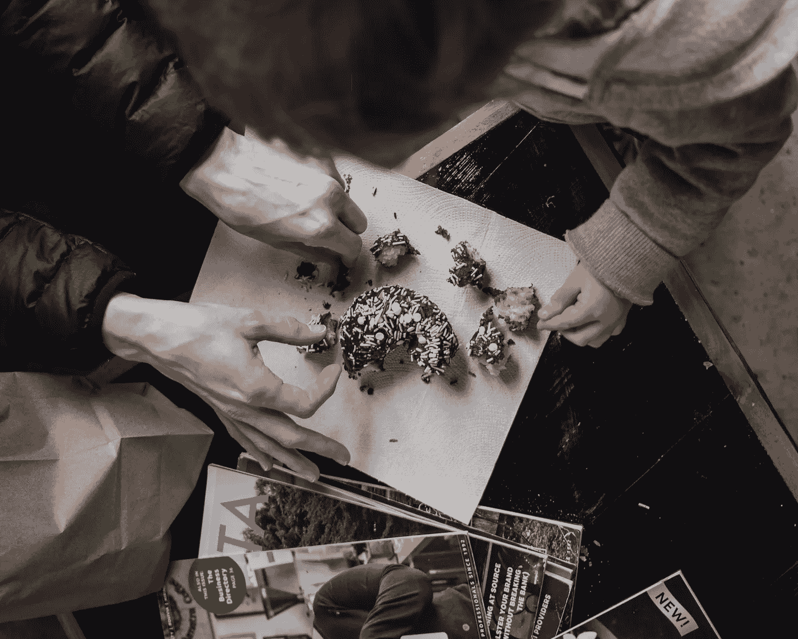
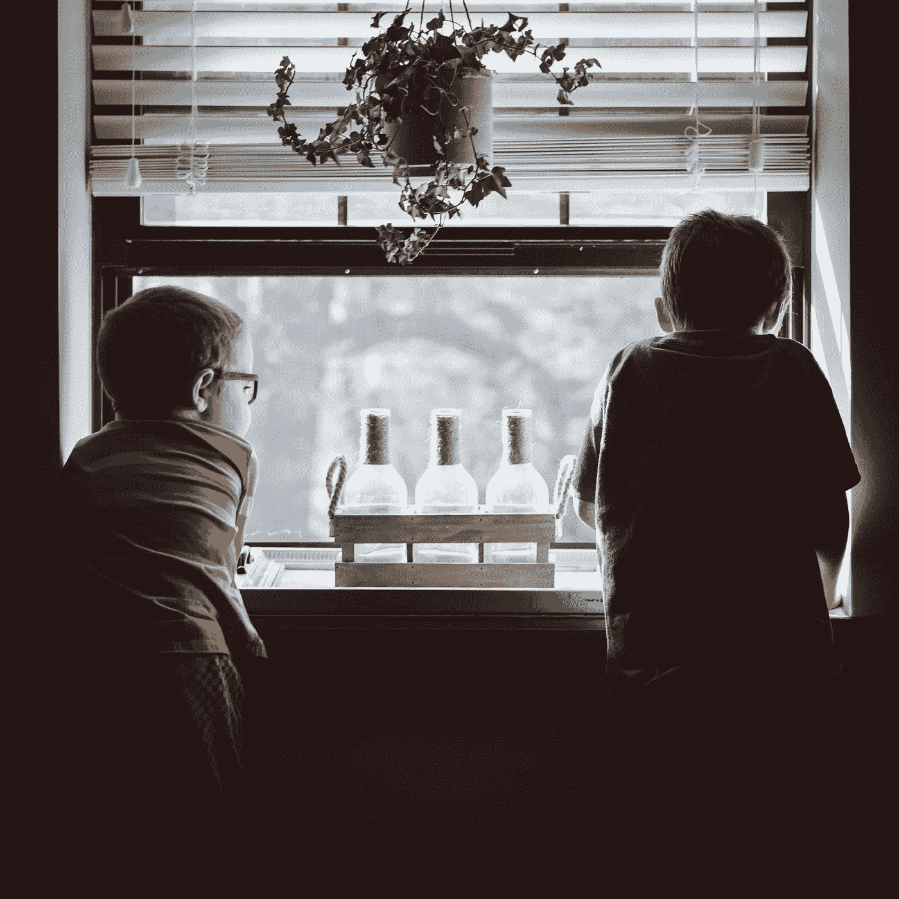

# 建立网络和培养关系的鲜为人知的策略

> 原文：<https://medium.com/swlh/the-lesser-known-tactics-in-building-a-network-and-fostering-relationships-e092ad560e04>

Photo by [Roberto Nickson (@g)](https://unsplash.com/photos/x5ugLJu1j0M?utm_source=unsplash&utm_medium=referral&utm_content=creditCopyText) on [Unsplash](https://unsplash.com/search/photos/friendship?utm_source=unsplash&utm_medium=referral&utm_content=creditCopyText)

我不了解你——有时候，当涉及到人际关系时，我真的被“把事情做好”的想法淹没了

我这么说是什么意思？

我经常思考人际关系。我考虑亲密关系，我考虑职业关系，我考虑家庭关系。

更进一步说:

*   我想到了和我有关系的人的数量。
*   我会思考我对另一方的了解以及他们对我的了解的实质内容。
*   我在想，如果我需要什么东西，我可以马上找谁。
*   我思考随着时间的推移和生活的发生，一段关系发生了怎样的变化(如果有的话)？

这是一个让我着迷的话题。

当然，我不想在这里歪曲我自己。我不是偏执狂，在与人打交道时，我总是感觉如履薄冰。恰恰相反。我很自在，觉得自己很有魅力，在社会交往中处理得很好。我对人类互动和*人类状况很感兴趣。*

所有这些想法引导我走上了一条真正尝试量化关系的道路。

当我开始寻找这些问题的答案时，我被带到了 Joey Coleman 那里，他是《华尔街日报》畅销书的作者， [*永远不再失去一个客户:在 100 天内将任何销售变成终身忠诚*](https://www.amazon.com/Never-Lose-Customer-Again-Lifelong/dp/0735220034) 以及他在 [Altucher 的播客](https://jamesaltucher.com/2018/05/joey-coleman/?utm_source=libsyn&utm_medium=link-to-site&utm_term=05302018&utm_content=&utm_campaign=joey-coleman)中对 [James Altucher](https://medium.com/u/cac1bc5422de?source=post_page-----e092ad560e04--------------------------------) 的采访。

现在，这篇文章不是书评。我可以告诉你，在回顾我的研究结果时，我不会做什么:

*   我不会看这本书的主要部分。
*   我不会定义科尔曼为了实现他的承诺(100 天内的忠诚)而概述的技巧、诀窍和策略。
*   我不会对他的工作发表我的态度或意见。
*   我不会批评他的任何主张。

我要做的是把他作品的主题和我在自己生活中看到的联系起来(以及它如何对你的生活产生积极影响)。

我觉得这在这种情况下更有实质意义和价值。

我知道，当我阅读一篇文章并以系统的方式吸收信息时，我只能获得表面的价值——然而，这并不是要减少我从这种写作风格中获得的过多的价值。

人类是移情的、社会性的动物。作为一个物种，我们之所以能够取得如此大的进步，是因为我们有能力从另一个人的视角来理解他们的经历。我们能够，在一瞬间，从我们的邻居那里收集情感经验，并尝试用于我们自己的学习。

这使我想到第一个首要主题。

# 1.成为第一个脆弱的人

Photo by [Christal Yuen](https://unsplash.com/photos/ErM56w1W2NY?utm_source=unsplash&utm_medium=referral&utm_content=creditCopyText) on [Unsplash](https://unsplash.com/search/photos/vulnerable?utm_source=unsplash&utm_medium=referral&utm_content=creditCopyText)

> “脆弱是联系的发源地，也是获得价值感的途径。如果它感觉不到脆弱，这种分享很可能是没有建设性的。”布伦·布朗

如今，脆弱是罕见的。

让别人进来似乎不太好。想想吧。你在社交媒体上看到了什么？

## 你只看到好的一面。

*   你看到你朋友的胜利。
*   你看到了“Insta-stars”的光鲜生活(这是一个词吗？)
*   你可以看到滤镜改变了拍摄图像的美学质量。

## 你很少看到这些人生活中脆弱的一面。

*   你看不到你的朋友在结婚前经历的争吵和分离。
*   在“Insta-star”成功之前，你不会看到艰苦的旅行和在咖啡店里磨蹭(去它的，我在造一个词)。
*   你看不到每个人对自己的瑕疵和不安全感——即使他们选择不承认。

归根结底，如今脆弱是一种奢侈。

这些年来，我发现大多数人都渴望变得脆弱，然而大多数人都不愿意成为第一个。**也许这与骄傲有关，或者也许他们在成长过程中没有被灌输脆弱的思想。不管怎样，我发现当你承担起成为第一个脆弱的人的责任时，这种关系在深度和质量上会有 100 倍的飞跃，接受者也会跟着做。**

在我自己的生活中，我发现在父亲面前的脆弱帮助我们加深了关系的深度和质量。

我父亲和我的关系一直很好。他从小就告诉我，他和他的父亲大半辈子都在争吵，他不想让我或我的兄弟姐妹也这样。随着年龄的增长，我们似乎越来越疏远。我离家去上大学，毕业后想搬到 1000 多英里外的一个新城市。

在我毕业之前，我父亲告诉我他的愿望是让我经营他的生意。在我心里，这是我不想要的。**我想，如果我告诉他，我会被抛弃，我会背叛他的爱，我们的关系会破裂，我的家庭关系也会破裂。**

我拖延了一年多才说出真相。我搬离了我的家乡，并暗示了一个错误的可能性，那就是有一天我会搬回家来经营公司。随着时间的推移，我意识到这个谎言正在侵蚀我。我觉得我过着多重生活。

我终于鼓起勇气，脆弱地告诉了他真相。那是我最后一次哭。

那是一个星期六的下午。我让他措手不及。我一直认为会有一个“合适”的时间告诉他(剧透一下，从来没有一个“合适”的时间)。

我很脆弱，告诉了他真相。我告诉他我害怕真相。我担心他会生气。我担心他会怨恨我。我害怕谈话。

在我告诉他这一切后，他开始咯咯地笑起来…

我完全糊涂了。

我清楚地记得他的回答，

> “嘿伙计，一切都好。我当然有对你的祝愿，那些祝愿来自于我认为生活应该如何生活的地方。我想给你最好的，我相信我的这个愿望会带来一定程度的繁荣。然而，归根结底，这是你的生活。你需要经历你的起起落落，你的成功和失败。无论你做什么，我都会爱你。”

那天下午，我的生活立刻变得更好了。我觉得这种释放在我身上消失了。我看到一块空白的石板开始在我面前形成。我没有试图同时取悦自己和他人。

当你承担起成为第一个脆弱的人的责任时，你会发现这种感觉潜伏在另一端的人身上。

# 2.不是所有的关系都是五五开的

人们常说，关系是对半分的——尤其是在亲密关系的背景下。

如果你在这段关系中付出了 50%的努力，你会从你的伴侣那里得到另外的 50%。

这是谬论。

在对乔伊·科尔曼的采访中，他讲述了他采访父母时的一段轶事。他解释了他母亲对一段关系的“秘密”的反应，

> “一段感情不是五五开的。相反，它是 90/10，它只是取决于在给定的时间点，谁需要拿 90，谁需要拿 10。有时候你必须是 90 岁，而你的伴侣是 10 岁。有时正好相反。有时候你们都是 90 后，关系是 180%。有时候你们都是 10，关系是 20%。当你明白这一点时，你们的关系会变得更好。”

我在自己的生活中发现这是真的。不管是出于无知还是自负，我发现自己假设我的伴侣能读懂我的感受。

Photo by [Kyle Nieber](https://unsplash.com/photos/MW4laRuT6zc?utm_source=unsplash&utm_medium=referral&utm_content=creditCopyText) on [Unsplash](https://unsplash.com/search/photos/sharing?utm_source=unsplash&utm_medium=referral&utm_content=creditCopyText)

这对你的伴侣来说是完全错误和不公平的。没有人会读心术。没有人能完全知道你是如何处理信息和感受的。如果你想发展关系，你需要传达你的想法和情感。

很多这种理解又回到了脆弱的概念。我发现当我被要求承担 90%的责任时，我需要掩饰自己的脆弱。我不能袖手旁观，希望事情会自行解决。

我需要准备好开始不舒服的谈话。

我需要愿意听别人说完。

对我来说，这个想法让我明白，一般来说，我需要戴上 90%的帽子(每个人都是)。当你承担起不总是期待 50%的责任时，你就承担起了愿意付出 90%的责任。

当你付出时，你会得到更多。

# 3.愿意分开成长(但要明白你从哪里来)

我一直害怕和朋友失去联系。

当然，我拥有社交媒体的奢侈和保持联系的便利，这是昨天的人甚至无法想象的。

随着年龄的增长，我开始担心有一个社区或社交圈会让我最终失去联系。

我觉得这是人生变老不可避免的一部分。**人们会在你的生活中来来去去，帮助你定义你的存在。**

*   我有一些在我年轻时帮助过我的朋友。我们在同一条街上长大，上的是同一所小学——他们帮助我度过了人生的那个阶段。
*   我有大学时代的朋友，他们帮助我成长为一个独立的人——他们帮助我度过了人生的那个阶段。
*   我有一些职业生涯中的朋友，他们帮助我获得新技能，成长为对社会有贡献的一员——他们帮助我度过了人生的那个阶段。

年轻的时候，我总是害怕放下人生的某些篇章。

我记得几年前有一个朋友帮我克服了这种令人窒息的情绪。

我住在波士顿(我已经从我的家乡芝加哥搬到了波士顿)。我去我的家乡是为了参加一个夏季音乐会。我遇到了我的朋友并和他对质。

Photo by [Andrew Seaman](https://unsplash.com/photos/ey5zZOkYL0Q?utm_source=unsplash&utm_medium=referral&utm_content=creditCopyText) on [Unsplash](https://unsplash.com/search/photos/little-boy-friends?utm_source=unsplash&utm_medium=referral&utm_content=creditCopyText)

离开这群我们一起帮助成长的朋友，我感到非常内疚。

我记得我告诉他，我觉得离开我们的朋友群是自私和冷漠的。

他微笑着回应道:

> “乔恩……那是个疯子。我们是朋友，我们永远是朋友。我们一生中总会有形影不离的时候。这一点永远不会改变。然而，我们可以把它留在那里。生活正在扎根——我们在成长。我们需要跟随这种增长，变得更好，而不是停留在过去，完全没有增长。我们将永远拥有那一章。”

我记得那一刻拥抱了他，感受到了另一种自由的感觉。

我们都将永远拥有那些回忆和我们生命中的那一章。我们将永远知道年轻时我们是如何帮助彼此成长的。**现在是我们的责任了，把我们学到的和我们分享的东西拿来帮助培育和发展我们的未来。**

在生活中，我们经历了一个又一个章节。

曾经存在的关系将永远存在。生活是动态的，随着时间的推移而变化。

你不能抓住过去。

一个人需要前进和进步，并看到为你准备的课程。

关系可能是艰难的——我们有时过于看重我们的关系，投入了太多我们不需要的东西，有时会导致迷失自我。其他时候，我们对他们投入不够——我们对其他人期望过高，我们将自己与任何类型的联系隔离开来。

虽然我们应该把人际关系放在生活的首位，但它不需要像我们有时拟定的那样困难。

*   理解脆弱的力量，并承担起表达这种力量的催化剂的责任。
*   在关系中承担更多付出的责任。如果你有爱人，就多付出多付出。如果你有一个客户，吹走他们的期望，如果你是一个运动队的领导，承担损失的责任。
*   愿意成长。你不能抓住每一段感情不放。它们改变了加班，赋予了新的意义。如果关系发生了变化，要知道它曾经的价值。看到积极的一面。

利用你对他人的影响力为你谋利。

## 在一个有 140 个字符、定时图像和图片说明的世界里，人们真正想要的是深层联系。成为第一个提供连接的人，你将获得 100 倍的回报。

# 准备好接受刺激了吗？

我提供给你一个经过测试和验证的 6 部分指南，它包含了强大的概念，可以帮助你识别、规划、成长和完成你的创造性追求。

## [> > >在这里获得免费指南< < <](https://www.tribeloyal.com/free-6-step-course)

## 学到了什么？按住👏说“谢谢！”并帮助他人找到这篇文章。

## 还评论！你喜欢什么？你讨厌什么？你在做什么？

## 这篇文章发表在《T4》杂志《创业》(The Startup)上，这是 Medium 最大的创业刊物，拥有 335，210 多名读者。

## 在这里订阅接收[我们的头条新闻](http://growthsupply.com/the-startup-newsletter/)。

