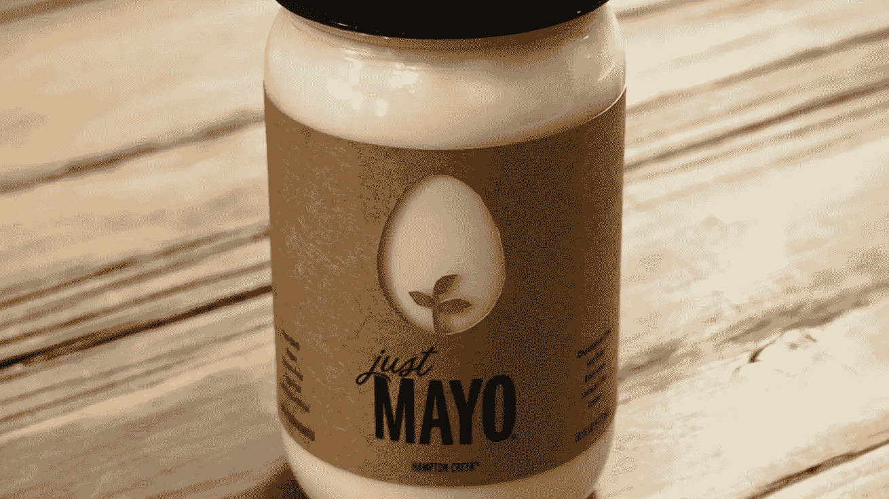

# “假装直到成功”的局限性

> 原文：<https://medium.com/swlh/the-limits-of-fake-it-till-you-make-it-4b55129a05ad>

## 不择手段和撒谎之间的界限比我们想象的要微妙。

彭博今天报道说，风险投资的蛋黄酱品牌 [Just Mayo](https://www.hamptoncreek.com/just-mayo) 可能已经不遗余力地向其投资者和买家展示增长，包括[从产品零售商](http://www.bloomberg.com/news/articles/2016-08-04/food-startup-ran-undercover-project-to-buy-up-its-own-products)的货架上买下自己的产品。