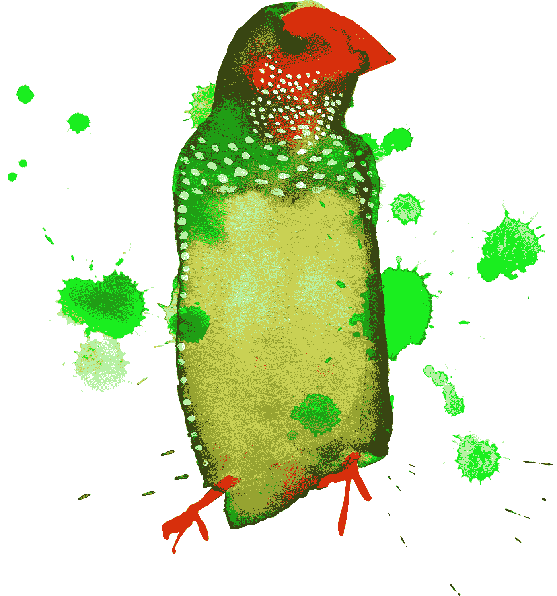

# 心理健康和创造力之间的联系

> 原文：<https://medium.com/swlh/the-link-between-mental-health-and-creativity-e7ee791f4032>

## 心理健康问题从常见的问题，如抑郁和焦虑，到罕见的疾病，如精神分裂症和躁郁症。很多人都受到影响，无论是个人还是照顾他人，但我注意到这在创意行业更明显。

创意人员非常敏感，而且容易波动。相同的性格类型在每个行业都能找到，但与银行业、法律或酒店业相比，用你的怪癖和激情来衡量，在艺术领域受到鼓励和奖励，而不是压制。

禁锢自由限制了创造力，但反过来也是正确的，狂躁或过度敏感会使个体失衡。这是一个极端和令人沮丧的例子，它是由毒瘾引发的，但我不禁想起了艺术家艾米·怀恩豪斯。她的脆弱似乎只是证实了她的才华，并反常地使她更有吸引力和更成功。我看了纪录片《艾米》,试图理解她自我毁灭的故事，她显然很有才华，但她的热情和强度也可能对她不利。对于艺术家和崇拜者来说，这种张力既迷人又有吸引力。这部电影质疑她做出的选择和支持她的人，不清楚她是被鼓励飞得太高还是失去了控制。

如今，至少有六分之一的员工在工作中遇到心理健康问题，这很常见，但却被保密。人们觉得他们需要向老板隐藏抑郁和焦虑，而员工们则是高效的，他们不受约束。压力增加是引发健康问题的一个关键因素，然而回报却是少花钱多办事，工作更快，承担更多的责任。

虽然心理健康仍然是一个禁忌话题，但许多人在面对这个问题时会感到害怕和困惑。引人注目需要勇气，你会招来不必要的关注。人们很快就会做出判断，被贴上有问题的标签，尤其是在公司环境中，会将机会拒之门外。

不同的工作环境和职业会对我们的压力水平产生不同的影响。为了保持一个健康和富有成效的工作角色，重要的是要感觉到你能尽可能地控制你的工作，并且你理解你工作的要求，不管是什么。其他重要因素包括你从经理和同事那里得到的支持，以及公司如何管理工作场所的变化。

这对父母来说听起来很熟悉，但如果我们想鼓励人们去冒险，他们需要知道如果他们摔倒了，有人会在那里接住他们。他们也需要开始信任自己。

我和各种各样的组织合作过；企业界、政府部门、所有者或家族企业，我见过各种各样的管理和文化模式。相比之下，创意产业享有比大多数行业更多的自由，有规则打破，个性受到重视。在那个领域工作很棒，但我也对压力和为客户、其他学科和部门工作的不同方式很敏感。

与喜欢迭代和需要不断挑战的快速发展的技术团队合作，不同于需要不断保证和希望事情第一次就做对的规避风险的客户。

> 确保船不会摇晃，最终产品不会漏水意味着额外的检查和驾驶更安全的路线。顺风航行或冒险进入未知的水域会带你去新的令人兴奋的地方，但这需要信念和准备。

一般来说，员工被要求承担更多的责任，并在这样做的过程中找到保护自己的方法。给予我们更大的自主权是为了鼓励我们做出更好、更大胆的决定，但我们需要一个框架和对规则的理解。我们也需要了解我们需要从别人那里得到什么样的支持。获得对事物的看法是有用的，但自我意识需要时间，你需要保持警惕，留意行为模式。识别你自己的优势和劣势。

压力和心理健康问题最常见的原因包括工作强度增加、工作安全性降低、自主性降低、目标驱动的工作文化、欺凌和骚扰。

如果你开始注意到以下警告信号，那么是时候寻求一些支持了。与你的医生和你的经理或人力资源部谈谈，他们可以探讨如何继续下去。警告信号和症状包括:

*   注意力和记忆力下降
*   决策困难
*   逃跑的想法
*   缺乏客观性
*   重量波动
*   头痛、消化障碍和胸痛
*   睡眠障碍和疲劳
*   重复思维
*   消极思维
*   沮丧和易怒
*   物质使用的增加
*   拿你的健康冒险
*   工作得晚或早，或者因为压力而错过工作
*   紧张、恐惧或悲伤

当人们筋疲力尽或崩溃时，谁应该负责还不清楚。企业有责任、道德和法律义务确保员工的福祉。当一个人从没有固定的梯子上摔下来时，很容易确定是谁的错。保护身体健康被认为是正常的，但吃苹果、喝大量的水和免费的瑜伽课无助于平衡沉重的责任感或缺乏支持的感觉。至关重要的是，我们要更加努力地互相照顾，共同发展。这就是人性的全部。

这些摘录摘自我写的一本关于探索创新精神的书。如果你想了解更多，请联系:faddyfinch@gmail.com

 [## 古怪的人不合群的人

### 为什么有创造力的人被认为与众不同？

blog.prototypr.io](https://blog.prototypr.io/why-are-creative-people-perceived-as-different-from-everyone-else-33d7cc348956) 

# WorldMentalHealthDay # wmhd 18 # mental health # ask twice

@ who @ time to change @ rethink _ @ mind charity @ mental health @ youngmindsuk @ wmhd 2018 ‏@design_week

[www.mentalhealthatwork.org.uk](http://www.mentalhealthatwork.org.uk)

## 这篇文章发表在[《创业](https://medium.com/swlh)》上，这是 Medium 最大的创业刊物，有+ 377，008 人关注。

## 订阅接收[我们的头条新闻](http://growthsupply.com/the-startup-newsletter/)。

