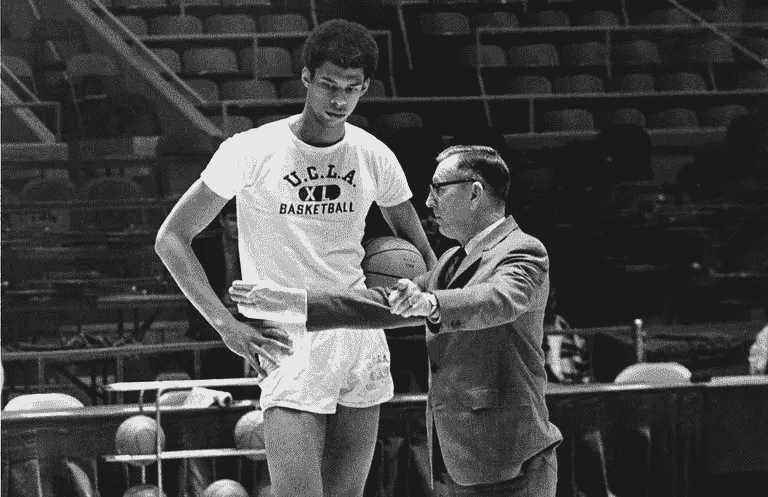

# 小事就是大事

> 原文：<https://medium.com/swlh/the-little-things-are-the-big-things-e0710a0c1a0f>

来自约翰·伍登的教训

Photo by [JESHOOTS.COM](https://unsplash.com/photos/pUAM5hPaCRI?utm_source=unsplash&utm_medium=referral&utm_content=creditCopyText) on [Unsplash](https://unsplash.com/search/photos/pencil-notebook?utm_source=unsplash&utm_medium=referral&utm_content=creditCopyText)

约翰·伍登是有史以来最好的教练之一。

作为加州大学洛杉矶分校的篮球主教练，他在 12 年内赢得了 10 次 NCAA 全国冠军，其中包括创纪录的七连冠。

没有其他球队在 1 区大学篮球赛中连续赢过三场以上。

但他并不是因为痴迷于分数而获得成功的。

事实上，恰恰相反。

木讷总是口口声声说准备第一。如果球队做好了准备并发挥出了最大的潜力，那么分数就不重要了。

> *“只有通过自我满足，知道自己尽了最大努力，才能获得内心的平静。”*

尽管取得了巨大的成功，伍登还是过分关注小细节。这里有一个例子:

在每个赛季的第一次训练中，伍登花了大部分时间教他的球员们一个重要的课程:如何穿上他们的袜子。

图片[卡里姆·阿布杜尔·贾巴尔](https://en.wikipedia.org/wiki/Kareem_Abdul-Jabbar)和[比尔·沃顿](https://en.wikipedia.org/wiki/Bill_Walton)，有史以来最伟大的两个篮球运动员，正在经历这个指令。

他们认为他疯了。

那么他为什么要这么做呢？

因为袜子上的褶皱会导致水泡。水泡会导致受伤。受伤会导致休假。休假会给团队带来损失。

Wooden 专注于他(和团队)可以控制的每一个细节，让其他变量(对手，得分，等等。)把自己发挥出来。

小事就是大事。

有哪些你可以多注意的小细节？

> “你会发现，成功和对细节的关注，最微小的细节，往往是密不可分的。”

# 想要加快你的个人发展吗？
[在这里注册我的简讯](http://eepurl.com/c-46aj)

**关于作者**

Tom Alaimo 是一位充满激情的 B2B 销售专家。他目前是 [*TR Talk 播客*](https://soundcloud.com/ryan-warner-799706255) *的主持人，在这里他帮助千禧一代快速跟踪他们的个人发展。Tom 也是 TechTarget 的客户经理，住在旧金山。*

[网站](http://tomalaimo.com/) | [播客](https://soundcloud.com/ryan-warner-799706255) | [邮箱](mailto:thomasalaimo7@gmail.com) | [推特](https://twitter.com/TomAlaimo_TTGT)|[LinkedIn](https://www.linkedin.com/in/tom-alaimo-573a1878/)|*|*|[脸书](https://www.facebook.com/thomas.alaimo.12) | [Instagram](http://instagram.com/talaimo7) | [媒体](/@TomAlaimo_TTGT) |

## 这个故事发表在 [The Startup](https://medium.com/swlh) 上，这是 Medium 最大的创业刊物，拥有 303，461+人关注。

## 在这里订阅接收[我们的头条新闻](http://growthsupply.com/the-startup-newsletter/)。

