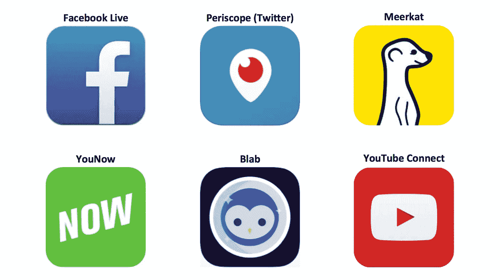
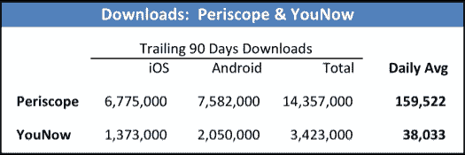
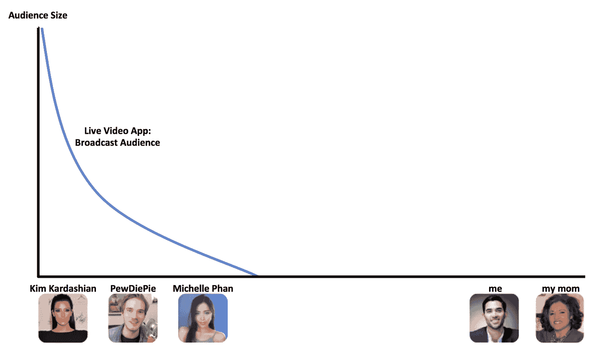
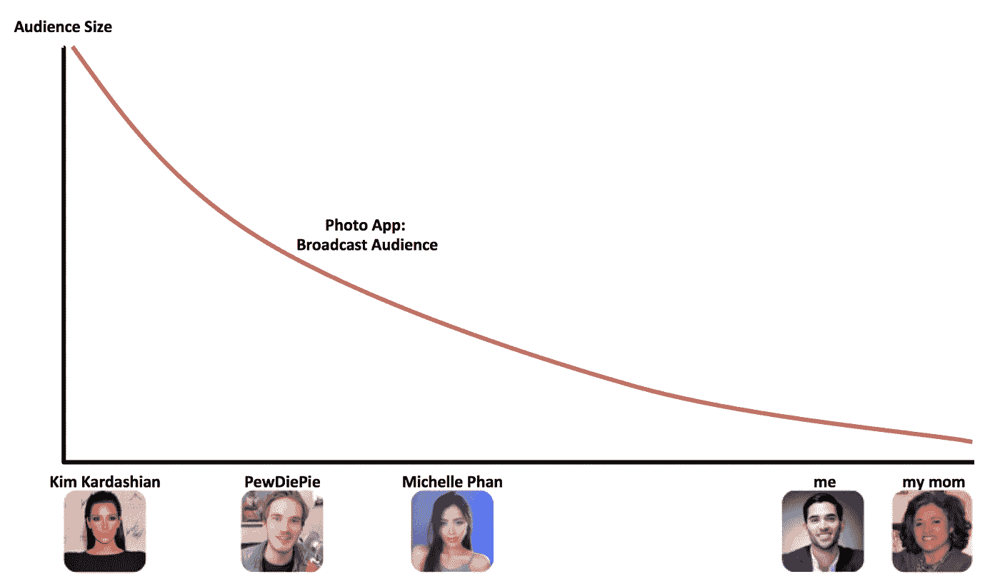

# 直播悖论:阻碍网络效应的 6 个陷阱

> 原文：<https://medium.com/swlh/the-live-streaming-paradox-6-pitfalls-blocking-network-effects-ffc1aa997a5a>

移动直播视频平台成为 2015 年最热门的趋势之一。现在，[脸书直播](http://www.businessinsider.com/facebook-live-video-update-2016-4)致力于以其巨大的规模取得成功，Twitter 的潜望镜已经一岁了，谷歌正准备推出 [YouTube Connect](http://venturebeat.com/2016/03/23/google-is-building-youtube-connect-a-live-streaming-app-to-take-on-periscope/) 。

有趣和互动的性质，现场视频是唯一的媒体之一，球迷可以参与，甚至塑造他们消费的内容。

**直播悖论:**

如果直播如此热门，为什么新的直播应用程序，如 Periscope，YouNow 和 Meerkat，没有成为主流使用？

这不是下载或新用户的问题:Periscope 和你现在看到健康的下载水平，在不同程度上。因此，这是一个参与和保留问题，阻止他们从市场倾斜的网络效应。

以下是我对在直播视频平台上扩展网络效果的 6 个主要陷阱的看法:

# **(1)伸缩直播=伸缩并发**

视频直播只有在直播时才是直播，这是一个利用和积累观众的有限窗口。一次广播的长度是一个相对较小的窗口来捕捉其全部潜在价值。

**修复:**安排广播。日历重复和可靠的广播时段。

# **(2)不对称消费**

Live 的短暂性阻碍了它从网络观众自然、不对称的消费习惯中获益。缺乏不对称消费错过了一个积累额外观点的巨大窗口。例如，一个 1 小时的广播暴露于 Snapchat 视频潜在价值的 1/24，该视频持续 24 小时。在只有直播的视频中，23 小时是没有价值的。

**解决方案:**允许非对称视频消费(又名 VOD)。

# **(3)长广播=发现的高障碍**

成功的现场直播是更长而不是更短，但长视频对观众来说是相对较大的投资。发现新视频需要大量的时间和精力；这可能会导致消费者在到达产品神奇的“啊哈！”之前感到疲劳瞬间。

**解决办法:**尝试你想在平台上展示的特定创作者的简短亮点或预览。把用户拉成一个“啊哈！”一会儿，快。

# **(4)缺乏病毒式分享**

更长的广播缺乏病毒的好处。潜在的病毒剪辑被烘焙并隐藏在长视频格式中。

如何分享 40 分钟广播中的 20 秒？你如何将一段视频推送到你的其他社交网络，以扩大视频的传播范围？

解决方法:突出“激动人心”的时刻。这可以使用观众参与(“赞”或评论)作为代理，或使用广播公司的移动设备传感器触发，如通过 GPS 或陀螺仪获取音量、位置和速度的音频。

# **(5)消费限额&约定**

长时间的广播限制了一个人一天可以观看的视频数量。消费三个 1 小时的广播需要 3 小时；十次广播需要 10 个小时。将这种情况与查看推文或照片进行比较。在一个很短的会话中，用户可以毫不费力地在 Instagram 上浏览 50 条推文或 20 张照片(更不用说，每个用户每天预计会有几个会话)。假设该用户分别奖励了 50 或 20 名 Twitter 或 Instagram 贡献者。这是激励强化。

**解决办法:**你想要一个用户每日单位消费潜力的高上限**。**优化一些内容和功能，缩短会话时间，轻松消费。在向社交网络添加功能时，要进行批判性思考。提出以下问题:该功能允许更多还是更少的消耗？

# **(6)中尾在哪里？**

今天的直播平台有一条类似下图的**广播员到观众曲线**。

一个**“影响者通吃”**网络:

我的意思是突出观众曲线的大致形状和斜率。

Instagram 的网络更像下图，普通人，比如我妈妈和我，拥有适度的观众。

一个具有健康的中长尾的网络:

这条曲线展示了一条延伸(向右)到用户群的长尾。

**解决方法:**积极策划和支持中尾。他们是你最大的传播者，也是你的网络未来价值的创造者。一个网络应该促进其用户群的广泛参与。