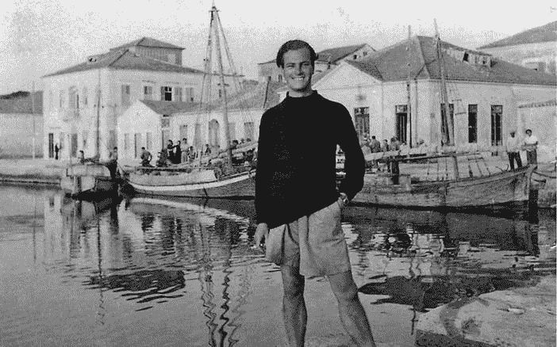
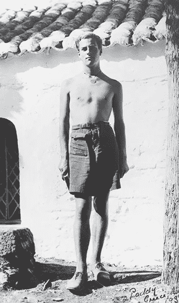
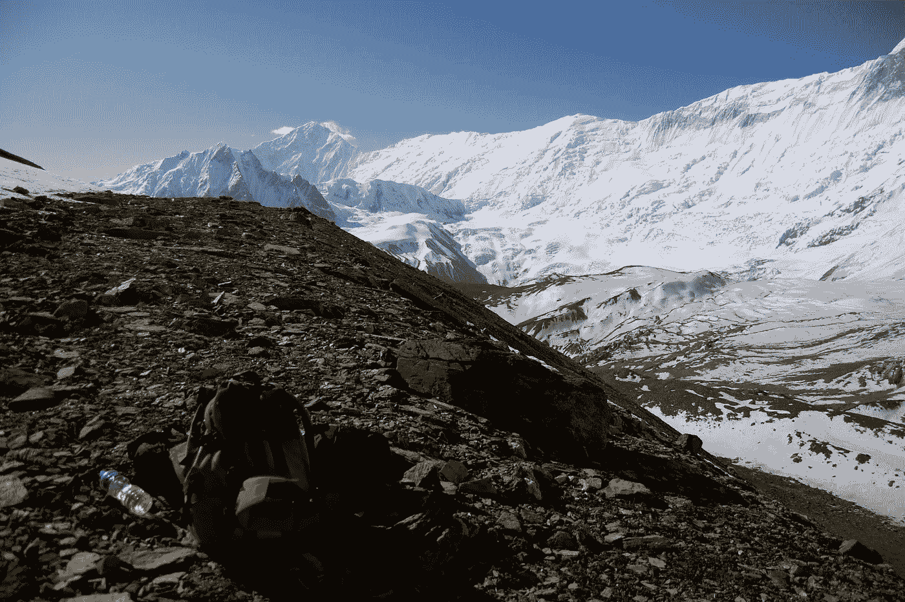

# 遗失的鲁莽旅行艺术

> 原文：<https://medium.com/swlh/the-lost-art-of-reckless-travel-99abda21cdfe>

Patrick Leigh Fermor in Greece, 1946\. Photo / NLS

1933 年，18 岁的帕特里克·利·弗莫尔面临着不确定的未来。他的学校生涯是丰富多彩的，但没有装饰。用他自己的话来说，他的野性“不适合最微弱的约束。”他的男同学崇拜他的滑稽动作，但他的老师却提出异议:在一份有先见之明的学校报告中，一位长期受苦的舍监将他描述为“世故和鲁莽的危险混合体”。这一切让他的父母绝望了。这个男孩究竟要做什么？求进入二流大学？申请桑德赫斯特参军？这两条老路似乎都不适合他的个性。

相反，朋友们称之为帕迪的利·弗莫尔抛弃了体面的选择，跳上了一艘开往欧洲大陆的荷兰轮船。旅行作家罗伯特·拜伦的朋友马克·奥吉尔维·格兰特给了他一个破旧的帆布背包——除了几件衣服、一双结实的靴子、一本英语诗集和他心爱的勒布版贺拉斯的《T2 颂》之外，他一无所有——利·弗莫尔开始了从荷兰钩到君士坦丁堡的陆路徒步旅行。这段旅程，后来被记录在*的《礼物的时代》中*，将带他穿越新崛起的希特勒统治下动荡不安的德国；沿着当时未驯服的多瑙河两岸；穿越分裂的奥匈帝国的旧地；深入巴尔干半岛的中心。(可悲的是，他一路上看到的许多东西——以及他遇到的许多人——将在五年后战争爆发后永远消失)。

PLF in Greece, 1935\. Photo / NLS

没有指南可以帮助他规划路线。古老的地图显示了一个城镇与另一个城镇的距离，乐于助人的村民为他指出了正确的方向，但利·弗莫尔主要依靠他的直觉和浪漫的想象力来指引他。他被一个叫人回味无穷的名字——波西米亚——从一个地方引诱到另一个地方。特兰西瓦尼亚！铁门！而且，通过让他的历史好奇心和文学爱好自由支配，他穿越了时间、思想和空间。他睡在干草堆和城堡里，和匈牙利贵族玩自行车马球，在遥远的喀尔巴阡山贮木场和正统犹太人兴奋地讨论《托拉》中的段落。一天晚上，他睡在河边的星空下，被两个警察粗暴地叫醒，他们以走私者的身份逮捕了他，然后在得知他只是一个误入歧途的学生后释放了他。黎明或黄昏时，他沿着乡间小路跋涉，唱着当时的流行歌曲和民歌，或者背诵拉丁诗歌。根据他自己的叙述:

> 。。。我边走边唱，只唤起宽容的微笑。但是诗句是不同的。公路上的窃窃私语引起了侧目和焦虑怜悯的目光。如果一个人被当场抓住，用手势说出的段落，有时声音很大，会引起惊恐的目光。。。。当这种情况发生时，我会试着咳嗽一声，或者把话语编织成不成调的嗡嗡声，并且把所有的手势都简化成整理头发的假动作。

利·弗莫尔在旅途中遇到的一切都带有浪漫主义色彩，无论是城镇、河流、森林还是同行者。他“在乌尔姆和奥格斯堡之间的路上”遇到的一个巡回扫烟囱的人似乎也沉醉于同样的旅行癖:

> 当(扫烟囱的)解释说他正向南去因斯布鲁克和布伦纳河，然后南下进入意大利时，他在桌上展开地图，手指着波尔扎诺、特伦托、阿迪杰河。。。当他说出这些光荣的名字时，他在空中挥了挥手，仿佛意大利就在我们周围。。。。又喝了一两杯杜松子酒，我们互相搀扶着担子，他出发去了蒂罗尔和罗马，去了柠檬树盛开的地方( *Dahin！当他在大雪中变得越来越虚弱时，他挥舞着他的大礼帽。我们都在风中呼喊着祝你好运。。。我拖着沉重的脚步，睫毛被雪花堵塞着，向巴伐利亚和君士坦丁堡走去。*

在我慕尼黑的宿舍里读了这段轶事后，我被利·弗莫尔的叙述精神所感染，做出了一个不切实际的决定，自己徒步穿越阿尔卑斯山。在从巴伐利亚南部的 Garmisch-Partenkirchen 出发之前，我买了一小瓶德国威士忌，没有别的原因，只是因为我喜欢在被布伦纳河不可避免的冷雨浸泡时用它“温暖自己”的想法。我在米滕瓦尔德的一个冬季两项运动员的家里避难，在因斯布鲁克遇到了一个伪 Conchita，然后跌跌撞撞地穿过 Matrei am Brenner，最后到达了意大利北部的 Vipiteno。

我的努力结果相当可笑。积雪仍然覆盖着山路，所以我不得不沿着公路走。在我的脑海中，我瞥见了罗马军团和第二次世界大战的军队移动(布伦纳作为一个主要的阿尔卑斯山口有着悠久的历史)；但事实上，申根时代的货运卡车车队从我身边呼啸而过，雨夹雪向我袭来，关心的 IT 工作者停下来让我搭车。有一次，在爬上一个由松树支撑的陡坡，离开了一条危险的铁轨后，我被困在一个空旷的采石场几个小时，最后才设法爬上铁丝网。自始至终，我都感激地想着利·弗莫尔——因为没有他的榜样，我永远也不会想到有这么多的乐趣。

Following the road to Mittenwald, Germany

我走过中世纪的城镇，和其他人一样经常盯着一个孤独的星球，但《礼物的时代》中讲述的壮丽旅程让我想知道今天的旅行者是否倾向于低估鲁莽。当然，不是每个人都想要同样的东西，把舒适和安逸放在危险之前是完全合理的。但是许多旅行者似乎渴望得到比他们现在拥有的更多的东西。我们大多数人都曾在某个时候感叹过“所有的寺庙都是一样的”；“这个海滩已经挤满了游客”；或者“我想要泰姬陵，但我得到的只有一千根自拍杆。”对于这群幻想破灭或心灰意冷的冒险者来说，还会有另一种旅行模式等待被重新发现吗？

人们常说互联网的兴起使世界变得更小，这在一定程度上是正确的。如果 Leigh Fermor 有一部 iPhone、一个 Instagram 账户和一个使用 Trip Advisor 的习惯，他冒险的刺激几乎肯定会减少。如果他使用谷歌地图，他可能会错过那些让他有如此多意外遭遇的错误转弯。如果他努力把[从遗愿清单上勾掉](http://www.newyorker.com/culture/cultural-comment/kicking-the-bucket-list)，他可能会在他的世界地图上遮蔽更多的国家——但是他旅行的基本目的将会丢失。科技方便出行；但这也许是一种矛盾。*旅行*这个词与*工作*有着共同的起源。这两个词都来自古法语 travailler(*travailler(*)——辛苦工作。没有挣扎，没有惊喜，我们可能只是在漫游吗？

Somewhere in Nepal, 2010

幸运的是,“世界正在缩小”的观点是一种幻觉，可以随意地被抛到一边。地球表面一如既往的广阔、多样和丰富多彩。为了避免平淡无奇，重新发现诗意，需要改变习惯和心态——远离“做越南”，回到有点鲁莽的状态。浪漫和鲁莽是冒险最丰富的装饰，甚至可以抵消全球化最温和的后果。