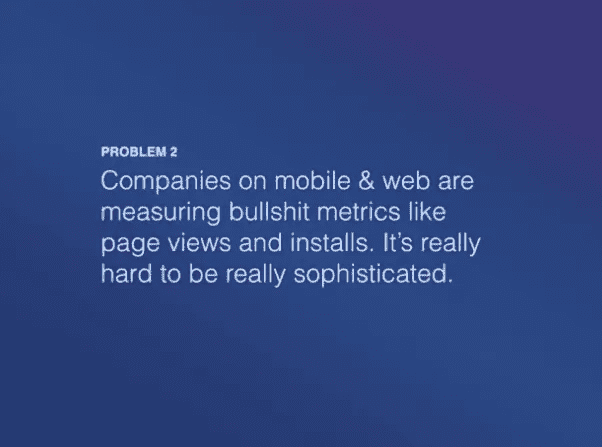
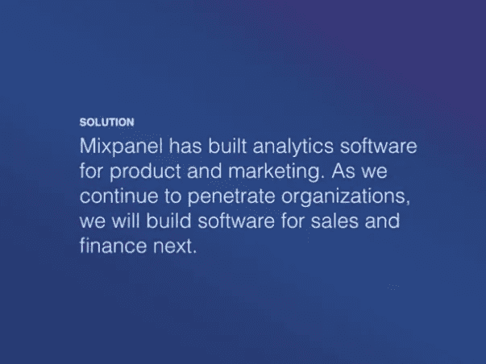

# 最终 VC 面板间距的内幕

> 原文：<https://medium.com/swlh/the-lowdown-on-the-final-vc-panel-pitch-2c404a0402c0>

信息时代和我们日益增长的分享经验的愿望使投资者/企业家的互动民主化。

一个简单的谷歌搜索就会带来来自经验丰富的风投和创始人的大量建议、见解和提示，涉及何时融资、如何找到合适的投资者、如何协商双方都同意的条款，当然还有如何推介。

尽管有这些信息，但仍然没有谈到的是最后的风险投资小组陈述——风险投资公司决定是否将投资意向书放在桌面上的最后时刻。

虽然不同风险投资公司之间的投资小组结构各不相同，但在 [Nauta Capital](https://www.nautacapital.com/) ，一旦我们的投资团队与创始人和团队进行了数月的会谈，进行了行业、市场和技术深度调查以及财务尽职调查，就到了邀请公司在团队面前展示的时候了。

对我们来说，不仅公司的合伙人，而且我们整个团队都要参加这些演示。此外，这是一次全公司范围的会议，任何与会者都可以提问。

不用说，对任何企业家来说，在一个小组面前展示两个小时都是令人头疼的事情，更不用说面对一个能左右你公司未来发展方向的观众了。

考虑到这一点，我们想分享一些区分初始推介和最终投资小组所需推介的关键因素，并分享一些创始人在最后阶段应该避免的常见陷阱。

# 球场甲板

作为一名创始人，一旦你知道你将要筹资，你就要准备一个推介台。投资者/创始人群体普遍认为，融资平台应包括以下几个部分:

1.  行动纲要
2.  问题
3.  解决办法
4.  市场机会
5.  竞争格局
6.  商业模式
7.  收入模型
8.  牵引/客户
9.  金融
10.  组
11.  该问

假设最初的资料引起了风投的注意，经过几个月的会议和充实想法，也许达到了新的里程碑，你最初的推介资料可能也会随之发生变化。

在 Nauta 的大多数情况下，创始人和主要风险投资人会紧张地工作，精简甲板的关键内容，同时为最终的投资小组引入重要的新分支。

虽然甲板的整体结构不会改变，但甲板内的某些部分将会发生重大变化。

这些通常是**问题、解决方案、财务、客户和竞争格局**。在最初的演示文稿中，这些部分可能只包含摘要，现在，在最终的演示文稿中，这些部分将会更加详细和引人注目。

事实上，这些部分现在应该回答或涵盖以下问题:

## 问题

问题的明确量化和定性性质及其在不同市场的重要性。

> 陷阱提示:试着联系你生意的起源故事来吸引注意力。

## 解决办法

向客户解释价值主张，不仅仅是产品是什么，而是如何帮助他们实现目标并解决他们的棘手问题。

> 陷阱提示:不要忘记在你的演示中建立问题和解决方案之间的自然联系，如下面的 Mixpanel 面板所示。

I’m a big fan of Mixpanel’s fundraising deck which helped them raise $65M ([see full deck here](https://www.slideshare.net/metrics1/mixpanel-our-pitch-deck-that-we-used-to-raise-65m?qid=44fc4515-8a6e-45ea-b458-3b76941597e9&v=&b=&from_search=1))

## 竞争格局

具体说明为什么贵公司的技术、流程、方法或模式优于您强调的竞争对手。

> 陷阱提示:如果你不能清楚地说明他们如何在上述所有领域与你的公司竞争(过去、现在和未来),不要只是将徽标添加到你的竞争矩阵中。

## 客户

包括 1-2 个核心客户的真实案例研究，以及你的服务/产品对他们的价值。

> 陷阱提示:不要忘记包括收入、购买成本、终身价值以及追加销售机会。

## 金融

这一部分不仅需要更加详细，而且需要更加透明。一些新的部分预计在这里看到包括:历史。现在和未来(预测)的财务状况、资本总额表、寻求的资金和收益的计划用途，以及您未来 18 个月的计划和/或您的退出策略。

> 陷阱提示:无论你认为自己会成为下一个独角兽还是下一个龙，都要准备好坚定地阐述你的愿景。

# 美学与交付

在这一点上，记住一个精心组织、精心设计且易于理解的演示文稿的影响也很重要。

如果你是一个不太注重美学、色彩协调或格式的创始人，那么让一名设计师或你团队中有设计眼光的人参与进来是值得的。

有些人可能认为筹款演示不应该是设计，但一个设计良好的演示，清晰易懂，讲述一个令人信服的故事，真的可以改变你的优势。

这不仅表明你在演示中投入了时间和精力，还表明你在思考你的品牌的视觉形象，以及你希望你未来的股东如何参与你的品牌。

另一方面，清晰流畅的演示将有助于你做一个引人入胜、易于理解的演示。

这让我想到了演讲的第二部分:**交付。**

我的意思是，企业家有能力用一句简单的话来表达他/她所做的事情的独特之处，从而获得“惊喜因素”。

即使是最复杂的技术命题也需要用通俗易懂的语言来解释。否则，你可能会让你的观众认为这个解决方案不是独一无二的，或者太复杂了，任何人都无法理解——包括你的潜在客户。

更重要的是，建立一个公司是一个团队的努力。如果创始人/首席执行官介绍了演示文稿中的某些部分，让你的首席技术官做产品演示幻灯片，或者让你的首席财务官介绍财务情况也是完全合理的。毕竟，这是一个展示你们作为一个团队合作得有多好的机会，也是向你的潜在投资者展示每个高级管理团队的核心专长的机会。

# 首字母缩略词驱动的指标

每个行业都有自己的行话和缩略语，风投行业也不例外。

除了投资者行业专用术语之外，大多数创始人可能并不真正需要这些术语，我们需要一些指标，企业家在演讲时需要记住这些指标。

在这一部分不深入讨论细节(让我们面对现实吧，这些指标值得一个完整的博客帖子)，下面是我们非常关注的一些数字的摘要:

*   MRR —每月经常性收入
*   ARR —年度经常性收入(MRR*12)
*   CAC——客户获取成本
*   LTV——客户的终身价值
*   SAM —可服务的可用市场
*   ARPA —每个账户的平均收入
*   流失率

当谈到这些指标时，一个创始人不仅应该知道这些数字，而且他应该能够自如地交流它们的过去、现在。以及未来的职位。

这些数字不仅展示了你当前的牵引力、增长、潜力和商业战略，而且它们也是可以显示公司资本效率或资本密集程度的单位经济学——这在 Nauta 投资一家公司的愿望中起着重要作用。

最后，值得一提的是，虽然最终的投资小组对创始人来说可能很紧张，但大多数繁重的工作都发生在几周甚至几个月的时间里，预期的内容在很大程度上取决于公司的阶段(后期种子期与首轮融资)。

**Ps** :我们**对资本效率高的创始人**情有独钟，所以如果你正在筹集资金或者知道一家 B2B 欧洲初创公司，我们应该和[谈谈，给我们打个招呼](https://www.nautacapital.com/)或者通过 [s](http://eepurl.com/c5Zuiz) 注册我们的时事通讯来保持联系👇🏼或者在 [Twitter](https://twitter.com/NautaCapital) 上与我们联系。

## 这篇文章发表在 [The Startup](https://medium.com/swlh) 上，这是 Medium 最大的创业刊物，拥有+ 374，685 读者。

## 在此订阅接收[我们的头条新闻](http://growthsupply.com/the-startup-newsletter/)。

