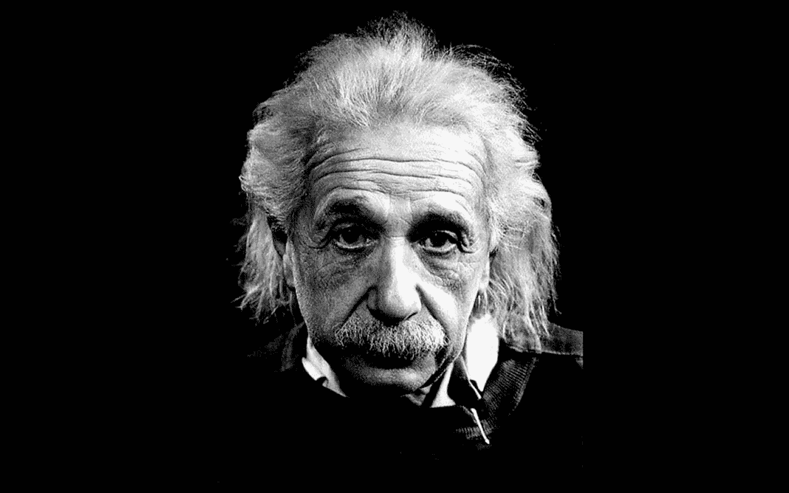

# 天才的疯狂

> 原文：<https://medium.com/swlh/the-madness-of-genius-7f8f4fc3fc1c>

“A question that sometimes drives me hazy: am I or are the others crazy?” Albert Einstein

## 和受折磨的灵魂

“这个地方(麻省理工学院)长期以来一直是“书呆子”的圣地——这些人沉迷于他们的研究，以至于知识成为一种生活方式。对我们大多数人来说，这些一心一意的年轻理想主义者似乎很怪异。事实上，他们是地球上最复杂、最不被理解的凡人。”[来源](http://www.astro.umd.edu/~avondale/extra/Humor/MIThumor/GeniusesAtWork.html)