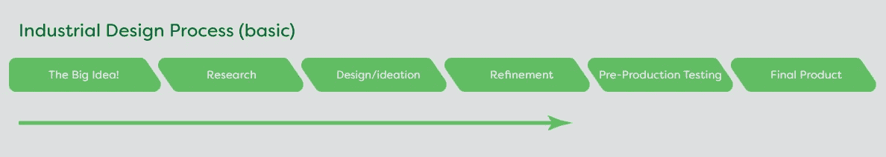
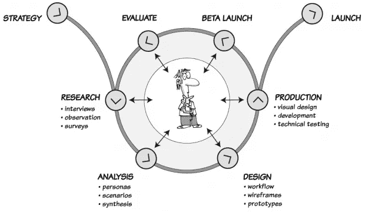
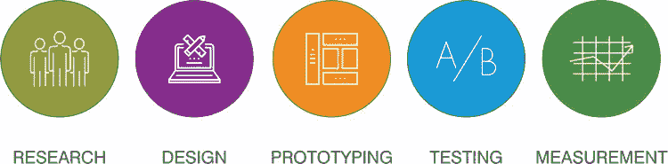
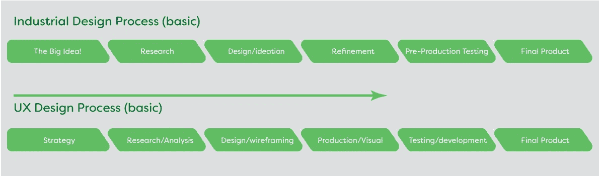
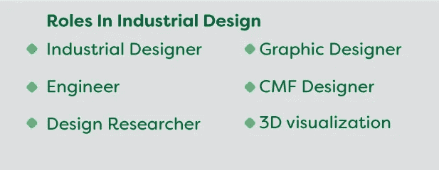
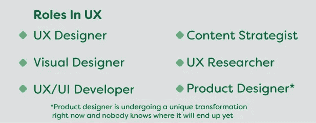
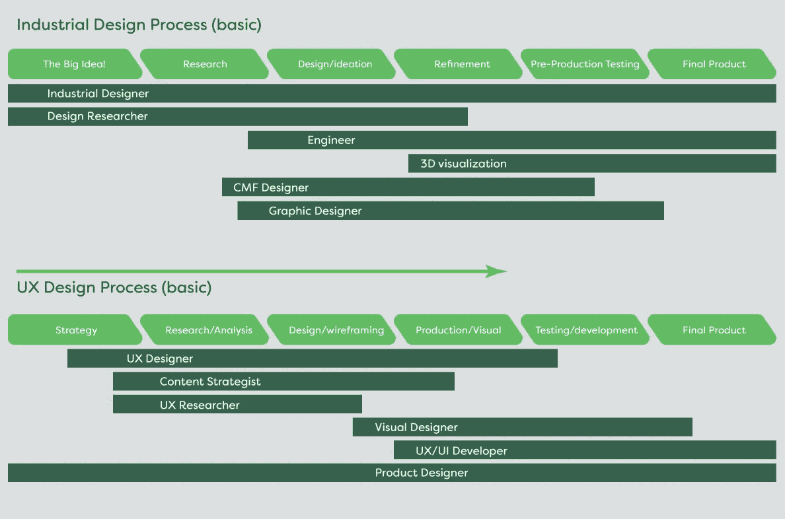

# UX 的众多角色

> 原文：<https://medium.com/swlh/the-many-roles-in-ux-6a9c6b7ab231>

工业设计师一直都是工业设计师。虽然工业设计师必须采用一些与其他职业相同的技能，如平面设计、3D 渲染可视化、3D cad、人工工程，当然还有草图绘制师/艺术家/插画师。有时候，这是一个更崇高的角色:宏观思考者，或者就像火炬手一样，在设计过程中保持设计意图。但它一直只是…工业设计师。如果是十年前，我会告诉你工业设计师和产品设计师是一回事，但随着潮流的转变，这也发生了变化。

UX 设计是另一回事。UX 设计师既是一个通用术语，也是一个特定术语，描述了整个流派，以及这个职位所需要的更具体的角色。有点像把一个真空吸尘器描述成一个胡佛，(一个[专有名称](https://en.wikipedia.org/wiki/Generic_trademark)，在英国最常用)但也知道一个胡佛是一个特定品牌的真空吸尘器。

我认为，解释在 UX 有哪些角色，而不包括所有这些角色所适用的过程，将是有害的。UX 设计是一个过程，很像工业设计，通常遵循以下路径:

In the real world, there will probably be about two to three revision cycles added

这个主题当然有几种变化，但这是它的主旨。

因此，让我们回顾一个基本的 UX 开发过程，看看是否有重叠。UXmastery.com 是这样描述的。

H/T to UXmastery for this illustration — Hope you don’t mind me borrowing this…

Usabilitygeek.com 是这样描述的:

H/T to Usabilitygeek — thank you also for this illustration

和工业设计一样，根据使用它的企业或个人的需求，它还有多种变化。那么 ID 和 UX 相比如何呢？

Not illustrated for simplicity: the amount of repeat cycles that can happen during development

如您所见，流程中肯定有重叠。然而，UX 设计的特色在于敏捷开发原则和精益创业的使用。在工业设计中还没有扎根的东西。在以后的另一篇文章中会有更多的介绍。

所以回到这个问题:UX 设计中有哪些角色？作为参考，我还创建了一个 ID 中最常见的角色列表。

3D viz specialists in ID are rare unless there is a focus on ultra-realistic renderings

The most commonly accepted names for these roles

这些头衔中的每一个在今天的就业市场上都至少有三个不同的名字。当你申请工作的时候，可能会很困惑！例如，UX 设计师也可以被称为:

*   体验设计师
*   交互设计师
*   信息架构师

关于头衔海洋的更多信息，[这篇文章](https://www.uxbeginner.com/how-to-navigate-the-ocean-of-ux-job-titles/)很好地解释了这一点。

上面的列表是可用角色的基本总结，但是当然还有共享角色，以及覆盖大多数基础的过度弧形位置。能做所有这些事情的人显然是独角兽。

但是这些角色如何以及在哪里应用呢？

这是我对当前形势的最好理解。当然，根据公司的规模，这些角色中的许多可以涵盖更大的范围，或者非常具体。我现在已经在几个工作列表上看到了产品设计师的头衔，据我所知，就角色覆盖范围而言，它甚至比 UX 设计师更高，是一个真正的多面手，但它不像其他角色那样定义明确。

随着流程的发现和比较，我们现在有希望看到上下文中的角色，所以让我们开始描述角色:

UX 研究员:你进行测试，收集数据，并以定性和定量的方式进行分析。这些数据用于发现“痛点”并帮助改进产品。

**内容战略家:**解读调研，你根据商业目标和用户需求开发内容。您可以通过创建分类法和元数据框架来做到这一点。你的重点是如何将所有的数据/研究整合在一起，创造有凝聚力的品牌体验。

**视觉设计师:**你关注的是体验看起来怎么样。按钮，图标，背景，都遵循你创建的设计指南，因此美学定义是正确的。颜色、字体和布局是主要关注点。这和平面设计师有很多相似之处。

UX/用户界面开发人员:这是代码出现的地方，以 HTML、CSS 和 javascript 的形式出现。你让这种体验变成了现实。非常类似于一个工程师在 ID 里做的事情。

**UX 设计师:**在这个角色中，你本质上是体验的架构师(这也是为什么另一个名字有时是信息架构师)。你的大部分精力都放在创建用户界面上，在视觉设计师润色之前，定义事情进展的方向和方式。

产品设计师:这个角色让你负责整个产品体验，关注整体功能，确保所有需求都得到满足。

这些都是快速总结，角色因公司而异。我创建了一个在我的研究中有用的链接列表。

总结一下(半信半疑地接受)。

**UX 研究员:*这是什么东西？***

**内容军师:** ***这就是这个东西应该说的***

**视觉设计师:*这是这个东西的样子***

**UX/UI 开发者:*这是这个东西将如何工作***

**UX 设计师:*这就是这个东西应该表现的样子***

**产品设计师:*这整个事情都需要工作***

我希望这有所帮助。我期待听到你的评论。

*以下是我在这篇文章中引用的链接:*

[*用户体验初学者指南*](https://usabilitygeek.com/ux-design-process-beginners-guide-user-experience/)

[*UX 进程*](https://uxmastery.com/resources/process/)

[*如何驾驭 UX 的海洋*](https://www.uxbeginner.com/how-to-navigate-the-ocean-of-ux-job-titles/)

[*普通 UX 设计流程的六个步骤*](https://blog.prototypr.io/a-common-product-ux-design-process-55af4ab5665e)

一个 UX 设计师实际上是做什么的？

## 这个故事发表在 [The Startup](https://medium.com/swlh) 上，这是 Medium 最大的企业家出版物，拥有 284，454+人。

## 在这里订阅接收[我们的头条新闻](http://growthsupply.com/the-startup-newsletter/)。

