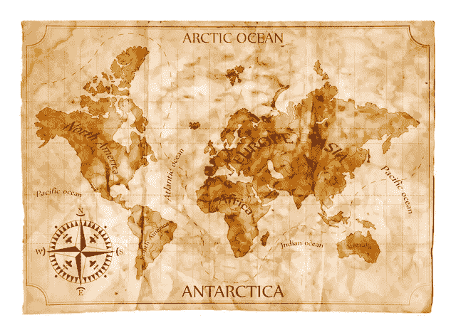

# 几乎每个公司都陷入了这种思维陷阱

> 原文：<https://medium.com/swlh/the-map-is-not-the-territory-c83505be942f>

给某人一张地图比给他一张错误的地图要好得多 —纳西姆·塔勒布

成功常常播下毁灭的种子。

为什么？

一个原因是人们在过时的“*地图*上做决定，他们没有看到变化的“*地形*

他们没有意识到游戏已经改变了。

让我解释一下。

我曾经为一家情报机构工作，这家机构是一个培养皿，用来观察各种组织——无论大小——是如何运作的。像其他人一样，随着我职位的上升，我希望获得 MBA 学位，这样我就可以“做出更好的决定”。

我去了学校，学习了所有关于财务报表、预算和仪表板的知识。我学会了计算哪些数字，以及如何计算和自动化它们。我可以对我一无所知但听起来很自信的业务制定策略。

理论上，我可以通过 excel 电子表格管理任何我想管理的公司，一眼就能迅速判断进展。我知道当事情朝着错误的方向发展时，我需要开始问问题。

我学到了很多关于司机的知识。”

总而言之两年的时间，我学会了如何对着说话的人说话，听起来好像我知道自己在做什么。

唯一的问题？我完全不知道。

(在我的第一学期意识到这一点，我停止做作业，创办了[法南街](https://www.farnamstreetblog.com/)，它已经成为世界上最受欢迎的博客之一。)

学校教了我"*地图*，"但是没有关于"*地形*"

我不得不出去走走(这就是我作为 [adventur.es](http://adventur.es/) 首席运营官正在做的事情)。

商学院，以及与此相关的许多管理理论，都是关于互相传递“地图”的，这就是为什么人们经常不了解业务中实际发生的事情。

# 地图与地形

1931 年，在路易斯安那州的新奥尔良，数学家阿尔弗雷德·科济布斯基发表了一篇关于数学语义学的论文。它不是给外行人的，但是，它包含了一个宝石。

在他关于语言结构的一系列论点中，Korzybski 引入并推广了地图不是领土的观点。

地图提炼现实，它们是必要的，但有缺陷。它们允许我们快速定位、交流、传递和应用信息。我们需要抽象。我们处理现实复杂性的唯一方法是进行归纳

**地图有两个基本问题**。我们无法理解它们的局限性，它们所基于的世界很容易发生变化，而且往往变化很快。

**1。即使是最好、最有用的地图也有局限性；**或者正如统计学家乔治·博克斯在 1976 年所说的那样*所有的模型都是错误的。*

Korzybski 为我们提供了一些探索:

(a .)地图可能*不正确*而我们没有意识到*；*

(b .)地图必然是实际事物的*缩减*，在这个过程中你会丢失某些重要信息；和

(c .)一张地图需要*解释*，这个过程可能会导致重大错误。真正解决最后一个问题的唯一方法是一个无止境的地图链，一个他称之为自反性的无限回归的陷阱。

The Treachery of Images: Rene Magritte

雷内·玛格利特通过他 1929 年的作品《图像的背叛》阐明了表象的易错性。这不是烟斗。这是一个管子的图片。

**2。世界是动态的。而且大部分时间都在快速变化。地图在更新之前是静态的，这需要重新评估和努力。没有什么比根据过时的地图做出决定更危险的了。**

我们如此依赖抽象，以至于我们经常使用不正确的模型，仅仅是因为我们觉得任何模型都比没有模型更好。(提醒其中一个醉汉在路灯下找钥匙，因为“灯就在那里！”).手里拿着地图可能会让人产生虚假的安心感。

再者，知道事物的描述，并不是知道事物本身。所以给某人一张地图并不等同于他们了解地形。

我心目中的英雄之一理查德·费曼凭直觉抓住了这一点。正如他所指出的，知道一件事的名字并不意味着你了解它。

财务报表是地图。

战略计划就是地图。

仪表板是地图。)

你基于地图经营企业的时间越长，你就越有可能脱离现实。记住，地图是抽象的现实，从定义上来说，它消除了细节，但不一定反映变化。

有趣的是，创始人经常接触他们业务的“地形”,因为他们生活在那里，呼吸着它。继任者更容易陷入困境，因为他们只是拿到了地图。

# 需要思考的问题…

您在业务中的什么地方使用地图？在你的人际关系中？你怎么得到它们的？地形变了吗？是时候重新评估和重新绘制图表，以更好地把握潜在的现实了吗？

如果你有兴趣学习更多关于地图和地形的知识，试试看。”

*如果你想工作得更聪明而不是更努力，我推荐订阅* [*大脑食物快讯*](https://www.farnamstreetblog.com/newsletter/) *。*

*可以跟着谢恩上* [*推特*](https://twitter.com/farnamstreet) *和* [*脸书*](https://www.facebook.com/FarnamStreet/) *。*