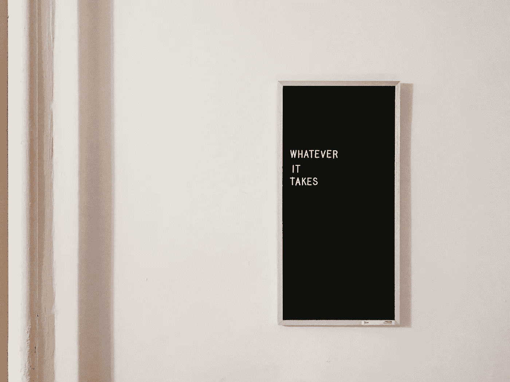

# 真正有才华的人和平庸的人之间的差距

> 原文：<https://medium.com/swlh/the-margin-between-the-truly-talented-those-who-thrive-in-mediocrity-c8ad6d0a82be>

Photo courtesy: [Unsplash](https://medium.com/u/2053395ac335?source=post_page-----c8ad6d0a82be--------------------------------)

## 每位成功员工做和不做的 5 件事

如果说我从这么长时间的游戏中学到了什么的话，那就是很少有人努力追求对他们来说重要的东西，而有很多人却在平庸中安于现状。

> 随着时间的推移，我记下了我的员工中非常出色的员工和不太明白的员工。

**这不是一篇向你展示“成为世界上最好的员工的 10 种方法”的文章，因为我不相信那些不会真正改善任何人生活的低劣点击诱饵文章。还有其他方法来产生印象。**

但是我确实认为有 5 个简单的“该做”和“不该做”的事情，任何规模的工作场所的每个员工都应该考虑。

以我的经验来看，正是这种人将他或她自己与群体中的其他人区分开来。他们继续做着令人惊奇的事情，但是每个人都有起点。

# 说够了，这里有 5 件事是每个员工都应该做的，这样才能成功爬上阶梯，为自己创造机会…

## 1.)做电灯开关

作为一名新员工或老员工，你能做的最简单的事情之一就是成为你团队的电灯开关。

**这是什么意思？**

做一个早上开灯的人，一天结束时关灯的人。太多的人担心从 9 点到 5 点出现，这样他们就可以回家看完《无耻之徒》在网飞的第五季。

如果你的老板/导师，或者你在本赛季的学习对象还在办公室，你最好也在那里。这可能是你唯一的一对一时间，因为他们整天都在开会。利用你拥有的时间向那些比你更有经验的人学习。这只会帮助你推进你的事业。

## 2.)铃响的时候别理它

偏离我刚才说的…

如果在下午 4 点 45 分，你正坐在那里摆弄着你的大拇指，打包好你的行李，眼睛盯着挂钟，那么我们就有麻烦了。对你所做的事情充满激情，以至于时间对你来说已经不重要了。你的老板会注意到你每多呆一个小时，把自己的时间延长一点。

顺便说一句，当你经常在下午 5 点准时离开时，千万不要抱怨有太多事情要做。事情不是这样的。

## 3.)永远要学习

教育不是从你报班开始的，也不是到你毕业就结束的。世界上最聪明的人并不是因为。

他们不断地消费新的信息，完全迷恋周围的世界。

**根据布莱恩·特雷西的说法，**

> 如果你每个月只看一本书，那你将成为我们社会中收入最高的 1%的人。但是如果你每周读一本书，每年读 50 本书，那你将会成为你所在领域中受教育程度最高、最聪明、最有能力、收入最高的人之一。经常阅读会彻底改变你的生活。

我希望我的员工渴望阅读。事实上，拿起一本书并没有负面影响。

## 4.)练习你的手艺

我们只有通过行动才能变得更好。练习，练习，练习。

你的工艺品永远不应该留在办公室。带着它。做一个激情项目。当没有面对客户的后果时，在你的空闲时间进行实验。

每周五，我**“随意地”问我的员工和同事周末有什么计划。世界上最好的答案是当我的设计师告诉我他们最终实现的个人项目。这就是为什么我知道我的团队里有合适的人。**

## **5.不要只是一个乐观主义者**

**我们能不能不要再问杯子是半空还是半满了？**

**那不应该是你所关心的。你唯一应该担心的是你今天如何给别人倒满水**。****

**作为一名员工，或者一般来说，你的愿望应该是让别人充实起来。为别人做些事情，努力不只是为自己着想。你变得更加平易近人，建立了更好的关系，生活以一种有趣的方式回馈我们，我们给予了别人什么。如果我们什么都不付出，你大概能猜到我们会得到什么回报。**

****

# **请原谅我。我们已经完成一半了。这是你在寻求成功时绝对不应该做的 5 件事。**

## **1.)不要准时**

**我非常尊敬的前同事罗尼·塞奇曾经对我说:**

> **“如果你准时，你就迟到了。”— [**罗尼贤者**](https://www.linkedin.com/in/ronnysage/)**

**对我们大多数人来说，这没有太多意义，感觉就像你 65 岁的爷爷会一遍又一遍地说的话，没有任何韵律或理由。**

**但是罗尼想的是一个更大的图景。罗尼告诉我，及时性更多的是关于你的性格和你向客户展示你知道如何管理自己的能力，以及你掌控一切的能力。**

**在截止日期前一周交下一个项目，要知道这些都是创造良好工作关系的小事。**

## **2.)停止寻找答案，开始问更好的问题**

**许多人会问一个答案，而不是问一个逻辑上允许他们提出解决方案的问题。**

**事实是，通常情况下，没有一个正确的答案。当员工问我答案时，我感到沮丧，因为他们认为答案只有一个，而我真的希望他们能提出一个出乎意料的解决方案，甚至让我感到惊讶！**

**这些是改变世界的思想家。而且相信我，你想成为职场上的这种人。**

## **3.)不要指望在电脑前呆上 8 个小时后，创造力和创新就会开花结果**

**你必须走出去，看看你周围的世界。让自己接触新事物。去旅行吧。俯冲。吃异国风味的冰淇淋。做一些不正常的事情。**

**世界上许多创新的领导者都提到，他们的突破时刻发生在偶然发现的时候。当我们真的需要有一个新鲜的世界体验来以不同的方式思考时，我们有时会非常努力地“让”一些事情发生。**

**带着零期望在公园里散步。你永远不知道会发生什么。**

## **4.)不要学着跟随。学会领导。**

****我首先要说的是:****

**如果你不在一个有导师或者可以让你不断学习的人的工作场所。离开那里。尤其是如果你是一个 20 多岁、几乎没有经验的人。**

**如果你有一个导师，做一个**海绵**。问问你的导师他们白天吃什么，或者睡前做什么，或者他们目前在读什么书。**

**如果他们有任何程度的成功，我可以保证他们有一套解决日常问题的方法。是小事让人们变得伟大。**

## **5.)**不要被办公室政治或者那些流言蜚语和抱怨所困扰****

**这很简单。办公室政治和流言蜚语是癌症。这不会让任何人成为更好的人，而是他们在办公室外处理事情的更深层次的反映。**

> **你生活的质量是你思想的总和。**

**我们真的相信有些人真的很幸运，而有些人只是运气不好吗？**

**还是那些运气好的人能充分利用每一个环境？**

**运气“不好”的人会想办法抱怨发生的每一件小事。**

# **让我以此结束…**

**当然，在工作场所，还有许多其他事情可以让我们变得更好或更差。**

**但是如果你还没有开始思考如何变得更好…**

**从这里开始。**

**现在就开始。**

**罗恩·吉博瑞是芝加哥一家广告公司的创意总监，该公司专注于颠覆性创意和数字营销。**

**

FOLLOW ON QUORA** **

FOLLOW ON LINKEDIN** **

FOLLOW ON INSTAGRAM** **

FOLLOW ON TWITTER**