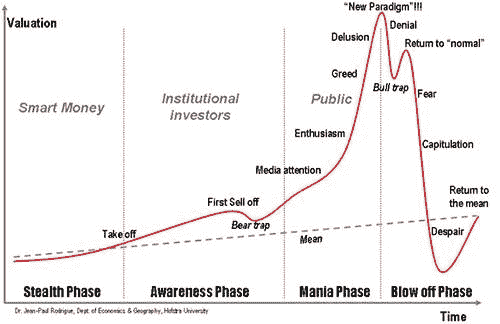

# ICO 的市场周期

> 原文：<https://medium.com/swlh/the-market-cycle-of-an-ico-4ec4d38a430>

Source: [proventureproperty.com](http://www.proventureproperty.com/property-cycles/)

我对 ico 的市场周期做了一个简单的解释，因为他们也经历了这个过程。我相信这对于思考你未来的总体加密投资是很有趣的。让我知道你的想法。信息由这个牛逼的家伙提供:[密码交易扯淡的家伙](https://twitter.com/Inkvizicija)。

*让我们想象一枚全新的硬币，为了便于参考，给它起个代号(****【BNC****)。假设 BNC 是一种新的区块链货币，拥有超私人的、闪电般快速的交易、不断增长的社区和一个小而活跃且有能力的开发者群体。*

## **阶段 0**

在一些超级黑幕交易所(姑且称之为 Yobit)交易后，BNC 在 Kucoin 上市。

## 第一阶段

关于 BNC 的消息在/r/cryptocurrency、Bitcointalk、/biz/等网站上流传。寻找好的小盘项目的早期投资者注意到这是一个远低于 2000 万美元市值的有前途的项目，并开始购买硬币。

## 第二阶段

一些使用技术分析的交易者注意到 BNC 的交易量增长了很多，并且发现其他指标也很乐观，所以他们开始买入。

## 第 3 阶段

现在硬币因为各种错误的原因被哄抬，人们开始谈论它的收益。FOMO 机器开启，大量贪婪涌入系统。现在，每个人都在购买(想想 XRB)。

Source: [tenor.com](https://tenor.com/search/fomo-gifs)

## 第四阶段

在牛市的最后也是最重要的阶段，最愚蠢的市场参与者跳上了火车。在 Kucoin 上市后，这个硬币已经增长了 20 倍，论坛上充斥着从 BNC 到月球的迷因。基于它过去的表现和抛物线轨迹，新手们相信这是一笔不错的投资(“这枚硬币永远不会下跌，我会持有它五年，直到我最初的五美元投资增长到五百万！”)

但是精明的投资者(早期投资者和交易者)已经知道一件事——市场严重超买，没有增长空间。这是一种好硬币，但距离大规模采用还有数年时间(比特币也是如此)，既然价格必须下降变得越来越明显，为什么不以低得多的价格购买更多呢？他们开始销售。

> 他们开始销售。

## 第五阶段

当然，他们不能一次卖掉所有的股份，否则他们会把价格降下来，所以他们只把一部分股份卖给 FOMO 大众。

## 第六阶段

价格下降了一点，但宣传力度很大，许多愚蠢的 FOMOs 认为这是一个很好的机会(他们听到了购买下跌的地方)。

## 第七阶段

价格上涨了一点，但仍低于 ATH，精明的投资者知道这意味着什么，他们卖得更多。自硬币抛物线轨迹被打破以来，FOMO 人气正慢慢转向 FUD。因此，越来越少的人购买下跌，价格反弹了一点点，然后进一步下跌。

## 第八阶段

然而，聪明的家伙知道，仍有一些果汁要从这枚硬币中吸出来(他们仍然没有完全卸下袋子，所以他们不希望价格下跌太快)，所以他们购买更多，价格再次回升一点。

## 第九阶段

但市场现在处于明显的熊市模式，所以聪明的家伙利用价格小幅上涨尽可能多地抛售。现在，价格行为正在画长长的红蜡烛，市场处于全面恐慌状态。每个人都试图尽快离开，论坛上尖叫着说 BNC 是个骗局，是个大骗子。

## 第十阶段

聪明的人注意到市场严重超卖，价格离他们最初的进场价格不远，所以他们再次买入。因此新的循环开始了。

> 因此新的循环开始了。

感谢 [Maca_Najeznica](https://www.reddit.com/r/CryptoCurrency/comments/7t3szh/the_market_cycle/) 允许我重新发布这篇文章。
关注他的[推特](https://twitter.com/Inkvizicija)获取更多酷炫的加密更新。

## 这个故事发表在 [The Startup](https://medium.com/swlh) 上，这是 Medium 最大的创业刊物，有 318，583+人关注。

## 在这里订阅接收[我们的头条新闻](http://growthsupply.com/the-startup-newsletter/)。

