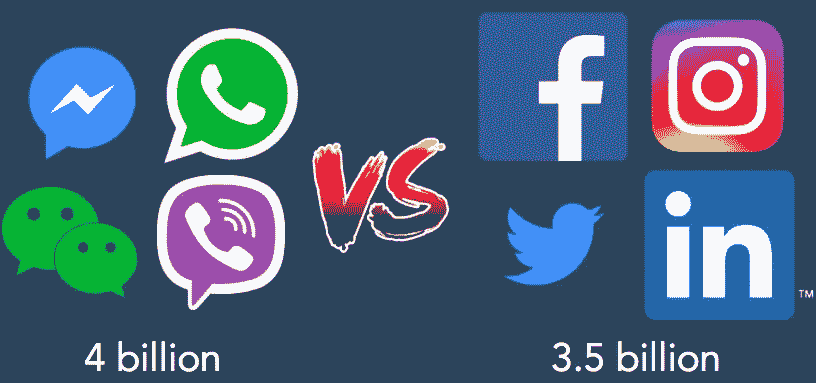

# 聊天机器人营销指南

> 原文：<https://medium.com/swlh/the-marketers-guide-to-chatbots-a37f48232c5>

## 用例、潜在陷阱+实施技巧

有一句非洲谚语说:“当音乐改变时，舞蹈也跟着改变”。

它说明了一些关键的学习:倾听节拍的重要性，然后适应我们前进的方向，随波逐流。

这也代表了当今消费者参与在线互动方式的转变——企业需要认真倾听，这样才能最好地改变他们的方法，跟上节奏。

# 消费者的行为和期望发生了翻天覆地的变化。

消费者满足于传统在线体验的日子已经一去不复返了。

最近的一项行业研究“2018 年聊天机器人状况报告”强调了网站用户的普遍不满:

> …网站难以导航(34%)，用户无法获得简单问题的答案(31%)，并且很难找到公司的基本信息(28%)。

此外，用户现在花在消息应用上的时间比花在社交媒体上的时间还多。

2015 年，四大消息应用[的全球月活跃用户数量超过了四大社交媒体网络，并且这些数字还在继续增长。](http://www.businessinsider.com/the-messaging-app-report-2015-11/?IR=T)

随着消息应用程序的活跃性增加，这为[聊天机器人](https://www.hubspot.com/stories/chatbot-marketing-future)促进[使用消息应用程序](https://blog.growthbot.org/why-chat-should-be-part-of-your-b2b-or-b2c-marketing-strategy)创造了更大的机会。

在当今这个随需应变的实时世界中，用户寻求即时性。

他们希望信息能够迅速传递，或者行动和购买能够在几步之内完成——如果他们的期望没有得到满足，他们很容易转向提供更好体验的竞争对手。

# 这就是聊天机器人发挥作用的地方。

让我们从定义聊天机器人开始:简单地说，机器人是一个自动执行任务的计算机程序，通过文本或听觉方法进行对话。

机器人通常分为两大类:**基于规则的机器人**和**智能机器人**。前者的功能与规则无关，并响应特定的评论。

这些机器人无法处理更复杂的情况，在这种情况下，对话模式与训练机器人的规则不同。

在 **中，相比之下，后者由人工智能(AI)** 驱动，这使它能够处理更复杂的命令，接受更广泛的用户输入，提供个性化的响应，并通过从与人的对话中学习变得更聪明。

虽然聊天机器人一再被视为炒作，但最近的市场趋势和统计数据表明情况并非如此:

*   大观研究[报告](http://markets.businessinsider.com/news/stocks/chatbot-market-size-to-reach-1-25-billion-by-2025-cagr-24-3-grand-view-research-inc-1002381903)称**全球聊天机器人市场预计到 2025 年将达到 12.3 亿美元。**
*   甲骨文对法国、荷兰、南非和英国的首席营销官、首席战略官、高级营销人员和高级管理人员进行了一项调查，大多数(80%)受访者表示他们已经使用聊天机器人或计划到 2020 年实施聊天机器人。

## 营销人员的使用案例和示例

大大小小的企业都利用聊天机器人来提高客户参与度、降低成本和提高效率。从内容交付到销售线索确认，以下是您可以考虑探索的五个使用案例:

# 1.提供卓越的客户服务体验

为了在竞争中脱颖而出，企业不能提供低于卓越的客户服务体验。

这意味着响应和解决方案需要快速、准确、个性化，提供多渠道互动，并允许消费者拥有更大程度的控制权(例如通过自助服务解决方案)。

这听起来有点拗口——但是聊天机器人可以帮助支持团队应对不断增长的需求。

荷兰皇家航空公司的情况就是如此，该公司推出了人工智能驱动的跨平台服务机器人 BlueBot，为 250 人的客户服务团队提供支持，每周处理超过 16，000 起查询。

有趣的是，BlueBot 的产品超越了客户支持的初始阶段——聊天机器人通常被部署在那里——而是在整个客户旅程中提供价值。

除了接收登机提醒和航班状态更新以进行航班预订，荷航的客户还可以依靠 BlueBot 获得便捷和定制的打包提示。

根据用户的目的地、他们的旅行持续时间和他们选择的目的地的当地天气，该机器人通过智能交互式语音驱动的装箱单提供帮助。

# 2.简化营销运作

当你有合适的聊天机器人支持时，进行竞争对手研究、发现最新的内容趋势和挖掘目标联系人的信息可以轻而易举。

机器人正在改变我们搜索的方式，而不是必须手动研究和从各种网站获取信息，你只需问一个问题，就可以获得一大堆信息。

以 [GrowthBot](http://www.growthbot.org/) 为例。这个机器人会立即显示你的问题的答案，这些问题可能是“moz.com 有多少流量？”到“freshdesk.com 为哪些有机关键词排名？”

除了提供一般问题的答案，GrowthBot 的其他营销用例包括收集比较见解，检查员工人数和 Alexa 排名等统计数据，以及识别潜在客户。

# 3.充当内容交付渠道

在铺天盖地的内容海洋中，观众越来越被精心策划和定制的内容和体验所吸引。

[有了聊天机器人，营销人员能够以个性化的方式提供内容](https://blog.growthbot.org/8-strategies-to-embrace-the-future-of-content-marketing)，并创造真实、吸引人的信息互动，让用户感到受到重视。

关键在于创造一种对话式而非交易式的体验，以更自然的方式吸引用户。

Food Network 的聊天机器人就是一个很好的例子:通过聊天机器人，用户可以以不同的方式询问食谱——通过输入配料、饭菜类型、厨师或烹饪节目。

但是这个机器人的功能不仅仅是一个食谱助手。从过去与用户的互动中，该团队发现，与机器人互动的用户并不总是寻找特定的食谱，而是希望获得更流畅的搜索体验，为他们的做饭过程提供想法。

因此，这些用户需求通过整合诸如“配餐”和“给我惊喜”等功能得到了满足，在这些功能中，用户可以收到围绕食物的娱乐性和启发性内容。

# 4.推动销售流程

InsideSales.com 进行的一项研究表明，在转化潜在客户时，提供实时响应会带来很大的不同。

研究表明，提交销售线索生成表和销售人员联系之间的时间间隔对销售线索是否转化为客户有直接影响。它指出:

> “如果在 5 分钟内接到电话，联系到销售线索的几率是 30 分钟内接到电话的几率的 100 倍。如果在 5 分钟内接到电话，那么确认销售线索的几率是 30 分钟的 21 倍。”

虽然这些见解围绕着电话联系，但它强调了一个适用于所有人的重要规则，不管你使用哪种渠道与客户联系:快速跟进是关键。

聊天机器人是企业提供实时响应的一个很好的方式，而不需要花费大量的人力成本。

像 [Hubspot 的聊天机器人构建器](https://www.hubspot.com/products/crm/chatbot-builder)或 Drift 的 [LeadBot](https://www.drift.com/leadbot/) 这样的工具可以被设置为以一种及时、低调的方式与潜在客户互动。

例如，只有当用户访问您网站上的特定页面，表现出他们在寻求额外信息时遇到问题的行为，或者当他们在您的网站上停留了一段时间时，该机器人才能启动。

# 5.推动高质量的销售线索

费尔德曼汽车集团(Feldman Automotive Group)成功地利用聊天机器人来推动销售线索，当时它推出了点击即时通讯广告来吸引脸书的观众。

目标受众通过定位(他们必须在费尔德曼汽车经销商 25 英里半径范围内)和聊天机器人互动(机器人提出了一系列问题，引导个人采取最合适的行动，如提交销售线索表或确认经销商的预约)来获得资格。

在测试这一策略的几个月内，该公司接触了超过 100，000 人，每月产生约 50 笔销售额。

他们还实现了 4.5%到 5%的点击率，这一数字明显高于汽车广告活动的标准。

# 练习注意:要避免的陷阱和实现技巧

## 不要赶时髦

营销人员有[抓住推动结果的趋势或新兴营销渠道](https://www.hubspot.com/stories/chatbot-marketing-future)的倾向——然后一直过多地利用它来消磨时间。

我们在聊天机器人技术上也面临类似的风险。

虽然行业调查——如 Retale [研究](http://www.adweek.com/digital/chat-bots-are-winning-over-social-media-users-report/)表明大多数千禧一代对聊天机器人有积极的体验——有助于了解聊天机器人的使用和受欢迎程度，但它们有时会描绘出一个片面的视角:品牌和营销人员最好实施聊天机器人，而且越快越好。

但情况并不总是如此，在您将聊天机器人应用于您的业务之前，退一步考虑以下问题可能会有所帮助:

*   你的营销活动中的其他元素是否支持聊天机器人的实施？
*   客户体验是否经过深思熟虑，是否有效？
*   实现聊天机器人的用例是什么？
*   聊天机器人是传递信息的最佳选择吗？

## 不要失去焦点

从小处着手是关键。与其[为整个品牌或多个目标](https://blog.growthbot.org/the-ultimate-chatbot-building-guide-for-non-technical-marketers)创造一个机器人，最好从专注于单一目的或活动开始。如果做得太多，你可能会让用户感到困惑，并获得很低的采用率。

这是 Sephora 在消息应用 Kik 上推出聊天机器人时采取的方法。该团队缩小了一个特定的目标:以一种自然且有教育意义的方式吸引少女。

丝芙兰从分享各种内容开始，比如按需访问教程和产品指南。

通过学习和实验，该品牌进而以新颖、意想不到的方式与目标受众建立联系——比如在 Kik 上举行抽奖和拍卖，以及创建推动用户实时互动的[活动](https://www.kik.com/casestudy/sephora/)。

## 当心过度自动化

机器人并不总是更好。特斯拉最近的生产停顿证明了这一点——马斯克[承认](https://www.cbsnews.com/news/elon-musk-tesla-model-3-problems-interview-today-2018-04-13/)在 Model 3 上一下子投入了“太多的新技术”，导致生产放缓。

对于聊天机器人，Intercom 的产品副总裁保罗·亚当斯[建议](https://blog.intercom.com/bots-versus-humans/)我们需要了解“它们相对于其他做事方式的优势和劣势”，并在“明显有限的双赢场景”中使用它们。

一个这样的场景是实施聊天机器人来处理重复性的客户关怀问题，这让支持团队有更多的带宽来处理复杂的查询或情况。

然而，亚当斯警告说，机器人并不是所有低级重复任务的最佳选择。事实上，有些情况下，机器人是错误的解决方案——例如可以通过使用表单或工作流轻松完成的任务——这些都是营销人员需要防范的情况。

他解释道:“人们盲目地将机器人应用于已经有更好解决方案的交互设计问题。人们只是在重新设计消息应用程序中可怕的逻辑树。”

## 持续优化是关键

请记住，实现聊天机器人不是一次性的过程。相反，正如客户体验自动化平台 Reply 的联合创始人克拉拉·德索托所说，这是一场长期的比赛。人工智能[解释道](https://venturebeat.com/2017/07/12/why-building-an-ai-company-should-not-remind-you-of-a-blind-date/):

> “在我们看来，你永远不会只是‘建造一个机器人’，而是启动一个‘对话策略’——一个根据用户实际互动方式不断进化和优化的策略。”

这是因为很大一部分工作将发生在启动你的聊天机器人之后。你的用户会以意想不到的方式互动，所以你需要不断优化和改进系统、用户体验和对话流程。

从制定你的成功标准开始，并确定你衡量这些标准的方法。每个用户的会话、每个用户的交互、混淆率、响应时间、对话步骤、目标完成率和满意率是通常测量的指标的例子。

但是不要只关注可量化的措施——寻找定性的反馈也同样重要。[根据机器人分析平台 Dashbot 的联合创始人 Dennis Yang 的说法，在增加和留住用户方面，征求反馈是超越其他策略的唯一策略。](https://venturebeat.com/2016/09/17/how-to-make-sure-people-keep-using-your-chatbot/)

这就是 GameMonk，一个为专业人士在工作日提供有趣休息的 Slack 机器人，如何不断推动用户参与。

在收集反馈的过程中，该团队了解到了两个他们原本不会发现的重要事实:他们的用户在问题之间感到匆忙，国际用户认为该机器人是以英语为中心的。

在针对这些评论做出改变后，团队发现会话长度增加了 24%，情绪增加了 23%。

# 营销人员的聊天工具和平台

如果你想在你的业务中采用聊天机器人，这里有一些工具和平台可以考虑:

*   ManyChat 是一个机器人平台，允许中小型企业通过 Facebook Messenger 进行交流、营销、销售和支持。对于没有编码技能的人来说，这是一个很好的选择，但是在定制编码的灵活性方面有一些限制。
*   [Bold360 ai](https://www.bold360.com/resources/articles/datasheets/bold360-ai-overview) 是一个聊天机器人和虚拟客户助理。其主要功能包括人工智能支持的代理辅助，自动处理重复的客户交互，以及智能的搜索和常见问题自助服务。它还提供了与 Salesforce 等业务系统的集成，使用户无需在各种应用程序之间切换。
*   [GrowthBot](https://www.growthbot.org/) :我已经提到了[营销人员如何使用 GrowthBot 进行竞争对手研究](https://blog.growthbot.org/how-to-make-competitive-intelligence-your-competitive-advantage)，搜索目标联系人，以及揭示内容趋势和上述统计数据。除了快速提供一般问题的答案，GrowthBot 还可以连接到你的 HubSpot 帐户(以及谷歌分析等其他工具)，以便你可以更快地通过机器人完成任务。
*   漂移:把漂移机器人想象成你网站的 24/7 虚拟助手。他们可以帮助实时捕捉和确认潜在客户，取消潜在客户的资格，并引导对话，以便网站访问者可以联系到合适的员工。
*   [Conversable](http://conversable.com/):Conversable 是一个 SaaS 平台，允许企业跨一系列平台设计、构建和分发人工智能增强的消息和语音体验，包括 Facebook Messenger、SMS、Google Home、Amazon Echo 等。它的目标是财富 500 强公司，所以它不适合中小型企业。

# 在消费者所在的地方与他们见面

消费者的期望和行为在不断变化，营销人员需要对这些变化保持敏感，并做出相应的调整。

机器人可以在许多方面改变游戏规则，只要它们在双赢的情况下使用，在这种情况下，利益和潜在的陷阱都得到了仔细考虑。