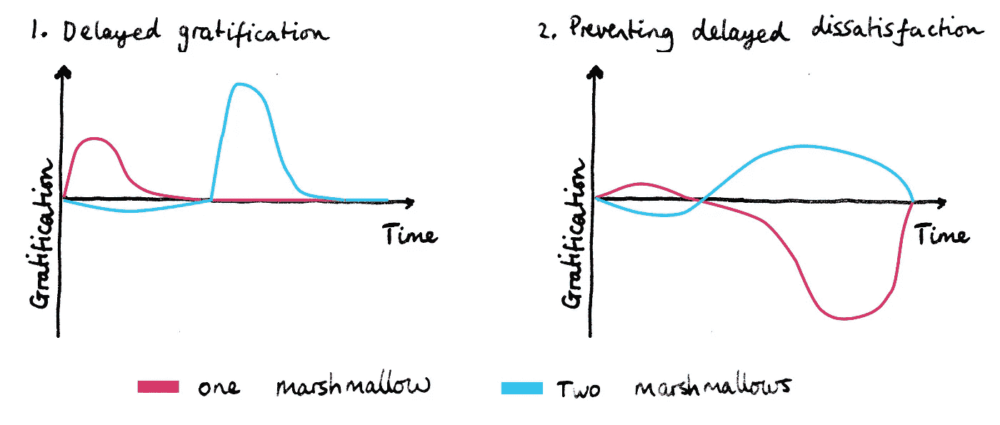

# 棉花糖法:提高生产率的新技术

> 原文：<https://medium.com/swlh/the-marshmallow-method-a-new-technique-to-increase-productivity-80bd085b9d95>

棉花糖时刻…我们每天都要面对成百上千个这样的时刻。在**棉花糖法的指导下，在这些时刻做出正确的决定**可以将你的生产力提升到一个全新的水平。

Marshmallow test

# 什么是棉花糖时刻？

20 世纪 60 年代和 70 年代，在斯坦福大学，一位名叫沃尔特·米歇尔的心理学家领导了一项名为[的棉花糖测试](https://en.wikipedia.org/wiki/Stanford_marshmallow_experiment)的实验。测试如下。

一个孩子被单独关在一个房间里。在孩子面前的盘子里，心理学家放了一个棉花糖。然后他对孩子说…

> “你可以现在就吃这个棉花糖……或者，如果你等 15 分钟，你可以吃两个棉花糖。”

…然后他离开了房间。

孩子们被单独留下来思考这个折磨人的测试，因为他们必须决定是立即接受款待还是推迟 15 分钟，在这一点上，他们将因为禁欲而接受双重款待。

# 延迟满足

这个实验测量了心理学家称之为**的延迟满足。**

几年后，对同样的孩子进行了进一步的研究。这些研究显示了延迟满足的能力与一些关键的人类指标之间的相关性，如智商、SAT 分数和身体质量指数。

但是这个测试不仅仅是针对孩子的，也不仅仅是针对棉花糖的。事实上，我们每天都要面对数百次变相的棉花糖测试。

它们通常是伪装的，因为尽管最初的棉花糖测试挑战了延迟满足的能力，但在日常生活中，我们面临的许多棉花糖测试挑战了我们防止延迟满足的能力。

The left-hand chart is the original marshmallow test. The right-hand chart is one where we are challenged to prevent delayed dissatisfaction.

但是两个图表的整体概念是一样的:现在就做一些事情，这可能不容易，因为你明白它的延迟收益。

# 棉花糖测试的剖析

我们可以把任何棉花糖测试分成三部分。

**一个棉花糖:**长期来看最糟糕，但现在却非常诱人的选择。

两个棉花糖:长远来看更好，但现在是遥远的现实的选择。

**棉花糖时刻:**考验你的时刻。

在每个棉花糖时刻，你总是有两个选择。

# 棉花糖时刻 1:闹钟响了

一个棉花糖:呃，我要把闹钟调小一点，我今天早上感觉好累。我应该再睡十分钟。

*一小时后……*

高峰时间的交通太糟糕了，我的脸在别人的腋窝里。

两个棉花糖:我要熬过这种早晨的可怕感觉，因为我知道，半个小时后，我将在一个空的电视上，阅读我的 Kindle，感觉在世界之巅。

*一小时后……*

我喜欢我能在 9 点前处理邮件的时候。

**棉花糖时刻:**你会起床吗？

# 棉花糖时刻 2:为新的一天做准备

一个棉花糖:我今天懒得做盒饭了。老实说，从昨天开始我甚至还没把我的脏特百惠从包里拿出来。我今天只买午餐…

*4 小时后……*

哇，我刚刚在午餐上花了 13 英镑。我不能再这样下去了！

**两个棉花糖:**我要洗一下我的特百惠保鲜盒，尽管它看起来还是有点发黄，但我要用一些生蔬菜和一些预先准备好的扁豆装满它，然后打开那个空管子！

*4 小时后* …

那既健康又美味，而且我今天午餐还没花一分钱！

**棉花糖时刻:**你会费心做那个盒饭吗？

# 棉花糖时刻 3:去商店

一个棉花糖:我要去商店买些食物。

*5 分钟后在商店…*

糟糕，我忘了我的包。

两个棉花糖:我要去商店买些食物，我永远也不能忘记我的包！

*5 分钟后在商店…*

我在拯救海龟，一次一个塑料袋。

**棉花糖时刻:**你会一辈子记得你的包包吗？

# 工作中的棉花糖时刻

创业，每天都有很多棉花糖时刻。吃一颗棉花糖很容易。技术债务、设计债务和 CRM 债务都只是棉花糖时刻错误选择的结果。

一个棉花糖:多么棒的会议。我会把她的名字记在我的笔记本上，然后把她加入我们的客户关系管理系统。实际上，你知道吗，我的笔记本在我的包里，我肯定我能记起她的名字。

一周后…

嗯，她叫什么来着？我给她发邮件了吗？我把她的名字写在哪里了…哦，我没有。

两个棉花糖:我要停下手头的工作，立即将她的详细信息添加到我们的客户关系管理系统中，因为，否则，这会导致严重的后果！

*一周后……*

啊，她在那里，在我们的客户关系管理系统的第三组。她正按计划通过销售漏斗。

**棉花糖时刻:**你会费心把她放进你的 CRM 系统吗？

类似的例子显然适用于设计债务和技术债务，事实上，大多数工作过程也是如此。

不仅仅是初创公司的创始人面临棉花糖时刻…

## 杰夫·贝索斯非常像两个棉花糖

亚马逊花了几年时间才首次盈利，因为杰夫·贝索斯认识到将所有利润再投资到新的研究领域的价值，从而延迟了满足感……但看看他现在！

# 没有人是纯粹的两个棉花糖或纯粹的一个棉花糖

在丹尼尔·卡内曼的名著 [*思快思慢*](https://en.wikipedia.org/wiki/Thinking,_Fast_and_Slow) 中，他谈到了我们的**体验自我**和我们的**回忆自我**。这两个不同的自我与棉花糖时刻的两个选项紧密联系在一起。

体验自我的**永远会选择当下最好的选择。我做这件事最快或最“懒”的方法是什么？我的身体现在在告诉我做什么？我们这一边总是会选一个棉花糖。**

****记得自己**考虑长远。正是记忆的自我，两个棉花糖，使新年的决心和周期进入工作。**

**我们都有这两个不同的自我，第一个追求即时的满足，第二个考虑更长远。**

# ****变得更像两个棉花糖了****

**那些声称自己是纯粹的棉花糖爱好者的人通常会付出很多努力，才能让自己获得那个受人尊敬的位置。**

**这是因为做一个纯粹的“双棉花糖”并不容易，也不自然。要成为其中一员，你必须有意识地努力分析你最糟糕和最频繁的棉花糖时刻。然后你必须想办法确保在这些时候你总是选择两个棉花糖。**

**对我来说，我用一种叫做**棉花糖法的技术来做这件事。****

# **棉花糖法**

1.  **写下你目前倾向于做的 5 件事，这些事会在以后给你带来麻烦。**
2.  **想想每一个人的确切的棉花糖时刻，你可以选择延迟满足或不满足的时刻(同样，防止延迟的不满足或不满足)。**
3.  **想想为什么你会在这些时候选择棉花糖。**
4.  **试着在你的棉花糖时刻和它们不想要的结果之间建立心理联系。这可以帮助你在未来面对这些时刻时做出更好的选择。**
5.  **根据这些心理联想，写下你可以做出的改变，以确保你不会一直吃那个棉花糖！这些是你的“棉花糖黑客”。**

# **棉花糖破解示例**

1.  **设置一个闹铃，喊着“*现在起床，因为 45 分钟后火车就满员了。”这将棉花糖时刻与不良后果联系在一起。***
2.  **在你的日历上放一个提醒，在周日晚上做一大锅扁豆，并注明“现在就做一些扁豆来节省一周的钱，它们不会花很长时间”**
3.  **把你的生活包放在你的手提包里，放在前门或冰箱旁，任何能在生活包和去商店之间建立必要的心理联系的地方。**
4.  **对于 CRM 系统的例子，我实际上不知道一个真正好的棉花糖黑客。我发现，即使有世界上最好的客户关系管理系统，你仍然不得不像两个棉花糖一样，强迫自己向系统输入数据。如果任何人知道一个好的棉花糖黑客来确保一切进入你的 CRM 系统，请在下面评论。**

# **最后……有时去寻求一些即时的满足！**

**真正高效的人会意识到棉花糖的重要时刻，也就是必须做出两个棉花糖选择的时刻。**

**但他们也认识到，在某些时刻，一点点即时的满足感不会太昂贵！**

***如果你喜欢这篇文章，请通过点击我的方式发送一些即时满足👏并与他人分享。***

***要阅读我的另一篇博客，请查看* [*长寿和幸福的秘密藏在爱因斯坦的相对论*](/swlh/the-secret-to-a-longer-and-happier-life-is-hidden-in-einsteins-theory-of-relativity-85bc2e07ce48) *。***

***也请查看我的公司*[*www.pilcro.com*](https://www.pilcro.com/?utm_source=medium&utm_medium=marshmallow&utm_campaign=awareness)*当你组织、分享和访问你的品牌资产时，你会发现自己不仅仅是两个棉花糖。***

****

## **这篇文章发表在 [The Startup](https://medium.com/swlh) 上，这是媒体最大的创业刊物，拥有 274，559 多名读者。**

## **在这里订阅接收[我们的头条新闻](http://growthsupply.com/the-startup-newsletter/)。**

****