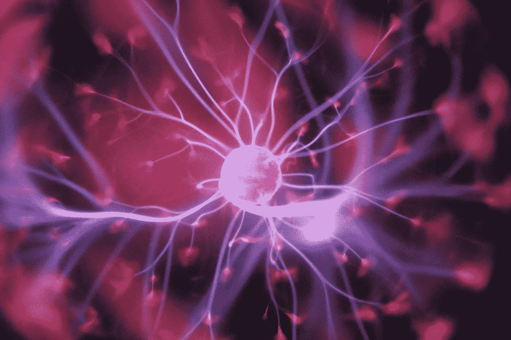

# 主算法

> 原文：<https://medium.com/swlh/the-master-algorithm-668162afda38>

Photo by [Hal Gatewood](https://unsplash.com/photos/OgvqXGL7XO4?utm_source=unsplash&utm_medium=referral&utm_content=creditCopyText) on [Unsplash](https://unsplash.com/search/photos/computer-science?utm_source=unsplash&utm_medium=referral&utm_content=creditCopyText)

统治他们所有人的算法！

这听起来绝对像是一个超级书呆子说的牵强附会的话。然而，学术界和工业界的许多人都在竞相寻找能够普遍解决许多许多问题的算法。这在很大程度上仍然是一个理论问题，如果你仔细思考，这个问题真的可以激发你的想象力。

我第一次听说“大师算法”这个新名词是在开车回家的路上，听着这个[播客](https://dataskeptic.com/blog/episodes/2018/the-master-algorithm)。有一整本书，关于它的几个讲座，所以很明显这个算法在机器学习社区和团队的头脑中。

以前的算法技术是用一步一步的指令来定义的。这个框架对于解决问题仍然很重要，因为我们自然喜欢将较大的问题分解成较小的子任务。然而，这个[下一个信息时代](/the-post-grad-survival-guide/hitchhikers-guide-to-the-galaxy-and-ai-9b2cb9ea86e0)是通过数据学习——计算机自己编程或者“自动化的自动化”

[在这里](https://www.youtube.com/watch?v=qIZ5PXLVZfo)，Pedro Domingos 博士谈论机器学习的圣杯——学习算法将能够做比现在可能做的更多的事情。

# 思想流派

教授介绍了算法学习的不同思想流派，我认为这些流派很吸引人。我将在这里强调一些。

进化论者认为，最合适的算法需要相互测试，以确定最优越的算法。此外，算法可以*共享*算法 DNA，其中不同代的代码传递关于什么可行什么不可行的学习——通过多样性模拟改进和新的问题解决策略。

还有一个阵营基于他们通过深度学习从神经科学中学习的假设。他们被称为“连接主义者”。这是学习在元水平上发生的地方，在那里“神经元一起放电，连接在一起。”这些人创造了反向传播，他们的技术被所有大型科技公司广泛用于搜索结果、广告、面部识别等应用。加强和削弱联系是这个游戏的名字。

另一类人喜欢通过类比来学习。他们沉迷于这样的想法，随着大量数据不断堆积，会有*和*成为与你正在研究的场景相似的场景。这些人希望通过回顾性数据的多样性来学习，这是一种拖延者的方法，但不要让这种方法欺骗你，让你认为它不那么有效。

# 算法收敛

此外，有一种想法是，也许主算法将是一个顶点或融合，使用所有当前的技术。机器学习的大统一理论——类似于物理学。貌似有理。

然而，我们也可能以错误的方式思考这个问题——也许我们需要跳出框框去寻找主算法。也许在某个国家的宿舍里会有一个孩子会想出办法。也许会有另一个黄金时代，所有合适的条件将结合起来创造出主算法。今天，我们拥有强大的计算能力和大量的数据，但也许还缺少一些东西。如果你愿意，可以说是秘制酱。

当我们奔向机器学习的统一理论时，必须始终理解我们工作的含义。在解决这些问题时，我们是否合乎道德？我们是否造成了需要减轻的下游影响？我们安全吗？一如既往，科技领域永远不会沉闷。

感谢阅读。

## 这篇文章发表在[《创业](https://medium.com/swlh)》上，这是 Medium 最大的创业刊物，有 312，043+人关注。

## 订阅接收[我们的头条新闻](http://growthsupply.com/the-startup-newsletter/)。

