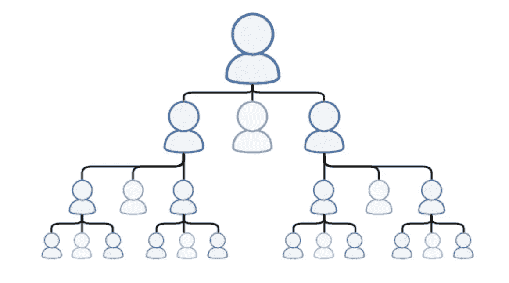
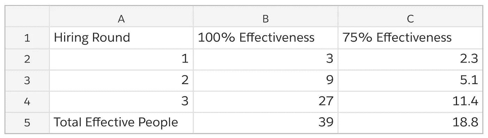
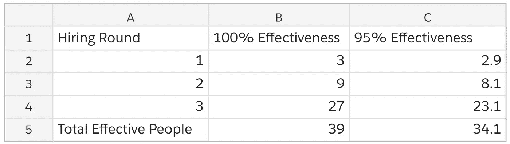
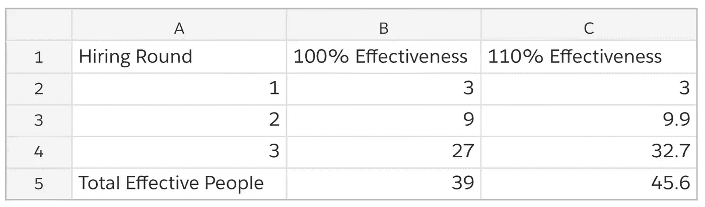
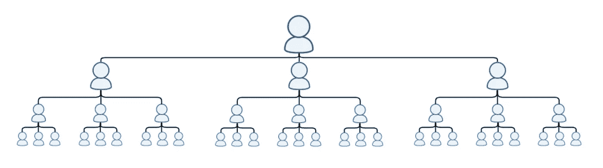

# 暗箭伤人的数学

> 原文：<https://medium.com/swlh/the-mathematics-of-backstabbing-a6298830d260>

## 销售摩擦如何悄无声息地扼杀你的公司

Photo Credit: Photo by [Manki Kim](https://unsplash.com/photos/BtHjHxh-D7I?utm_source=unsplash&utm_medium=referral&utm_content=creditCopyText) on [Unsplash](https://unsplash.com/search/photos/knife?utm_source=unsplash&utm_medium=referral&utm_content=creditCopyText)

非常糟糕的销售室也有同样的氛围——持续的紧张和敌意。每个人都在竞争，每个人都对自己的“队友”感到不安。

这是这些房间滋生的反常激励的作用。如果你积极地与周围的人争夺金钱、晋升、奖金，有时甚至是你的工作，你永远不能信任他们。在这些销售组织中，*“每个人都是一座孤岛。”*

这种紧张和敌意是销售组织的两大杀手:团队摩擦和异常行为的正常化。这两者是联系在一起的，无论是在一起还是分开，它们都会摧毁一个销售团队和一个公司。

# 暗箭伤人的数学

> *任何人的死亡都是对我的削弱，
> 因为我与人类息息相关*

约翰·多恩

你是销售主管。在[订单扩展](https://blog.heresy.io/prove-understand-scale-stack-overflows-3-phases-of-building-a-sales-team/)中，你雇佣了三名销售代表。然而，你是一名糟糕的销售领导，没有为团队的成功做好准备。你鼓励保密和暗箭伤人。你很幸运，只有三分之一的销售代表离开。

在你之后的每个雇员都知道你的坏方法，所以在他们之后被雇佣的每三个销售代表中就有一个也离开了。三代之后，你的团队是这样的:

你的团队有 15 个人。七个人已经退出了。这看起来不错。但是你忘记了反事实。*如果你不是那么坏，会发生什么？如果你留住所有员工，他们雇佣并留住他们的员工，你将拥有一个 40 人的团队。三分之一的流失率导致你的团队规模减少了 66%。*

在经济上，这在两个方面伤害了你:

1.  雇佣那些让你失望并辞职的人是要花钱的。[平均每次租用成本为 4，129 美元](https://www.shrm.org/about-shrm/press-room/press-releases/pages/human-capital-benchmarking-report.aspx)。浪费了 28903 美元。
2.  你有更少的人做这项工作。如果一个销售代表平均每月成交 20，000 美元，那么 15 个而不是 40 个销售代表每月将损失 500，000 美元。

因为你想建立一个糟糕的团队，你每个月会损失 50 多万美元。

这实际上是最好的情况。

# 销售团队中异常行为的正常化

1986 年 1 月 28 日，挑战者号航天飞机在飞行 73 秒后解体。船上的七名船员全部死亡。他们被杀是因为异常行为的正常化。

Space Shuttle Challenger Exploding Less Than 2 Minutes After Takeoff

社会学家黛安·沃恩在详述挑战者号任务的问题时创造了这个术语:

> *“偏离行为的社会正常化意味着组织内的人们变得如此习惯于偏离行为，以至于他们不认为这是偏离行为，尽管他们远远超出了自己的基本安全规则。”*

对于*号挑战者*号的灾难，在固体火箭助推器的 O 型圈的设计和测试中，一个又一个角落被砍掉。这些偏离正常程序的行为从来没有造成任何问题，直到有一天早上他们在地球上空 15 公里的地方。

直到最近，销售团队中的异常行为还普遍存在。上述问题——紧张、敌意、秘密、暗箭伤人——是正常化的异常行为。没有人会因此而死在你的销售室里，但你的公司会失败。

团队流失不仅仅是数字的问题。知识也同样重要。每个离开的人都失去了知识。这是一个失去的变得更好的机会。这意味着问题的化合物。不仅你未来的雇员不太可能留下来，他们也不太有才华。随着每一代人向下一代传授坏习惯，完成的好工作越来越少，更多的人离开。

暂时，让我们假设没有人离开，但每一代人都不想帮助下一代——他们将他们视为竞争对手而不是团队成员。他们教给他们粗略的知识，但不想分享他们成功的任何秘密。通过这种方式，每个新销售代表只学到了他们需要的 75%。这个问题始于你只教给你的雇员他们需要的 75%。

让我们看看结果如何:

如果你是完美的，你会有一个 40 人的团队(39 名雇员和你)。如果你有 75%的效率，你的总有效人数只有 19 人。注意两件事:

1.  在这个场景中，**没有人离开**。很简单，没有人愿意对他们的同事进行适当的培训，以至于你雇佣的团队做的工作还不到他们应该做的一半。
2.  **问题复合**。在第二轮中，75%的新员工接受了 75%的培训。在第三轮中，受过 75%培训的人对新员工进行了 75%的培训。随着每一代人的成长，这个问题越来越严重。

流失和糟糕的培训相结合，使得销售团队基本上不可能扩大规模。这一切都始于在你的销售室里对紧张、敌意和暗箭伤人感到高兴。

# 每个代表都是这块大陆的一部分

从销售中的个人重点转移到基于团队的心态是敏捷销售的核心组成部分。团队一起成功，一起失败。敌意、秘密和暗箭伤人是这样一个设置的诅咒。

当一个团队成员确实希望另一个成功，并努力提供帮助时，这将提高团队的整体效率。即使训练不是 100%完美，这也是对事件的个人主义版本的巨大改进:

通过 95%的有效培训，团队的有效总人数从 19 人上升到 34 人。仅仅通过帮助队友就多了 15 个人。但还可以更好。正在[分享知识的销售团队](https://blog.heresy.io/leveraging-the-wisdom-of-your-crowd/)具有紧急属性。他们不仅仅是个人，随着时间的推移，他们的知识和能力都在增长。因此，作为团队的一员，您可以拥有超过 100%的效率:

通过围绕协作和协作技术建立一个团队，你正在赢得人们而不是失去他们。来自运作良好的团队的近 7 名“免费”销售人员。

当然，你不会失去任何人。协作型团队是人们想加入的团队。你的“世代”图表变成这样:

人们留下来，并随着时间变得更好。团队作为一个整体随着时间的推移而提高。你可以扩展你的组织。您可以达成更多交易。

所有这些都来自于对客户流失是销售团队的杀手的理解。它不仅耗费了您的人力，还耗费了您的财务，以及您的扩展能力。要解决这个问题:

*   为您的团队提供协作工具。[单口相声](https://blog.heresy.io/the-meaningful-sales-standup/)分享知识；[燃尽图](https://blog.heresy.io/the-best-kept-secret-in-sales-management-the-burndown-chart-99b84b2990e9/)共享数据。
*   围绕知识共享构建你的成长。不要让销售代表与销售代表对立起来[建立你的销售规模](https://blog.heresy.io/prove-understand-scale-stack-overflows-3-phases-of-building-a-sales-team/)，这样，如果销售代表有动力，他们就可以不断地在你的组织中学习新的想法。
*   给人们需要的支持。如果你忙于销售，你就没有在帮助别人。销售领导的职能是激励、教导和授权他人。给你的团队时间。

做到这一点，你就能建立起相当于净负流失率的人:那些不会离开并随着时间推移而增长的人。

*原载于 2018 年 4 月 3 日* [*blog .异端. io*](https://blog.heresy.io/churn-is-the-silent-killer-of-your-sales-team/) *。*

## 这篇文章发表在 [The Startup](https://medium.com/swlh) 上，这是 Medium 最大的创业刊物，有 312，921+人关注。

## 在此订阅接收[我们的头条新闻](http://growthsupply.com/the-startup-newsletter/)。

