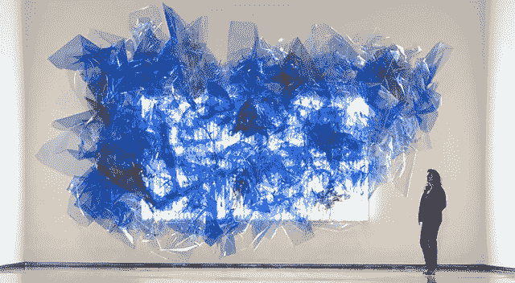

# 矩阵是存在

> 原文：<https://medium.com/swlh/the-matrix-is-presence-60f7b8346f44>

红色的抵抗药丸

矩阵实际上只是一个当下的隐喻。我想象在矩阵中的感觉和在他们所谓的“流动状态”中的感觉一样。

心流状态是指我们正在做的一切都开始变慢，而所有其他感觉感受器和输入都加速。我们的瞳孔扩大，我们的皮肤刺痛，我们的手指，眼睛和思想比光移动得更快，对手头的任务有着难以置信的专注和意识。你不能阻止它，你没有时间也没有控制去分析它，你只是跟着它走..越久越好。太不可思议了。作家、职业运动员、程序员和任何深入从事某项工作的人都会经历这种情况。

他们可能会去找它，但更多的时候，它会去找他们，当它找到他们时，他们就会介入。他们服用红色药丸，跨过任何阻力，进入不确定和不安全中，找到一个与众不同的地方。他们是其中的一部分，而不是试图操纵、控制和适应他们自己，他们与自己一起流动并成为其中的一部分。

“你吃了红色药丸，就呆在仙境里，我让你看看兔子洞有多深。”

我们的矩阵是一个通过我们的集体感知创造的世界，在不同文化之间传承了几个世纪。在这个世界里，任何被认为是可能的事情都有可能发生。这是一个我们努力想待下去的地方，但是仅仅对抗这样的抵抗只会破坏我们正在经历的互动和联系。一会儿就全没了。然后我们会想这是什么，我们做了什么，以及我们如何才能创造机会重返。

它总是在那里，总是可用的，我们只需要有耐心，接受自己是海洋的一部分，乘着海浪来来去去，不时地走进走出，这是必要的，也是足够的。那就是临在，那是耐心，那是觉知，那是流动，那是化学创造力，内啡肽和强度都融入了我们人类的潜力。介入，拿着红色药丸，跟着兔子洞走。

# 被催眠了…也许？

我们喜欢相信自由意志、自我控制和意识是我们生活的基石。我们做出合理的决定，将某种程度的理性与些许运气和努力结合在一起。听起来像是我看过和没看过的每部电影的故事情节。所以，我们快乐的小幻觉叫做生活。

我有另一个理论，它涉及到催眠。

催眠是一种意识状态的诱导，在这种状态中，一个人对暗示或指示有高度的反应。听起来很像爱、欲望和受任何让我们兴奋的事物的影响。简而言之，惊艳。

我还听说催眠被优雅地描述为……"当你被催眠时，就好像你觉得你可以，但你不会，所以你不能，你也不会。"

再来一次，但是慢一点:你觉得你可以…但是你不会…所以你不能…而且你没有。

这实际上听起来像是我没有或不能做的每一个决定。就像我两边的魔鬼争论过的每一个矛盾的想法一样。这听起来像是真正的爱情，真正的情欲，真正的生活。它令人困惑和不安全，但同时又乐观和满足。这听起来像是我小时候想象的从上面跳下、跑过、做过的事情，但实际上我从来没有做过。就像每一个疯狂的、高度非法的、不可能的梦一样，伴随着我的睡眠。

鉴于催眠与陶醉的享受和每天为理性思考而奋斗的相似性，那么未被催眠意味着什么呢？我们怎么会注意到它呢？嗯…

你可以但你不会，所以你不能也不会。

# 今天的垃圾想法

你只有一次生命。别浪费了。

一次机会

对陌生人来说:这一刻很可能是我们一生中唯一一次见面、产生影响/留下印象的机会，这种互动不仅仅是对“本来会怎样”的褪色或遗忘的记忆。我认为我们应该利用这个机会，即使只是出于好奇。不是吗？

你不能思考想法

思想出现，你不能想一个思想才想或者挑；因此，你是一个旁观者，在本质上曾经有意无意地。自制力是一种错觉。我们只是告诉自己，我们有能力去理解这个世界，去实现自己的目标。意识不是认知或智能决策。

遗传学和目的

基因操纵和创造很酷，进化和智能更酷，但通过个人联系、社会关系和好奇心引导的偶然时刻创造有目的和有意义的生活才是其他一切；这是最重要的。

混乱与平静

从进化的角度来看，在混乱之中，似乎存在着极端的秩序和因果关系。目的和意义似乎是我们的感知和叙述的一个功能，来源于社会关系、人际关系和好奇心。

保持饥饿，保持愚蠢

保持饥饿，保持愚蠢。一个物种或一个想法会上升到它的局部最佳机会或适合度。好奇、愚蠢和尝试随机性是超越那个地方的唯一途径。

## 这个故事发表在 [The Startup](https://medium.com/swlh) 上，这是 Medium 最大的创业刊物，有 291，182+人关注。

## 订阅接收[我们的头条](http://growthsupply.com/the-startup-newsletter/)。

