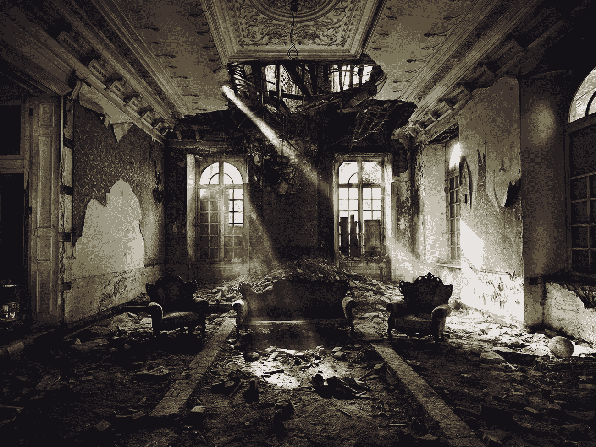

# 生命的意义在于牺牲。

> 原文：<https://medium.com/swlh/the-meaning-of-life-is-sacrifice-dbaf0d166330>

你在海滩上。日落和饮料。海浪的冲击是唯一打破寂静的东西。

就像你血管里的蜂蜜，出色完成工作的甜蜜感觉让你兴奋，也让你平静下来。你满意了。

说来话长，但你已经到了尽头。你可以享受成功后的宁静。你付出了一切，现在你在另一边。身边的人都心知肚明。

最后，你闭上眼睛…

这是一个好梦吗？你以前有过吗？我肯定你有。我当然有。但是生活不是这样。

*事物的消失是为了它们所创造的东西。当然，并不是每个人都适合。如果你只是做着你的工作，每天等着下班，梦想着从工作中解脱出来，那充满满足和快乐的爱的怀抱是一个美妙的梦。*

*但如果你是这种人，你为什么要这样活着？你为什么不去寻找你能为这个世界提供的最好的东西呢？为什么不把这一切都交给你的激情？*

玩生活的游戏，但不要指望活着完成它。

你不可能想象把这一切都交给你的激情、你的命运，最后还能保持镇定享受平静。

因为推动你激情的东西，最终也是推动生活本身的东西。**牺牲**。

它无处不在，无处不在。

这是一棵树，它到达了最高的地方，却落下来滋养了下面的树林。它在野兽中落下来喂捕食者，它们会被依次吃掉。

它存在于老师身上，而消失在学生身上。父母为孩子付出了一切。

伟大的圣殿为新根的生长提供了身体。伟大的思想把它的生命奉献给那些倾听的人。

伟大的恒星拥有最明亮的生命，最终会爆发出新的物质。

热情的灵魂活着就是为了被燃烧它的火焰吞噬。

你不会活着享受假期，当你完成了。如果你活着是为了做你该做的事，就不会。它不是这样工作的。

你会被消耗，吞噬。牺牲了。

你将放弃你所拥有的一切，每一小时的睡眠，每一种快乐，你的心，你的理智本身。

这是个诅咒。

你会喜欢的。

感谢您的阅读！

✌🏻

## 这篇文章发表在 [The Startup](https://medium.com/swlh) 上，这是 Medium 最大的创业刊物，拥有 282，454+人关注。

## 在此订阅接收[我们的头条新闻](http://growthsupply.com/the-startup-newsletter/)。

