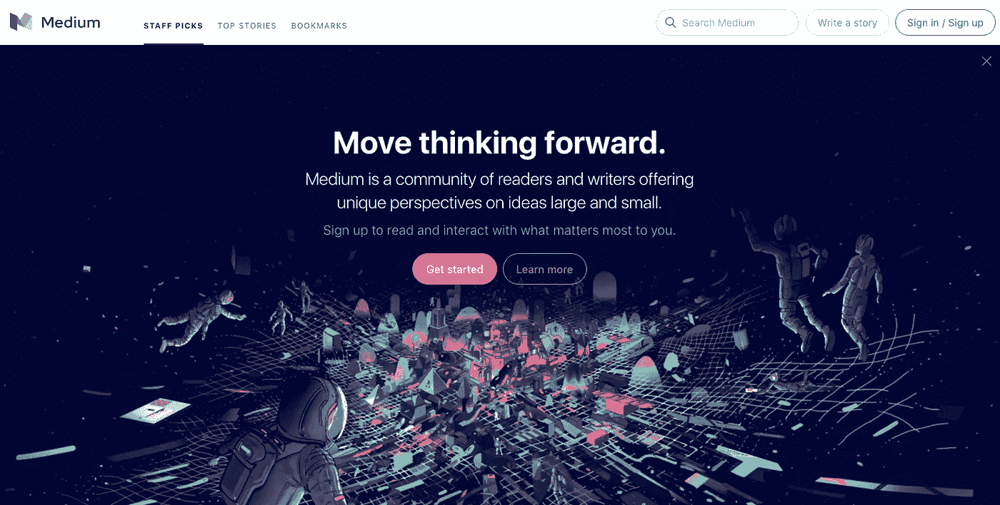
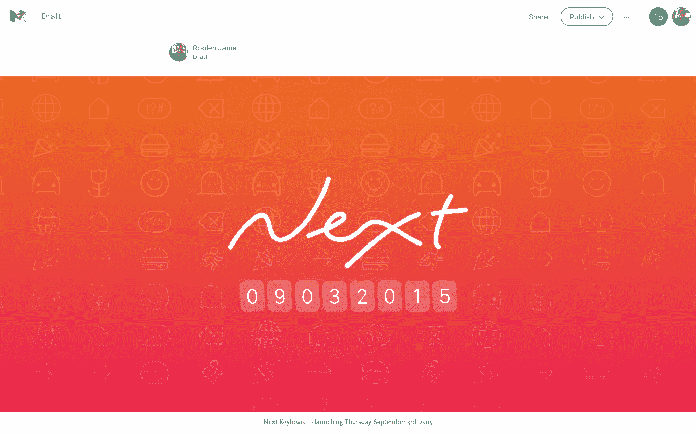
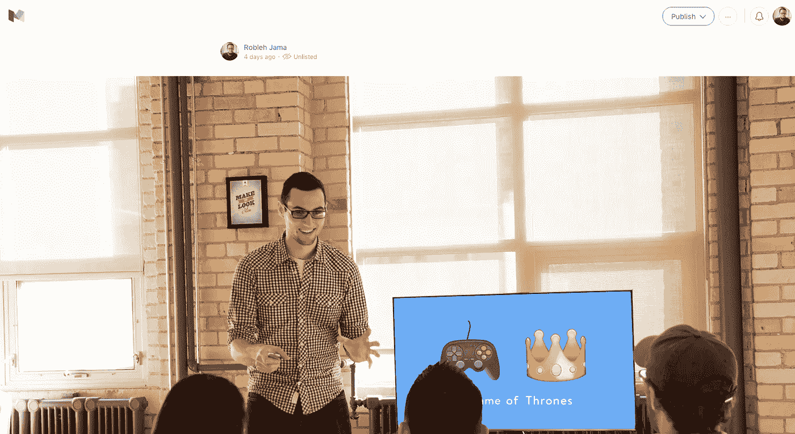

# Medium.com 主办的新闻资料袋:如何使博客的生活更容易

> 原文：<https://medium.com/swlh/the-medium-com-hosted-press-kit-how-to-make-a-blogger-s-life-easier-10962dc3f04e>

在过去，新闻资料袋是存放在 Dropbox 中或附在电子邮件中的概况介绍、文本文件、图像或 pdf 文件的文件夹。你能想象这对博客作者和记者有多讨厌吗？

他们将不得不梳理五个不同的文件，下载大型文件夹，以了解你的应用程序是否值得报道，并重复他们收件箱中的所有其他推介。

耶！难怪博客作者和记者会紧张不安。TechCrunch 的 Mike Butcher 说得好:[新闻稿已死](http://mbites.com/2015/07/01/the-press-release-is-dead/)。

谢天谢地，那些日子早就过去了。当我第一次写我如何使用[媒体作为新闻工具](/swlh/the-press-release-is-dead-here-are-its-replacements-f0a0a27d6549#.udbljd1eu)时，我很惊讶更多的人还没有尝试过。

创始人、营销人员、公关人员——我想你会喜欢这个的。你要做的工作会更少，你联系的博客和记者也不会那么讨厌你。如果你把握好时机，在你的故事中投入一些心思，他们可能真的会喜欢你。你给了他们一个精心包装、深思熟虑的故事，而不仅仅是一堆数据和充满公关术语的商业广告。

让我们打开中型新闻资料袋的概念，进一步探讨一下:

# 为什么媒体工具包是中型的？

[中号](/about/about-medium-9eac453da935#.bpx41ktvl)是为了让文字看起来漂亮。这个平台是关于分享故事的。简而言之，公关也是分享你的产品故事。我一直觉得界面有某种无形的东西会鼓励你这样写。

很多博客都在使用媒体，并在上面阅读，所以他们会更习惯这种体验。

其他一些额外津贴:

*   您可以随时轻松地编辑它，它会立即反映这些更改。当文件或错误已经下载到 blogger 的计算机上时，尝试修复该文件或错误。
*   媒体显示推文，视频，gif，图像作为美丽的嵌入。
*   是个网址。一键之遥，让博主的工作更轻松。博客作者也更容易与他们的同事或读者分享。
*   媒体是写博客的好地方，它本身也是一个未开发的公关渠道。这意味着，如果你选择公开你的新闻资料袋，比你只是把它上传到 Dropbox 或其他网站上，会有更多的人看到它。
*   相当多的公司已经在使用媒体作为公关渠道(像 HBO 和 T2 的每日秀)。更进一步，把你的新闻资料袋放在这里。当 Figma 宣布他们的发布时，他们仅仅通过媒体就获得了[吨的牵引力](/figma-design/design-meet-the-internet-4140774f2872)。(他们仍然在 [TechCrunch](http://techcrunch.com/2015/12/03/figma-vs-goliath/#.ot2n2w:YW0X) 、 [VentureBeat](http://venturebeat.com/2015/12/03/user-interface-design-app-figma-launches-with-14m-led-by-greylock-partners/) 和 [Fast Co.Design](https://www.fastcodesign.com/3054382/figma-aims-to-be-a-github-for-designers) 上得到报道。)

如果你是一家知名公司(或思想领袖或名人 CEO)或有许多媒体/Twitter 追随者，媒体可以让你充分利用现有的社交网络。你在一个他们已经熟悉的平台上分享新闻，你的追随者(其中一些可能是博客和记者)已经在使用这个平台。

显然，你可以创建自己的 press 网页，但这比简单地将文本复制粘贴到一个中型文档中要耗费更多的资源。(如果有，[尝试按下 kit()](http://dopresskit.com/) 。)

你也可以在类似 Totem 的网站上发布你的新闻资料，但这些都是付费服务。它也没有获得媒体可能给你带来的那种流量。

## 喜欢你目前读到的吗？[加入我们不常见的简讯](http://bit.ly/1kp6lTN)，了解“如何在 App Store 上被发现”和“如何制造人们喜爱的产品”等内容。

# 我们上次做了什么

Our press kit for Next Keyboard on Medium

当我们[推出 Next Keyboard](/swlh/how-next-keyboard-became-the-most-funded-app-on-kickstarter-ada26c4384d1#.3okbcol51) 、[时，我们在媒体](/@robjama/7363fbd85754#.z0lgf14s2)上发布了未上市的新闻包。我们嵌入了视频、推文和照片。这是一个很棒的新闻资料袋——都方便地放在一个帖子里。当然，我们仍然在 Dropbox 上托管了我们所有的高分辨率照片和 gif，并在帖子末尾链接到了它。这对我们来说效果很好。Techcrunch、The Verge 和 Mashable 报道了 Next Keyboard。

当你把一个博客需要的所有东西都放在一个地方，他们会喜欢的。他们会感激你，因为你没有做对你最方便的事情*。你真的想过他们。即使他们现在不写你，这也是建立良好关系的开始。*

*我们没有公开，因为我们认为博客作者和记者最好先了解细节，然后再把它传递给他们的读者。媒体上未列出的帖子只对有链接的人可见。它不会列在 Medium 的公共页面或您的个人资料中。你可以选择把它保留为草稿，或者像我们一样作为[未公开的帖子](/the-story/new-on-medium-unlisted-d9477b716d1d#.8rua9hsdv)发布，或者作为公共帖子发布。*

# *我们下次要做什么*

*下一次，我们仍然会写在媒体上，但我们会向公众提供我们的新闻资料袋和公告。*

**

*Medium press kit for Emoji Party*

*这正是我们在本周推出的苹果电视(和 iPhone)表情符号派对上所做的事情。你可以在这里查看新闻资料。这一次，我们还确保记者使用我们的新闻资料袋，以确保我们专注于最有新闻价值的内容。*

*你好，看着我👉rj@tinyhearts.com 如果你是一个对写表情派对感兴趣的博主😉*

*当然，我们也将继续与公关部门协调我们的产品发布。实际上，我们已经与我们的一些客户就这种“即服务”产品展开合作。例如，我们帮助学习伙伴建立了他们的应用程序 [Real Talk](http://www.thelearningpartnership.ca/real-talk) ，我们还帮助他们在 Lifehacker 和 [Betakit](http://betakit.com/tiny-hearts-teams-up-with-the-learning-partnership-to-give-young-people-real-talk-about-career-choices/) 上推出了一个[功能。你可以在这里](http://lifehacker.com/real-talk-offers-in-depth-career-advice-from-people-in-1740854565)找到我们用于真实谈话发布会[的媒体新闻包。](/@tlpcanada/7c94bc1367a6#.icxoo0j0y)*

**

*Real Talk featured on Lifehacker*

# *现在，轮到你了*

*我们真的很感激你已经阅读了这篇文章(如果你已经跟随[走过了整个旅程](/@robjama)，那就更感激了)。我们实际上是在寻求反馈，以帮助找出你的知识差距。这有助于我们创建更好的内容，同时也有助于我们根据您遇到的真实问题开发解决方案。如果你想问我们任何反馈、问题或集思广益，[在这里填写这个表格](https://tinyhearts.typeform.com/to/DycQ58)。我们很乐意聊天。*

**

*哦，博主们，你们有什么抱怨或想法想和公关人员和企业家们分享吗？我们也希望收到您的来信。如果有人送给你一个包装拙劣的新闻资料袋，你知道该去哪里找他们；——)*

**

# *如果你喜欢这篇文章，你可能也会喜欢:*

* [## 新闻稿已经作废了。这是它的替代品

### 获得结果的非常规公关的 3 个技巧](/p/f0a0a27d6549)  [## 如何在 App Store 上获得特色

### 在你进一步阅读这篇文章之前，这里有一些你应该已经在做的事情。如果你不是，你就不是…

medium.com](/p/656ebe4cdd04) 

## Robleh Jama 是获奖产品工作室 [Tiny Hearts](http://www.tinyhearts.com/) 的创始人。他们制造自己的产品，如 [Next Keyboard](http://www.nextkeyboard.co) 、 [Wake Alarm](http://www.tinyhearts.com/wake) 和[Quick Fit](http://www.tinyhearts.com/quickfit)——也为 Plantronics 和 Philips 等客户制造产品。

## [查看我们的博客](http://blog.tinyhearts.com)和[加入我们的时事通讯](http://bit.ly/1kp6lTN)，了解诸如“如何在 App Store 上被发现”和“如何制造人们喜爱的产品”之类的事情。

**如果你喜欢这篇文章，请推荐，帮助别人找到！**

*