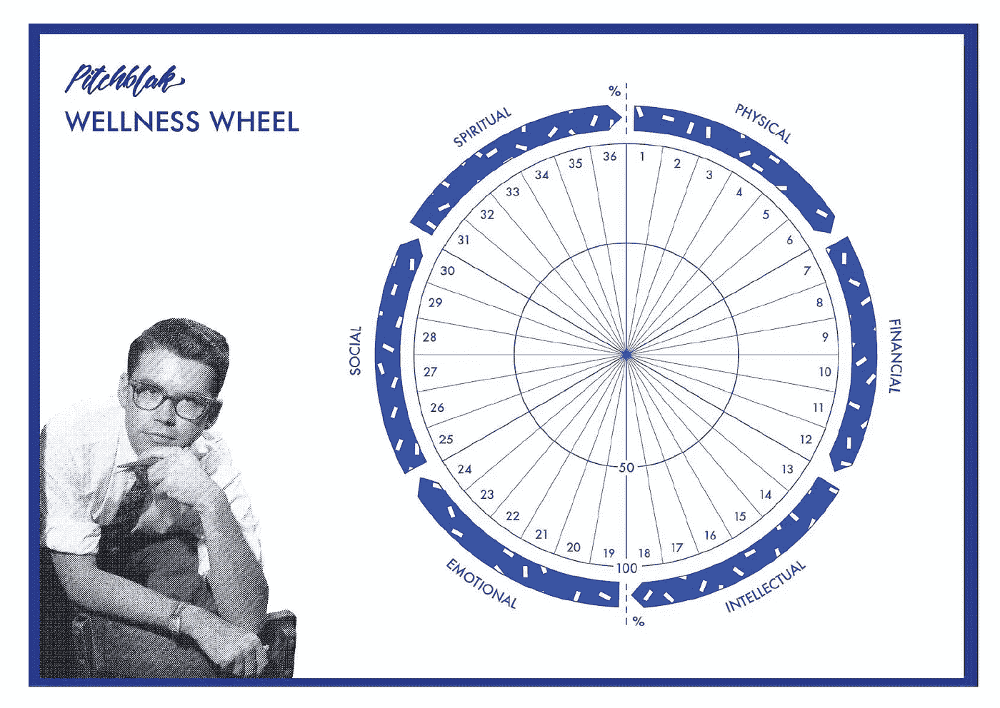
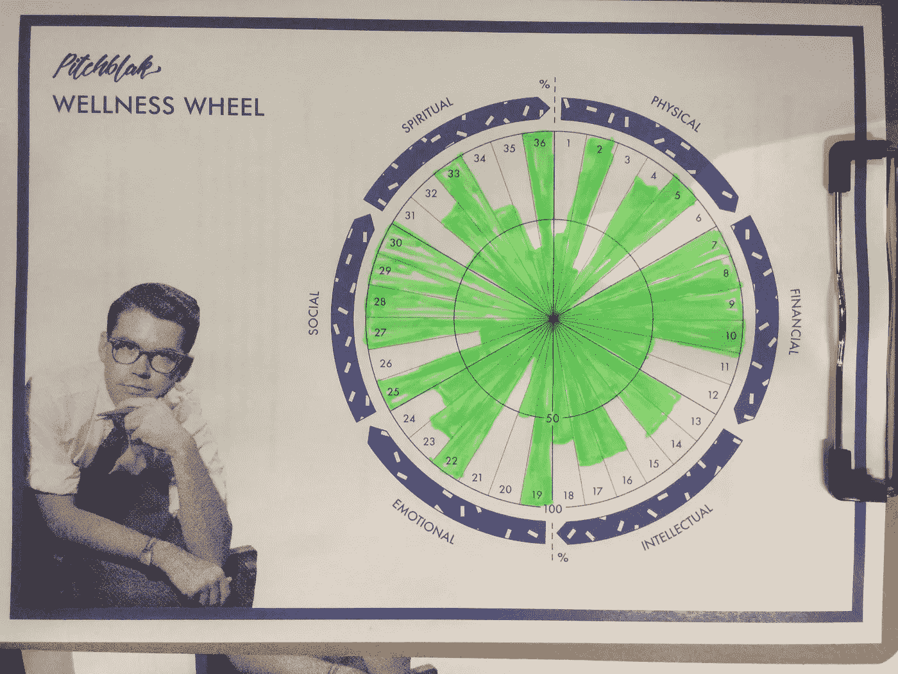

# 创业公司的智力游戏

> 原文：<https://medium.com/swlh/the-mental-game-of-startups-b83dfcf483ad>

我的朋友 Jess [写了一篇关于从其他创始人那里学习错误的文章](https://www.monash.edu/entrepreneurship/news/articles/how-to-steal-like-a-founder),这样你就不必自己犯错误了。他给创业公司上的第一课是什么？了解你自己。

自我意识让你在个人生活中建立坚实的基础，这直接影响到你建立的事业。

这是我们在加速器前期项目中教授的最重要的课程之一，但我没有看到很多企业家这样做。

我开发了一个深入的过程来帮助我们的创始人变得更有自知之明，这让他们能够为建立一个企业打下坚实的基础。

这个过程是每一个创始人在决定全职投入他们的事业之前都应该经历的。

# **程序**

我们开展了一个为期 13 周的项目，在这个项目中，你将学习如何创业(以及要避免的错误)，然后将这些知识应用到你的创业想法中。

创始人会挖掘他们想要解决的问题，提出想法假设，像对待科学实验一样对待这个想法，并证明人们确实想要它，然后提出一个可靠的方案来获得投资。

注意:这个项目已经停止了，因为内容已经上线，我们和创始人一起做了更多的定制项目。

很激烈。我们跑了 8 个队列(任何时候都是 3 个)，我们学到了很多。

项目中有一些关键点会让人陷入困境，但中途(第 6 或 7 周)尤其棘手。这是我们教脸书广告的时候。

有两个问题:

1.  **巨大的学习曲线。** 脸书广告平台复杂难学。如果你没有实验的心态，那就特别难。一些创始人会尝试一套广告，如果他们不工作，他们认为这是一个失败。
2.  **情感障碍。深入挖掘之后，我们发现这个问题比我们意识到的要复杂得多。这一切都是基于恐惧。**

许多创始人把自我价值放在他们的想法中。这是他们千载难逢的十亿美元的想法。但在此之前，他们只告诉了给予他们无条件支持的母亲和密友。很少给他们关于这个想法的真实反馈。

他们害怕真相。当你的自我价值与一个想法联系在一起时，有人批评这个想法，感觉就像他们在批评你。当你受到一个匿名巨魔的摆布，他写了一篇令人讨厌的评论，这是令人心碎的。

在某些情况下，创始人没有告诉任何人他们的想法，并像一个肮脏的小秘密一样保守着。

当你告诉别人时，你变得更有责任感，他们会检查你的进展情况。如果你失败了呢？如果没有人想要你认为会改变世界的想法呢？这也是令人心碎的。

因此，当创始人学习广告平台时，他们有这种情感障碍，阻止他们充分学习或实际投放广告。

情绪高涨时，我希望人们更多地了解自己，发现他们想做这个想法或经营一家企业的原因，并帮助他们建立坚实的基础来真正做到这一点。

创业是如此激烈，没有坚实的基础很难成功。如果你的个人生活一团糟，你的创业可能也会一团糟。

所以当创始人加入这个项目时，他们认为他们已经准备好了他们的创意投资。他们不知道…我对他们有其他的计划。

# **一对一(治疗)会议**

我大部分空闲时间都在学习心理学和人类行为，这意味着我有一大堆资源和练习随时可以提供给你。

我的社区经理角色很快变成了心理学家角色。

除了每周的学习研讨会，创始人偶尔还会与我们的首席执行官阿德里安进行一对一的会谈，在会谈中他们会得到关于他们创业想法的具体反馈。然后他们和我进行了一对一的谈话，集中在创业的情感方面。

我的目标是让每个人变得更有自我意识。

有时这意味着人们比以往任何时候都更努力地鞭策自己。有时这意味着人们认识到创业不适合他们。有时这意味着他们意识到他们不关心这个部落或者他们正在解决的问题。所有这些对我们来说都是胜利。

我会带你走过我带给他们的旅程。

# **了解自己**

在创始人们开始这个项目之前，我让每个人参加了两次性格测试。

这样做的目的是让人们更多地了解自己，但也让我了解如何与他们共事。

1.  [**迈尔斯布里格斯式指示器**](https://en.wikipedia.org/wiki/Myers%E2%80%93Briggs_Type_Indicator)

这个测试探索了我们性格的四个方面(你可以在这里参加测试[)。如果我再做一次，我会用](http://16personalities.com/)[五大因素](https://en.wikipedia.org/wiki/Big_Five_personality_traits)，因为我认为它对我们的性格进行了更深入的分析，包括优点(你擅长的事情)和缺点(需要改进的地方)。

我们社区中最流行的两种人格类型是 ENFP 和 ENFJ。

注意:这并不意味着这些类型的人更有可能成为企业家，因为这些类型的人(尤其是外向的人)可能更喜欢集体教育项目。

我们合作过的 80%的创始人都是外向的人。

**70%** 创始人凭直觉思考世界(N)。这意味着他们喜欢谈论想法，做决定时相信自己的直觉，而他们的对手更喜欢细节和具体的信息。

**70%** 的创始人根据他们的感受或者这个决定会给其他人带来怎样的感受来做决定(F)。

这样做的目的不是把人们放在一个盒子里，而是让他们理解他们为什么做他们所做的事情，以及具有相反特征的人可能面临的挑战。一个常见的例子是专注于大愿景的企业家和实事求是的开发者之间的沟通差距。

**2。** [**四种习惯倾向**](https://www.surveygizmo.com/s3/3706759/Gretchen-Rubin-s-Quiz-The-Four-Tendencies)

这个关于习惯和动机(内在和外在)的框架是格雷琴·鲁宾创建的。这一点对我来说很重要，在与人交流和向人提出挑战时，我必须知道。

每周创始人都有“家庭作业”或“创业工作”要完成，我会根据他们的倾向调整我的语言。

**支持者** —你受到内部和外部的激励。

如果你把一项任务放在你的待办清单或日历上，它就会完成。你很容易被激励，但有时你会毫无疑问地做不必要的任务，因为它在你的清单上，而不是因为它实际上需要完成。

这个人喜欢挑战，并且总是提前完成所有的家庭作业。有些人甚至不需要挑战，因为他们的生活已经如此紧密。在这种情况下，我们坚持做一些小事，比如每天使用牙线。

“在你下周来之前完成这个作业。”

*“这是你必须在此日期前完成的挑战。”*

**提问者** —你有内在动力。你可以有外部动机，但你需要一个理由，而且这个理由必须对你有意义。

你拒绝别人告诉你该做什么，你会问很多问题，这样一个请求对你来说才有意义。

*“如果你没有完成作业，你将无法参加下周的研讨会，也无法获得关于你想法的具体反馈。”*

*“这个挑战对你很重要，因为它会从 x，y，z 方面改善你的生活。”*

你有外在的动力。你更喜欢让别人设定最后期限，让你承担责任，或者参加集体课程。

乐于助人的人倾向于强迫自己保持内在动力，这往往会导致失败和失望。如果你认识到这一点，你就可以通过寻找外部激励因素来为自己的成功做准备。

“我需要你在下周之前完成这项作业，这样我们就可以在小组活动中互相帮助了。”

“我希望你完成这个挑战，因为这对你的家庭很重要。下周我会去看看你的情况。”

**叛逆**——你抗拒内部或外部的动机。你讨厌墨守成规，更喜欢做自己觉得合适的事情。反叛者喜欢选择和标新立异。

这个人经常做作业(以他们想要的速度)，但从不写下来寻求反馈。他们想做什么就做什么，想什么时候做就什么时候做。

*“如果你选择在本周做作业，它会在 x，y，z 方面让你受益。”*

“如果你愿意，你可以尝试这个挑战，它可能会在 x、y、z 方面让你受益。”

反叛者经常做与他们被告知的相反的事情。所以如果你告诉他们他们不能做某事，他们证明你错了。这是一个有趣的策略。

因此，在给一群人的电子邮件中，我可能会说这样的话来迎合所有的倾向:

“下周，我们将开展这项活动，因为 x、y、z 方面都有好处。如果你选择完成作业，你可以获得对自己想法的反馈，团队的其他成员也可以从你的见解中受益。”

# **建立坚实的基础**

在第一次入住时，我们做了一个健康轮来衡量创始人在六个健康领域的情况:身体、情感、智力、社交、财务和精神。

我列了一张 50 个问题的清单，我会引导他们完成，他们会在健康轮盘上填写他们对这句话的认同程度。当所有的馅饼都涂上颜色后，我们就能看到缺口在哪里了。

人们通常至少有一个领域需要工作。

然后我们一起反思。

你对自己目前的处境有什么感觉？有什么惊喜吗？
*您在哪里最能看到这些差距，它对您有何影响？*

接下来，我们将设置一个挑战来弥补差距。

挑战可能包括每天早上用牙线剔牙，或者和你的伴侣进行一次艰难的金钱对话。许多人想努力的一个领域是他们喝了多少酒，是把他们的三杯睡前酒减少到一杯，还是减少他们作为社交润滑剂的频率。

最重要的是，挑战必须是可以实现的。因此，当有人告诉我他们想戒酒时，我们会深究为什么这对他们很重要，并让它变得现实。完全戒酒是一个很大的行为改变，所以大多数人会一开始就把消费量减半。他们的习惯倾向也决定了挑战要求。

我们将在 3-4 周内再次召开会议，思考挑战的进展和他们的感受。

如果他们坚持到底，我们就能想出如何让它更上一层楼或迎接另一个挑战。

如果他们无法完成，我们会反思原因，并根据他们努力的方向进行修改。

我还会给他们发送资源，让他们根据健康轮中的缺口或他们对学习感兴趣的东西进行工作。

因此，如果他们的差距在金融领域，我会推荐富爸爸、穷爸爸或 T2，我会教你变得富有。或者跟踪他们如何花钱的简单练习(没有限制)。

在这个过程中，一些创始人意识到他们的价值观或目标与创业不相符。他们不想要建立庞大企业的压力或生活方式。也许他们开始了一个小生意，或者用他们学到的知识在目前的工作中获得了晋升。

这种认识对我们来说是一种胜利。不是每个人都适合创业，我们很高兴他们在花太多时间或金钱在他们的想法上之前发现了这一点。

这些练习有助于为企业建立坚实的基础和合适的条件。如果你的个人生活在一个或多个领域分崩离析，你会分心，永远无法将全部注意力放在事业上。

如果你的伴侣不支持你正在做的事情…

如果你没有很多朋友，感觉很孤独…

如果你正在处理身体或精神健康问题…

当你建立一个企业时，所有这些事情都会被放大。先照顾好自己。商业(和改变世界……)排在第二位。

## 这篇文章发表在[的《创业](https://medium.com/swlh)，这是 Medium 最大的创业刊物，拥有+396，714 人关注。

## 在这里订阅接收[我们的头条新闻](http://growthsupply.com/the-startup-newsletter/)。

