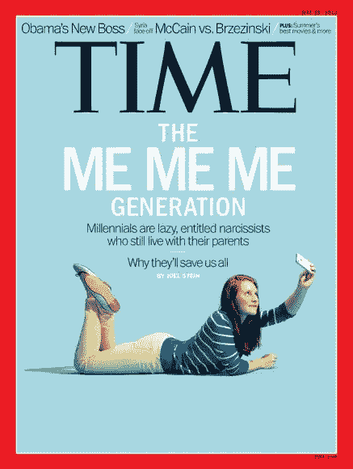

# 千禧年营销神话

> 原文：<https://medium.com/swlh/the-millennial-marketing-myth-d38f91365b4f>

## 把所有的千禧一代归为一类是没有用的。

No article about Millennials is complete without avocado toast.

如果你在过去的 15 年里没有生活在岩石下，你可能听说过很多关于千禧一代的事情。很明显，他们是自恋的科技迷，就是不能从父母的地下室里搬出去。他们也都有资格，并且正在“扼杀”几乎每一个行业。

**这是假的。**

让我们从头开始，定义谁是千禧一代。虽然营销人员使用的年龄组各不相同，但这里有一个总体概述。

Not a graphic designer, but you get the gist of it.

千禧一代通常被认为是第一批数字原住民。这个范围的高端是在我们今天所知道的数字诞生的时候，并且在他们生命的早期使用拨号和 AIM 聊天室。百岁老人是真正的数字原住民，社交媒体和智能手机几乎主宰了他们的整个生活。

很难用任何有意义的方式来定义千禧一代。虽然占世界人口的 38%，但在伊朗、巴西、柬埔寨或美国的千禧一代之间还是有很大的不同。即使在整个国家内部，收入不平等的现状如此之大，千禧一代的高收入和低收入人群之间也呈现出鲜明的对比。

Time Magazine, May 2013

如果千禧一代(实际上是任何年龄组)如此不同，为什么我们总是对他们进行分组和污名化？

许多新闻媒体都在宣传千禧一代自恋且有权利的故事。广告公司 Ogilvy and Mather 所做的研究显示了相反的情况——他们更无私，并且比他们的前辈们给予那些不幸的人更多。

他们也更有可能重视多样性(正如许多当前的社会运动所见)，并分享。

他们存钱更多，不太可能使用信用卡，也不像上几代人那样同时买房。他们也更加节俭。

他们对工作也有不同的看法，不太可能在任何一份工作上呆很长时间。在许多情况下，前几代人几乎会在一家公司度过他们的整个职业生涯，而千禧一代经常“跳槽”，与前几代人相比，他们更注重工作的成就感。

> 几乎所有关于千禧一代的描述都是不真实的。事实上，X 世代对 X 世代使用了许多与 X 世代对 y 世代相同的论点。

那么，如果我们被告知的一切都是不真实的，我们在千禧一代身上看到了什么样的广告和技术行为呢？我们如何向他们营销？

## 1.不要把他们都放在一组

如果我问你你的目标市场是谁，你说“千禧一代”，你不知道你的目标市场是谁。为了获得清晰的图像，还需要添加更多的内容。否则，你对一个 18 岁的大学新生的营销方式就像你是两个孩子的单身母亲一样。

## 2.许多人有道德意识

星巴克(Starbucks)和巴塔哥尼亚(Patagonia)等公司已经准备好利用这一特点，他们的品牌主要关注帮助环境和促进社会平等——这两个问题都是许多千禧一代所关心的。

## 3.许多人关心隐私

尤其是我们越接近千禧一代，他们想要的隐私就越多。他们越年轻，就越把 Snapchat 当成比脸书更紧密、更私密的社交媒体。

## 4.在线研究

许多千禧一代在承诺购买产品之前会在网上进行大量研究。他们也更倾向于支持小企业，尽管亚马逊已经被列为他们离不开的第一应用。

## 5.社会影响者有很大的影响力

影响者营销的回报率比其他形式的数字广告高出 11 倍，其中许多吸引人的是千禧一代。

没有什么比千禧一代的话题更能显示简化概括的影响了。他们是一个比许多人认为的要复杂得多的群体。

## 想和我免费聊 30 分钟营销策略吗？在我的日历上安排一个时间！如果你喜欢我的作品，在[推特](https://twitter.com/AlexDRiddle)或[媒体](/@AlexDRiddle)上关注我，别忘了点击那个鼓掌按钮——它能帮助别人找到我。

## 这篇文章发表在 [The Startup](https://medium.com/swlh) 上，这是 Medium 最大的创业刊物，有 307，792+人关注。

## 订阅接收[我们的头条新闻](http://growthsupply.com/the-startup-newsletter/)。

