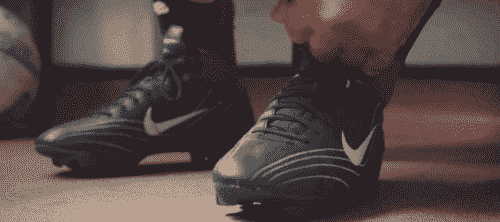

# 看似自然改变世界的品牌背后令人麻木的秘密

> 原文：<https://medium.com/swlh/the-mind-numbing-secret-behind-brands-that-seem-to-naturally-change-the-world-64ee73a1a290>

## (以及如何为你的品牌挖掘这种力量。这比你想象的容易[也难]。)

有没有想过一些公司和组织似乎有改变世界的诀窍和能力？

为什么有些*劣质*产品能胜过*优质*产品？

> 大众怎么会渴望一个价值较低的东西，而不是另一个功能和整体价值更好的*产品呢？*

这就是我在本周的《周三一分钟》第 17 集所报道的内容！

谁会赢:

> 是哪个品牌拥有更好的材料和更好的功能**还是**是哪个品牌拥有更好的故事来打动作为人类一员的我们？

不幸的是，太多公司问了错误的问题:

> 为什么心灵感应没有渗透到真正需要我们的产品和服务的客户的头脑中，这样我们才能赢得更多客户？
> 
> 为什么生活如此不公平？

[一家我更名为](http://www.risingabovethenoise.com/brand-storytelling-case-study/)的公司已经忘记了他们自己的故事，我需要提醒他们，并帮助他们重新找到相关的故事。

# 改变你的故事，改变世界

许多公司在开发或改进产品时，关注其品牌的特点、独特之处以及它们提供的价值。都是很正当的活动。

但是当涉及到告诉世界的时候，他们忘记了 ***这是真正的工作开始的地方*** 在这里你需要和开发你的产品时一样多的创造力。

你必须投入两倍、三倍、5X 的创造力，才能获得你应得的吸引力。

# 如何改变世界(以及如何停止为自己的命运找借口)

你知道吗 ***故事更精彩的品牌*** 会胜出？

没有更多的功能等。而是想出如何以有意义的方式讲述他们的故事的人。

如果你错过了前 16 集，请点击查看并订阅。

要真正脱颖而出，有一些至关重要的技巧，如果你正在挠头(或挠屁股)，不知道该抓住 8000 多个品牌中的哪一个，这样你就有了正确的(成熟的)工具，请阅读下面的内容。

# “这么棒的一本书…”

***想要本书帮助*** ***商家产生超过 10 亿美元的销售额？*** 然后在亚马逊上抢你的 [*精装本*](http://a.co/jgBtQ2C) (看下面戴蒙德约翰怎么说)。你将再也看不到烙印。

Grab your own copy of what Daymond John calls “a great book…” : [http://a.co/jgBtQ2C](http://a.co/jgBtQ2C)

*最初发表于*[*【www.risingabovethenoise.com】*](http://www.risingabovethenoise.com/secret-brands-seem-change-the-world/)*。*

## 这篇文章发表在 [The Startup](https://medium.com/swlh) 上，这是 Medium 最大的创业刊物，有 319，283+人关注。

## 在这里订阅接收[我们的头条新闻](http://growthsupply.com/the-startup-newsletter/)。

