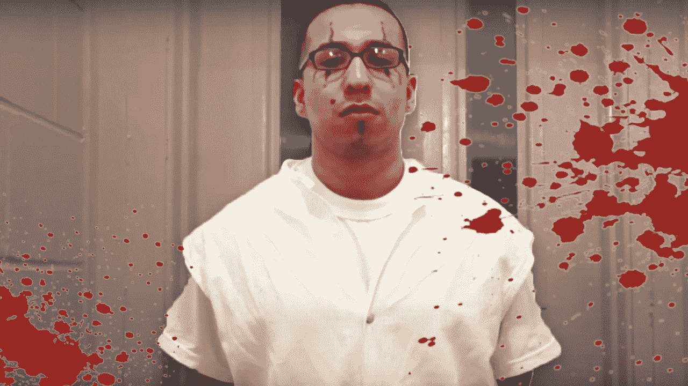

# 一个墨西哥卡特尔杀手的想法

> 原文：<https://medium.com/swlh/the-mind-of-a-mexican-cartel-hitman-bd954d683336>

邪恶——天生的，着魔的，还是神经疾病？

更令人担忧的真相似乎是 ***杀手是被创造出来的。***

罗萨里奥·雷塔就是这种情况…

# 杀手的崛起

> 我第一次杀人是在 13 岁的时候。
> 
> 一天，我被邀请去墨西哥。我不知道什么是…