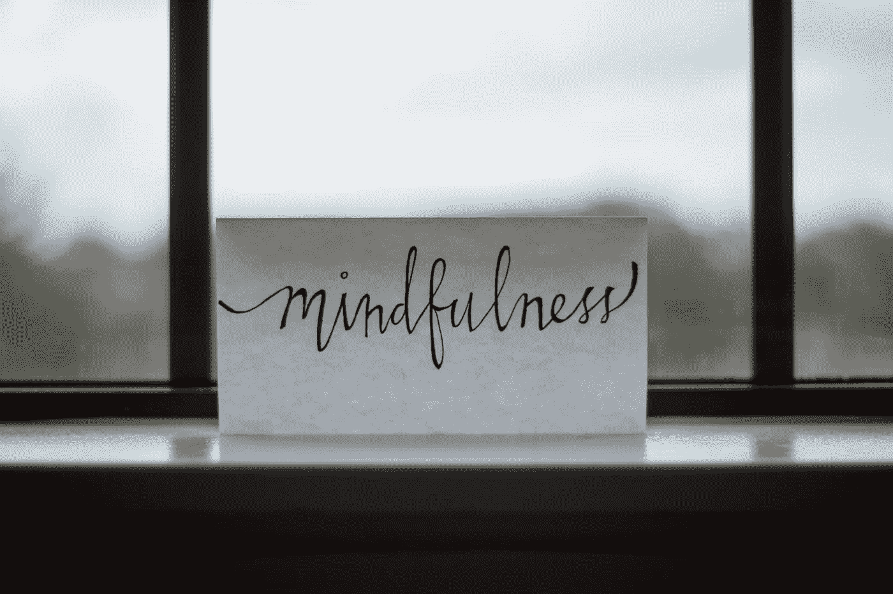
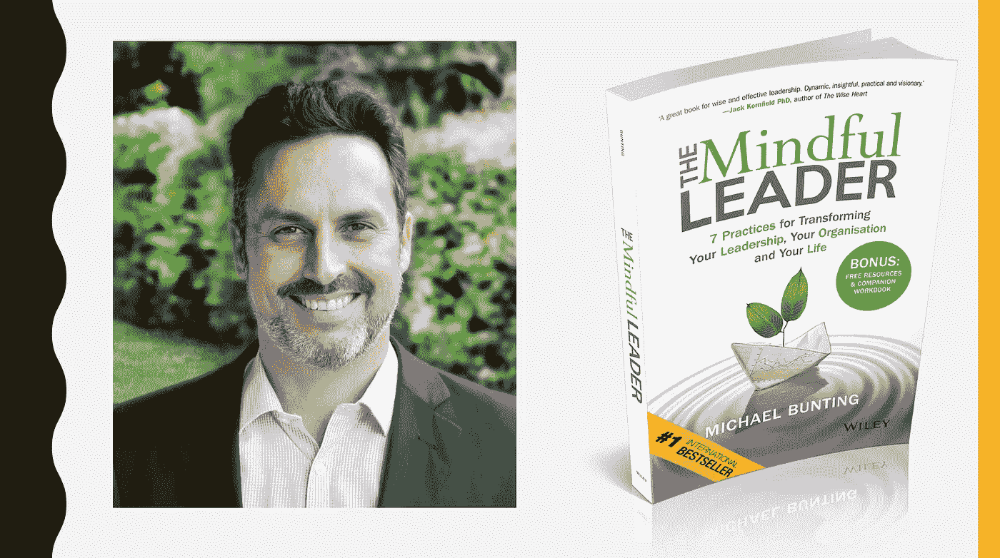
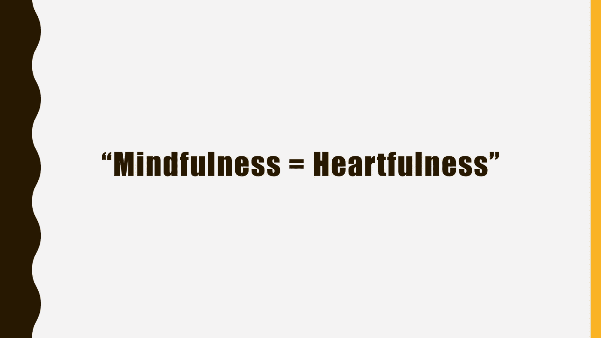
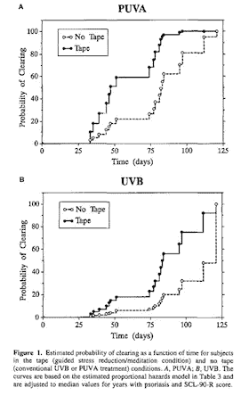
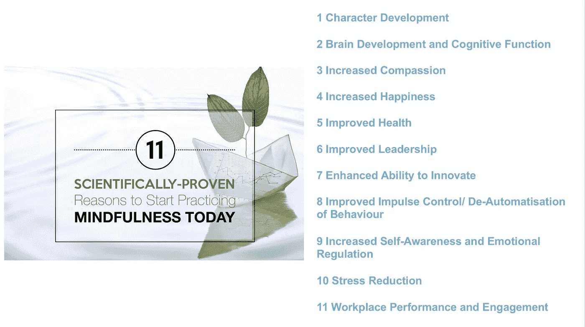
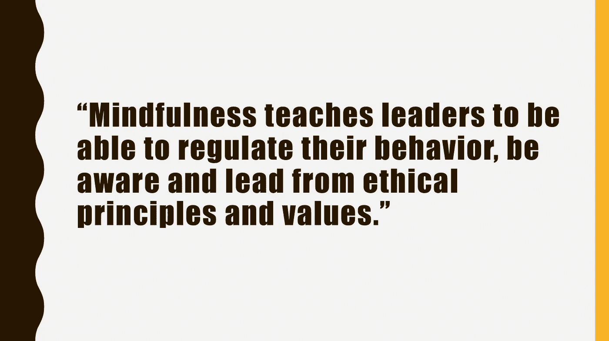
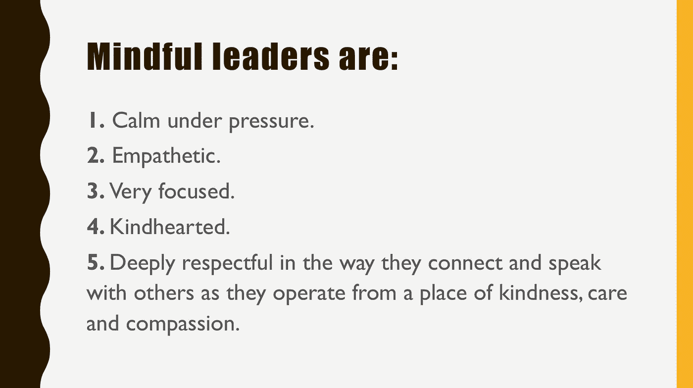
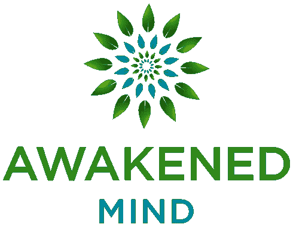

# 有头脑的领导者:迈克尔·邦廷访谈

> 原文：<https://medium.com/swlh/the-mindful-leader-an-interview-with-michael-bunting-901c38742cff>

冥想是一个有益的旅程，不仅对你自己，对你周围的人也是如此。我 2 年前开始练习正念，在我自己和我的反应之间留一些空间；然而，说实话，我并没有取得很大的进步，直到我遇到了[迈克尔·邦汀](https://mindfulleader.net/)。

去年，当我的[朋友](https://www.linkedin.com/in/zina-thaifa-8b37b33/)(同时也是我的前老板、导师和守护天使)邀请我和 Michael Bunting 一起参加她为她的团队组织的正念研讨会时，我像个孩子一样吹嘘自己在这个话题上的*渊博知识*以及*我在这个过程中已经取得了多大的进步*。今天，当我回想起那次谈话时，我的脸上带着嘲弄但宽容的微笑。我的朋友用她富有表情的大眼睛直直地盯着我的灵魂，她说:“[他的书](http://www.mindfulleaderbook.com/)正在改变我，并对我的生活产生了巨大的积极影响，无论如何你都应该加入我们的研讨会。”很明显我跟踪了她。

当你见到迈克尔时，你会立即感受到他的积极和热情。他毫不费力地在他周围创造了一个“安全区”，就好像你在周日和家人一起吃早餐一样……就好像你和你一生的朋友一起参观你童年的故乡一样。然后，他雄辩地分享他的智慧和科学证明的想法和方法，他深深地激励你“活在当下”，“做你自己”，当然，还有“正念”。他带你到一个强烈而壮观的时刻，意识到我们一直以来对我们内心深处的人类核心价值是多么无知。他向你展示了找到你内在的善良、健康和结束所有痛苦的愿望的方法。从很多方面来说，那天对我(和我的同事/朋友)来说都是一个里程碑，我将永远感激他。

由于我最近一直在写关于领导力和真实性的文章，我决定写下我的正念之旅。经过一个星期的思考，我意识到我的修行还不够先进，不足以教任何人关于正念，但我不能放弃这个想法。我写信给迈克尔请求帮助&他毫不犹豫地接受了。下面你将读到的采访是他给我们所有人的慷慨和善意的礼物。

Michael Bunting is the founder of WorkSmart Australia, a certified B Corp. He has helped thousands of leaders develop to their full potential, including two AHRI CEO’s of the year. He is the author of the #1 bestselling books *The Mindful Leader* and *A Practical Guide to Mindful Meditation* and co-authored *Extraordinary Leadership in Australia & New Zealand* with Jim Kouzes and Barry Posner, the world’s premier researchers and authors in the field of leadership. He is the creator of *Awakened Min*d, a premium mindfulness App. Michael also teaches Mindful Leadership on Sydney University’s award winning Global Exec MBA. Several of his clients have become award winning Best Employers through his programs. He regularly contributes articles for industry magazines including *CEO Magazin*e, *BR*W, *SmartCompan*y and *Inside H*R. He delivers large-scale keynote presentations at industry events, trade shows and company off-sites. He lives with his wife and 3 children in Sydney, Australia.

迈克尔，谢谢你接受这次采访。你的慷慨让我受宠若惊，很荣幸有这个机会。什么是正念，它和其他自我提升的练习有什么不同？

从技术上来说，正念这个词来源于巴利文“**萨蒂”**，意思是“**记起**”，记起你现在所在的位置。因为当我们不正念时，换句话说，健忘时，我们真的会忘记自己身在何处。所以，我们可以在走廊上走着或者开着车，我们忘记了，因为我们迷失在头脑中。最基本的正念是记住你现在在哪里。

从定义上来说，它也能够可持续地停留在当下或维持存在。它是记住你现在在这里，并且不断地停留在当下。正念有一个微妙的部分:你同样可以称之为“**心念**”。

通常，正念只是被教导为“专注于当下”，但它远不止于此，你还需要情绪化地呈现，这需要一种温暖、善良、开放的心态。**所以，正念是记住持续地、敞开心扉地停留在当下。**

当下最典型的定位点是**感受身体，注意感官**。你不能感觉到过去或未来的身体和感官，你只能感觉到你现在的身体和感官。

关于你提到的其他自我提升实践的问题，我只能谈谈我的经验，我不是每个个人发展技巧的专家。关于正念的一个关键区别是，它实际上是关于通过自我接受的转变，而不是通过自我改善项目的转变。

作为一种哲学，正念就是接受你是已经完美的人&你的思想欺骗你相信你不只是像你现在这样就很好。这是关于理清想法和思考，而不是接受新的想法和思考。这是一门学科，或者说是一种活在当下的技巧，但你也必须整合道德、同情和善良，才能找到你内心深处的一致性。

正念是接受和联系当下，并通过一个觉知过程发现我们是谁从根本上来说是好的。当我们意识到这一点时，我们开始从自我价值的角度做出更健康的选择，而不是从努力成为更好的我的角度。”

***你如何解释正念的流行？***

专注练习已经有大约 2500 年的历史了，在公司、医院等地方都有教授。但是乔恩·卡巴特-津恩用他的医学研究在西方[推广了它。](https://pdfs.semanticscholar.org/2515/cf92a42c8bbd760fd95a338d9ad35ac8e7e2.pdf)

[Psychosomatic Medicine 60:625–632 (1998)](https://pdfs.semanticscholar.org/2515/cf92a42c8bbd760fd95a338d9ad35ac8e7e2.pdf)

他证明了基于录音指导下的正念冥想的减压方法可以更快地治愈银屑病(14 天和 49.5 天)，分别适用于接受光疗(UVB)或光化学疗法(PUVA)治疗的患者。

这是第一个激动人心的时刻，第一次我们有了一个可测量的医学结果。随后，它变得不成比例，仅去年一年就有 1093 项关于正念的同行评议学术研究。因为我们背后有科学证据，它击中了主流。

另一个原因是与新技术相关的疾病激增。我们的注意力持续时间越来越短，近年来焦虑和抑郁的程度明显上升。现代技术世界和它的速度正在制造精神疾病，没有人再争论了。按照[微软](http://time.com/3858309/attention-spans-goldfish/)的说法，现在一个普通人的注意力持续时间比一条金鱼还低(9 秒)。自 2000 年以来(或大约是移动革命开始的时候)，平均注意力持续时间从 12 秒下降到 8 秒，表明日益数字化的生活方式对大脑的影响。其他研究表明，西方世界的普通人现在表现出以前被认为是注意力缺陷多动症的症状。我最近与戴尔电脑合作，他们甚至在设计电脑的方式上也认识到了这些趋势。**注意力的丧失给人们带来了很高的焦虑、抑郁和无意义感。正念是解药** **因为它是开始扩展我们注意力范围的注意力训练。**

令人惊讶的是，延长我们的注意力持续时间改善了抑郁、精神和身体健康的结果。体育运动中的正念也在上升。去年澳大利亚规则足球的两个顶级球队进行了某种形式的正念练习和冥想。表现和正念之间有很强的[相关性。澳大利亚的法官也必须学习正念，莫纳什大学的医生也必须学习正念。英国 68%的全科医生现在推荐正念作为一种治疗焦虑和抑郁的方法。](https://www.smh.com.au/opinion/mindfulness-was-a-key-factor-in-richmonds-grand-final-victory-20171002-gysjwv.html)

根据我自己的经验，我认为企业领导力培训需要领导者改变行为。但是如果没有持续的觉知练习，没有管理你的注意力和管理你自己的能力，就不可能有持续的改变。**正念逐渐成为培训领导者的关键方法。”**

***为什么正念对领导者很重要？一个有头脑的领导者最重要的价值观是什么？***

这是个大问题！自我意识这一课题已经被各个大学和学者广泛研究。自我意识是领导的基本素质和技能，也是最难保持的。讽刺的是，我们得到的是自我意识的问题。

> 当你正在读这篇文章的时候，如果我邀请你有自知之明，你会知道实际上该做什么吗？你打算运用什么技巧？实际上，你现在要练习什么才能有自知之明？

我向 10000 多名领导人提出了这个问题。可能有 0.0002%的人回答了这个问题。我想强调的是**在我们对自我意识的需求和你如何将自我意识作为一种实用技能来实践之间存在着巨大的理解差距**。答案是正念，这是持续的意识&持续的注意力。首先，正念训练是训练头脑保持警觉，尤其是当事情不舒服的时候。我们知道，在练习正念的人群中，大脑中的[前额叶皮层会增长](https://www.newscientist.com/article/dn8317-meditation-builds-up-the-brain/)，这是大脑的自我调节部分。**正念教导领导者能够规范自己的行为并保持清醒。**它也教导了意识的“自我”部分。领导者学会从身体暗示中调节自己。如果他们的行为方式不理想，他们开始了解身体上的感觉，并认识到身体的冲动，这种冲动使他们能够“在情感层面捕捉行为”。正念教导领导者保持头脑冷静，保持专注。人们希望得到领导的关注。我们对 4000 名观察者和大约 500 名领导者的研究表明，在 83 种领导品质中，冷静、清晰、踏实和专注(尤其是在压力下)是人们最希望老板具备的 5 种品质。

其次，当领导者变得更加敏锐地意识到自己，关注自己内心发生的事情时，他们会发现，当他们的领导与他们宣称的价值观不一致时，他们会开始注意到对他们的影响。他们开始看到身体进入某种紧张，情绪中毒和痛苦。

当我们没有从良好的原则和价值观出发时，头脑就会飞速运转。有了正念，领导者开始意识到他们和周围的人一样痛苦&随着时间的推移，遵循道德规范成为一种非常自然的协调，因为它与深层的幸福和健康相关联，这解释了为什么它是一种内在的动机，而不是外在的动机。这是我认为极其重要的两个主要领域。如果你还没有掌握它们，就好像你是一个残废的领导者&你并没有真正进入心流。"

***我们如何识别一个有头脑的领导者？我们如何知道一个人是否正念？***

我们实际上测量了这个。 **1。他们在压力下保持冷静。 **2。**他们感同身受。 **3。他们非常专注。 **4。他们心地善良。 **5。**他们在与他人交流和交谈时非常尊重他人。这些都是基本素质。他们的另一个重要特征是思想开放。他们不是防御性的，他们不需要自己的观点被认可来获得安全感。他们的安全感是基于他们的存在，而不是紧紧抓住他们的想法不放。他们是有目的的，他们有天生的弱点。他们可以谈论他们的错误和失误，这来自于深刻的自信和专注。有一种基本的善良和人性。******

很多人描述正念的“内容”。但是“为什么”是什么？**它是去除我们经历的所有不必要的痛苦，并以一种永远不会给别人带来痛苦的方式行事。你可能正在和某人进行艰难的对话，甚至是解雇某人。但它总是从一个善良、关心和同情的地方开始。有意识的领导者并不完美，他们知道自己并不完美，因为他们有真正的自我意识和高度的诚实。"**

***你提到了“什么”和“为什么”。我们如何练习正念？有没有快速解决的办法？***

“我 t 是一个悖论。正念是瞬间的，它需要“现在”练习，也是完全自然的。你不需要教一个 2 岁的孩子正念。可持续地存在是绝对自然的。这不是宗教或教条的技能，这是一种自然的技能。问题在于我们大多数人的动力。我们没有被教导要留心，我们有能力思考过去和未来，很快我们就会被我们的思维所困，迷失在各种创伤、条件反射、记忆和观点中，追逐梦想和目标。我们习惯了心不在焉，而不是正念。当我们开始练习正念时，它是瞬间的，我们几乎试图倒转关于心不在焉、分心、无意识的一生的动力。举例来说，我们中的一些人可能在童年时受到伤害，我们的心关闭了。我们中的一部分再也没有敞开心扉地存在过。当我们练习正念时，在更深的层次上，我们再次打开心灵，这可能是一个相当具有挑战性的过程。当你练习正念时，它不是线性的，而是一个永无止境的、开放的旅程。

这项研究告诉我们，对健康的切实好处——甚至在基因水平上——在 6 到 8 周后开始，这是一个相当紧张的时间框架。所以，你很快就能得到好处。从经验上来说，正念越能帮助你变得觉知，你就越能意识到自己是多么的无意识！当你的意识在增长时，你也开始看到前方的漫漫长路。这就是为什么，对于任何开始练习正念的人来说，记录、认可和欣赏进步是超级重要的。人们很容易忘记你可以在很短的时间内取得一些深刻的进步。我已经教授正念 17 年了，我已经听过无数次了。正念练习最喜欢的时刻是当有人注册，然后有一天他们遇到交通堵塞，或者当他们的孩子在某些方面行为不端时，他们不会像以前那样做出反应，他们能够保持冷静，他们会突然意识到“这是不同的”。我强烈建议任何人去欣赏和认可你的惊艳时刻。”

***在一个可能不欣赏这些价值观的企业环境中，如何才能做到真实可信，拥有一颗初心？***

“我认为记住价值观是一种实践很重要。有一个初学者的心态，就是在练习好奇心。我通常这样告诉我的客户:想象一下，你有两家紧挨着的酒店。他们有完全相同的建筑，相同的预算和相同的员工。但是他们中的一个练习成为专家，并且需要一直正确。而另一家酒店则一直保持开放的态度，努力从错误中吸取教训，不断学习。开业两年后，你现在可以选择作为客人。你想要住在哪个饭店？哪个酒店会更好？哪家酒店会让你住得更愉快？每个人都知道:那个一直在学习的人。初学者心态的悖论是，当你练习时，你实际上变得更聪明，因为你实际上在成长，从经验中学习，你意识到这是一个永无止境的旅程和流动。你必须不断地问“我们能不能换个角度看问题？我们能换一种方式吗？".

不实践这一点的人，那些最懂的人，那些自以为最内行的人，就像他们被冻结在时间里，他们被卡住了！他们不仅没有成长，而且这是一种多么无聊的生活方式，一种多么痛苦的方式来度过你的一天，你的生活，不断捍卫你的观点。底线是，谁学得最快谁就赢。就这么简单。这并不是从一个神奇的仙境开始，而是从领导者的角色塑造和开放思想开始。"

在大数据等颠覆性技术引发伦理问题、人工智能威胁人类的时代，你对未来是乐观还是悲观？

在正念练习中，我的答案是“既不乐观也不悲观，而是更现实”。正念是关于接受现状。乐观和悲观是一个硬币的两面。如果你是一个乐观主义者，你希望有一个更好的未来。如果你是一个悲观主义者，你担心的是一个更糟糕的未来。正念练习的定义是说“我现在要敞开心扉去做我能做的事情，我放弃未来，因为我无法控制它。我只想继续处理“现在”的事情。

然而，我认为你需要在心里保持一部分乐观，否则你就放手了，我知道有时候很难。但是继续前进，你并不孤单。你不是唯一有这种感觉的人。”

感谢迈克尔照亮了我们的道路。非常感谢！

— — — — — — — — — — — — — — — — — — — — — — — — — — — — —

> 如果你想了解更多关于正念的知识，那就去读迈克尔的书吧。这里 可以买到 [**。**](https://www.amazon.com/The-Mindful-Leader-Transforming-Organisation/dp/0730329763/ref=as_li_ss_tl?ie=UTF8&keywords=mindful%20leader%20michael%20bunting&qid=1460047121&ref_=sr_1_1&sr=8-1&linkCode=sl1&tag=greatnessques-20&linkId=cef080900ed3a19ffd008fa35dc961f1)
> 
> 如果你想练习正念，你需要一个结构化的、有指导的来源，从[**app store**](https://itunes.apple.com/us/app/awakened-mind/id1153941035?ls=1&mt=8)**或[**Google play**](https://play.google.com/store/apps/details?id=com.awakenedmind.android)**下载《觉醒的心》。****

****

**[Click here](https://www.awakenedmind.com/) for more information**

**在这之前，我用过其他一些基本的正念冥想应用，但是《觉醒的心》是非常不同的。这款应用程序不仅仅提供简单的压力缓解或暂时的平静，而是一个改变生活的解决方案，能够实现真正的觉醒。对我来说，这是一次独特的、鼓舞人心的旅程。强烈推荐！**

**迈克尔目前正在与主要的医学专家一起录制一系列关于正念的教育视频，这些医学专家研究并发表正念背后的科学原理和证据。他想让你知道，这些视频很快就会推出，敬请期待:)**

**如果你觉得这个故事有趣，请随意鼓掌一次、两次或五十次👏👏👏👏👏**

**如果你看不够，请在[媒体](/@ezgitasdemir)和[推特](http://twitter.com/ezgitasdemir4)上关注我🤗**

**这里还有一些你可能会感兴趣的文章:**

*   **[真实性](/swlh/oath-to-authenticity-b60d761fa904)**
*   **[领导](/swlh/leadership-n-capacity-to-lead-eb05c9253698)**
*   **[未来不再是过去的样子](https://becominghuman.ai/future-is-not-what-it-used-to-be-f00ff8fc4f50)**
*   **你真的想长生不老吗？**
*   **[从疾病护理到医疗保健](/@ezgitasdemir/from-sickcare-to-healthcare-3e939a88f12a)**
*   **[医疗保健领域的物联网革命](/@ezgitasdemir/iot-revolution-in-health-care-901fec5459cf)**
*   **[人工智能:开饭了](/swlh/if-i-could-invite-9-important-figures-and-a-robot-over-for-dinner-and-ask-them-about-ai-7c12c2502572)**

***Ezgi Tasdemir 博士是诺华肿瘤公司的员工。本文由 Ezgi Tasdemir 创作。所有观点、分析和观点完全独立，仅属于作者，不代表诺华或任何其他公司或组织的观点或意见。作者没有从诺华或任何其他制药/非制药公司获得任何资助或支持。***

****

## **这个故事发表在 [The Startup](https://medium.com/swlh) 上，这是 Medium 最大的企业家出版物，拥有 322，555+人。**

## **在这里订阅接收[我们的头条新闻](http://growthsupply.com/the-startup-newsletter/)。**

****