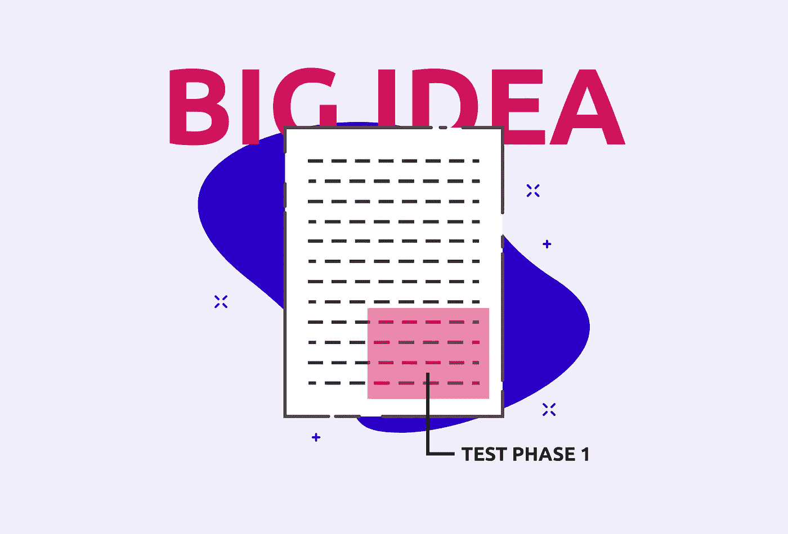

# 最低可行的伙伴关系

> 原文：<https://medium.com/swlh/the-minimum-viable-partnership-4fa4367305f9>

Thank you J.Quach for the images: [http://jquach.co/](http://jquach.co/)

## *以校准文件开始*

越来越多的技术公司使用开放的 API，开发者可以随时获得 SDK，这增加了合作的机会；但是，作为合作伙伴经理，您如何区分哪些是值得做的呢？你如何获得认同？在一场每个人都把自己的牌放在胸前的扑克游戏中，你如何衡量潜在的投资回报率？

如果你的目标是在你的产品和补充服务之间建立良好的合作关系，这些可能都是你每天都要面对的问题和挑战。

这篇文章的目的是通过创建一个可以与所有内部和外部利益相关者共享的协作文档来帮助指导您完成这一旅程。

在我们查看文档结构之前，我们需要简要探讨一下为什么这成为一个挑战，以及作为合作伙伴经理，我们在哪里适合。[Brandon Chu](https://blackboxofpm.com/@brandonmchu)(Shopify 的总经理，前产品负责人)写了一篇关于挑战的伟大文章，论述了“[无情的优先化](https://blackboxofpm.com/ruthless-prioritization-e4256e3520a9)”的概念。

在技术领域——集成合作伙伴关系需要来自产品团队的资源，并且他们不断地从许多不同的部门、利益相关者和客户那里获得时间。

这要求合作伙伴经理能够*理解*并且*尽可能地与各部门说同一种语言*。你可以通过提供一个令人信服的案例研究来测试一个关于潜在成功伙伴关系的假设，并展示测试的结果。

# 校准文件

任务的早期阶段是让一切顺利进行。

这份文件在它的一生中有许多用途，从引起不知情的利益相关者的兴趣，到将你与其他合作伙伴经理的午餐谈话记录到一个切实的行动计划中。

**A .概述
*这是什么合作关系？***这一段就是你的电梯推介。要么是你提出的，要么是另一家公司的合作伙伴经理主动联系你的。对于一个 MVP 来说，理想的情况是，你希望能够在一个段落中解释这种合作关系是什么。

你希望能够解释你潜在的销售对象，这样双方都能理解这个机会。目标应该是明确的，应该面向从主管到一线工人的每个人。

***我们的目标是谁？***你希望能够解释你潜在的销售对象和目标客户。首先会针对哪个用户群？

在 MVP 阶段，最好将它保持在一个更小、更有针对性的基础上。随着团队变得高度关注和对投资回报率负责，旧的喷雾-祈祷模式(尽可能多地聚集合作伙伴，祈祷有所收获)变得越来越过时。与您的合作伙伴经理合作，确定使用这两种产品的理想客户群，并努力打造非凡的买家之旅。

有了一个更受控制的用户群，你就可以预测如果这种方法推广到每个人身上会取得成功。如果第一次测试失败，您还可以记录挑战，并使用改进的策略再次尝试。

我们将如何到达我们的目标市场？
你将接触潜在合作伙伴的目标市场的行动。这一部分将进入您将要衡量的第一个可交付行动。这方面的一些例子如下:

*   一次网上研讨会，评估 200 名现有用户的兴趣，并对与会者进行跟进
*   向用户群发送大量电子邮件，宣布与打折登录页面的合作关系
*   对用户群进行调查，以评估对潜在集成的兴趣

***我们将于何时启动第一阶段？*** 直截了当—给两个团队一个明确的发布日期。现实一点，让对方对这次约会负责。大量的合作伙伴关系因为没有遵守发布日期的承诺而搁浅。尤其是对于试图与大公司合作的小公司。

你越是拖延潜在的合作关系，大公司就越有可能认为你在浪费他们的时间。

**B .目标和关键绩效指标**

这一部分有助于确定每个公司在这种合作关系中的价值，并使目标一致。一个好的组合是两家公司都看到一个伙伴关系

不一致的例子是，如果一个较小的合作伙伴可能认为 20 次试验是成功的，而较大的合作伙伴正在测量转换的升级，需要 100 次以上。

这一部分可以帮助您确定合作伙伴关系的优先级。如果预测的转换范围太小，那么您的支持部门将不会认为这是一个成功的测试。它将帮助你了解如何分配你忙碌的一天，以及你应该在项目之间花费多少资源。

***目标*** *这种合作关系有哪些硬性和软性目标？*一些帮助你开始的例子:

硬性目标:
这些是*可以量化的*。

*   了解目标用户群的转化率
*   衡量净新试验的数量
*   增加平均升级的 MRR
*   销售 x 数量的新包装

软目标:
这些是*目标*，因为它们更难衡量，但有助于你了解买家和他们的旅程。

*   了解向该客户群销售的挑战和成功之处
*   客户对合作关系的积极反馈

**关键结果** *认为“第一阶段”成功的关键绩效指标是什么？*这些与目标联系在一起，但是记录了“成功的障碍”。例如:

*   增加 xxxxx 美元 MRR
*   销售团队获得的配额百分比
*   xx 名网上研讨会与会者，其中 x%对产品感兴趣

**C .里程碑** *通过适当的检查点，过程中有哪些可操作的项目？*

文档的这一部分往往是最长的。这是你的合作关系走向市场的一部分，它会根据你们两个人所做的事情而有很大的不同。建议的模板如下:

> 【待行动】—行动日期:年月日
> 状态:未开始/进行中/开始/完成
> 1。【A 公司】来做这个
> 2。[公司 B]这样做的结果
> :
> 
> 【待创建】—行动日期:年月日
> 状态:未开始/进行中/开始/完成
> 1。【甲公司】做这个
> 2。[B 公司]这样做的结果是:
> 
> 【待测】—行动日期:年月日
> 状态:未开始/进行中/开始/完成
> 1。【甲公司】来做这个
> 2。【B 公司】这么做的结果
> :

另一个建议是将所有共享和支持的文件包含在文档里程碑中。在每个里程碑中共享一个简单的 Google Sheets 链接将帮助每个合作伙伴更容易地协作。

尽量不要让这部分过于复杂。请记住，这只是第一步——它是针对激动人心的机会的快速行动计划。

# 报告和借鉴成功/失败

成功！…或者失败。你已经安排好了一切，完成了文件。在过去的几天/几周/几个月里，你也认真执行了所有的里程碑。您现在已经有了一份很好的工作文档，可以向您的内部团队展示。

如果一切顺利，你已经达到了成功的门槛，你将有一个清晰的商业案例，让公司资源投资下一个数百万美元的项目。他们需要深入到杂草中，但是你已经尽你所能以最简单的方式引起了他们的兴趣(因为记住，一天只有那么几个小时)。

如果你没有，那就从头开始。要么你决定用不同的用户群再次测试，要么你决定分道扬镳。

大多数项目甚至在开始之前就失败了，使用这个文档将有希望使这些项目起步。

## 这个故事发表在 [The Startup](https://medium.com/swlh) 上，这是 Medium 最大的创业刊物，拥有 321，672+人关注。

## 在这里订阅接收[我们的头条新闻](http://growthsupply.com/the-startup-newsletter/)。

