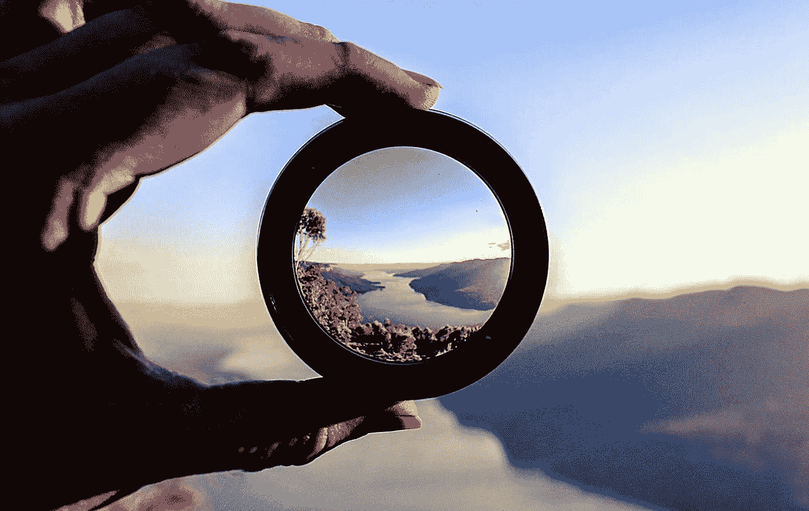
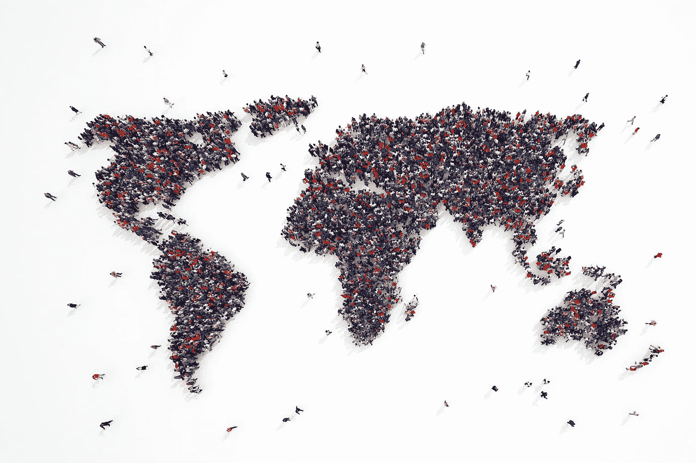

# 自我确认的幻景

> 原文：<https://medium.com/swlh/the-mirage-of-self-validation-e517c1cc8edd>

## 我们对显而易见的事物不那么明显的吸引力

我们爱自己，当我们是对的时候更是如此，当我们能够证明它或者指向一个预测说，“我就知道”的时候更是如此。我们爱着，渴望着，渴望着预测性的自我确认，我们会尽我们的身体、精神、意识和潜意识的力量去证实我们根据过去的经验为自己创造的未来。

这是终极的满足和舒适的享受，看着我们自己扮演我们写出来的角色，甚至是某种形式的自慰娱乐。这确实令人愉快。但是自我确认满足感的机会成本是多少呢？

体验和欣赏陌生事物的不可预测性的机会怎么样？去体验那些对展现在我们面前的崭新时刻充满好奇的人的焦虑和兴奋？

我们忙着担心和分心，试图走在潮流的前面，努力保持和维护我们的相关性，以至于我们忽略了把它当作娱乐。我们在这个永无止境的捉迷藏游戏中玩完我们的困境。

我们是自己不满的来源，在大多数情况下，我们真正的问题是我们没有问题..至少不是他们认为的那样。

当我们一天中的大部分时间都在思考，而不是消耗分散注意力的信息或做平凡的任务时，你已经通过重复形成了一种耐受性…解决棘手的问题，迫使自己离开舒适区，让一切顺其自然，并体验它的本来面目…

从醒来到休息，我们会感到非常满足、疲惫和兴奋。我们会有无法满足的饥饿感，睡得很香，一分钟感觉像一小时，最重要的是，我们会在第二天醒来，在我们的余生中，我们会像小时候一样充满兴奋，那时一切都是新的，不可预测的，没有故事可循/可维持。

为现在做贡献。剩下的就是肉汁了。

# **今天的原始想法**

> “大多数人的问题是他们没有问题；至少不是他们认为的那样。”

## 行动和输出胜过思考和润色

我们把时间、精力和注意力浪费在思想和修饰上，而不是行动和产出上。你不需要看起来很酷，你可以在以后发现这一点，事实上你的客户会告诉你如何做，现在只要做好工作。很多。尽你所能，每一天。行动起来，把事情做好。然后把它送给别人，直到你淹没在伟大的内容和创作中。然后聊你想聊的或者你觉得需要聊的，来满足那些仍然存在的不安全感。

## 放弃你最好的东西

把你最好的建议，你最好的最有想象力的想法和见解免费送给每个人。99%的人什么都不会做，而那 1%的人是如此的有动力、聪明和热情，以至于他们无论如何都会赢，会想出办法，甚至可能比你做得更好。“但是我得到了什么？”你会得到一个值得信赖的名声，有目的，有善意，而且非常棒。你赢得了 1%的尊重，并为 99%的人提供了你一生工作和经历的机会。你得到了一切。

> “在场胜过在场。如果你在那里，就在那里。”

## 没人看着你，没人在乎

没人看。我们表现得好像这个世界是这样的，我们所做的大部分事情对其他人来说只是一两秒钟的事情，但事实并非如此。他们忙于生活，被自己的生活分心，就像我们被自己的生活分心一样。所以放松，做你的事情，不管是什么，带着目的和意图去做。

## 我们不可能。差远了。

思考什么是可能的，什么是我们生理上完全能够做到的，什么是我们无法理解的。作为一个物种，我们能做些什么，是我们在进化中跳过的，或者是超出我们想象范围但在我们能力范围内的。令人着迷。

## 这篇文章发表在《创业公司》杂志上，这是 Medium 最大的创业刊物，有 306，792 人关注。

## 订阅接收[我们的头条](http://growthsupply.com/the-startup-newsletter/)。

