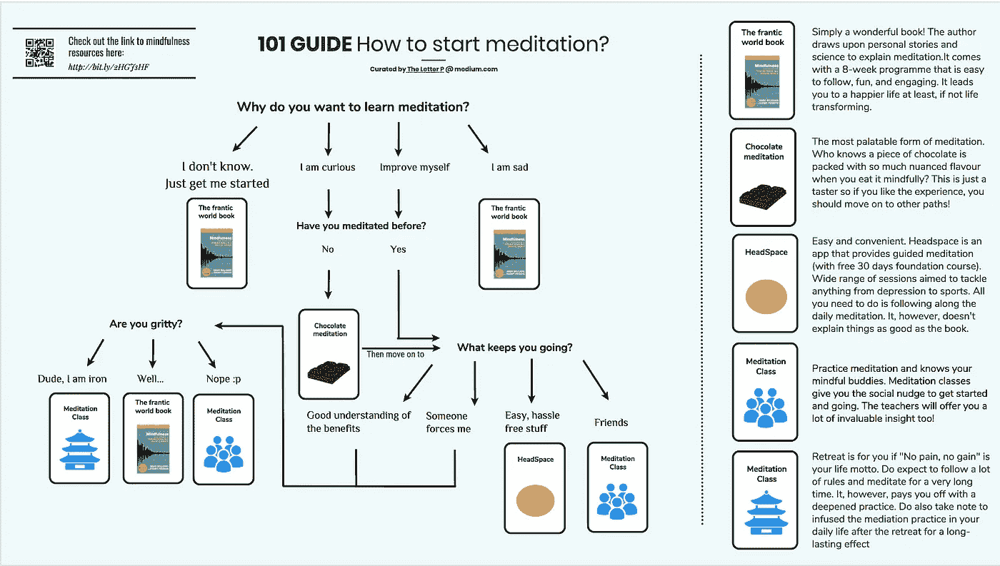

# 冥想初学者的缺失地图

> 原文：<https://medium.com/swlh/the-missing-map-for-beginners-of-meditation-be0be91aaf47>

## 系统练习比教程更重要



Feel free to share :)

或许你已经听说过实施调解的好处，并且想要开始，这是正确的地方。

虽然这个故事是献给冥想初学者的，但它是**而不是**的一个冥想教程。初学者需要的不是教程，而是一条道路，因为冥想既容易又难。

冥想很容易。有大量简单易懂的视频教程，任何人都可以在一生中第一次尝试 10 分钟的冥想。

但是你不会从 10 分钟的冥想中收获太多。很有可能，你会发现一种放松和筋疲力尽的复杂感觉。你觉得很有趣，但第二天就忘了。

有人说冥想是“心灵的健身房”，这是非常正确的。心血来潮坐在健身器上不会给你强健的体魄，就像一次冥想不会给你渴望的宁静一样。

**头脑和体质一样，需要系统地、有规律地训练。在培养正念的系统中，你需要知道的远不止如何冥想:**

> -冥想时如何处理无聊、不安或激动？
> -如何在日常生活中弥漫正念意识？为什么像专注于呼吸这样的简单练习会训练大脑？
> -有什么好处？
> -还有更多……

一篇简单的文章是不够的。**初学者需要的是一条路径，而不是一个简短的教程。**

## 有哪些路径？

有许多方法可以接近正念冥想。一个好的方法应该提供一个很好的**对实践的理解，培养毅力，并且平易近人。**

我在上面的信息图中列出了五种方法。除了巧克力冥想是正念的“小品尝者”,其他的都是训练你练习的好的系统方法。

你下定决心了吗？使用信息图来帮助您做出决定，路径资源如下:

**狂乱的世界书**

[](https://www.amazon.co.uk/Mindfulness-practical-guide-finding-frantic/dp/074995308X) [## 正念:在疯狂的世界中寻找平静的实用指南

### 购买正念:在混乱的世界中寻找平静的实用指南，2011 年由马克·威廉姆斯博士在英国首次出版

www.amazon.co.uk](https://www.amazon.co.uk/Mindfulness-practical-guide-finding-frantic/dp/074995308X) 

**巧克力冥想**

*条*

[](https://www.psychologytoday.com/blog/mindfulness-in-frantic-world/201109/the-chocolate-meditation) [## 巧克力冥想

### 正念冥想通常被视为一种简朴的练习。虽然简单有它的位置，它也值得记住…

www.psychologytoday.com](https://www.psychologytoday.com/blog/mindfulness-in-frantic-world/201109/the-chocolate-meditation) 

*指导配乐*

**顶空**

[](https://www.headspace.com) [## 冥想和正念变得简单-顶部空间

### 每天只需在 Headspace 应用上冥想几分钟，就能过上更快乐、更健康的生活。

www.headspace.com](https://www.headspace.com) 

**冥想班/静修**

找个调解班/静修比其他选项更费力。冥想有许多流派。有些是世俗的，有些是佛教徒，每个人都有自己潜在的哲学。

通常搜索“冥想静修/课程+你的城市”会找到很多课程和静修。但并不是所有的静修都是为了所有的人。

虽然我不能对每一个可行的选择给出详细的分析，但知道这个课程/静修所遵循的禅修学校是很重要的。如果你在寻找长期的心理实践，在你的搜索中添加 MBCT(基于正念的认知疗法)或 MBSR(基于正念的减压)。否则，通常课程/静修都与佛教有关。

问问你自己你愿意为此付出多少。课程/静修有不同的承诺水平——看看他们如何练习，看看练习和目标是否适合你。每个人都是不同的，这里没有明确的答案。

也许你已经下定决心选择一条路？那很好。还是你还在琢磨？那也没关系。做出一个坚定的决定比一时兴起做一些事情要好——你可能会在几天后放弃。

正念通过改变我与思想和情感联系的方式，改变了我的生活。从那时起，我就致力于向更多的人倡导这种生活艺术。

经过短短两年的冥想，我在快乐、焦虑和睡眠等方面体验到了无数的好处。你可以在这里阅读我的故事:

[](/swlh/super-boost-your-professional-life-commute-meditation-db2054d9ad9d) [## 超级提升你的职业生活:通勤冥想

### 为迎接重大挑战热身

medium.com](/swlh/super-boost-your-professional-life-commute-meditation-db2054d9ad9d) [](https://byrslf.co/meditation-one-year-review-of-making-my-life-better-ed87a7031851) [## 冥想——我如何在一年内让生活变得更好

### 如何变得更快乐，每天做出更明智的决定

byrslf.co](https://byrslf.co/meditation-one-year-review-of-making-my-life-better-ed87a7031851) 

我的故事本身只是文字的组合，它们不会让你的生活变得更好。我只是在分享一条我走过的路，这条路对我来说非常有意义。宝石就在路上，但除非你迈出第一步，否则你永远也找不到它们。

冥想快乐！

```
Hey there! If you like this story - please give me some support by meshing the **[Clap]** button hard! and **[Follow]** me so I can keep writing for you :)I want to try a little experiment on Clapping - **I want YOU**, the reader, to voice out your opinion with your Claps- If you feel this is a good read, give it 1 - 9 claps- If you like stories about **Meditation**, clap 10 times or more! The more you clap, I will write more stories like this :D- If you think this story is worth sharing to your friends, go stright up to 50 claps! and of course please share it**Comment** or leave a **private note** if you have anything want to tell me - I will try my best to address any of your concerns!By the way, if you turns out to live in Hong Kong, check out the meditation group that I lead :)[http://treehole.hk](http://treehole.hk)
```

[](https://medium.com/swlh)

## 这篇文章发表在[《创业](https://medium.com/swlh)》上，这是 Medium 最大的创业刊物，有 307，492+人关注。

## 订阅接收[我们的头条新闻](http://growthsupply.com/the-startup-newsletter/)。

[](https://medium.com/swlh)