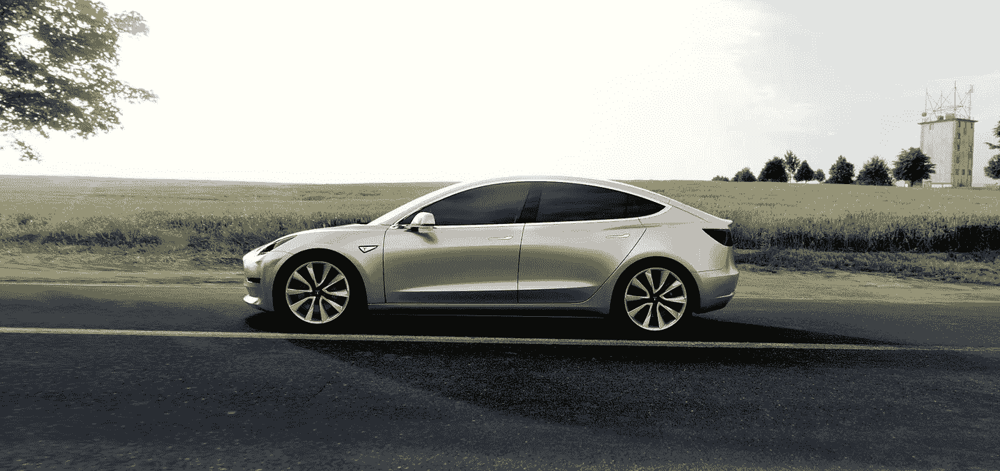
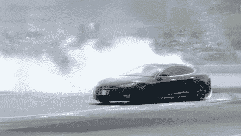

# Model 3 和汽车的未来

> 原文：<https://medium.com/swlh/the-model-3-and-the-future-of-cars-8a325d1607c9>

就在 3 月 31 日特斯拉 Model 3 发布后，我 [*有一些关于这个主题的话要说*](https://twitter.com/nmoryl/status/715784168744099840) *。这篇文章是对这个话题的阐述。*

在目前运营的汽车制造商中，特斯拉拥有最佳的战略定位。基于其相对较小的市场规模，很容易低估该公司:他们的目标是今年在美国市场总销量为 1750 万辆的汽车中生产 8 万至 9 万辆。甚至他们的 [325k Model 3 预购](https://twitter.com/elonmusk/status/718112326889529344)也只是杯水车薪。但特斯拉在技术和运营上都领先所有其他制造商好几年，其竞争对手根本无力应对。如果你想一想，竞争对手已经有 10 年的时间来对抗特斯拉的举动，但他们没有。这是怎么回事？

## 技术游戏已经改变

现有制造商面临的第一个问题是，汽车竞争的基础正在发生变化——而且不一定是你马上会想到的那种变化。不，这不是电动与汽油传动系统。那就是软件和计算正在成为驾驶体验的核心部分。

现在路上的大多数汽车对大多数人来说已经足够好了。总的来说，他们会安全、高效、舒适地将你和你的家人以及货物从 A 点运送到 B 点。该行业基本上已经达到了机械创新的平台期，任何递增的机械改进都很快被复制和商品化(例如侧面碰撞安全气囊、双叉骨悬架、额外的 50 马力或 5 英里/加仑)。在大众市场上，几乎没有人在机械地做什么，这实际上是独一无二的。

虽然特斯拉在所有这些技术指标上都很优秀(快得惊人、安全得惊人、高效得惊人)，但它做了一些现任者无法快速复制的事情，因为它选择了制造汽车的方式:将计算和软件作为重中之重。

特斯拉本质上是一家技术公司，这一点也体现了出来。特斯拉从发布之初就在 Model S 中内置了空中更新功能，因此您现在可以[下载一个升级版本，该版本增加了将您的汽车召唤到您身边的功能](https://www.teslamotors.com/blog/summon-your-tesla-your-phone)。与此同时，当福特的 MyFord Touch 信息娱乐系统受到消费者[的指责](http://jalopnik.com/people-hate-fords-infotainment-system-so-much-they-plan-824376438)时，消费者可以[要么通过 u 盘安装升级来改进它，要么让经销商为他们做这件事](https://en.wikipedia.org/wiki/MyFord_Touch)。同样，当克莱斯勒发现[黑客可以在吉普车行驶时远程使其瘫痪](http://www.wired.com/2015/07/hackers-remotely-kill-jeep-highway/)时，他们不得不[发布召回，要求经销商访问或类似的基于 USB 的更新过程](http://www.wired.com/2015/07/jeep-hack-chrysler-recalls-1-4m-vehicles-bug-fix/)。特斯拉已经能够通过空中更新完全解决它的一些问题[，并且是](http://www.wired.com/insights/2014/02/teslas-air-fix-best-example-yet-internet-things/)[唯一公开声明正在空中更新核心发动机控制单元软件的制造商](http://www.oesa.org/Publications/OESA-News/August-2015/ver-the-Air-Updates-to-Become-Commonplace-in-Vehicles.html)。

现任者通常将防抱死制动、电子稳定控制和动力传动系统等部件外包给博世和德尔福等供应商。这些系统都有重要的计算组件，主要制造商选择不在内部开发，因为他们的核心能力是在车辆设计，组装和营销，而不是软件设计。现在，这些外包决定的后果正在得到报应，其结果是车主体验不佳，制造商无法快速做出反应。

Tesla’s software prowess, illustrated

设计一辆汽车需要几年时间。特斯拉 Roadster 从概念到小规模生产花了 5 年时间，即使在零件和生产方面得到了路特斯的大力帮助。[在现有平台上开发一款采用现有动力系统的新车型需要 2-3 年的时间](https://www.quora.com/Automobile-Design-How-long-does-it-take-to-develop-a-car-design-from-scratch)，但开发新的动力系统和底盘将大大延长所需的时间。即使现任者在 2012 年推出 Model S 时看到了它的成功，并认为它是汽车的未来，也不能保证他们今年或明年会有任何直接竞争的产品(从软件角度来看)。

汽车很大，很贵，很复杂，而且监管严格。重新设计汽车是一回事。同时重启你的商业模式是一个完全不同的游戏。

## 一种新的商业模式

虽然特斯拉在十多年前开始工作时面临着巨大的挑战，但它也有机会从头开始建立一家现代汽车公司。这意味着不仅要从头开始设计汽车，还要创造销售汽车的最佳商业模式。

现有的汽车公司，不管是好是坏，都被他们的商业模式所束缚。根据法律，他们不得直接向消费者销售汽车:[经销商必须充当中间商](https://en.wikipedia.org/wiki/Car_dealerships_in_North_America)。但由于经销商特许经营法是如何写的，特斯拉还没有经销商的事实让他们放弃了创造他们摆在首位。[1]

这很重要，因为电动汽车对经销商来说没有太大的经济意义。经销商的大部分利润来自融资和维护。电动汽车可能仍然需要融资，但它们肯定不像汽油动力汽车那样需要那么多服务。运动部件少得多，这意味着磨损的部件更少，需要定期更换的液体也更少。除此之外，特斯拉可以通过无线软件更新解决越来越多的问题，而拥有实体经销商的经济效益显著下降。

除了经济因素，经销商的缺乏是特斯拉的一个重要的组织优势。制造商和经销商之间存在某种对立的关系:制造商将汽车卖给经销商，经销商再卖给终端消费者，因此经销商是制造商的直接客户。这就造成了低效率:客户一般不能订购带有他们想要的选项的确切的汽车；他们要么从停车场里挑选，要么四处寻找最接近他们理想的车。

套用史蒂文·辛诺夫斯基的话，公司会发布他们的组织结构图。汽车制造商商业模式和最终产品存在的问题反映了制造商、零件供应商和经销商网络各自为政的利益。目前，制造商首先需要满足经销商，其次才是消费者。结果是一个充斥着平庸产品的市场，让消费者提不起精神。但是对制造商来说，可能还有一个不太可能出现的好消息:汽车保有量下降。

## 租赁救援

具有讽刺意味的是，趋势[远离购买汽车](http://www.washingtonpost.com/sf/style/2015/09/02/americas-fading-car-culture/)和转向所有权即服务可能是拯救现有汽车制造商。其中一些已经在投资替代所有权模式:戴姆勒拥有 [Car2Go](https://www.car2go.com/en/austin/) ，这是 Zipcar 的竞争对手，在其城市内提供单程租赁服务；宝马最近在西雅图推出了 [ReachNow](http://www.bmwcarsharing.com/how) ，提供时租服务；奥迪在旧金山湾区推出了按需礼宾租赁服务。交通是一项“需要完成的工作”，精明的投资者押注汽车所有权将在未来转变为一种服务模式:优步的估值是基于其取代越来越多人口拥有汽车的能力。

这并不能改变这样一个事实，即软件将是运输新世界中竞争的关键。软件主要是通过盲点监测、车道辅助以及最终的完全自动驾驶等功能来塑造驾驶(以及越来越多地乘坐)汽车的体验。它也将成为人们管理交通的手段，或者通过管理所有权( [Drive](https://www.drivemotors.com/) ，[Beepi](https://www.beepi.com/)([et](https://instamotor.com/)[al](http://www.withclutch.com/))。)、[特斯拉](https://www.teslamotors.com/))或者 access ( [特斯拉召唤](https://www.teslamotors.com/blog/summon-your-tesla-your-phone)、[优步](https://www.uber.com/)、 [Lyft](https://www.lyft.com/) 、 [Zipcar](http://www.zipcar.com/) )。

是否有任何制造商能够发展足够的直接消费者关系，在按需汽车领域挑战优步(或谷歌，或苹果)，仍有待观察。虽然他们肯定有足够的资源来解决这个问题，但这些关系目前是通过经销商来调解的——如果(或当)特斯拉提供按需产品，这种潜在的减速带就不会存在。

但目前还不清楚这种影响会有多快:今天，如果你住在旧金山或纽约市中心，主要依靠优步和 Zipcar 生活可能是可行的，但对于洛杉矶甚至门洛帕克的大多数人来说，这仍然不是全职的汽车替代品。虽然技术发展很快，但建筑世界的变化却很慢。在我们拥有更先进、更广泛的自动驾驶技术(以及支持它的法规)之前，大多数美国人将继续拥有自己的汽车。与此同时，特斯拉比任何其他制造商都更有能力主导消费者的想象和需求。

[1]十年前,《纽约客》杂志对经销商特许经营法做了一个简史。结论是，在上世纪 20 年代和 30 年代，制造商强迫经销商购买他们卖不出去的产品。这导致交易商转向州政府寻求保护性法律，以弥补他们的杠杆不足。由于这些法律大多是为了规范现有的经销商-制造商关系而制定的，特斯拉经常不在其中。因此，在大多数州，特斯拉被允许直接向公众销售。但是在 T2 的一些州，比如印第安纳州的 T3，经销商正在游说立法者修改经销商法，以迫使所有汽车制造商通过经销商销售，尽管这遭到了特斯拉支持者的强烈反对。其他州如 T4、德克萨斯、密西根、亚利桑那、康涅狄格和西弗吉尼亚已经有了直销禁令。

[2]辛诺夫斯基的评论本身就是对康威定律的诠释。