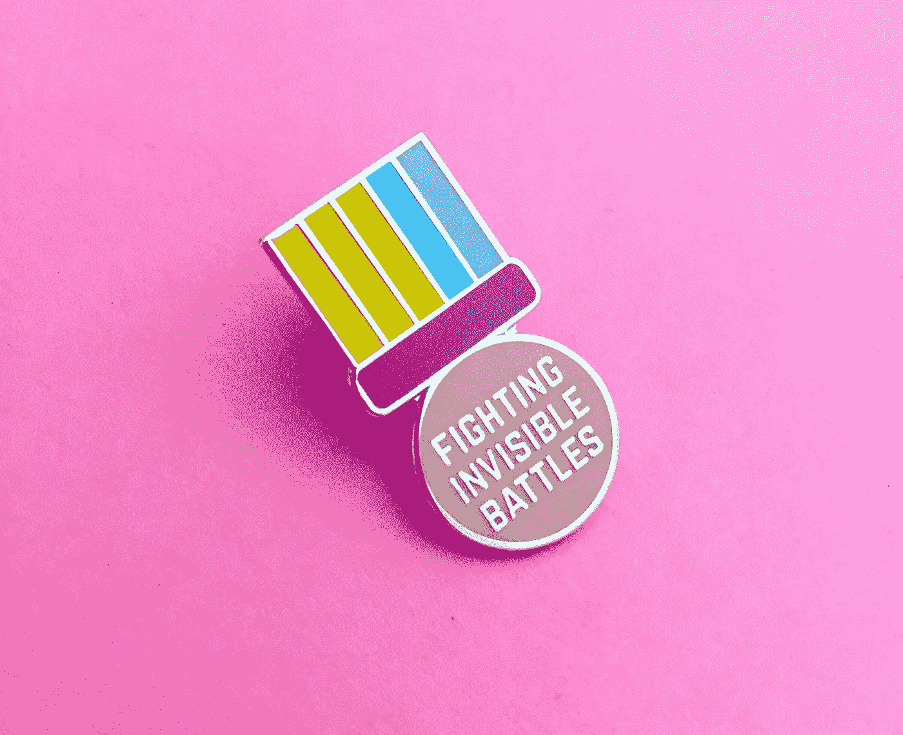

# 我听过的最美丽的事物会让你陷入沉思。

> 原文：<https://medium.com/swlh/the-most-beautiful-thing-ive-been-told-that-will-force-you-into-deep-contemplation-32b275833d3e>

Image Credit: [Mike Orlov](https://mikeorlov.com/en/Beauty)

三年前，我遇到了一个人，我正试图和他做生意。我很了解他，但三年后，我们从未达成交易。
前几天他突然打电话给我。

我没有试图找出我们为什么没有达成交易的原因，而是和他谈了谈。

我问他家里怎么样。我问他生意怎么样。

然后他问我对他在生意中必须做出的两个决定的看法。我给了他我诚实的建议，甚至透露了我的偏见，这让他感到惊讶。

他来自埃及，通过我们的各种交谈，我告诉他我的梦想，访问该国，看到古老的金字塔。他答应在我想去的时候带我去，因为他一年去那里三次。

Image Credit: [One Rude Dawg](https://fineartamerica.com/profiles/onerudedawg.html)

他的好意总是让我相信有更多的东西。

他的生意很成功，赚了很多钱，但他住在普通的房子里，开着普通的车，不乱花钱。

我的好奇心促使我问他一个问题:

> ***“什么驱使着你？如果你已经有足够的钱，为什么还要做这些？”***

就在那一刻，我的脸上挨了一记右勾拳。他的回答大概是这样的:

> 蒂姆，当我的生意做得好的时候，很多人都会受益

好了，现在他引起了我的注意。

我问他是什么意思。

他说:

> 蒂姆，为我工作的人都不知道这件事，所以我来告诉你这个大秘密。我生意赚的大部分钱都用来资助孤儿院。这不是我的问题，也不是我能带多少钱回家的问题。”

# 就这几句话，我无言以对。

这是我听过的最美妙的事情。

这个想法让我陷入沉思。后来的几个星期里，我开始想起这个人。我仍然想着他。

这次谈话让我提出了以下问题:

如何才能让我们每个人都采取相似的心态？
如果我们都致力于这类工作会怎么样？
一个人怎么变得这么善良？这个世界不像我们被误导的那样糟糕吗？

这个人节省每一分钱，尽可能少买办公用品，尽可能多赚钱。所有这些看起来都像其他企业主的行为。

不过，特别之处在于输出。我们大多数人都不明白为什么企业家要走向世界，创建这些庞大的企业。通常是因为我们永远不知道的原因。这个人肯定有他的理由。

从外表上看，这个人和你在生意场上遇到的其他人没什么两样。

# 这一天过后，我明白了:

> “每个人都在打一场你一无所知的仗。”

Image Credit: [FairyCakes On Etsy](https://www.etsy.com/listing/529011531/fighting-invisible-battles-medal-enamel)

好吧，这是我可能从温迪·马斯那里搞砸的一句名言，但你明白我的意思了。

在紧闭的门后，有比你永远也不会知道的更多的人在做着像这样惊人的善举。

我们从外面看到的与我们选择窥视别人的生活，用我们脆弱的真实的自我来引导对话是非常不同的。

# 故事总有另一面。

你永远不会像你想的那样真正了解别人。

选择相信每个人内心都有这种善良。它会改变你的思维方式。

现在是你接受这个想法并深入思考的时候了。

# 行动呼吁

如果你想提高你的工作效率，学习一些有价值的生活窍门，那就订阅我的私人邮件列表吧。你还将获得我的免费电子书，它将帮助你成为改变游戏规则的在线影响者。

[**点击这里马上订阅！**](http://timdenning.net/free-ebook)

## 这篇文章发表在[《创业](https://medium.com/swlh)》上，这是 Medium 最大的创业刊物，有 340，876+人关注。

## 在这里订阅接收[我们的头条新闻](http://growthsupply.com/the-startup-newsletter/)。

