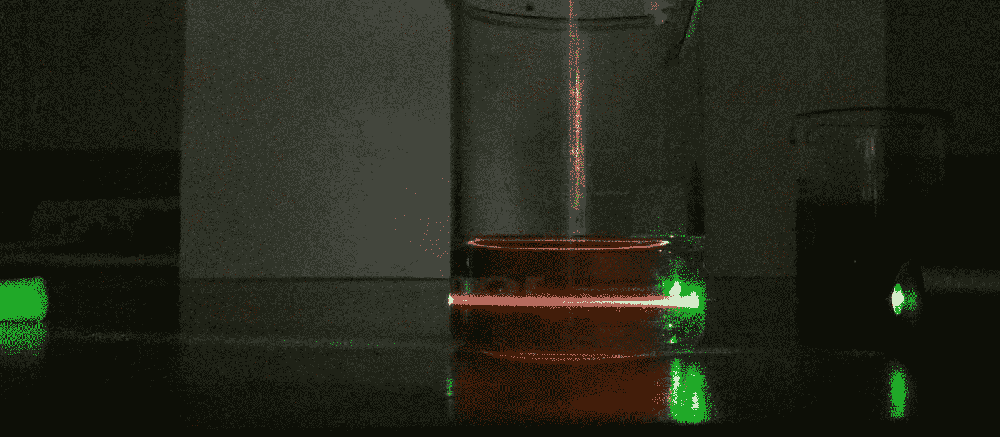

# 学生在实验报告中最常犯的错误

> 原文：<https://medium.com/swlh/the-most-common-mistakes-students-make-on-lab-reports-12b4e6a8a841>

Photo: Rhett Allain. This really isn’t a lab, but it’s cool. This shows a green laser changing color when it passes through oil.

看完实验报告后，有几个常见的问题。这里是一个概述。

*   **假设。**到底什么是假设？有一种真实的东西叫做假设，还有假设检验。然而，几乎每个使用这个词的学生都用错了。我的建议是不要用这个词。而是专注于模型的建立。