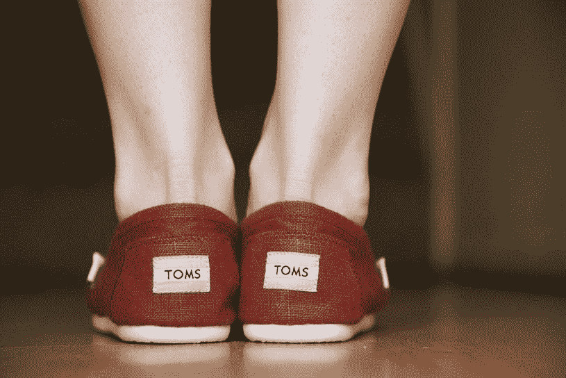

# 有史以来最有效的营销策略(而且是免费的)

> 原文：<https://medium.com/swlh/the-most-effective-marketing-strategy-ever-on-a-budget-9ab871d5713>

## 一个人如何让素未谋面的名人为他的产品代言而不花一分钱

Photo by [Austin Chan](https://unsplash.com/photos/ukzHlkoz1IE?utm_source=unsplash&utm_medium=referral&utm_content=creditCopyText) on [Unsplash](https://unsplash.com/?utm_source=unsplash&utm_medium=referral&utm_content=creditCopyText)

你曾经试图开始某事吗？无论是博客、课程、书籍还是任何类型的生意，你都知道你内心深处有一些东西需要释放出来。

然后，也许在大量的工作和努力之后，你终于发布了你的产品，让尽可能多的人知道，但是没有人关注。

灰心丧气的你决定放弃你开始做的任何事情，但是你的一部分仍然渴望做一些事情。

要是你能想出一种方法来引起注意，获得你应得的关注，而不必为营销花一大笔钱就好了。

有哪些成功人士做得很好而你做得不好？

我来给你讲一个关于布莱克的故事来回答这个问题。

布莱克今年 29 岁，正在进行他的第四次创业，他最终决定去度一个值得的长假。他去了阿根廷放松并沉浸在那里的文化中。他跳他们的舞蹈，吃他们的食物，玩他们的运动。他也很喜欢穿他们的民族鞋 *alpargata* 。

在旅行快结束时，布莱克遇到了一位在鞋子义卖活动中做志愿者的妇女。妇女们分发的所有鞋子都是捐赠的，从来都不够分发。

布莱克了解到，即使在像阿根廷这样的发达国家，那里的许多孩子也缺少鞋子。另一个大问题是，这些捐赠的鞋子并不适合这些孩子。

布莱克然后开始旅行到不同的村庄，亲眼看看周围较贫穷的城市。他知道贫穷是存在的，但看到这些孩子在村子里光着脚走来走去，让他觉得这是真的。他看到了这些孩子遭受的疼痛、水泡和感染，原因仅仅是因为他们没有鞋子穿。

布莱克想帮助这些孩子，所以他想出了一个主意，建立一个鞋生意，每卖出一双鞋，他就给需要的人捐一双。

经过许多艰苦的工作，他能够得到一批鞋，他把它带回家加州，并首次与他的朋友分享他在做什么。他解释了他的故事，他的朋友们喜欢他所做的，那天晚上他们都从他那里买了一双。

布莱克最终能够与零售商分享他的故事，零售商也购买了他的产品。他也获得了更多的曝光，因为媒体捕捉到了他的故事，他的产品最终成为洛杉矶时报日历部分的头条新闻。很快，杰西卡·阿尔芭、史努比狗和查莉兹·塞隆等名人就穿上了这双鞋。

这项业务开始时只是一个简单的想法，后来变成了现实，成为了我们现在所知的 [TOMS](http://www.toms.com/) 公司。

布莱克·麦可斯基没有花一分钱推销他的产品。他的故事像野火一样在相信他所做的人中间传播开来。

他生意成功的原因不是因为他的产品有多好或多时尚，而是因为他做他正在做的事情背后的故事。他确切地知道他为什么做他的生意；通过向没有鞋子的人提供鞋子来帮助有需要的人。

# **如果你想让你的生意在另一个层面上成功，你必须有一个非常强有力的理由来解释你为什么要这么做。**

人们可能喜欢他们的鞋子，但是人们最喜欢的是为什么他们要卖他们的鞋子。他们的鞋子质量很好，就像其他主要的鞋子系列一样，但这是他们鞋子背后的原因，激励人们乐意购买他们的产品。

这家公司的目的远不止是卖鞋，这也是它如此受欢迎的原因。

如果汤姆的目的只是做鞋，那就没什么意思了。布莱克卖这双鞋是为了能够做一些对他真正重要的事情，而这件事最终也关系到很多其他人。

该公司的存在是为了帮助向其他有需要的人提供鞋子，他们在营销中非常清楚地表明了他们制造和销售产品的**原因**。

# 为了找出你的原因，你必须深挖

当你和自己进行一次诚实的对话，并深入挖掘，你将会发现什么对你真正重要。

**你的“为什么”一定要引起你的情绪反应。**

当你想到它的时候，你就会知道为什么。你有一种清晰的感觉，对你想要的生活有一种非常清晰的方向感。

当对你来说比任何人都重要的时候，你知道你已经找到了为什么。有时候会很困惑，因为我们想要别人的生活，因为他们给了我们太多的灵感。

所以，在你开始开发你的产品之前，弄清楚你为什么要这样做，并确保你深入了解它。

**如果你喜欢这篇文章，那么你可能也会喜欢我的免费指南，** [**立即开始你最好的生活的四个步骤**](https://mailchi.mp/de7ebe746809/destiny-hacks-free-guide) **来学习一个简单的练习，找出你为什么以及其他重要的战略来发展你的业务。**

## 这个故事发表在 [The Startup](https://medium.com/swlh) 上，这是 Medium 最大的企业家出版物，拥有 281，454+人。

## 在这里订阅接收[我们的头条新闻](http://growthsupply.com/the-startup-newsletter/)。

